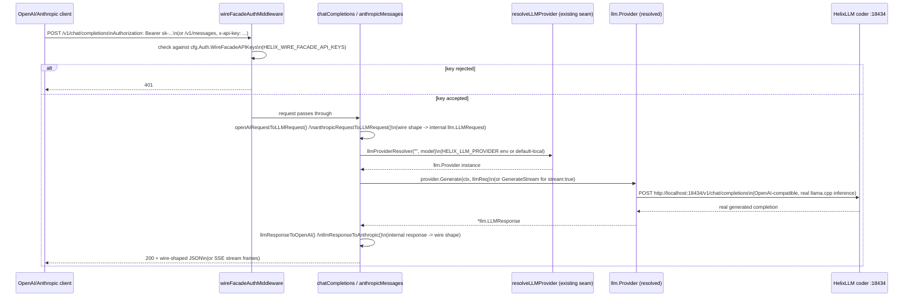
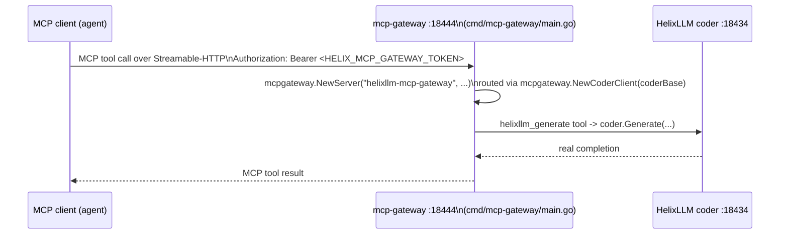
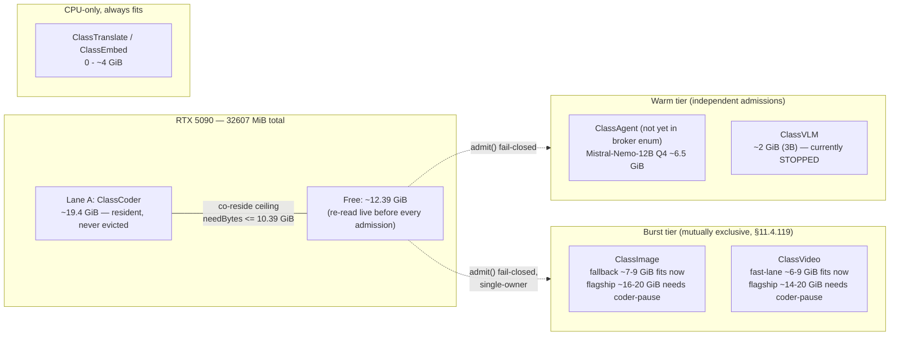

# HelixLLM Integration Architecture — HelixCode → HelixAgent → HelixLLM (+ LLMsVerifier)

| | |
|---|---|
| **Scope** | The end-to-end architecture of how HelixCode's own server, HelixAgent, HelixLLM's local-serving capabilities, and LLMsVerifier fit together, as landed on `feature/helixllm-full-extension` as of 2026-07-08. |
| **Track / branch** | `(T1/feature/helixllm-full-extension)` |
| **Relationship to prior docs** | Extends, does not replace, `docs/ARCHITECTURE.md` (the pre-existing HelixCode meta-repo architecture doc) and `docs/guides/HELIXLLM_CAPABILITIES_GUIDE.md` (the per-capability operator manual this document draws its facts from). This document adds the cross-cutting topology/sequence/VRAM/discovery view the capability guide does not attempt. |
| **Grounding (§11.4.6 / §11.4.123)** | Every port, route, struct, and file cited below is either read directly from a committed source file (cited inline) or copied from the capability guide / master implementation plan, which are themselves evidence-cited documents. Nothing here is invented. Where a capability is scaffold-only or design-only, it is labelled as such — never presented as live. |
| **Honest boundary** | This is a snapshot as of the evidence dated 2026-07-06 → 2026-07-08 (see `## Sources`). Ports, states, and code may have moved since — re-read the cited source file before relying on any fact here for an operational decision. |

---

## Table of contents

- [1. System topology](#1-system-topology)
- [2. Request flow](#2-request-flow)
- [3. VRAM lane model](#3-vram-lane-model)
- [4. Capability state matrix](#4-capability-state-matrix)
- [5. Provider / discovery wiring](#5-provider--discovery-wiring)
- [Sources](#sources)

---

## 1. System topology

Three real, physically-distinct HTTP surfaces exist in this stack — they are frequently confused because two of them serve overlapping wire shapes. Reading left to right in the diagram below:

1. **HelixCode's own server** (`helix_code/internal/server/server.go`) — the meta-repo's Gin HTTP server, default port `8080` (dev; `443` prod default; `internal/config/config.go:462,2231,2248`). It now speaks THREE surfaces on the SAME port: its pre-existing custom `/api/v1/llm/generate` route, plus two NET-NEW routes added this cycle — `POST /v1/chat/completions` (OpenAI Chat Completions wire) and `POST /v1/messages` (Anthropic Messages wire) — both gated by `wireFacadeAuthMiddleware()` (`server.go:426-427`, `wire_facade.go`).
2. **HelixLLM's own standalone Go gateway** (`submodules/helix_llm/cmd/helixllm/main.go`) — a SEPARATE, distinct binary/process from (1), listening on `:8443` (TLS-mandatory, HTTP/3+HTTP/2), fronting an EMBEDDED llama.cpp brain. This is documented in `submodules/helix_llm/docs/API_CONTRACT.md` and is **code-verified, not captured live-serving this session** (capability guide §4).
3. **HelixLLM's local capability fleet** — the actual inference/serving processes: the coder (`:18434`, LIVE), and the on-demand capabilities (embeddings, vision, translation, whisper, tesseract, RAG, A2A, image-gen, video-gen), each on its own port, all reachable from HelixCode/HelixAgent as OpenAI-compatible (or capability-specific) HTTP endpoints.

HelixAgent (`submodules/helix_agent`) sits between HelixCode's CLI-agent layer and the coder: its `helixllm.Provider` (`internal/llm/providers/helixllm/provider.go`) is env-var-pinned (`HELIX_LLM_LOCAL_OPENAI_ENDPOINT` / `HELIX_LLM_HOST` / `HELIX_LLM_PORT`) to reach the coder directly at `:18434`, and additionally drives Postgres session persistence + Redis caching around that call.

LLMsVerifier (`submodules/llms_verifier`) never touches model *content* — it is a metadata-only registry (`ProviderClient{Name, BaseURL, APIKey}` in `providers/model_provider_service.go`) that discovers each provider's live model set by calling that provider's own `GET /v1/models`. The `helixllm` provider row (`providers/config.go:1404-1425`) points at `helixLLMEndpoint()` which resolves `HELIX_LLM_LOCAL_OPENAI_ENDPOINT`, defaulting to `http://localhost:18434` (`config.go:15-22,40-43`).

codegraph and OpenDesign are the two under-the-hood MCP-exposed dev-tooling providers wired into `.mcp.json` at the repo root — codegraph as a stdio MCP server (`codegraph serve --mcp`) giving Claude Code semantic code-graph queries, OpenDesign as a stdio MCP server bridging to a daemon on `:7456` (per `.mcp.json`, `open-design-mcp` npm package) for UI design-token work (§11.4.162). **OpenDesign's daemon is NOT YET INSTALLED** (capability guide §17) — the MCP server entry exists in `.mcp.json` but the daemon it bridges to has not been brought up.

```mermaid
flowchart TB
    subgraph ClientLayer["Clients"]
        CC["Claude Code / claude_toolkit\n(via LLMsVerifier registry\nand/or codegraph+open-design MCP)"]
        OAI["Generic OpenAI-compatible client"]
        ANT["Generic Anthropic-compatible client"]
    end

    subgraph HelixCodeSrv["HelixCode server (helix_code/internal/server)\nGin, port 8080 dev / 443 prod default"]
        Facade["wire_facade.go\nPOST /v1/chat/completions\nPOST /v1/messages\n(wireFacadeAuthMiddleware)"]
        Generate["llm_generate.go\nPOST /api/v1/llm/generate\n(pre-existing custom route)"]
        Resolver["resolveLLMProvider()\nllm.Select seam\nHELIX_LLM_PROVIDER env"]
    end

    subgraph HelixAgentBox["HelixAgent (submodules/helix_agent)"]
        Provider["helixllm.Provider\nHELIX_LLM_LOCAL_OPENAI_ENDPOINT /\nHELIX_LLM_HOST+PORT"]
        Session["Postgres session repo"]
        Cache["Redis cache client"]
    end

    subgraph VerifierBox["LLMsVerifier (submodules/llms_verifier)"]
        Registry["ProviderClient registry\nhelixllm row -> helixLLMEndpoint()\nCONST-036/037/038/039/040"]
    end

    subgraph HelixLLMBox["HelixLLM (submodules/helix_llm)"]
        Coder[":18434 Coder fleet - LIVE\nQwen3-Coder-30B-A3B, llama.cpp router\nresident, never evicted"]
        Gateway8443[":8443 standalone Go gateway (cmd/helixllm)\nOpenAI+Anthropic, TLS-mandatory\ncode-verified, not live-captured"]
        Broker["internal/vrambroker\nAcquire/Release/Budget, fail-closed admit()"]
        MCPGw[":18444 MCP gateway (cmd/mcp-gateway)\nStreamable-HTTP, bearer-token\nscaffold: code committed, Phase-5 wiring pending"]
        Embed[":18435 Embeddings (TEI) - on-demand"]
        Vision[":18439 Vision VLM - on-demand, currently STOPPED"]
        Translate[":18436 Translation NLLB - on-demand"]
        Whisper[":18437 Whisper STT - on-demand"]
        Tesseract[":18438 Tesseract OCR - on-demand"]
        RAG[":18440 RAG (own TEI + live coder) - on-demand"]
        A2A[":18441 A2A server - on-demand"]
        ImageGen[":18442 Image-gen - SCAFFOLD-ONLY"]
        VideoGen[":18443 Video-gen - SCAFFOLD-ONLY"]
    end

    subgraph DevTools["Under-the-hood MCP dev-tooling (.mcp.json)"]
        CodeGraph["codegraph MCP (stdio)\ncodegraph serve --mcp"]
        OpenDesign["open-design MCP (stdio)\nbridges to daemon :7456\nNOT YET INSTALLED"]
    end

    CC --> Registry
    CC -.-> CodeGraph
    CC -.-> OpenDesign
    OAI --> Facade
    ANT --> Facade
    OAI --> Coder
    Facade --> Resolver
    Generate --> Resolver
    Resolver --> Coder
    Provider --> Coder
    Provider -. "LAN/VPN via HELIX_LLM_HOST" .-> Coder
    Session --> Provider
    Cache --> Provider
    Registry -. "GET /v1/models" .-> Coder
    Registry -. "GET /v1/models" .-> Gateway8443
    MCPGw --> Coder
    Broker --> Vision
    Broker --> ImageGen
    Broker --> VideoGen
    Broker --> Translate
    Broker --> Embed
    RAG --> Embed
    RAG --> Coder
```



**Reading the diagram.** Two independent client paths reach the coder: (a) directly, via HelixCode's own dual-wire facade or its pre-existing `/api/v1/llm/generate` route, both of which resolve a provider through the SAME `resolveLLMProvider`/`llmProviderResolver` seam (`llm_generate.go`) that HelixCode's server has always used — the wire-facade handlers are translators bolted in front of that existing seam, not a new routing path (`wire_facade.go` file-level doc-comment); (b) through HelixAgent's `helixllm.Provider`, which additionally persists sessions to Postgres and caches to Redis. LLMsVerifier is a metadata-only sidecar to both paths — it discovers what models/capabilities exist by polling `/v1/models`, it never proxies generation traffic. The VRAM broker mediates every non-resident HelixLLM capability's admission against a live GPU-budget read.

---

## 2. Request flow

### 2.1 OpenAI/Anthropic client → HelixCode's own dual-wire facade → coder

This is the ONE net-new adapter landed under Providers-plan §3 Phase D (master plan §2, row "2c") — HelixCode's server did not answer any OpenAI- or Anthropic-compatible route before this cycle (`wire_facade.go` file-level doc-comment: a route grep previously returned zero hits).



Streaming reuses the identical provider channel-ownership contract `generateLLM`/`streamLLM` already use (`llm_generate.go`'s documented CHANNEL-OWNERSHIP CONTRACT): the provider is the sender and sole closer of the channel; `streamOpenAIChatCompletion`/`streamAnthropicMessages` (`wire_facade.go`) just re-frame the same chunks as `chat.completion.chunk` SSE or the Anthropic `message_start`/`content_block_delta`/`message_stop` event sequence.

### 2.2 MCP-gateway tool-call flow (scaffold — code committed, Phase-5 wiring pending)



Honest state: `cmd/mcp-gateway/main.go` is real, committed, compiling Go source — it constructs a real `mcpgateway.NewCoderClient` against `HELIX_LLM_LOCAL_OPENAI_ENDPOINT`/`http://localhost:18434` and refuses to start without a real bearer token (`HELIX_MCP_GATEWAY_TOKEN`, no hardcoded credential). Per the master implementation plan (§2 row "5", §5 item 9, §6.4), the MCP gateway's real-wire landing is a **Phase-5, partially-gated item** — the beta go-sdk's Streamable-HTTP **server** transport coverage needs confirming before the gateway design is treated as committed-live; this diagram documents the code path that exists today, not a captured live tool-call transcript.

---

## 3. VRAM lane model

Single shared GPU (RTX 5090, 32607 MiB ≈ 31.84 GiB total). Live reading re-baselined 2026-07-08 03:45:27 local (`nvidia-smi --query-gpu=memory.total,memory.used,memory.free`): **19436 MiB (≈18.98 GiB) used — coder-only resident**, **12685 MiB (≈12.39 GiB) free** (master plan §3). This table is a **snapshot, not a cached truth** — DZ-23 (master plan §4 item 1) is the single most-repeated finding across the serving and capabilities research: free VRAM moved from ≈7.89 GiB (coder+vision resident) to ≈12.39 GiB (coder-only) within the SAME session. Every real admission decision MUST re-read `nvidia-smi`/`Budget().free` live immediately before acting — this table is for orientation only.

| Lane | Broker class | Residency | Size (at time of evidence) | Co-resides with coder? |
|---|---|---|---|---|
| Lane A — coder | `ClassCoder` | Resident, always-on, never evicted, uncounted against admission | ~19.4 GiB | N/A (baseline) |
| Lane B — 2nd coder/agent instance | `ClassAgent` (not yet added to the broker enum — Phase 1a Task 1.4 gap) | Warm, admission-gated | Best-fit candidate: Mistral-Nemo-12B Q4 ~6.52 GiB weights (~3.87 GiB KV headroom) | Yes, within the 10.39 GiB ceiling |
| Vision (VLM) | `ClassVLM` | Warm, currently STOPPED (torn down mid-session) | ~2 GiB at 3B; ~12–16 GiB at an 8B upgrade tier (unmeasured) | Yes at 3B |
| Image-gen fallback | `ClassImage` (burst, single-owner §11.4.119) | Burst | SDXL/FLUX.1-schnell-Q4 ~7–9 GiB | **Fits now** (≤12.39 GiB free) |
| Image-gen flagship | `ClassImage` | Burst | FLUX.1-schnell fp8 ~16–20 GiB | Does NOT fit — needs a scheduled operator-authorized coder-pause burst window |
| Video-gen fast lane | `ClassVideo` (burst, single-owner) | Burst | LTX-Video 2B-distilled ~6–8 GiB or WAN 2.2 TI2V-5B ~7–9 GiB | **Fits now** |
| Video-gen flagship | `ClassVideo` | Burst | WAN 2.2 A14B MoE fp8 ~14–20 GiB | Does NOT fit — needs the same scheduled coder-pause window |
| Translation / embeddings | `ClassTranslate` / `ClassEmbed` | Warm/CPU | 0 GiB (CPU-only) or ~3–4 GiB | Always fits |

**Reconciled co-reside ceiling:** `needBytes + 2 GiB hard-floor headroom ≤ 12.39 GiB free` ⇒ `needBytes ≲ 10.39 GiB` — every Lane-B candidate and every generative fallback/fast-lane tier above is computed against this number.

**§11.4.119 single-owner rule:** `ClassImage` and `ClassVideo` are mutually-exclusive burst classes — never run concurrently. Vision (`ClassVLM`) and a would-be Lane-B agent (`ClassAgent`) are independent warm-tier admissions, both gated by the same live `Budget().free` read.

**Coder-never-casually-restart constraint (D8 / §11.4.122):** `helixllm-coder` is explicitly "never restart without operator authorization." Every Lane-A-affecting change (kv-unified flag, batch-size tuning, GGUF re-pull) MUST be batched into a SINGLE operator-authorized coder-pause window (master plan roadmap Phase 6) — never several separate pauses.



---

## 4. Capability state matrix

Honest STATE labels per §11.4.6 / §11.4.123 — copied verbatim in substance from the capability guide's quick-reference table (`docs/guides/HELIXLLM_CAPABILITIES_GUIDE.md` §2), which is itself cited to per-capability `docs/qa/*/RESULTS.md` runtime evidence.

| # | Capability | Port | State | Model / engine |
|---|---|---|---|---|
| 1 | Coder serving | `:18434` | **LIVE** — always-on, resident | Qwen3-Coder-30B-A3B-Instruct-Q4_K_M (llama.cpp router) |
| 2 | Standalone HelixLLM Go gateway (OpenAI+Anthropic) | `:8443` | **Code-verified, not captured live-serving this session** | Embedded llama.cpp brain (default `Llama-3.1-70B-Instruct-Q4_K_M`) or the resident coder when wired |
| 3 | HelixCode's own dual-wire facade | `:8080` (dev) / `:443` (prod default) | **LIVE, code-reviewed, DZ-05-remediated auth** — same port as HelixCode's server | Reuses whichever provider `resolveLLMProvider` selects (default local Ollama or `HELIX_LLM_PROVIDER`) |
| 4 | MCP gateway | `:18444` | **Scaffold — real committed code, Phase-5 wiring gated** on confirming the beta go-sdk's Streamable-HTTP server-transport coverage | Fronts the live coder via `mcpgateway.NewCoderClient` |
| 5 | Embeddings (TEI) | `:18435` | **On-demand boot** (proven when running) | `BAAI/bge-small-en-v1.5`, dim 384 |
| 6 | Vision VLM | `:18439` | **On-demand boot; currently STOPPED** | Qwen2.5-VL-3B-Instruct-Q4_K_M + mmproj |
| 7 | Translation (NLLB primary / LibreTranslate fallback) | `:18436` | **On-demand boot** (proven when running, two lanes, not concurrently) | NLLB-200-distilled-600M (CTranslate2) / LibreTranslate-Argos |
| 8 | Whisper STT | `:18437` | **On-demand boot** (proven when running) | faster-whisper (CTranslate2), `model=base`, CPU |
| 9 | Tesseract OCR | `:18438` | **On-demand boot** (proven when running) | Tesseract 5.3.0-2 (OEM 1/LSTM) |
| 10 | RAG pipeline | own TEI `:18440` + coder `:18434` | **On-demand boot** (proven pipeline) | `bge-small-en-v1.5` embed + live coder generate |
| 11 | A2A (Google Agent2Agent) | `:18441` | **On-demand boot** (proven when running, server-side only) | Routes Tasks to the live coder |
| 12 | Network provider (LAN/VPN) | same coder port, remote host | **LIVE** (env-var driven, no separate service) | Same coder/gateway over `HELIX_LLM_HOST`/`HELIX_LLM_PORT` |
| 13 | VRAM broker | in-process package | **CORE landed** (`a12df57c`); no eviction/pause-warm-tier logic yet | `internal/vrambroker` |
| 14 | HelixMemory | ephemeral proof ports `:18450`/`:18451` | **Reference implementation PROVEN**, not the literal mem0/Graphiti package | pgvector cosine recall + live coder generate |
| 15 | Image generation | `:18442` | **SCAFFOLD-ONLY** — broker-integrated, self-validated CLIPScore analyzer, RED-first; runtime proof pending | ComfyUI + FLUX.1-schnell / stable-diffusion.cpp fallback |
| 16 | Video generation | `:18443` | **SCAFFOLD-ONLY** — same posture; runtime proof pending | WAN 2.2 / LTX-Video (design) |
| 17 | codegraph MCP | stdio (no port) | **LIVE** — wired in `.mcp.json`, DESIGN-COMPLETE with known defects (path rot, version drift, index bloat — fix not yet landed) | `codegraph serve --mcp` |
| 18 | OpenDesign MCP / daemon | `:7456` (daemon, planned) | **NOT YET INSTALLED** — MCP server entry exists in `.mcp.json`, daemon not brought up | n/a |

---

## 5. Provider / discovery wiring

LLMsVerifier is the CONST-036–040 single source of truth for provider and model metadata — no hardcoded model lists anywhere in HelixCode. The `helixllm` provider is registered as a plain data record:

```go
// submodules/llms_verifier/llm-verifier/providers/config.go:1404-1425
pr.providers["helixllm"] = &ProviderConfig{
    Name:            "helixllm",
    Endpoint:        helixLLMEndpoint(),   // HELIX_LLM_LOCAL_OPENAI_ENDPOINT or http://localhost:18434
    AuthType:        "bearer",
    StreamingFormat: "sse",
    DefaultModel:    "",                   // CONST-036: discovered from live /v1/models
    Features: map[string]interface{}{
        "supports_streaming": true,
        "supports_functions": false,       // CONST-040: sourced from the real C4/C5 probe, not hardcoded
        "openai_compatible":  true,
        "local_only":         true,
        "env_var":            "HELIX_LLM_LOCAL_OPENAI_ENDPOINT",
        "supported_models":   []string{},  // never hardcoded
    },
}
```

LLMsVerifier discovers the coder's actual loaded model by calling its own `GET /v1/models` — the response reflects the ACTUALLY-loaded GGUF (`/models/Qwen3-Coder-30B-A3B-Instruct-Q4_K_M.gguf` at the time of the cited evidence), never a static list. Capability flags (MCP, LSP, ACP, Embedding, RAG, Skills, Plugins per CONST-040) come from a real `VerificationResult` produced by probing the live endpoint (`llmverifier.Verifier.DetectModelFeatures`), never asserted in source.

**How Claude Code / other CLI agents auto-recognize this:**

1. **`.mcp.json`** at the repo root wires `codegraph` (stdio, `codegraph serve --mcp`) and `open-design` (stdio, bridges to the `:7456` daemon — not yet installed) as MCP servers Claude Code loads automatically per session.
2. **claude_toolkit** (the companion CLI-agent-provider alias tool, master plan §6.7/§5 item 4) is the mechanism by which extended-provider rows (including `helixllm`) get surfaced as named provider aliases to CLI agents; per the master plan's operator-decision list, the extended-provider commits currently live on `origin/feature/helixllm-full-extension`, not `origin/main` — claude_toolkit's own LLMsVerifier trunk-bump (roadmap Phase 7) is gated on an operator decision to merge this feature branch or explicitly point claude_toolkit's vendored submodule at the feature branch as a documented deviation. **Do not assume claude_toolkit already surfaces `helixllm` as an alias until that trunk-bump lands.**
3. In practice, right now, the real non-hardcoded model-discovery call for the live coder fleet is simply:
   ```bash
   curl -s http://localhost:18434/v1/models
   ```

---

## Sources

- `docs/research/07.2026/00_master/MASTER_IMPLEMENTATION_PLAN.md` (§1.1 reviewed-GO capability table, §1.2 scaffold-complete generative, §2 phased roadmap, §3 VRAM lane budget table, §4 danger-zone rollup, §5 operator-decision list, §6 immediate Phase-1 work, §6.4 MCP/OKF gap)
- `docs/guides/HELIXLLM_CAPABILITIES_GUIDE.md` (§1 architecture diagram, §2 quick-reference table, §3–§18 per-capability sections, §19 provider/discovery section)
- `helix_code/internal/server/wire_facade.go` — dual OpenAI/Anthropic wire-facade handlers, request/response translation, streaming re-framing (direct source read)
- `helix_code/internal/server/server.go` (lines ~68-435) — route registration, `wireFacadeAuthMiddleware`, `cfg.Server.Address`/`Port` binding
- `helix_code/internal/server/llm_generate.go` — `resolveLLMProvider`/`llmProviderResolver` seam, `HELIX_LLM_PROVIDER` precedence (direct source read)
- `helix_code/internal/config/config.go` (lines 462, 712, 2231, 2248, 2266) — `server.port` defaults: 8080 dev, 443 prod, 0 test (direct source read)
- `submodules/helix_llm/cmd/mcp-gateway/main.go` — MCP gateway binary: `:18444` default listen addr, coder-base env var, bearer-token-required startup (direct source read)
- `submodules/llms_verifier/llm-verifier/providers/config.go` (lines 9-43, 1385-1425) — `helixllm` provider registration, `helixLLMEndpoint()` resolution (direct source read)
- `.mcp.json` (repo root) — `codegraph` and `open-design` MCP server wiring (direct source read)
- `submodules/helix_llm/docs/API_CONTRACT.md` — the standalone `:8443` Go gateway's HTTP contract (source-verified, cited via capability guide §4)
- `docs/research/07.2026/05_mcp_acp_protocols/MCP_OKF_GATEWAY_MEMO.md` (line 239) — MCP gateway port candidate `:18444` confirmation
- `docs/ARCHITECTURE.md` — pre-existing HelixCode meta-repo architecture document (extended, not replaced, by this document)
