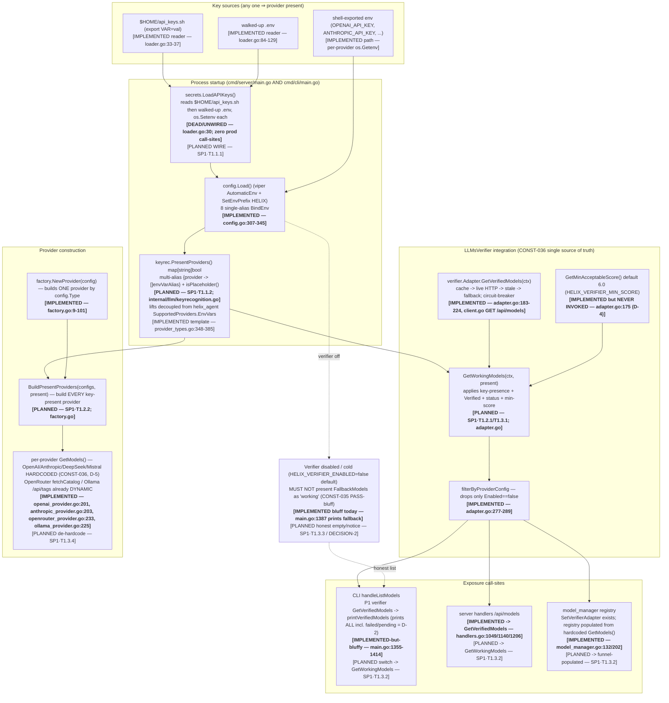
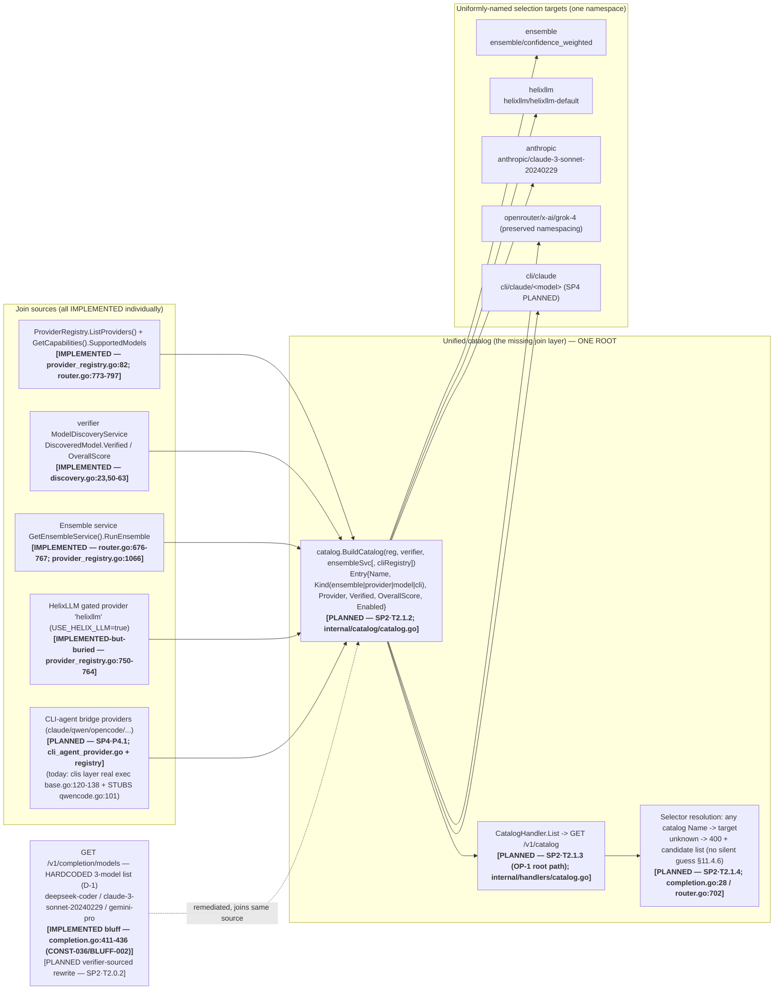
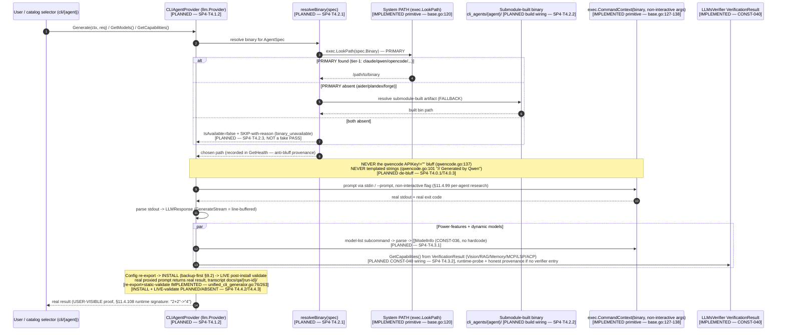

# Model-Access Architecture — Diagrams (Key-Recognition · Unified Catalog · CLI-Bridge)

| Field | Value |
|-------|-------|
| Revision | 1 |
| Created | 2026-06-10 |
| Last modified | 2026-06-10 |
| Status | DESIGN — describes target architecture; nodes labelled IMPLEMENTED vs PLANNED |
| Maintainer | DOCUMENTATION subagent (READ-ONLY on code) |
| Authority | Cascades from `constitution/` + root `CLAUDE.md`/`CONSTITUTION.md`; CONST-036 (verifier single source of truth), CONST-040 (capabilities from `VerificationResult`), §11.4 anti-bluff |
| Sources | SP1 plan (`docs/superpowers/specs/plans/2026-06-10-SP1-model-access-plan.md`), SP2 plan (`…/2026-06-10-SP2-helixagent-exposure-plan.md`), SP4 plan (`…/2026-06-10-SP4-cli-bridge-plan.md`); analyses B/C/D (`docs/superpowers/specs/analysis/2026-06-10-{B,C,D}-*.md`); master roadmap (`docs/superpowers/specs/2026-06-10-llms-access-master-roadmap.md`) |

---

> **§11.4 / §11.4.123 anti-bluff honesty note (read first).** This document describes the
> **target architecture** of the model-access + provider-exposure + CLI-bridge system. It mixes
> **IMPLEMENTED** components (real code, cited `file:line`, confirmed in the analysis passes) with
> **PLANNED** components (specified in SP1/SP2/SP4 but **not yet built** — no captured runtime
> evidence exists). Every diagram node carries an explicit `[IMPLEMENTED …]` or `[PLANNED …]`
> tag. A node tagged PLANNED is a design intent, **not** a claim of working software. Diagrams
> are documentation, not proof of behaviour; the runtime-evidence bar (§11.4.5 / §11.4.69 /
> §11.4.107) is met only by the test/Challenge evidence each SP plan requires at execution time.

Legend used in every diagram:

- **IMPLEMENTED** — real code exists today; cited to a real `file:line` read during the
  2026-06-10 analysis passes.
- **PLANNED** — specified in an SP plan / task (e.g. `SP1·T1.2.1`); **not built**; no runtime
  evidence.
- **DEAD/UNWIRED** — code exists but has zero production call-sites (a §11.4.124 investigate-then-wire
  target, **not** removed).

Paths: inner Go app code is under `helix_code/` (module `dev.helix.code`); the HelixAgent
exposure surface is under `submodules/helix_agent/` (module `dev.helix.agent`).

---

## Table of contents

- [Diagram A — Key-recognition → verifier → working-model funnel (SP1)](#diagram-a--key-recognition--verifier--working-model-funnel-sp1)
- [Diagram B — Unified catalog under one root (SP2 + SP4)](#diagram-b--unified-catalog-under-one-root-sp2--sp4)
- [Diagram C — CLI-bridge selection & proxy sequence (SP4)](#diagram-c--cli-bridge-selection--proxy-sequence-sp4)
- [Node provenance ledger (IMPLEMENTED vs PLANNED)](#node-provenance-ledger-implemented-vs-planned)
- [Cross-references](#cross-references)

---

## Diagram A — Key-recognition → verifier → working-model funnel (SP1)

**What it shows.** How a single supplied/recognized API key turns into the set of WORKING
models a user sees. Source: SP1 plan §3 "Target design (the working-model funnel)"; analysis-B §4.1.

**Working-model predicate (SP1 §3, applied in the PLANNED `GetWorkingModels`):**
`present[provider]` ∧ `Verified==true` ∧ `VerificationStatus=="verified"` ∧
`OverallScore >= GetMinAcceptableScore()` ∧ `Providers[provider].Enabled != false`.

**Defect anchors closed by SP1 (analysis-B top-5 gaps):** D-2 (CLI shows failed/pending),
D-3 (`LoadAPIKeys` dead), D-4 (min-score never applied), D-5 (hardcoded lists), plus the
no-key-presence-gate gap and the single-provider-factory gap.

---

## Diagram B — Unified catalog under one root (SP2 + SP4)

**What it shows.** The PLANNED unified catalog that joins, **under one root**, the AI-debate
ensemble + HelixLLM + every discovered provider + every provider's verified model + (SP4) every
CLI-agent bridge provider and its models — each a uniformly-named, individually-addressable
selection target. Source: SP2 plan §P2.1/§P2.2; analysis-C §3; master roadmap §257; SP4 plan §P4.1/§P4.3.

**Naming grammar (analysis-C §3.2, master roadmap line 257):**
`ensemble` · `ensemble/<preset>` · `helixllm` · `helixllm/<model>` · `<provider>` ·
`<provider>/<model_id>` (preserving already-namespaced ids like `openrouter/x-ai/grok-4`) ·
**(SP4)** `cli/<agent>` · `cli/<agent>/<model>`.

**Anti-bluff invariant (SP2 §7).** Catalog "model" entries are emitted **only** for
`DiscoveredModel.Verified == true` — never the static `SupportedModels` slice, never a hardcoded
literal. HelixLLM is **promoted, never removed** (§11.4.122); all existing `/v1/*` routes stay
intact (additive design).

---

## Diagram C — CLI-bridge selection & proxy sequence (SP4)

**What it shows.** How a `cli/<agent>` selection resolves a binary (PRIMARY system-installed →
FALLBACK submodule-built), proxies a prompt via real `exec`, parses the result, and surfaces
power-features. Source: SP4 plan §P4.2/§P4.3/§P4.4; analysis-D §5.

**Tier-1 agents system-installed today (analysis-D §2, captured `command -v`):** claude 2.1.170,
qwen 0.5.0, opencode 1.16.2, gemini 0.1.9, crush v0.22.2, codex, goose 1.8.0, copilot 1.0.46.
**Fallback-required (absent today):** aider, plandex, forge.

**Wiring prerequisite (SP4 §2.3, confirmed gap D-7).** `helix_code/go.mod` (replace block
lines 194-212) has **no** `replace dev.helix.agent` — so HelixCode cannot import the `clis`
substrate today. SP4·T4.0.5 PLANS to add it (or a narrow shim, decided on `go mod graph`
evidence). The exec primitive itself (`base.go:120-138`) is IMPLEMENTED and real; the
per-agent dispatch tier (`instance_manager.go:906+ executeClaudeCode/...`) and
`qwencode.go:101/115/137` are **STUBS** (a §11.4 bluff SP4·P4.0 RED-reproduces then fixes).

---

## Node provenance ledger (IMPLEMENTED vs PLANNED)

A single-table audit so a reader can verify each claim against real code or a real SP task.

| Component | State | Anchor (real `file:line`) or SP task |
|-----------|-------|--------------------------------------|
| `secrets.LoadAPIKeys` reader | IMPLEMENTED but DEAD/UNWIRED | `helix_code/internal/secrets/loader.go:30,33-37,84-129` |
| Wire `LoadAPIKeys` at startup | PLANNED | SP1·T1.1.1 (`cmd/server/main.go`, `cmd/cli/main.go`) |
| Viper `AutomaticEnv` + 8 `BindEnv` | IMPLEMENTED | `helix_code/internal/config/config.go:307-345` |
| Multi-alias key-recognition table | PLANNED | SP1·T1.1.2 (`internal/llm/keyrecognition.go`) |
| helix_agent `SupportedProviders.EnvVars` (reuse template) | IMPLEMENTED | `submodules/helix_agent/internal/verifier/provider_types.go:348-385` |
| `verifier.Adapter.GetVerifiedModels` (real HTTP) | IMPLEMENTED | `helix_code/internal/verifier/adapter.go:183-224`; `client.go` GET `/api/models` |
| `GetMinAcceptableScore` (loaded, never invoked) | IMPLEMENTED-unused (D-4) | `helix_code/internal/verifier/adapter.go:175-180` |
| `GetWorkingModels` filter | PLANNED | SP1·T1.2.1 / T1.3.1 (`adapter.go`) |
| `filterByProviderConfig` (Enabled flag only) | IMPLEMENTED | `helix_code/internal/verifier/adapter.go:277-289` |
| CLI `handleListModels` / `printVerifiedModels` (shows failed/pending, D-2) | IMPLEMENTED-bluffy | `helix_code/cmd/cli/main.go:1355-1414` |
| Switch CLI/server/registry → `GetWorkingModels` | PLANNED | SP1·T1.3.2 |
| Verifier-disabled honest behaviour | PLANNED | SP1·T1.3.3 / DECISION-2 (today bluff at `main.go:1387`) |
| `factory.NewProvider` (one by `config.Type`) | IMPLEMENTED | `helix_code/internal/llm/factory.go:9-101` |
| `BuildPresentProviders` enumerator | PLANNED | SP1·T1.2.2 |
| Hardcoded provider model lists (D-5/CONST-036) | IMPLEMENTED (violation) | `openai_provider.go:201`, `anthropic_provider.go:203`, `deepseek_provider.go`, `mistral_provider.go` |
| OpenRouter `fetchCatalog` / Ollama `/api/tags` (dynamic templates) | IMPLEMENTED | `openrouter_provider.go:233-295`, `ollama_provider.go:225` |
| `ProviderRegistry.ListProviders` + `GET /v1/providers` | IMPLEMENTED | `submodules/helix_agent/internal/services/provider_registry.go:82`; `internal/router/router.go:773-797` |
| Ensemble route `POST /v1/ensemble/completions` | IMPLEMENTED | `submodules/helix_agent/internal/router/router.go:676-767` |
| HelixLLM gated provider `helixllm` (buried) | IMPLEMENTED | `submodules/helix_agent/internal/services/provider_registry.go:750-764` |
| `DiscoveredModel.Verified` / `OverallScore` (working flag) | IMPLEMENTED | `submodules/helix_agent/internal/verifier/discovery.go:50-63` |
| `GET /v1/completion/models` hardcoded 3-model list (D-1) | IMPLEMENTED bluff | `submodules/helix_agent/internal/handlers/completion.go:411-436` |
| D-1 verifier-sourced rewrite | PLANNED | SP2·T2.0.2 |
| `catalog.BuildCatalog` join | PLANNED | SP2·T2.1.2 (`internal/catalog/catalog.go`) |
| `GET /v1/catalog` handler + route | PLANNED | SP2·T2.1.3 (OP-1 root path) |
| Selector resolution (Name → target) | PLANNED | SP2·T2.1.4 |
| HelixLLM first-class root promotion | PLANNED | SP2·T2.2.4 |
| `llm.Provider` contract (CLI bridge target) | IMPLEMENTED | `helix_code/internal/llm/missing_types.go:356-378` |
| CLI-exec primitive (`LookPath` + `CommandContext`) | IMPLEMENTED | `submodules/helix_agent/internal/clis/agents/base/base.go:120-138` |
| `qwencode` stub (templated strings, APIKey gate) | IMPLEMENTED bluff (D-6) | `submodules/helix_agent/internal/clis/agents/qwencode/qwencode.go:101,115,137` |
| `instance_manager` dispatch stubs | IMPLEMENTED bluff (wider than D-6) | `submodules/helix_agent/internal/clis/instance_manager.go:906-942` |
| `replace dev.helix.agent` wiring (D-7) | PLANNED/ABSENT | SP4·T4.0.5 (`helix_code/go.mod:194-212` has no such replace) |
| `CLIAgentProvider` + `AgentSpec` registry | PLANNED | SP4·T4.1.2 / T4.1.3 |
| `resolveBinary` PRIMARY→FALLBACK | PLANNED | SP4·T4.2.1 |
| Dynamic `GetModels` per agent (CONST-036) | PLANNED | SP4·T4.3.1 |
| Capabilities from `VerificationResult` (CONST-040) | PLANNED | SP4·T4.3.2 |
| Config re-export + static `Validate()` | IMPLEMENTED | `submodules/helix_agent/.../unified_cli_generator.go:76,212,263`; `cmd/helixagent/main.go:107,4522` |
| Filesystem INSTALL + LIVE post-install validate | PLANNED/ABSENT | SP4·T4.4.2 / T4.4.3 |

---

## Cross-references

- **SQL data model** for these flows: [`model-access-schema.sql`](./model-access-schema.sql).
- **Index / metadata header:** [`README.md`](./README.md).
- **SP plans (authoritative task source):**
  `docs/superpowers/specs/plans/2026-06-10-SP1-model-access-plan.md`,
  `…-SP2-helixagent-exposure-plan.md`, `…-SP4-cli-bridge-plan.md`.
- **Analysis (evidence base):** `docs/superpowers/specs/analysis/2026-06-10-B-model-access.md`,
  `…-C-helixagent-exposure.md`, `…-D-cli-bridge.md`.
- **Master roadmap:** `docs/superpowers/specs/2026-06-10-llms-access-master-roadmap.md`.

> Per CONST-066 / §11.4.65, this `.md` should ship synchronized `.html`/`.pdf` siblings at
> release-prep. They are **not** generated by this READ-ONLY documentation pass.
