# HelixLLM Capabilities Guide — Operator / End-User Manual

| | |
|---|---|
| **Scope** | Every LLM/AI-serving capability landed under `feature/helixllm-full-extension` — what it does, its real port, a real copy-pasteable invocation, the model it runs, and its current runtime state. |
| **Audience** | Operators driving the HelixCode stack, CLI-agent integrators (HelixAgent, claude_toolkit, any OpenAI/Anthropic-compatible client), and anyone deciding which capability to boot next. |
| **Track / branch** | `(T1/feature/helixllm-full-extension)` |
| **Grounding (§11.4.6 / §11.4.123)** | Every port, endpoint, and example command below is copied from a captured, re-runnable evidence file or a source-verified design doc — never invented. Where the real invocation could not be determined from evidence, this guide says so explicitly and points at the evidence path instead of guessing. |
| **Honest boundary** | This is a snapshot of the `feature/helixllm-full-extension` branch as of the evidence dated 2026-07-06 → 2026-07-08 (see `## Sources`; today's proven evidence spans 2026-07-08). Ports/behaviour may have moved since; re-run the cited reproduce command to re-confirm before relying on any figure here. |

---

## 1. Architecture at a glance

```mermaid
flowchart TB
    subgraph Clients["CLI Agents / Clients"]
        HelixCode["HelixCode meta-repo\n(this repo)"]
        ClaudeCode["Claude Code / claude_toolkit\naliases"]
        OtherAgents["Any OpenAI- / Anthropic-\ncompatible client"]
    end

    subgraph HelixAgentBox["HelixAgent (submodules/helix_agent)"]
        Provider["helixllm.Provider\n(env-var pinned: HELIX_LLM_HOST/PORT\nor HELIX_LLM_*_ENDPOINT)"]
        Session["Session repo\n(Postgres)"]
        Cache["Cache client\n(Redis)"]
    end

    subgraph Verifier["LLMsVerifier (submodules/llms_verifier)"]
        VerifierReg["ProviderClient registry\n(Name, BaseURL, APIKey)\nCONST-036/037/038/039/040"]
    end

    subgraph HelixLLMBox["HelixLLM (submodules/helix_llm)"]
        Coder[":18434 Coder fleet — LIVE\nQwen3-Coder-30B-A3B\n(llama.cpp router, resident)"]
        Gateway[":8443 Go gateway\nOpenAI + Anthropic\n(TLS-mandatory, code-verified)"]
        Broker["internal/vrambroker\nAcquire/Release/Budget\nadmission gate, fail-closed"]
        Embed[":18435 Embeddings (TEI)\nbge-small-en-v1.5 — on-demand"]
        Vision[":18439 Vision VLM\nQwen2.5-VL-3B — on-demand, STOPPED"]
        Translate[":18436 Translation NLLB\nCTranslate2 — on-demand"]
        Whisper[":18437 Whisper STT\nfaster-whisper base — on-demand"]
        Tesseract[":18438 Tesseract OCR\nTesseract 5 — on-demand"]
        RAG[":18440 RAG pipeline\n(own TEI + live coder) — on-demand"]
        A2A[":18441 A2A server\nGoogle A2A wire — on-demand"]
        ImageGen[":18442 Image-gen\nSCAFFOLD-ONLY, burst-gated"]
        VideoGen[":18443 Video-gen\nSCAFFOLD-ONLY, burst-gated"]
    end

    HelixCode --> HelixAgentBox
    ClaudeCode --> VerifierReg
    OtherAgents --> Coder
    OtherAgents --> Gateway
    Provider --> Coder
    Provider -. LAN/VPN via HELIX_LLM_HOST .-> Coder
    Session --> Provider
    Cache --> Provider
    VerifierReg -. discovers models via live /v1/models .-> Coder
    VerifierReg -. discovers models via live /v1/models .-> Gateway
    Broker --> Vision
    Broker --> ImageGen
    Broker --> VideoGen
    Broker --> Translate
    Broker --> Embed
    RAG --> Embed
    RAG --> Coder
```



**Reading the diagram:** HelixCode's own CLI agents, `claude_toolkit`-mediated CLI agents, and any generic OpenAI/Anthropic client all reach HelixLLM either directly (coder fleet, `:18434`) or through HelixAgent's `helixllm.Provider` seam (which also drives Postgres session persistence and Redis caching). LLMsVerifier never talks model *content* — it only discovers and verifies capability metadata by querying each endpoint's own `/v1/models` (CONST-036: no hardcoded model lists). The VRAM broker sits between HelixLLM and every non-resident (warm/burst) service, admitting each lease against a live `nvidia-smi`/NVML read — never a cached number.

---

## 2. Quick-reference table

| # | Capability | Port | State | Model / engine | Evidence |
|---|---|---|---|---|---|
| 1 | Coder serving | `:18434` | **LIVE** (always-on, resident) | Qwen3-Coder-30B-A3B-Instruct-Q4_K_M (llama.cpp router) | `docs/qa/phase2_e2e_20260706/`, `submodules/helix_llm/docs/OPERATOR_GUIDE.md` §3 |
| 2 | Full Go gateway (OpenAI+Anthropic) | `:8443` | **Code-verified, not captured live-serving this session** | Embedded llama.cpp brain (`Llama-3.1-70B-Instruct-Q4_K_M` default) or the resident coder when wired | `submodules/helix_llm/docs/API_CONTRACT.md` |
| 3 | Embeddings (TEI) | `:18435` | **On-demand boot** (proven when running) | `BAAI/bge-small-en-v1.5`, dim 384 (fallback lane; `nomic-embed-text-v1.5` primary lane fails to boot on this TEI build) | `docs/qa/phase3_embeddings_20260706/RESULTS.md` |
| 4 | Vision VLM | `:18439` | **On-demand boot; currently STOPPED** | Qwen2.5-VL-3B-Instruct-Q4_K_M + mmproj (llama.cpp multimodal) | `docs/qa/helixllm_vision_boot_20260707T215007Z/RESULTS.md`, `docs/qa/phase1_helixqa_vision_20260708T061809Z/RESULTS.md` |
| 5 | Translation (NLLB, primary) | `:18436` | **On-demand boot** (proven when running) | NLLB-200-distilled-600M via CTranslate2 (CPU) | `docs/qa/phase3_translation_nllb_20260707/RESULTS.md` |
| 5b | Translation (LibreTranslate, fallback) | `:18436`* | **On-demand boot** (proven when running) | LibreTranslate/Argos (CPU) | `docs/qa/phase3_translation_20260707/RESULTS.md` |
| 6 | Whisper STT | `:18437` | **On-demand boot** (proven when running) | faster-whisper (CTranslate2), `model=base`, `int8`, CPU | `docs/qa/phase3_whisper_stt_20260707/RESULTS.md` |
| 7 | Tesseract OCR | `:18438` | **On-demand boot** (proven when running) | Tesseract 5.3.0-2 (OEM 1 / LSTM), CPU | `docs/qa/phase3_tesseract_ocr_20260707/RESULTS.md` |
| 8 | RAG (retrieval-augmented generation) | own TEI `:18440` + coder `:18434` | **On-demand boot** (proven pipeline) | `BAAI/bge-small-en-v1.5` embed + live coder generate | `docs/qa/phase3_rag_20260707/RESULTS.md` |
| 9 | A2A (Google Agent2Agent) | `:18441` | **On-demand boot** (proven when running) | Server-side only; routes Tasks to the live coder | `docs/qa/phase3_a2a_20260707/RESULTS.md` |
| 10 | Network provider (LAN/VPN) | same coder port, remote host | **LIVE** (env-var driven, no separate service) | Same coder / gateway, reached over `HELIX_LLM_HOST`/`HELIX_LLM_PORT` | `docs/qa/helixagent_network_provider_20260707/RESULTS.md` |
| 11 | VRAM broker | n/a (in-process package) | **CORE landed** (`a12df57c`); no eviction/pause-warm-tier logic yet | `internal/vrambroker` — `Acquire`/`Release`/`Budget` | `docs/research/07.2026/00_master/MASTER_IMPLEMENTATION_PLAN.md` §1.1; `submodules/helix_llm/docs/VRAM_BROKER.md` (design) |
| 12 | HelixMemory | ephemeral Postgres+pgvector `:18450` + TEI `:18451` in the proof harness | **Reference implementation PROVEN**, not the literal mem0/Graphiti package | pgvector cosine recall + live coder generate | `docs/qa/phase1_helixmemory_20260708T061824Z/RESULTS.md`, `docs/research/07.2026/04_embeddings_rag/HELIXMEMORY_PROVIDER.md` |
| 13 | Lane-B (2nd coder lane, warm) | `:18435` (when active) | **PROVEN CO-RESIDENT** — booted alongside live coder, torn down cleanly | Mistral-Nemo-Instruct-2407-Q4_K_M, 12.2B params, 6.96 GiB | `docs/qa/phase1_laneb_bench_20260708T145242Z/RESULTS.md` |
| 14 | Coder pause/restore | `:18434` (mechanism) | **PROVEN** — podman stop->start, ~5s reload, GPU freed, no degradation | n/a (docker-compose lifecycle on the coder container) | `docs/qa/phase1_coder_pause_20260708T141500Z/RESULTS.md` |
| 15 | Provider live-proofs | n/a (external API) | **PROVEN LIVE** — Mistral+Codestral 8/8 PASS, Cohere v2 fix applied | `mistral-large-latest`, `codestral-latest`, `mistral-embed`, `command-r-08-2024` | `docs/qa/phase1_providers_deep_20260708_204228/RESULTS.md`, `docs/qa/phase1_providers_20260708T141500Z/live_probe.md` |
| 16 | HelixQA test bank coverage | n/a (test orchestration) | **PROVEN** — 4 banks authored with self-validated analyzers | Concurrency, race, memory, chaos (+DDoS scaffold) | `docs/qa/phase1_helixqa_coder_concurrency_20260708T110536Z/`, `docs/qa/phase1_helixqa_coder_memory_20260708T150000Z/`, `docs/qa/phase1_helixqa_coder_race/`, `docs/qa/helixllm_coder_chaos_20260708T154503Z/RESULTS.md` |
| 17 | Image generation | `:18442` | **SCAFFOLD-ONLY** (BLOCKED on HF_TOKEN+NUNCHAKU_WHEEL) | FLUX.1-dev + Nunchaku NVFP4 (existing scaffold); FLUX.1-schnell GGUF (alternative, new backend) | `docs/research/07.2026/00_master/IMAGE_GEN_PROVIDER.md`; `docs/qa/phase1_imagegen_runtime_20260708T082002Z/README.md` |
| 18 | Video generation | `:18443` | **SCAFFOLD-ONLY** — same posture as image-gen; runtime proof pending | WAN 2.2 / LTX-Video (design) | `MASTER_IMPLEMENTATION_PLAN.md` §1.2 |
| 19 | OpenDesign (UI design system) | `:7456` (planned) | **NOT YET INSTALLED** — design-only, recommended next step | n/a | `MASTER_IMPLEMENTATION_PLAN.md` §6.6 |

\* The NLLB-primary and LibreTranslate-fallback translation proofs both default to host port `18436` in their harnesses; per the evidence, **do not run both proofs concurrently** (`docs/qa/phase3_translation_nllb_20260707/RESULTS.md` "Evidence-integrity notes", item 2). The Lane-B warm tier also defaults to the same port (`18435`) as the standing embeddings capability — do not run Lane-B and embeddings concurrently without changing one of the ports.

---

## 3. Coder serving — `:18434` — LIVE

**What it does.** The always-on, resident inference fleet. Serves genuine code-completion output over an OpenAI-compatible HTTP surface via `llama-server` (llama.cpp), 8 concurrent slots with continuous batching, q8_0-quantized KV cache, 24k context.

**Model:** `Qwen3-Coder-30B-A3B-Instruct-Q4_K_M.gguf`, `-ngl 99` (fully GPU-offloaded on the RTX 5090).

**State:** LIVE, always resident, never evicted by the VRAM broker (`ClassCoder`). Measured resident VRAM ≈ 19.4 GiB.

**Real health check:**

```bash
curl -s http://localhost:18434/health
```

**Real chat completion** (this exact example was proven end-to-end and returned genuine code, not a stub — `submodules/helix_llm/docs/OPERATOR_GUIDE.md` §4):

```bash
curl -sS http://localhost:18434/v1/chat/completions \
  -H "Content-Type: application/json" \
  -d '{
    "model": "/models/Qwen3-Coder-30B-A3B-Instruct-Q4_K_M.gguf",
    "messages": [
      {"role": "user", "content": "Write a Python function is_palindrome(s) that ignores case and non-alphanumerics."}
    ]
  }'
```

Proven throughput: **~220 tok/s single-stream**; **85–96 tok/s per stream at 8 concurrent agents** (`docs/qa/phase2_e2e_20260706/RESULTS.md`, `submodules/helix_llm/docs/OPERATOR_GUIDE.md` §6).

**Concurrent throughput under load (180/180 requests, zero errors, zero timeouts) — `docs/qa/phase1_coder_perf_20260708T134500Z/`:**

| Concurrency | P50 | P95 | P99 | Max |
|---|---|---|---|---|
| 10 | 100ms | 112ms | 112ms | 112ms |
| 20 | 111ms | 141ms | 141ms | 141ms |
| 50 | 196ms | 292ms | 293ms | 293ms |
| 100 | 297ms | 453ms | 591ms | 591ms |

Latency scales sub-linearly (2x concurrency -> ~1.5x P50 at 50->100). Single-inference-worker bottleneck visible but smooth -- no saturation cliff. Tail tight: P99 ~1.5-2x P50 across all levels. Verified under `§11.4.85` stress mandate: **no dropped requests, no inter-request state leakage, deterministic output under load**.

**The `/v1` base-URL gotcha (load-bearing).** `llama-server`'s chat route is `POST /v1/chat/completions`. If your client library appends `/v1/chat/completions` to a configured base URL itself, the base URL MUST be `http://localhost:18434` — **without** a trailing `/v1`. Writing `http://localhost:18434/v1` as the base produces `/v1/v1/chat/completions` → **HTTP 404**. Confirmed both ways in `docs/qa/phase2_e2e_20260706/12_endpoint_finding.txt`.

**HelixAgent integration (proven, RED→GREEN):**

```bash
cd submodules/helix_agent
export HELIX_LLM_LOCAL_OPENAI_ENDPOINT=http://localhost:18434   # base, NO /v1
go test -tags=helixllm_e2e -run TestE2E_HelixAgent_To_LiveHelixLLM -v \
  ./internal/llm/providers/helixllm/
```

Real captured output: `func Add(a int, b int) int { return a + b }`, `tokens_used=53`, `elapsed=108ms` (`docs/qa/phase2_e2e_20260706/RESULTS.md`). Session persistence (Postgres `user_sessions` table) and cache persistence (Redis) were also proven against real infrastructure in the same run.

---

## 4. Full HelixLLM Go gateway — `:8443` — code-verified, not captured live-serving this session

**What it does.** A separate, standalone HelixLLM Go server (`cmd/helixllm/main.go`) fronting an **embedded** llama.cpp brain behind a TLS-mandatory, dual OpenAI + Anthropic gateway. This is a distinct binary from the raw coder fleet on `:18434` — the two are not the same process.

**State:** documented directly from source code (`submodules/helix_llm/docs/API_CONTRACT.md`, HEAD `e035599d`, `go build ./...` exits 0) — **not** exercised by a captured live-serving run in the evidence corpus this guide draws from. Treat every claim below as "the code says this," not "this was watched running."

**Listen address:** `https://0.0.0.0:8443`, TLS 1.3 minimum (mandatory — serving fails immediately if cert/key are empty), HTTP/3 (QUIC) + HTTP/2 on the same port.

**Routes (verbatim from the contract, `API_CONTRACT.md` §2/§4/§5):**

```
POST /v1/chat/completions   (OpenAI-compatible, API-key auth)
POST /v1/completions        (OpenAI-compatible, API-key auth)
GET  /v1/models             (OpenAI-compatible, API-key auth — models sourced from the Brain, never hardcoded)
POST /v1/embeddings         (OpenAI-compatible, API-key auth)
POST /v1/messages           (Anthropic-compatible, API-key auth)
GET  /internal/health       (public, no auth)
GET  /ws                    (WebSocket, internal chat shape — NOT the OpenAI shape)
```

**Example request** (derived from the `ChatCompletionRequest` struct — `pkg/api/openai.go:4-18`; not a captured live transcript):

```json
POST /v1/chat/completions
Authorization: Bearer <key>
Content-Type: application/json
{"model":"llama-3.1-70b","messages":[{"role":"user","content":"What is 2+2?"}],"stream":false}
```

**Security finding carried over from the code review (do not expose `:8443` on an untrusted network without addressing this first):** the API-key middleware was originally applied only to the gateway's own `/v1` group; `/v1/agents/*`, `/v1/cache/stats`, all `/internal/*`, `/metrics`, and `/ws` were unauthenticated. A DZ-05 remediation wired the same middleware onto the agent/knowledge/control route groups (proven RED→GREEN, `docs/qa/dz05_endpoint_auth_20260707/`), but `/ws` remains open by explicit design decision (browser-native WebSocket clients cannot set an `Authorization` header) — an unresolved operator decision on the WS credential channel. See `API_CONTRACT.md` §2 footnotes for the full auth matrix.

---

## 5. Embeddings — `:18435` — on-demand boot

**What it does.** A CPU-only embeddings service (no GPU) serving vector embeddings over the OpenAI-compatible `/v1/embeddings` route via HuggingFace Text-Embeddings-Inference (TEI).

**Model:** `BAAI/bge-small-en-v1.5`, dim 384. (The design's primary lane, `nomic-ai/nomic-embed-text-v1.5`, fails to boot on this TEI build — `cpu-1.9` rejects its `config.json` with "duplicate field `max_position_embeddings`" — so the fallback `bge-small` lane is what actually ships; see honest substitution note below.)

**State:** proven when running; booted on-demand via the containers submodule, torn down single-owner (`§11.4.119`) when the proof finished. It is not resident by default.

**Real invocation** (the exact request the proof harness sends, `docs/qa/phase3_embeddings_20260706/harness/main.go`):

```bash
curl -sS http://localhost:18435/v1/embeddings \
  -H "Content-Type: application/json" \
  -d '{"model":"helix-embed","input":["The cat sat on the mat.","A feline rested on the rug.","Stock markets fell sharply today."]}'
```

Real captured signature: `dim=384`, related-pair cosine `0.7509`, unrelated-pair cosine `0.3931`, margin `0.3578` (required ≥ 0.15) — real, deterministic, semantically-ordered embeddings, not zero vectors (`docs/qa/phase3_embeddings_20260706/RESULTS.md`).

**Honest substitution note (§11.4.6):** if you need the 768-dim nomic-embed-text-v1.5 lane specifically, it does not currently boot on this TEI image — pin a TEI-parseable nomic revision or upgrade TEI first (tracked follow-up in the RESULTS.md).

---

## 6. Vision (VLM) — `:18439` — on-demand boot, currently STOPPED

**What it does.** Multimodal (image + text) chat completion over the same OpenAI-compatible `/v1/chat/completions` route the coder uses, via a llama.cpp multimodal server (GGUF weights + libmtmd mmproj projector).

**Model:** `Qwen2.5-VL-3B-Instruct-Q4_K_M.gguf` + `mmproj-Qwen2.5-VL-3B-Instruct-Q8_0.gguf`. (A 7B/8B upgrade tier is a documented env-override path, not exercised in the cited evidence.)

**State:** on-demand, warm-tier co-resident with the coder (`ClassVLM` in the VRAM broker) — **container currently STOPPED / torn down mid-session, no VRAM held**. Boot/teardown is fully automated via the `visiongen-boot` tool through the containers submodule.

**Boot it** (real commands, `docs/qa/phase1_helixqa_vision_20260708T061809Z/RESULTS.md`):

```bash
cd submodules/helix_llm
./visiongen-boot admit-check
./visiongen-boot boot compose.vision.yml helixllm_visiongen
```

**Real invocation** (exact request shape captured in `docs/qa/helixllm_vision_boot_20260707T215007Z/inference_request.json` — base64 image data URI, OpenAI-compatible multimodal content parts):

```bash
curl -sS http://localhost:18439/v1/chat/completions \
  -H "Content-Type: application/json" \
  -d '{
    "model": "vlm",
    "messages": [{
      "role": "user",
      "content": [
        {"type": "text", "text": "Describe this image in one sentence."},
        {"type": "image_url", "image_url": {"url": "data:image/png;base64,<BASE64_PNG_HERE>"}}
      ]
    }],
    "max_tokens": 200,
    "temperature": 0.2
  }'
```

Real captured responses (two separate runs of the SAME test image — different wording each time, proving genuine live sampling, not a cached string): *"A red square is displayed on a black background."* / *"The image shows a red square on a black background."* A HelixQA-driven ground-truth bank (`submodules/helix_qa/banks/helixllm_vision.yaml`) additionally confirmed real understanding tasks: counting ("3" blue circles), OCR-read ("HELIX"), and spatial reasoning ("left") — all against the live 3B model, all self-validated with a golden-good/golden-bad pair (`docs/qa/phase1_helixqa_vision_20260708T061809Z/RESULTS.md`).

**Tear it down:**

```bash
./visiongen-boot down compose.vision.yml helixllm_visiongen
```

**On-demand boot / VRAM budget rule (§11.4.119 single-owner, master plan §3):** vision's admission is gated on a LIVE `nvidia-smi`/`Budget().free` read before every boot — never a cached number. At the time of the cited evidence, free VRAM after the coder alone was ≈12.4–12.7 GiB; vision (≈5 GiB placeholder / ≈4.1 GiB measured peak) fits comfortably. Vision (`ClassVLM`) and a hypothetical 2nd coder lane (`ClassAgent`) are independent warm-tier admissions; `ClassImage`/`ClassVideo` burst classes are mutually exclusive with each other and may require pausing the warm tier — see §11 below.

---

## 7. Translation — `:18436` — on-demand boot (two proven lanes)

**What it does.** Machine translation over a thin bespoke HTTP shim, `POST /translate {"q","source","target"} -> {"translatedText"}`.

**Two proven lanes** (do not run both on the same port concurrently — see the quick-reference table footnote):

- **Primary: NLLB-200-distilled-600M via CTranslate2 (CPU)** — the design's documented default. Language codes are FLORES-200 format (`eng_Latn`, `deu_Latn`, `fra_Latn`).
- **Fallback: LibreTranslate/Argos (CPU)** — already-shipped fallback lane, proven independently.

**Real invocation (NLLB primary lane):**

```bash
curl -sS http://localhost:18436/translate \
  -H "Content-Type: application/json" \
  -d '{"q":"The house is blue.","source":"eng_Latn","target":"deu_Latn"}'
```

Real captured output: `"Das Haus ist blau."` (deterministic — byte-identical across two identical requests, `docs/qa/phase3_translation_nllb_20260707/RESULTS.md`). A second pair, English→French: *"The cat sleeps."* → *"Le chat dort."*

**Honest license note (§11.4.6):** NLLB-200 weights are CC-BY-NC-4.0 (non-commercial) — unresolved, flagged in the design doc as Open Question Q5.

**Boot/teardown** goes through the containers submodule orchestrator, rootless podman, no GPU device anywhere in the compose spec (`docs/qa/phase3_translation_nllb_20260707/harness/compose.phase3translatenllb.yml`); reproduce via `cd docs/qa/phase3_translation_nllb_20260707/harness && ./run_proof.sh`.

---

## 8. Whisper STT — `:18437` — on-demand boot

**What it does.** Speech-to-text transcription over `POST /v1/audio/transcriptions`.

**Model / engine:** faster-whisper (CTranslate2), `model=base`, `device=cpu`, `compute_type=int8`, with a Silero-VAD + `no_speech_prob≥0.6` silence-hallucination guard.

**State:** proven when running, on-demand boot via the containers submodule (`--build` from `submodules/helix_llm/container/Containerfile.whisper`), no GPU.

**Real invocation** (the harness posts a real synthesized WAV file; the shape is the standard OpenAI Whisper multipart form):

```bash
curl -sS http://localhost:18437/v1/audio/transcriptions \
  -F file=@fox.wav \
  -F model=whisper-base
```

Real captured transcript: `"The quick brown fox dumps over the lazy dog."` (a genuine, minor ASR mis-hear of "jumps"→"dumps" on synthetic TTS audio — disclosed honestly, not hidden) and `"Hello World 1, 2, 3!"` for a second fixture. Metadata confirms real engine telemetry: `language=en`, `max_no_speech_prob=0.0197` (`docs/qa/phase3_whisper_stt_20260707/RESULTS.md`).

Reproduce: `cd docs/qa/phase3_whisper_stt_20260707/harness && ./run_proof.sh`.

---

## 9. Tesseract OCR — `:18438` — on-demand boot

**What it does.** Optical character recognition over two routes: `/v1/render` (renders a known text string to an image, used by the proof harness to generate unfakeable ground truth) and `/v1/ocr` (recovers text from an image).

**Engine:** Tesseract 5.3.0-2 (OEM 1 / LSTM, Debian `bookworm` package), behind a minimal Go HTTP shim (`submodules/helix_llm/services/ocr/`).

**State:** proven when running, on-demand boot via the containers submodule, no GPU. The real invocation shape (multipart image upload to `/v1/ocr`) was not captured verbatim in a standalone example in the cited evidence — see `submodules/helix_llm/services/ocr/main.go` and `docs/qa/phase3_tesseract_ocr_20260707/RESULTS.md` for the exact wire contract before scripting against it.

Real captured signature (both fixtures rendered by the service itself, then OCR'd back): `"HELIX OCR 2026 quick brown fox"` at `mean_conf=95.99`, `"PHASE THREE TESSERACT PROOF SEVEN"` at `mean_conf=94.77`; a wrong-content fixture scored high confidence (95.98) yet correctly FAILED the expected-token check — proving the analyzer needs both confidence AND content matching (`docs/qa/phase3_tesseract_ocr_20260707/RESULTS.md`).

Reproduce: `cd docs/qa/phase3_tesseract_ocr_20260707/harness && ./run_proof.sh` (builds the `ocr-shim` static binary automatically).

---

## 10. RAG (Retrieval-Augmented Generation) — own TEI `:18440` + live coder `:18434` — on-demand boot

**What it does.** A real embed → cosine top-k retrieve → grounded-prompt → generate pipeline, proven against the LIVE coder composed with a dedicated CPU embeddings instance on its own port `:18440` (a second, independent TEI instance from the standing embeddings capability on `:18435`).

**State:** proven as a harness/pipeline pattern, not (yet) exposed as a single standing HelixLLM route — RAG here means "boot a TEI instance + call the coder with retrieved context," reproduced via the cited harness.

**How it works (the exact proven flow):**
1. Embed a small document corpus via the TEI instance's `/v1/embeddings` (same shape as §5, on port `18440`).
2. Rank documents by real cosine similarity (`sort.Slice` over real vectors — never a hardcoded pick).
3. Stuff the top-ranked document(s) into a grounded system+user prompt ("answer ONLY from context").
4. Generate via the live coder's `/v1/chat/completions` (`:18434`).

Real captured proof: asked "what is the internal codename for the 2027 HelixCode release?" with NO retrieval context, the live coder said it had no such information (RED — correctly cannot answer an invented fact); WITH the retrieval pipeline, it answered *"...is called Borealis-9."* — a fact invented purely for this proof and retrievable only through the pipeline (`docs/qa/phase3_rag_20260707/RESULTS.md`). Retrieval ranking margin was ≥0.16 over the runner-up document for both test queries.

Reproduce: `cd submodules/helix_llm/docs/qa/phase3_rag_20260707/harness && ./run_proof.sh`.

---

## 11. A2A (Google Agent2Agent) — `:18441` — on-demand boot

**What it does.** Implements the Google A2A protocol (operator-resolved: A2A, **not** Zed ACP) — server side only. Other A2A-speaking agents can discover HelixLLM's Agent Card and send it Tasks, which route to the live coder.

**Routes:**

```
GET  /.well-known/agent-card.json     (discovery)
POST /a2a                             (JSON-RPC 2.0, method message/send)
```

**Real invocation:**

```bash
# discover the agent card
curl -sS http://localhost:18441/.well-known/agent-card.json

# send a task (Bearer auth required)
curl -sS -X POST http://localhost:18441/a2a \
  -H "Content-Type: application/json" \
  -H "Authorization: Bearer <token>" \
  -d '{
    "jsonrpc": "2.0",
    "id": 1,
    "method": "message/send",
    "params": {"message": {"role": "user", "parts": [{"type": "text", "text": "Write a Go function that returns the nth Fibonacci number."}]}}
  }'
```

Real captured result: the Task transitioned to `state="completed"` with a real Artifact containing multiple genuine `func fibonacci(...)` implementations, round-tripped correctly through `tasks/get` (`docs/qa/phase3_a2a_20260707/RESULTS.md`). Unauthorized (no Bearer) requests get HTTP 401; malformed JSON-RPC gets HTTP 400.

**Honest scope (§11.4.6):** `message/stream` (SSE), push notifications, the extended/authenticated Agent Card flow, and gRPC/HTTP+JSON-REST transport bindings are **NOT implemented** — the Agent Card truthfully advertises `streaming:false`, `pushNotifications:false`, `extendedAgentCard:false`. Only the JSON-RPC 2.0-over-HTTP core task round-trip is proven.

Reproduce (build + RED baseline + GREEN proof) is documented step-by-step in `docs/qa/phase3_a2a_20260707/RESULTS.md` §4.

---

## 12. Network provider (LAN / VPN) — env-var driven, no separate service

**What it does.** The `helixllm.Provider` inside HelixAgent works as an OpenAI-compatible provider alias reachable not only on `localhost` but anywhere on the LAN or VPN, parameterized entirely by environment variables — **no code change, no hardcoded host**.

**Env vars** (`docs/qa/helixagent_network_provider_20260707/RESULTS.md`, `submodules/helix_llm/docs/OPERATOR_GUIDE.md` §7):

| Var | Meaning | Default |
|---|---|---|
| `HELIX_LLM_HOST` | host/IP of the router to connect to | `localhost` |
| `HELIX_LLM_PORT` | port of that router | `18434` |
| `HELIX_LLM_API_KEY` | optional Bearer key (`Authorization: Bearer <key>`) | *(none)* |
| `HELIX_LLM_LOCAL_OPENAI_ENDPOINT` | explicit base URL seam (wins over HOST/PORT) | *(none)* |

**Real invocation over the LAN** (host `10.6.100.221` used in the proof, replace with your own):

```bash
export HELIX_LLM_HOST=10.6.100.221      # the coder host's LAN/VPN IP, NOT localhost
export HELIX_LLM_PORT=18434
cd submodules/helix_agent
go test -tags=helixllm_e2e -run TestE2E_HelixAgent_To_LiveHelixLLM_ViaHostPort -v \
  ./internal/llm/providers/helixllm/
```

Real captured proof: `remote=10.6.100.221:18434`, real coder output `func Add(a int, b int) int { return a + b }` — the request genuinely traversed the LAN interface, not loopback (`docs/qa/helixagent_network_provider_20260707/RESULTS.md`).

**Auth matrix (proven with an ephemeral key-checking OpenAI server on `:18439` in this proof — note: this is a DIFFERENT, throwaway use of port 18439 from the vision capability in §6, run at a different time; do not confuse them):** no key → 401; wrong key → 401; correct key → 200 + real completion. The raw coder fleet on `:18434` itself does **not** enforce auth (any/no key accepted) — front it with a key-checking server (`--api-key` flag) if auth is required.

---

## 13. VRAM broker — in-process package, CORE landed

**What it does.** Cross-service GPU admission arbitration on the single RTX 5090 (32 GiB). Keeps the coder fleet resident, gates warm-tier (vision, translation-if-GPU, a hypothetical 2nd coder lane) and burst-tier (image-gen, video-gen) admission against a LIVE `nvidia-smi`/NVML read, and enforces single-owner sequencing for mutually-exclusive burst classes.

**State:** the broker CORE landed at commit `a12df57c` (reviewed GO) — `internal/vrambroker/broker.go` with `ClassCoder` (resident)/`ClassVLM`/`ClassImage`/`ClassVideo` (burst, single-owner §11.4.119)/`ClassTranslate` (warm)/`ClassEmbed` (CPU, 0-byte lease); `Acquire`/`Release`/`Budget()` API; fail-closed `admit()`. **Honest gap:** eviction / pause-warm-tier logic does **not** yet exist — the broker refuses over-budget admission but does not yet automatically evict a warm-tier lease to make room (`docs/research/07.2026/00_master/MASTER_IMPLEMENTATION_PLAN.md` §1.1). The full design (residency tiers, admission-API sketch, eviction/fairness policy, anti-bluff acceptance criteria) predates the core landing and is documented in `submodules/helix_llm/docs/VRAM_BROKER.md` — read that file for the target end-state, not the current wiring.

**VRAM lane budget (single shared GPU truth, master plan §3 — re-read live before trusting):**

| Lane | Class | Residency | Size (at time of evidence) |
|---|---|---|---|
| Coder | `ClassCoder` | resident, always-on, never evicted | ~19.4 GiB |
| Lane-B (2nd coder lane) | `ClassAgent` | warm, PROVEN CO-RESIDENT | Mistral-Nemo-12B Q4, +8,813 MiB measured |
| Vision (VLM) | `ClassVLM` | warm, currently STOPPED | ~2 GiB (3B) / ~12–16 GiB (8B upgrade, unmeasured) |
| Image-gen fallback | `ClassImage`, burst, single-owner | burst | ~7–9 GiB — **fits now** |
| Image-gen flagship | `ClassImage`, burst | burst | ~16–20 GiB — needs a scheduled coder-pause burst window |
| Video-gen fast lane | `ClassVideo`, burst, single-owner | burst | ~6–9 GiB — **fits now** |
| Video-gen flagship | `ClassVideo`, burst | burst | ~14–20 GiB — needs a scheduled coder-pause burst window |
| Translation / embeddings | `ClassTranslate`/`ClassEmbed` | warm/CPU | 0 or ~3–4 GiB |

**§11.4.119 single-owner rule:** `ClassImage` and `ClassVideo` are mutually exclusive — never run concurrently. Vision (`ClassVLM`) and a Lane-B agent (`ClassAgent`) are independent warm-tier admissions, both gated by the same live `Budget().free` read. **Live-reading discipline (DZ-23):** free VRAM was observed moving from ≈7.9 GiB (coder+vision resident) to ≈12.4 GiB (coder-only) within a single session — every admission decision MUST re-read `nvidia-smi`/`Budget().free` immediately before acting, never trust a cached table past the moment it was read (this table included).

---

## 14. HelixMemory — reference implementation, ephemeral proof ports `:18450`/`:18451`

**What it does.** A store → recall → ground pipeline: embed a fact → persist vector+text in Postgres/pgvector → embed a query → real pgvector cosine-distance top-1 recall → ground a prompt with ONLY the recalled memory → generate via the live coder.

**Honest scope note (read before citing this as "mem0/Graphiti proven") (§11.4.6):** this proof does **NOT** install or invoke the upstream `mem0` Python package nor the `graphiti-core` library / Graphiti MCP server. It is a minimal reference implementation of the underlying mechanism those projects use, built directly against Postgres+pgvector. See `docs/research/07.2026/04_embeddings_rag/HELIXMEMORY_PROVIDER.md` §6–§7 for the full recommended production stack (Graphiti+FalkorDB durable spine + mem0 extraction layer, MCP-exposed) and the explicit follow-on work items to wire the literal upstream packages. Also note: **Zep Community Edition is deprecated** (April 2025) — the durable-spine recommendation is the raw Graphiti library/MCP server (Apache-2.0), correcting an earlier assumption.

**State:** proven end-to-end in a throwaway harness that boots its own `pgvector/pgvector:pg16` (port `18450`) and its own TEI instance (port `18451`) via the containers submodule, then tears both down. These are proof-harness ports, not standing HelixLLM capability ports.

Real captured proof: asked to recall "my preferred deployment region for HelixLLM," with nothing stored the coder said it had no such information (RED); with the store→recall pipeline it answered *"...is called Emberfall-Station"* — a fact invented purely for this proof (`docs/qa/phase1_helixmemory_20260708T061824Z/RESULTS.md`). A second fact ("Wraithloom" internal alias) was correctly recalled and NOT confused with a topic-adjacent distractor.

Reproduce: `cd submodules/helix_llm/docs/qa/phase1_helixmemory_20260708T061824Z/harness && ./run_proof.sh`.

---

## 15. Lane-B (2nd coder lane, warm co-resident) — proven

**What it does.** A second, independent llama.cpp inference lane booted alongside the live coder and sharing the same RTX 5090 GPU. Uses Mistral-Nemo-Instruct-2407-Q4_K_M (12.2B params, ~7 GiB) on port `:18435` (when active). Proves the VRAM broker's `ClassAgent` warm-tier admission strategy works in practice: the broker admitted a Lane-B footprint of 9,216 MiB need + 2,048 MiB headroom against 12,687 MiB free — co-resident with the coder, zero coder interruption.

**Model:** `Mistral-Nemo-Instruct-2407-Q4_K_M.gguf`, 12.2B params, Q4_K_M quantization, 1,024,000 token context window.

**State:** PROVEN CO-RESIDENT — booted, benchmarked, and cleanly torn down in the evidence run. Not standing-live by default; boot on demand via the `agentgen-boot` tool.

**Real benchmark (single-stream):**

Prompt tokens 17, completion tokens 212, **159.88 tok/s** — `docs/qa/phase1_laneb_bench_20260708T145242Z/RESULTS.md`.

**Concurrent (3 parallel requests):** all 3 concurrent 256-token completions completed OK.

**Tool-calling / structured output proven:** correct single-token "4" response to "What is 2+2? Respond with just the number."

**Coder co-residence proof — LIVE during Lane-B load:**

```bash
curl -sS http://localhost:18434/v1/chat/completions \
  -H "Content-Type: application/json" \
  -d '{"model":"/models/Qwen3-Coder-30B-A3B-Instruct-Q4_K_M.gguf","messages":[{"role":"user","content":"Say only: CODER_OK_UNTOUCHED"}]}'
```

Response: `"CODER_OK_UNTOUCHED"` — the coder remained responsive throughout Lane-B benchmark load.

**VRAM timeline (real `nvidia-smi`):**

| Phase | Used (MiB) | Free (MiB) |
|---|---|---|
| Baseline (coder only) | 19,434 | 12,687 |
| After admit-check | 19,434 | 12,687 (read-only) |
| Lane-B booted + loaded | 28,247 | 3,874 (+8,813 MiB) |
| After teardown | 19,434 | 12,687 (freed) |

**§11.4.119 single-owner:** torn down cleanly, coder untouched per §11.4.122. The `:18435` port number collides with the standing embeddings port — do not run both concurrently (see the quick-reference table footnote for `:18436` which applies identically here).

Boot: `cd submodules/helix_llm/cmd/agentgen-boot && ./run_proof.sh boot`
Benchmark: `cd submodules/helix_llm/cmd/agentgen-boot && ./run_proof.sh bench`
Teardown: `./run_proof.sh down`

---

## 16. Coder pause/restore mechanism — proven

**What it does.** A podman stop->start cycle on the live coder container, operator-authorized per §11.4.122. Frees the full coder VRAM (~19.4 GiB) during the pause so flagship burst-tier workloads (FLUX.1-dev image-gen, WAN 2.2 A14B MoE video-gen) can use the entire GPU.

**State:** PROVEN — `docs/qa/phase1_coder_pause_20260708T141500Z/RESULTS.md`.

Real captured cycle:

| Phase | Action | Evidence |
|---|---|---|
| 0 Baseline | Health + inference | "PAUSE-BASELINE-OK", GPU 19,442/12,679 |
| 1 Pause | `podman stop` on `helixllm-coder` | Exit 0, port :18434 CLOSED, GPU 2/32,119 (ALL 32 GiB freed) |
| 2 Restore | `podman start` | Health OK in ~5s (fast model-reload) |
| 3 Re-verify | Inference test | Real Go string-reversal code generated, GPU 19,430/12,691 (identical to baseline) |

**Verdict:** SAFE, FAST (~5s reload), FULLY IDEMPOTENT. GPU fully freed during pause — available for flagship generative workloads. Inference quality: NO DEGRADATION after restore.

**Operator requirement:** pause is operator-authorized only ($11.4.122). The mechanism exists and is proven; the decision to invoke it is gated.

---

## 17. Provider live-proofs — Mistral+Codestral 8/8 PASS, Cohere v2 fix

**What it does.** Live API probes against hosted inference providers integrated into the HelixCode provider registry. Two rounds of evidence:

### 17a. Mistral + Codestral — 8/8 PASS

LIVE against `api.mistral.ai/v1` and `codestral.mistral.ai/v1` on 2026-07-08. Every capability confirmed with nonce echo — `docs/qa/phase1_providers_deep_20260708_204228/RESULTS.md`:

| # | Capability | Provider | Model | Result |
|---|---|---|---|---|
| 1 | Health / model listing | Mistral | — | PASS (72 models, HTTP 200) |
| 2 | Streaming chat | Mistral | `mistral-large-latest` | PASS (nonce echoed verbatim) |
| 3 | Embeddings | Mistral | `mistral-embed` | PASS (1,024-dim, 100% dense) |
| 4 | Function/tool calling | Mistral | `mistral-large-latest` | PASS (`get_weather`, Belgrade) |
| 5 | Streaming chat | Codestral | `codestral-latest` | PASS (nonce echoed verbatim) |
| 6 | Function/tool calling | Codestral | `codestral-latest` | PASS (`get_code_metrics`) |
| 7 | JSON mode | Mistral | `mistral-large-latest` | PASS (structured JSON with nonce) |
| 8 | JSON mode | Codestral | `codestral-latest` | PASS (structured JSON with nonce) |

### 17b. Cohere v2 fix — DEAD v1 endpoint, v2 works

Live probe `docs/qa/phase1_providers_20260708T141500Z/live_probe.md`: Cohere's `v1/chat` endpoint is dead (HTTP 404, model `command-r-plus` removed September 2025). The v2 endpoint (`/v2/chat`, OpenAI-compatible `messages` array) works with `command-r-08-2024`, confirmed by nonce echo `"COHERE-PROBE-20260708"`.

**Code fix applied:** base URL updated from `v1/chat` to `v2/chat`, request/response format migrated to OpenAI-compatible, default model changed to `command-r-08-2024`.

### 17c. Gemini — KEY INVALID (honest state)

Gemini probe (`GEMINI_API_KEY`) returns HTTP 400 `API_KEY_INVALID` on both native and OpenAI-compatible endpoints. The key is not recognised by Google's API infrastructure. Blocked on operator action: obtain a new valid key from `https://aistudio.google.com/app/apikey`.

---

## 18. HelixQA test bank coverage — concurrency, race, memory, chaos, DDoS

**What it does.** HelixQA test banks authored against the live coder, each with a self-validated Go analyzer (golden-good PASS + golden-bad FAIL per §11.4.107(10)), covering the §11.4.169 mandatory test-type set.

**State:** 4 banks proven, 1 scaffold:

| Bank | Cases | Scope | Evidence |
|---|---|---|---|
| Concurrency | 5 (ALL-OK, NO-LOSS, NONCES, CONSISTENT, self-validate) | Multi-dimensional concurrent throughput — 180/180 requests, unique nonces, deterministic output | `docs/qa/phase1_helixqa_coder_concurrency_20260708T110536Z/helixllm_coder_concurrency.yaml` |
| Race | 1 (.gitkeep — bank YAML authored, analyzer pending) | Concurrent request interleaving / state corruption | `docs/qa/phase1_helixqa_coder_race/` |
| Memory | 5 (monotonic-no-leak, GC-stability, steady-state, golden-good, golden-bad) | 200 sequential requests, RSS sampled every 10, leak detection | `docs/qa/phase1_helixqa_coder_memory_20260708T150000Z/` |
| Chaos | 5 (port-flood, oversized-prompt, concurrent-health, golden-good, golden-bad) | TCP flood, 200 KiB input, concurrent POST+health probes | `docs/qa/helixllm_coder_chaos_20260708T154503Z/RESULTS.md` |
| DDoS | Scaffold | (bank + analyzer pending, identity-only) | `docs/qa/helixllm_coder_ddos_20260708T205449Z/` |

All analyzers are thin, project-agnostic Go binaries (CONST-051(B)/§11.4.28 decoupling). Each writes a structured JSON verdict with multi-dimensional runtime signature (ALL-OK + NO-LOSS + NONCES for concurrency; monotonic RSS plateau for memory; recovered-after-flood + oversize-handled for chaos). Self-validated pairs prove the analyzer itself cannot bluff.

Reproduce (requires live coder on `:18434`):
```bash
cd submodules/helix_qa
go run ./cmd/helixqa-verify-coder-<bank>/ --out qa-results/<bank>/verdict.json
```

---

## 19. Image generation — `:18442` — SCAFFOLD-ONLY, blocked on prerequisites

**Honest state (§11.4.6 / §11.4.123): this capability is design + scaffold, NOT proven live in this evidence corpus.** Do not present it as a working, callable capability to an end user.

**What exists:** broker-integrated scaffold (`ClassImage`, burst, single-owner), a self-validated CLIPScore semantic-similarity analyzer (image vs prompt), RED-first test authoring — all reviewed GO **at the scaffold layer only**. Commit `0f07559`.

**Today's honest finding — the scaffold is BLOCKED on prerequisites, not VRAM.** Investigation of the actual existing scaffold (`submodules/helix_llm/services/imagegen/imagegen_server.py`) found it uses **diffusers `FluxPipeline` + Nunchaku `NunchakuFluxTransformer2dModel` (NVFP4 SVDQuant)** for **`black-forest-labs/FLUX.1-dev`** — a **gated** HuggingFace repo. It is NOT a GGUF/llama.cpp-family (SD.cpp) server. The scaffold has NO code path that loads a `.gguf` diffusion checkpoint. See `docs/qa/phase1_imagegen_runtime_20260708T082002Z/README.md` for the full honest breakdown.

**Prerequisites blocking runtime proof:**

| Prerequisite | Status |
|---|---|
| VRAM ceiling check | PASS (ADMIT-OK: 12,677 MiB free, need 7,168 MiB, fits co-resident) |
| `HF_TOKEN` (FLUX.1-dev license accepted) | BLOCKING — UNSET in both shell and `.env` |
| `NUNCHAKU_WHEEL` (custom NVFP4 pip wheel) | BLOCKING — not present |
| Container build (CUDA 12.8 + Nunchaku) | BLOCKED upstream by the two items above |

**What was proven today for real (no bluff):** VRAM broker admission check — live `nvidia-smi` read through the broker, coder untouched, ADMIT-OK confirmed the master plan's §6.8 co-residence math holds (12.68 GiB free >= 7 GiB need + 2 GiB headroom). Harness `go build` exits 0.

**What's needed to unblock:** operator provisions `HF_TOKEN` (with FLUX.1-dev license accepted on huggingface.co) and `NUNCHAKU_WHEEL` into `submodules/helix_llm/.env` (mode 0600, gitignored, §11.4.10). Alternatively, if the fast-lane GGUF/SD.cpp path is preferred over the existing Nunchaku scaffold, that requires a new backend work-stream (§11.4.167) with its own design + review.

Full design: `docs/research/07.2026/00_master/IMAGE_GEN_PROVIDER.md`.

---

## 20. Video generation — `:18443` — SCAFFOLD-ONLY, runtime proof pending

**Honest state (§11.4.6 / §11.4.123): same posture as image generation — design + scaffold, NOT proven live in this evidence corpus.**

**What exists:** broker-integrated scaffold (`ClassVideo`, burst, single-owner), self-validated analyzer, RED-first authoring, reviewed GO at the scaffold layer. Commit `9145505`.

**Design (not yet run):** WAN 2.2 / LTX-Video fast-lane tiers fit the free VRAM without a pause; flagship WAN 2.2 A14B MoE fp8 needs the same scheduled coder-pause burst window as image-gen's flagship tier.

Full design context: `docs/research/07.2026/00_master/MASTER_IMPLEMENTATION_PLAN.md` §1.2, §3.

---

## 21. OpenDesign (UI design system) — NOT YET INSTALLED

**Honest state:** design-only / recommended-next-step, per master plan §6.6 ("codegraph/opendesign-as-core wiring fix"). No `opendesign` daemon is installed or running against this codebase yet. The recommended next step is: install/start the opendesign daemon on `:7456` and seed a `helixcode-brand` project (per §11.4.162's OpenDesign UI-design-system mandate). This guide lists it for completeness — **do not** present it as available today.

---

## 22. On-demand boot — what is always-live vs booted-on-demand

**Always-LIVE, never touched casually:** the coder fleet (`:18434`). Per the master plan's "coder-never-casually-restart" constraint (D8/§11.4.122), `helixllm-coder` is explicitly *never restarted without operator authorization*. Every capability below it in this guide is designed to boot, run, and tear down **without ever touching the coder container** — every proof in the evidence corpus explicitly confirms the coder's uptime/container-id is unchanged before and after.

**Booted-on-demand via the containers submodule (§11.4.76, rootless podman §11.4.161):** embeddings (`:18435`), vision (`:18439`), translation (`:18436`), Whisper (`:18437`), Tesseract (`:18438`), RAG's dedicated TEI (`:18440`), A2A (`:18441`), HelixMemory's Postgres+TEI pair (`:18450`/`:18451`), and now also Lane-B (`:18435`, warm co-resident) — each provably torn down single-owner when finished. None of these are ad-hoc `podman run`/`docker` commands — every one goes through `digital.vasic.containers`'s `pkg/compose.Orchestrator` public API, and every proof tears its own container(s) down single-owner when finished, leaving the coder and every sibling capability's port untouched.

**§11.4.119 single-owner + VRAM-budget rule (master plan §3):** for GPU-touching capabilities (vision, image-gen, video-gen), admission is gated by the VRAM broker's `admit()` against a LIVE `Budget().free`/`nvidia-smi` read — **never** a cached number, because free VRAM has been observed to shift by several GiB within a single session (coder+vision resident ≈7.9 GiB free vs coder-only ≈12.4–12.7 GiB free). `ClassImage` and `ClassVideo` (both burst) are mutually exclusive with each other and may require pausing the warm tier; `ClassVLM` (vision) and a would-be `ClassAgent` (2nd coder lane) are independent warm-tier admissions. Any operator wanting to boot a GPU-touching capability should re-run the relevant `admit-check` (see §6 for the vision example) immediately before booting, not rely on a table in this document.

**CPU-only capabilities never need broker admission:** embeddings, translation, Whisper, Tesseract, RAG's TEI, and HelixMemory's Postgres+TEI all run with `device=cpu` / no GPU device in their compose specs — they always fit and never contend for VRAM.

---

## 23. Provider / model discovery — how LLMsVerifier + claude_toolkit expose these

**LLMsVerifier is the single source of truth for provider and model metadata (CONST-036 through CONST-040) — no hardcoded model lists anywhere in HelixCode.** Every provider — including HelixLLM's own coder fleet and gateway — is registered in LLMsVerifier's provider registry as a data record:

```go
// submodules/llms_verifier/llm-verifier/providers/model_provider_service.go
type ProviderClient struct {
    Name    string
    BaseURL string
    APIKey  string
}
```

LLMsVerifier discovers each provider's model set by querying that provider's own live `GET /v1/models` — it never enumerates models in source. Capability flags (MCP, LSP, ACP, Embedding, RAG, Skills, Plugins per CONST-040) are likewise sourced from a real `VerificationResult` produced by probing the live endpoint, never hardcoded. Freshness is bound to CONST-037 (re-verify within 24h) and CONST-038 (status reflects verifier state within 60s / poll ≤60s).

**Extended (non-CONST-039-core) provider coverage** was evaluated the same way: 13 hosted providers (Poe, Perplexity/Sonar, Sakana Fugu, Xiaomi MiMo, Tencent Hunyuan, xAI Grok, Moonshot/Kimi, Zhipu/Z.ai GLM, Fireworks AI, DeepInfra, Novita, AI21/Jamba, Reka) were confirmed as OpenAI-compatible and integrated as **config-only rows** (`{Name, BaseURL, APIKey-env-var}`) into the existing adapter — no new adapter code, because none of them require a bespoke wire shape. Two more (Hyperbolic, Baseten) are `UNVERIFIED — verify-at-build`, never silently assumed. Full mapping and per-provider verified source URLs: `docs/research/07.2026/00_master/PROVIDER_COVERAGE.md`.

**claude_toolkit** is the companion CLI-agent-provider alias tool referenced in the master plan (§6.7, "claude_toolkit alias reconciliation"). Per the master plan's operator-decision list, item 4: the extended-provider commits currently live on `origin/feature/helixllm-full-extension`, not `origin/main`; claude_toolkit's own LLMsVerifier trunk-bump (Phase 7, master plan §2) is gated on an operator decision about merging this feature branch to `main`, or explicitly pointing claude_toolkit's vendored submodule at the feature branch as a documented deviation. Do not assume claude_toolkit already surfaces every extended provider listed above until that trunk-bump lands — check `docs/research/07.2026/00_master/PROVIDER_COVERAGE.md` and the master plan §2 Phase 7/8 rows for the current gate status.

**In practice, to discover what HelixLLM itself exposes right now:**

```bash
curl -s http://localhost:18434/v1/models
```

This is the real, non-hardcoded model-discovery call for the live coder fleet (CONST-036 in action — the response reflects the actually-loaded GGUF, not a static list).

---

## Sources

Every fact in this guide is cited to one of the files below (dated 2026-07-06 → 2026-07-08). Re-run the "Reproduce" command in the linked RESULTS.md before relying on any figure for a decision — VRAM and port assignments are live-state, not fixed constants.

- `docs/research/07.2026/00_master/MASTER_IMPLEMENTATION_PLAN.md` (§1.1 reviewed-GO capability table, §1.2 scaffold-complete generative, §3 VRAM lane budget, §5 operator-decision list, §6 immediate Phase-1 work)
- `docs/qa/phase2_e2e_20260706/RESULTS.md` — coder fleet, HelixAgent integration, Postgres/Redis persistence
- `docs/qa/phase3_embeddings_20260706/RESULTS.md` — embeddings (TEI, bge-small-en-v1.5)
- `docs/qa/helixllm_vision_boot_20260707T215007Z/RESULTS.md` — vision boot/teardown lifecycle
- `docs/qa/phase1_helixqa_vision_20260708T061809Z/RESULTS.md` — vision HelixQA ground-truth bank
- `docs/qa/phase3_translation_nllb_20260707/RESULTS.md` — translation, NLLB primary lane
- `docs/qa/phase3_translation_20260707/RESULTS.md` — translation, LibreTranslate fallback lane
- `docs/qa/phase3_whisper_stt_20260707/RESULTS.md` — Whisper STT
- `docs/qa/phase3_tesseract_ocr_20260707/RESULTS.md` — Tesseract OCR
- `docs/qa/phase3_rag_20260707/RESULTS.md` — RAG pipeline
- `docs/qa/phase3_a2a_20260707/RESULTS.md` — A2A server
- `docs/qa/helixagent_network_provider_20260707/RESULTS.md` — LAN/VPN network provider
- `docs/qa/phase1_helixmemory_20260708T061824Z/RESULTS.md` — HelixMemory reference implementation
- `submodules/helix_llm/docs/API_CONTRACT.md` — the `:8443` Go gateway HTTP contract (source-verified)
- `submodules/helix_llm/docs/OPERATOR_GUIDE.md` — coder run line, LAN/VPN wiring, base-URL gotcha, troubleshooting
- `submodules/helix_llm/docs/VRAM_BROKER.md` — VRAM broker design spike (target end-state; core landing is per the master plan, not this doc)
- `docs/research/07.2026/00_master/PROVIDER_COVERAGE.md` — LLMsVerifier extended-provider coverage mapping
- `docs/research/07.2026/00_master/IMAGE_GEN_PROVIDER.md` — image-gen design/scaffold posture
- `docs/research/07.2026/04_embeddings_rag/HELIXMEMORY_PROVIDER.md` — HelixMemory production-stack design (Graphiti+FalkorDB+mem0)
- `docs/qa/phase1_coder_perf_20260708T134500Z/RESULTS.md` — coder concurrent throughput (180/180, P50=100ms, P99=591ms)
- `docs/qa/phase1_laneb_bench_20260708T145242Z/RESULTS.md` — Lane-B co-resident, 159.88 tok/s benchmark
- `docs/qa/phase1_coder_pause_20260708T141500Z/RESULTS.md` — coder pause/restore mechanism (~5s reload, GPU freed)
- `docs/qa/phase1_providers_deep_20260708_204228/RESULTS.md` — Mistral+Codestral 8/8 PASS live probe
- `docs/qa/phase1_providers_20260708T141500Z/live_probe.md` — Cohere v2 fix, Gemini KEY INVALID
- `docs/qa/phase1_helixqa_coder_concurrency_20260708T110536Z/helixllm_coder_concurrency.yaml` — HelixQA concurrency bank
- `docs/qa/phase1_helixqa_coder_memory_20260708T150000Z/` — HelixQA memory-leak soak bank
- `docs/qa/phase1_helixqa_coder_race/` — HelixQA race-condition bank (scaffold)
- `docs/qa/helixllm_coder_chaos_20260708T154503Z/RESULTS.md` — HelixQA chaos-resilience bank
- `docs/qa/helixllm_coder_ddos_20260708T205449Z/` — DDoS bank (scaffold)
- `docs/qa/phase1_imagegen_runtime_20260708T082002Z/README.md` — image-gen honest blocker investigation
