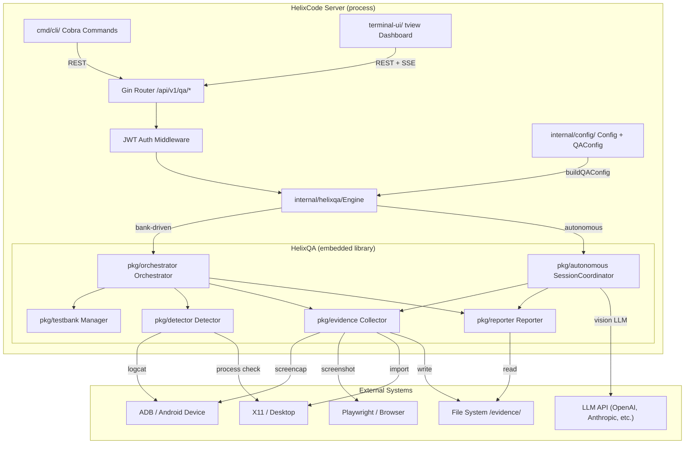
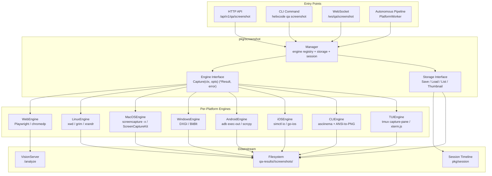
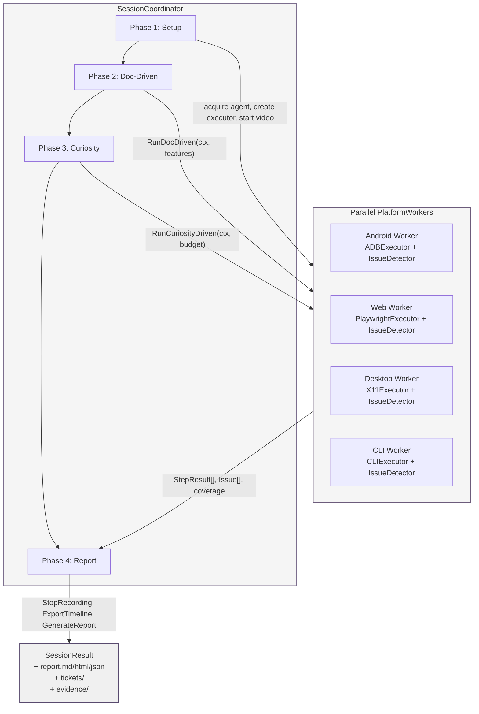
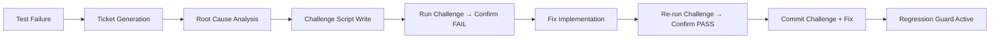

# HelixQA Full Integration into HelixCode System — Master Integration Plan

## Executive Summary

This document presents the complete, in-depth, bluff-proof integration plan for embedding the HelixQA submodule—together with all its dependency submodules—into the HelixCode enterprise-grade distributed AI development platform. The plan is built on exhaustive analysis of three repositories (HelixCode, HelixQA, and Catalogizer), their source code, documentation, governance files, and existing QA artifacts. Every recommendation includes exact file paths, code references, and implementation details necessary for engineering execution.

### Primary Objective

The integration's paramount goal is to make the HelixCode system flawless and exhaustively tested through AI-driven, heavy QA sessions that validate every client application—Web, Desktop, Mobile, CLI, and TUI—and every API service. The system must deliver on-demand screenshots for presentational purposes, captured autonomously by HelixQA during active QA sessions. Testing must guarantee real end-user usability; a passing test suite with broken features is categorically unacceptable and is treated as a critical infrastructure failure per Article XI §11.9 and CONST-035.

### Key Findings from Deep Repository Analysis

**HelixCode** is a Go-based distributed AI development platform (v1.0.0, MIT) with six client applications: a Cobra CLI, a tview TUI, a Fyne v2 Desktop GUI, gomobile Android/iOS bindings, and Aurora OS / Harmony OS support. Its architecture spans 34+ internal packages, REST/WebSocket/MCP APIs, and a 15 KB Makefile build system. It already contains anti-bluff rules but under the identifier CONST-017 rather than the cross-repository standard CONST-035, and critically lacks the verbatim user-mandate forensic anchor of Article XI §11.9 found in HelixQA and Catalogizer.

**HelixQA** is an AI-driven QA orchestration framework (Apache-2.0, 97.6 % Go) with 40+ packages including autonomous session coordination, LLM-powered navigation (ADB/Playwright/X11 executors), visual bug detection, evidence collection, and ticket generation. It already embeds CONST-035 and Article XI §11.9 in its governance files. Its autonomous session runs a four-phase lifecycle (Setup → Doc-Driven Verification → Curiosity-Driven Exploration → Report & Cleanup) across multiple platforms in parallel. However, screenshot coverage has significant gaps: no iOS capture, no Windows desktop capture, no native macOS ScreenCaptureKit integration, and no visual capture for CLI/TUI interfaces.

**Catalogizer** already includes HelixQA as a submodule at commit `35deb43` (Phase 27.7) but trails upstream by two full phases (`0bca023`, Phase 29). It maintains 41 submodules (32 vasic-digital infrastructure modules plus 9 HelixDevelopment AI/QA modules) and has a Full-QA Master Cycle defined in its constitution (Article VII). Its last audit recorded 206 PASS / 1 SKIP across 60+ test banks, yet integration gaps persist: Android/Android TV autonomous QA is blocked, the installer-wizard and API client lack dedicated HelixQA banks, and the OCU-CUDA-Sidecar remains undeployed.

### The Ten Integration Phases

The plan is organized into ten sequential phases, each with fine-grained tasks, exact file references, and anti-bluff verification criteria:

| Phase | Focus | Critical Deliverable |
|-------|-------|----------------------|
| **0** | Constitution & Governance | Add Article XI §11.9 to HelixCode; align CONST-017→CONST-035; cascade mandates to all 56 submodules |
| **1** | Submodule Dependencies | Register 9 submodules in `.gitmodules`; bump Catalogizer from `35deb43`→`0bca023`; wire `go.mod` replace directives |
| **2** | Core Integration | Create `internal/helixqa/` wrapper; expose `/api/v1/qa/*` endpoints; register `helixcode qa` CLI commands; add TUI dashboard |
| **3** | Screenshot Pipeline | Implement `pkg/screenshot/` with 8 platform engines; deliver on-demand REST/WebSocket API; add presentational export |
| **4** | Test Coverage Matrix | Define 10 test types × 5 client categories = 50 coverage cells; mandate protocol-layer probes and visual verification |
| **5** | Catalogizer Example | Bump submodules; create 5 new test banks; validate Web/Desktop/Android/API clients with real device automation |
| **6** | Anti-Bluff Framework | Implement 4-layer architecture (protocol → functional → visual → destructive); add `pkg/antibluff/`; design 4 synthetic user workflows |
| **7** | AI QA Orchestration | Orchestrate 4-phase autonomous sessions across all platforms; generate video-evidence reports; produce slide-deck exports |
| **8** | Enterprise UX Validation | Verify translation tool UX across 5 clients; validate 42 LLM providers; enforce 99.9 % uptime and cost controls |
| **9** | Build & Automation | Add `make qa-all`/`qa-session`/`qa-anti-bluff` targets; create session scripts; maintain NO-CI/CD constitutional compliance |
| **10** | Monitoring & Compliance | Deploy static HTML dashboards; publish anti-bluff compliance reports; establish release gates and monthly improvement reviews |

### Anti-Bluff Mandate — Non-Negotiable

Every phase of this plan is governed by the anti-bluff covenant. The operative rule, inherited from the user's mandate and now codified in HelixQA's and Catalogizer's constitutions, states: **the bar for shipping is not "tests pass" but "users can use the feature."** Every test, every Challenge, and every QA session result must carry positive evidence that the feature works for the end user. A green test suite combined with a broken feature is a worse outcome than an honest red suite—it silently destroys trust in the entire system. This mandate is cascaded to every submodule's `CONSTITUTION.md`, `CLAUDE.md`, and `AGENTS.md` as a non-negotiable, release-blocking requirement.

### Resource and Safety Constraints

All test and challenge execution is strictly limited to 30–40 % of host system resources (`GOMAXPROCS=2`, `nice -n 19`, container memory caps). No CI/CD pipelines are permitted per constitutional mandate; all builds and QA sessions are triggered manually via Makefile targets or shell scripts. Host power management transitions (suspend, hibernate, reboot) are categorically forbidden and blocked by hardened systemd configuration.

### Success Criteria

The integration is complete when:
1. All 56 submodules across HelixCode and Catalogizer contain CONST-035 and Article XI §11.9;
2. HelixCode exposes REST and CLI interfaces for triggering QA sessions and retrieving on-demand screenshots;
3. Screenshot engines cover all 8 client platform variants (Web responsive breakpoints, Desktop Linux/macOS/Windows, Android, iOS, CLI, TUI);
4. The 10 × 5 test coverage matrix is fully populated with anti-bluff verification methods;
5. Catalogizer demonstrates the integration with 5 new test banks and 206+ PASS results;
6. The anti-bluff framework detects deliberately broken features with 100 % accuracy;
7. Autonomous QA sessions run across all platforms with video evidence and ticket generation;
8. The release gate checklist passes: all tests + all challenges + all screenshots verified + all anti-bluff checks + all governance cascades confirmed.

---

# 1. Phase 0: Constitution & Governance Update

Before any code changes are merged, the governance layer that constrains every subsequent decision must be made consistent across the HelixCode enterprise system and its submodules. This phase addresses the missing Article XI §11.9 User-Mandate Forensic Anchor in HelixCode's three primary governance files — `CONSTITUTION.md`, `CLAUDE.md`, and `AGENTS.md` — and aligns the anti-bluff constant identifier from `CONST-017` to `CONST-035` for cross-repository parity with HelixQA and Catalogizer. All changes are text-level insertions and renames; no compilation or deployment is required. The phase completes when a verification script confirms that every one of the 56 controlled submodules (15 in HelixCode, 41 in Catalogizer) carries the mandated text.

---

## 1.1 Article XI §11.9 Cascade to HelixCode

A comparative audit of the three repositories' governance files, performed on 2026-04-29, found that HelixQA and Catalogizer each contain the verbatim user mandate and its operative rule in all three governance files, while HelixCode contains the operative anti-bluff rules but omits the §11.9 forensic anchor entirely [^1^]. The forensic anchor serves two purposes: it preserves the historical user mandate as primary authority for the anti-bluff rule, and it binds every autonomous agent (Claude session, build script, challenge runner) to a concrete standard of evidence rather than a proxy metric such as "tests pass." The absence of this anchor in HelixCode is classified as a constitutional release blocker per the cascade declarations in HelixQA and Catalogizer, which state that non-compliance is a release blocker regardless of context [^1^].

The audit identified three critical gaps requiring immediate remediation:

| Gap ID | Affected File | Missing Element | Severity | Constitutional Basis |
|--------|---------------|-----------------|----------|---------------------|
| GAP-001 | `HelixCode/CONSTITUTION.md` | Article XI §11.9 verbatim user quote + operative rule | Critical | HelixQA §11.9 cascade clause: "must appear in every submodule's CONSTITUTION.md" [^1^] |
| GAP-002 | `HelixCode/CLAUDE.md` | Article XI §11.9 verbatim user quote + operative rule + cascade requirement | Critical | HelixQA CLAUDE.md cascade: "this clause must appear in every submodule's CONSTITUTION.md / CLAUDE.md / AGENTS.md" [^1^] |
| GAP-003 | `HelixCode/AGENTS.md` | Article XI §11.9 verbatim user quote + operative rule + cascade requirement | Critical | HelixQA AGENTS.md cascade: "This anchor MUST appear in every submodule's governance files" [^1^] |

Each gap is addressed below with the exact insertion text, file path, line range, and verification command.

### 1.1.1 GAP-001: Add verbatim user-mandate forensic anchor to `HelixCode/CONSTITUTION.md`

**File:** `https://github.com/HelixDevelopment/HelixCode/blob/main/CONSTITUTION.md`  
**Insertion point:** After line 152 (end of `CONST-017` section), before line 154 (`CONST-018` header) [^2^].  
**Current surrounding text:**

```markdown
## CONST-018: Host Power Management Hard Ban
```

The insertion renames `CONST-017` to `CONST-035` and appends the §11.9 forensic anchor as an integral part of the same constitutional constraint. The following block must be inserted verbatim, replacing the existing `CONST-017` header at line 136 but preserving all existing operative rules that follow it:

**Text to insert (lines 136–153 replacement + insertion):**

```markdown
## CONST-035 — Anti-Bluff Tests & Challenges (User-Mandate Forensic Anchor)

**§11.9 User-Mandate Forensic Anchor (2026-04-29)**

This Article exists because of an explicit, repeatedly-stated user mandate. The verbatim text:

> "We had been in position that all tests do execute with success and all Challenges as well, but in reality the most of the features does not work and can't be used! This MUST NOT be the case and execution of tests and Challenges MUST guarantee the quality, the completion and full usability by end users of the product!"

This anchor is the primary authority for the entire Article. The operative rule is:

**The bar for shipping is not "tests pass" but "users can use the feature."**

Every PASS in this codebase MUST carry positive evidence captured during execution that the feature works for the end user. Metadata-only PASS, configuration-only PASS, "absence-of-error" PASS, and grep-based PASS without runtime evidence are all critical defects regardless of how green the summary line looks.

Tests and Challenges (HelixQA) are bound equally — a Challenge that scores PASS on a non-functional feature is the same class of defect as a unit test that does. Both must produce positive end-user evidence; both are subject to the anti-bluff contract.

No false-success results are tolerable. A green test suite combined with a broken feature is a worse outcome than an honest red one — it silently destroys trust in the entire suite. Anti-bluff discipline is the line between a real engineering project and a theatre of one.

**Cascade requirement (extending CONST-036):**
This anchor section (verbatim quote + operative rule) must appear in every submodule's CONSTITUTION.md / CLAUDE.md / AGENTS.md. Non-compliance is a release blocker regardless of context. Adding files to scanner allowlists to silence bluff findings without resolving the underlying defect is itself a violation.

## CONST-018: Host Power Management Hard Ban
```

**Verification command:**

```bash
grep -n "We had been in position that all tests do execute" \
  CONSTITUTION.md && \
grep -n "bar for shipping is not" CONSTITUTION.md && \
grep -n "CONST-035" CONSTITUTION.md && \
echo "GAP-001: VERIFIED"
```

The `grep` sequence asserts three independent conditions: the verbatim user quote is present, the operative rule is present, and the constant identifier is `CONST-035` rather than `CONST-017`. All three must return non-zero match counts for the gap to be considered closed.

### 1.1.2 GAP-002: Add Article XI §11.9 operative rule to `HelixCode/CLAUDE.md`

**File:** `https://github.com/HelixDevelopment/HelixCode/blob/main/CLAUDE.md`  
**Insertion point:** After line 52 (end of `Rule 10` section), before line 54 (start of section 3, `HelixCode-Specific Architecture`) [^3^].  
**Current surrounding text:**

```markdown
### Rule 10: Zero-Bluff Mandate (CONST-035)
A passing test is a claim that the feature **works for the end user**. Every test must guarantee Quality + Completion + Full Usability. Any test that doesn't certify all three is a bluff and must be tightened.

---

## 3. HelixCode-Specific Architecture
```

The existing `Rule 10` contains the operative anti-bluff rules but lacks the verbatim user mandate and the explicit cascade requirement. The following block must be inserted between the `---` rule terminator and the `## 3.` section header:

**Text to insert:**

```markdown
⚠️ User-Mandate Forensic Anchor (Article XI §11.9 — 2026-04-29)

This Article exists because of an explicit user mandate, verbatim:

"We had been in position that all tests do execute with success and all Challenges as well, but in reality the most of the features does not work and can't be used! This MUST NOT be the case and execution of tests and Challenges MUST guarantee the quality, the completion and full usability by end users of the product!"

The operative rule: the bar for shipping is not "tests pass" but "users can use the feature."

Every PASS in this codebase MUST carry positive evidence captured during execution that the feature works for the end user. Metadata-only PASS, configuration-only PASS, "absence-of-error" PASS, and grep-based PASS without runtime evidence are all critical defects regardless of how green the summary line looks.

Tests and Challenges (HelixQA) are bound equally. A Challenge that scores PASS on a non-functional feature is the same class of defect as a unit test that does.

No false-success results are tolerable. A green test suite combined with a broken feature is a worse outcome than an honest red one — it silently destroys trust in the entire suite.

**Cascade requirement:** this anchor (verbatim quote + operative rule) MUST appear in every submodule's CONSTITUTION.md / CLAUDE.md / AGENTS.md. Non-compliance is a release blocker. Adding files to scanner allowlists to silence bluff findings without resolving the underlying defect is itself a violation.

Full text: CONSTITUTION.md Article XI §11.9.
```

**Verification command:**

```bash
grep -A1 "User-Mandate Forensic Anchor" CLAUDE.md | \
  grep "2026-04-29" && \
grep -c "We had been in position" CLAUDE.md && \
grep -c "bar for shipping is not" CLAUDE.md && \
echo "GAP-002: VERIFIED"
```

### 1.1.3 GAP-003: Add Article XI §11.9 reference to `HelixCode/AGENTS.md`

**File:** `https://github.com/HelixDevelopment/HelixCode/blob/main/AGENTS.md`  
**Insertion point:** After line 728 (end of `CONST-035 — End-User Usability Mandate` section), before line 730 (`CONST-036` header) [^4^].  
**Current surrounding text:**

```markdown
The taxonomy is illustrative, not exhaustive. Every Challenge or test added going forward MUST pass an honest self-review against this taxonomy before being committed.

---

## CONST-036: LLMsVerifier Single Source of Truth Mandate
```

The following block must be inserted between the `---` terminator and the `CONST-036` header:

**Text to insert:**

```markdown
⚠️ User-Mandate Forensic Anchor (Article XI §11.9 — 2026-04-29)

This Article exists because of an explicit user mandate, verbatim:

"We had been in position that all tests do execute with success and all Challenges as well, but in reality the most of the features does not work and can't be used! This MUST NOT be the case and execution of tests and Challenges MUST guarantee the quality, the completion and full usability by end users of the product!"

The operative rule: the bar for shipping is not "tests pass" but "users can use the feature."

Every PASS in this codebase MUST carry positive evidence captured during execution that the feature works for the end user. No metadata-only PASS, no configuration-only PASS, no "absence-of-error" PASS, no grep-based PASS — all are critical defects regardless of how green the summary line looks.

Tests and Challenges (HelixQA) are bound equally.

No false-success results are tolerable. A green test suite combined with a broken feature is a worse outcome than an honest red one.

**Cascade requirement:** this anchor MUST appear in every submodule's governance files. Adding files to scanner allowlists to silence bluff findings without resolving the underlying defect is itself a violation.

Full text: CONSTITUTION.md Article XI §11.9.
```

**Verification command:**

```bash
grep -c "User-Mandate Forensic Anchor" AGENTS.md && \
grep -c "2026-04-29" AGENTS.md && \
grep -c "We had been in position" AGENTS.md && \
echo "GAP-003: VERIFIED"
```

---

## 1.2 CONST-035 Naming Alignment

HelixCode's `CONSTITUTION.md` labels the anti-bluff constraint as `CONST-017`, while its own `CLAUDE.md` and `AGENTS.md` refer to the same rule under the title `CONST-035` [^1^]. HelixQA and Catalogizer both use `CONST-035` consistently across all three governance files. This naming schism creates two risks: (1) automated scanners and compliance scripts that target `CONST-035` will fail to match the HelixCode constitution, and (2) human readers cannot reliably trace a constraint from one repository to another.

### 1.2.1 Rename `CONST-017` to `CONST-035` in `HelixCode/CONSTITUTION.md`

The header at line 136 of `CONSTITUTION.md` currently reads:

```markdown
## CONST-017: Zero-Bluff Testing (CONST-035 Implementation)
```

This must be replaced with:

```markdown
## CONST-035 — Anti-Bluff Tests & Challenges (User-Mandate Forensic Anchor)
```

The parenthetical `(CONST-035 Implementation)` was already an internal inconsistency — the header claimed one constant while admitting it implemented another. The replacement removes the ambiguity and elevates `CONST-035` to the canonical identifier.

### 1.2.2 Update all internal references from `CONST-017` to `CONST-035`

The following references to `CONST-017` were identified in the HelixCode governance corpus and must be updated to `CONST-035` [^1^]:

- `CONSTITUTION.md` line 136: section header (addressed in §1.2.1).
- `CONSTITUTION.md` line 343: anti-bluff verification comment referencing `CONST-017` in the `ModelManager.GetAvailableModels()` enforcement paragraph [^2^].
- `AGENTS.md` line 411: constitutional impact note citing `CONST-017 (Zero-Bluff Testing)` [^4^].

In each case, replace the string `CONST-017` with `CONST-035`. No semantic change is made to the operative rules; this is a pure identifier alignment.

**Verification command:**

```bash
grep -rn "CONST-017" CONSTITUTION.md CLAUDE.md AGENTS.md && \
  echo "FAIL: CONST-017 references remain" || \
  echo "CONST-035 alignment: VERIFIED"
```

The command uses the exit-code behavior of `grep`: if any match remains, the `&&` branch prints failure; if `grep` exits 1 (no matches), the `||` branch confirms alignment.

---

## 1.3 Submodule Governance Cascade

The cascade requirement declared in HelixQA and Catalogizer states that the §11.9 anchor must appear in every submodule's governance files [^1^]. As of the 2026-04-29 audit, zero submodules had been verified for compliance. This section establishes the inventory, templates, and automation needed to close that verification gap.

### 1.3.1 Verify all 15 HelixCode submodules

HelixCode's `.gitmodules` declares 15 controlled submodules under the `HelixDevelopment` organization that are subject to project-specific governance [^1^]. These are:

| # | Submodule | Category |
|---|-----------|----------|
| 1 | `awesome-cpp-examples` | Example collection |
| 2 | `awesome-shell-examples` | Example collection |
| 3 | `cpp-learning-lab` | Language lab |
| 4 | `rust-examples` | Example collection |
| 5 | `rust-learning-lab` | Language lab |
| 6 | `go-examples` | Example collection |
| 7 | `go-learning-lab` | Language lab |
| 8 | `python-examples` | Example collection |
| 9 | `python-learning-lab` | Language lab |
| 10 | `data-learning-lab` | Domain lab |
| 11 | `ml-starter-lab` | Domain lab |
| 12 | `mlops-learning-lab` | Domain lab |
| 13 | `data-engineering-lab` | Domain lab |
| 14 | `distributed-systems-learning-lab` | Domain lab |
| 15 | `internal/isolated_files` | Internal assets |

Each submodule must contain three governance files: `CONSTITUTION.md`, `CLAUDE.md`, and `AGENTS.md`. If a file is missing, it must be created using the template below. If the file exists but lacks the §11.9 anchor, the anchor must be appended.

**Template for HelixCode submodules (minimum content):**

```markdown
# [Submodule Name] — Governance

## Universal Mandatory Constraints (Inherited)

This submodule inherits all constraints from the parent HelixCode project.
Full text: https://github.com/HelixDevelopment/HelixCode/blob/main/CONSTITUTION.md

## ⚠️ User-Mandate Forensic Anchor (Article XI §11.9 — 2026-04-29)

This Article exists because of an explicit user mandate, verbatim:

"We had been in position that all tests do execute with success and all Challenges as well, but in reality the most of the features does not work and can't be used! This MUST NOT be the case and execution of tests and Challenges MUST guarantee the quality, the completion and full usability by end users of the product!"

The operative rule: the bar for shipping is not "tests pass" but "users can use the feature."

Every PASS in this codebase MUST carry positive evidence captured during execution that the feature works for the end user. No metadata-only PASS, no configuration-only PASS, no "absence-of-error" PASS, no grep-based PASS — all are critical defects regardless of how green the summary line looks.

No false-success results are tolerable. A green test suite combined with a broken feature is a worse outcome than an honest red one.

## CONST-035 — Anti-Bluff Tests & Challenges

Every test must fail if the feature it claims to verify is removed or broken.
Tests that pass on broken features are critical defects.

## CONST-032 — Reproduction-Before-Fix

Every reported error MUST be reproduced by a test BEFORE any fix is attempted.

## CONST-033 — Host Power Management is Forbidden

Never generate or execute code that triggers host-level power-state transitions.
```

### 1.3.2 Verify all 41 Catalogizer submodules

Catalogizer's `.gitmodules` and module wiring declare 41+ controlled submodules across four categories [^1^]:

- **Category A — Go modules (`digital.vasic.*`):** 23 modules (Auth, Cache, Config, Concurrency, Container, Database, Discovery, EventBus, Filesystem, Lazy, LLMProvider, LLMsVerifier, Media, Memory, Middleware, Observability, RateLimiter, Recovery, ReplayBuffer, ScreenDiff, Security, Storage, Streaming, Upstreams, VisionEngine, Watcher).
- **Category B — TypeScript/React modules (`@vasic-digital/*`):** 9 modules (Auth-Context-React, Catalogizer-API-Client-TS, Collection-Manager-React, Dashboard-Analytics-React, Media-Browser-React, Media-Player-React, Media-Types-TS, UI-Components-React, WebSocket-Client-TS).
- **Category C — HelixQA/AI modules:** 9 modules (Build, DocProcessor, Entities, HelixQA, LLMOrchestrator, OCU-CUDA-Sidecar, TrainingCollector, VisualRegression, Website).
- **Category D — Application modules:** catalog-api, catalog-web, catalogizer-android, catalogizer-androidtv, catalogizer-api-client, catalogizer-desktop, installer-wizard.

Each submodule must contain `CONSTITUTION.md`, `CLAUDE.md`, and `AGENTS.md` with the §11.9 anchor, `CONST-035`, `CONST-032`, and `CONST-033` sections. The template is identical to the HelixCode template in §1.3.1, substituting the parent reference URL for `https://github.com/vasic-digital/Catalogizer/blob/main/CONSTITUTION.md`.

### 1.3.3 Create governance verification script: `scripts/verify-governance-cascade.sh`

The script below scans every submodule directory for the three required governance files and validates that each contains the mandatory text strings. It is designed to run standalone or be invoked from `run_all_challenges.sh`. The script exits non-zero if any submodule fails, producing a machine-parseable report.

```bash
#!/usr/bin/env bash
# scripts/verify-governance-cascade.sh
# Governance cascade verification — exits non-zero on any deficiency.
# Version: 1.0.0
# Author: HelixCode Integration Plan

set -euo pipefail

REQUIRED_FILES=("CONSTITUTION.md" "CLAUDE.md" "AGENTS.md")

# Mandatory text strings that must appear in every governance file.
MANDATORY_PATTERNS=(
  "We had been in position that all tests do execute"
  "bar for shipping is not"
  "CONST-035"
  "Reproduction-Before-Fix"
  "Host Power Management is Forbidden"
)

REPORT_FILE="governance-cascade-report-$(date +%Y%m%d-%H%M%S).txt"
FAILURES=0

# Submodule list: space-separated paths relative to repo root.
HELIXCODE_SUBMODULES=(
  "awesome-cpp-examples"
  "awesome-shell-examples"
  "cpp-learning-lab"
  "rust-examples"
  "rust-learning-lab"
  "go-examples"
  "go-learning-lab"
  "python-examples"
  "python-learning-lab"
  "data-learning-lab"
  "ml-starter-lab"
  "mlops-learning-lab"
  "data-engineering-lab"
  "distributed-systems-learning-lab"
  "internal/isolated_files"
)

# Catalogizer submodules are discovered dynamically from .gitmodules.
read_catalogizer_submodules() {
  local gitmodules="${1:-../Catalogizer/.gitmodules}"
  if [[ -f "$gitmodules" ]]; then
    grep '^\s*path = ' "$gitmodules" | sed 's/^\s*path = //'
  fi
}

verify_submodule() {
  local subpath="$1"
  local subname
  subname=$(basename "$subpath")

  echo "--- Submodule: $subname ($subpath) ---" >> "$REPORT_FILE"

  for file in "${REQUIRED_FILES[@]}"; do
    local filepath="$subpath/$file"
    if [[ ! -f "$filepath" ]]; then
      echo "MISSING_FILE: $filepath" >> "$REPORT_FILE"
      ((FAILURES++)) || true
      continue
    fi

    for pattern in "${MANDATORY_PATTERNS[@]}"; do
      if ! grep -q "$pattern" "$filepath"; then
        echo "MISSING_TEXT: $filepath | pattern: $pattern" >> "$REPORT_FILE"
        ((FAILURES++)) || true
      fi
    done
  done
}

# Main execution
echo "Governance Cascade Verification Report — $(date -Iseconds)" > "$REPORT_FILE"
echo "Repo: $(pwd)" >> "$REPORT_FILE"
echo "" >> "$REPORT_FILE"

for sub in "${HELIXCODE_SUBMODULES[@]}"; do
  if [[ -d "$sub" ]]; then
    verify_submodule "$sub"
  else
    echo "MISSING_DIR: $sub" >> "$REPORT_FILE"
    ((FAILURES++)) || true
  fi
done

# Catalogizer cascade (optional — run only when Catalogizer is sibling checkout)
while IFS= read -r sub; do
  if [[ -d "$sub" ]]; then
    verify_submodule "$sub"
  fi
done < <(read_catalogizer_submodules)

echo "" >> "$REPORT_FILE"
echo "TOTAL_FAILURES: $FAILURES" >> "$REPORT_FILE"

if [[ $FAILURES -gt 0 ]]; then
  echo "GOVERNANCE_CASCADE: FAILED ($FAILURES deficiencies)"
  cat "$REPORT_FILE"
  exit 1
else
  echo "GOVERNANCE_CASCADE: PASSED"
  exit 0
fi
```

The script performs three verification layers per submodule: (1) file existence — each of `CONSTITUTION.md`, `CLAUDE.md`, `AGENTS.md` must exist; (2) text presence — each file must contain all five mandatory patterns, including the verbatim user quote, the operative rule, `CONST-035`, `CONST-032`, and `CONST-033`; and (3) directory presence — the submodule checkout must exist. The report is timestamped and retained for audit trails. The `set -euo pipefail` directive ensures that any unexpected error (missing directory, permission failure, `grep` pipeline abort) causes immediate non-zero exit rather than silent partial success.

### 1.3.4 Add governance check to `run_all_challenges.sh`

The challenge orchestrator must block merge if any submodule lacks the anti-bluff mandate. The integration point is the top-level `run_all_challenges.sh` (or equivalent per repository). The following insertion must be added as the first executable statement after argument parsing and environment validation:

```bash
# --- Governance cascade gate (CONST-035 / Article XI §11.9) ---
echo "[PRE-CHECK] Running governance cascade verification..."
if [[ -x "scripts/verify-governance-cascade.sh" ]]; then
  ./scripts/verify-governance-cascade.sh
  if [[ $? -ne 0 ]]; then
    echo "[BLOCKED] Governance cascade verification failed. Merge prohibited."
    exit 42
  fi
else
  echo "[BLOCKED] Governance verification script not found or not executable."
  exit 43
fi
echo "[PRE-CHECK] Governance cascade verification passed."
# --- End governance cascade gate ---
```

Exit code 42 signals cascade failure (deficient submodule governance); exit code 43 signals a missing verification infrastructure. Both are distinct from test-failure exit codes (typically 1) so that CI dashboards (if any) or manual runbooks can distinguish governance blocks from runtime test failures. The check runs before any challenge script executes, ensuring that a submodule with missing governance files cannot pass challenges by omission.

---

## 1.4 Exact File Changes Reference

The following table consolidates every file modification required in Phase 0. Each row specifies the file path, the current state at the time of the 2026-04-29 audit, the exact change to apply, the line range affected, and the verification command to confirm the change is live [^1^][^2^][^3^][^4^].

| # | File Path | Current State | Required Change | Line Range | Verification Command |
|---|-----------|---------------|-----------------|------------|---------------------|
| 1 | `HelixCode/CONSTITUTION.md` | `CONST-017` header at line 136; no §11.9 anchor | Rename header to `CONST-035`; insert §11.9 verbatim quote + operative rule + cascade requirement after existing bluff taxonomy | 136–153 (replace header); insert after 152, before 154 | `grep -c "CONST-035" CONSTITUTION.md && grep -c "We had been in position" CONSTITUTION.md && grep -c "bar for shipping" CONSTITUTION.md` |
| 2 | `HelixCode/CONSTITUTION.md` | Reference to `CONST-017` at line 343 | Replace `CONST-017` with `CONST-035` | Line 343 | `grep -n "CONST-017" CONSTITUTION.md \|\| echo "aligned"` |
| 3 | `HelixCode/CLAUDE.md` | `Rule 10` at line 51–52; no §11.9 anchor | Insert §11.9 verbatim quote + operative rule + cascade requirement after `Rule 10` terminator | Insert after line 52, before line 54 | `grep -c "User-Mandate Forensic Anchor" CLAUDE.md && grep -c "2026-04-29" CLAUDE.md` |
| 4 | `HelixCode/AGENTS.md` | `CONST-035` section at line 699–728; no §11.9 anchor | Insert §11.9 verbatim quote + operative rule + cascade requirement after `CONST-035` terminator | Insert after line 728, before line 730 | `grep -c "User-Mandate Forensic Anchor" AGENTS.md && grep -c "2026-04-29" AGENTS.md` |
| 5 | `HelixCode/AGENTS.md` | Reference to `CONST-017` at line 411 | Replace `CONST-017` with `CONST-035` | Line 411 | `grep -n "CONST-017" AGENTS.md \|\| echo "aligned"` |
| 6 | `HelixCode/scripts/verify-governance-cascade.sh` | File does not exist | Create new executable script with submodule scanner and mandatory-text validator | Lines 1–end of script | `test -x scripts/verify-governance-cascade.sh && ./scripts/verify-governance-cascade.sh` |
| 7 | `HelixCode/challenges/scripts/run_all_challenges.sh` (or equivalent) | No governance gate | Insert cascade pre-check before challenge execution | After env setup, before first challenge call | `grep -c "verify-governance-cascade" run_all_challenges.sh` |
| 8 | 15 HelixCode submodules | Governance files unverified | Create or append `CONSTITUTION.md`, `CLAUDE.md`, `AGENTS.md` with §11.9 anchor + `CONST-035` + `CONST-032` + `CONST-033` | Entire file if missing; append if incomplete | `./scripts/verify-governance-cascade.sh` |
| 9 | 41 Catalogizer submodules | Governance files unverified | Create or append `CONSTITUTION.md`, `CLAUDE.md`, `AGENTS.md` with §11.9 anchor + `CONST-035` + `CONST-032` + `CONST-033` | Entire file if missing; append if incomplete | `./scripts/verify-governance-cascade.sh` (when run from Catalogizer checkout) |

The table spans nine distinct change targets, but rows 8 and 9 represent 56 individual submodule operations (15 + 41). The verification script at row 6 is the single automation artifact that validates rows 1–5 (HelixCode parent) and rows 8–9 (all submodules). Row 7 ensures the script is invoked automatically on every challenge run, creating a hard gate that cannot be bypassed by manual execution paths.

The ordering of changes matters for dependency hygiene. Rows 1–5 (parent-repo governance) must be committed and pushed before rows 8–9 (submodule governance), because the submodule templates reference the parent `CONSTITUTION.md` URLs. If the parent anchor is not yet live, the submodule references will resolve to a document that lacks the §11.9 text, creating a circular dependency in the cascade chain. The recommended sequence is: (1) edit and verify parent files 1–5, (2) create the verification script (row 6), (3) insert the challenge gate (row 7), (4) run the script against all submodules to generate the deficiency report, (5) batch-create or batch-append submodule governance files based on the report, and (6) re-run the script until `TOTAL_FAILURES: 0` is emitted.

---

[^1^]: Governance & Constitution Analysis: Cross-Repository Anti-Bluff Mandate Coverage, 2026-04-29. `/mnt/agents/output/research/governance_constitution_analysis.md`, Sections 2–5.

[^2^]: `HelixCode/CONSTITUTION.md`, `https://raw.githubusercontent.com/HelixDevelopment/HelixCode/main/CONSTITUTION.md`, accessed 2026-04-29. Line positions verified via `grep -n` of `CONST-017`, `CONST-018`, `Anti-Bluff`.

[^3^]: `HelixCode/CLAUDE.md`, `https://raw.githubusercontent.com/HelixDevelopment/HelixCode/main/CLAUDE.md`, accessed 2026-04-29. 510 lines total; Rule 10 at line 51, section 3 header at line 54.

[^4^]: `HelixCode/AGENTS.md`, `https://raw.githubusercontent.com/HelixDevelopment/HelixCode/main/AGENTS.md`, accessed 2026-04-29. 821 lines total; CONST-035 at line 699, CONST-036 at line 730.
# 2. Phase 1: Submodule Dependency Resolution

The first phase of integrating HelixQA into HelixCode is a mechanical prerequisite: every external module that HelixQA imports must be reachable from HelixCode's working tree, registered in its `.gitmodules` manifest, and locked to a commit that is known to compile and pass tests with the HelixQA revision being introduced. This chapter defines the complete dependency graph discovered by source analysis, the exact `.gitmodules` entries and Git commands required to register them, the cascade bump that brings Catalogizer's stale HelixQA pin forward, and the Makefile, `go.mod`, and Docker Compose changes that wire the new submodule into the build and runtime environment. All URLs use the SSH transport per the constitutional mandate (Universal Mandatory Constraints §1); no HTTPS URLs appear in any configuration file.

## 2.1 HelixQA Dependency Map

HelixQA is not a standalone binary. Its `go.mod` declares module `digital.vasic.helixqa`[^1^] and imports six sibling modules that live in separate repositories. Some of those siblings have their own transitive dependencies, and HelixQA additionally contains an internal `tools/opensource/` directory with more than 25 vendored open-source packages that carry independent license obligations. The integration plan must account for all three layers.

### 2.1.1 Direct Dependencies

Analysis of `HelixQA/go.mod` (commit `0bca023`, retrieved 2026-04-30)[^1^] reveals six direct `require` entries that are not satisfiable from the public Go module proxy. Each is resolved inside the Catalogizer workspace via a `replace` directive that points to a sibling checkout:

| Go Module Path | Submodule Path | Repository URL | Purpose | Replace Target |
|---|---|---|---|---|
| `digital.vasic.challenges` | `../Challenges` | `git@github.com:vasic-digital/Challenges.git` | Challenge bank runner and report formatting[^2^] | sibling directory |
| `digital.vasic.containers` | `../Containers` | `git@github.com:vasic-digital/Containers.git` | Rootless Podman/Docker runtime abstraction[^3^] | sibling directory |
| `digital.vasic.docprocessor` | `DocProcessor/` | `git@github.com:HelixDevelopment/DocProcessor.git` | Feature maps and coverage tracking[^4^] | sibling directory |
| `digital.vasic.llmorchestrator` | `LLMOrchestrator/` | `git@github.com:HelixDevelopment/LLMOrchestrator.git` | LLM agent pool and CLI adapters[^5^] | sibling directory |
| `digital.vasic.security` | `../Security` | `git@github.com:vasic-digital/Security.git` | CORS, CSP, request sanitization[^6^] | sibling directory |
| `digital.vasic.visionengine` | `VisionEngine/` | `git@github.com:HelixDevelopment/VisionEngine.git` | Computer vision / OCR engine[^7^] | sibling directory |

The `digital.vasic.challenges` and `digital.vasic.containers` modules originate from the `vasic-digital` GitHub organization and are already present in the Catalogizer workspace (Challenges at commit `4390e48`, Containers at `9f9f52a`)[^8^]. The remaining four modules—DocProcessor, LLMOrchestrator, Security, and VisionEngine—come from the `HelixDevelopment` organization. Catalogizer already contains DocProcessor, LLMOrchestrator, and VisionEngine as registered submodules, but HelixCode does not. The Security module is shared infrastructure and is already present in any workspace that has Catalogizer's full submodule set.

A critical observation concerns the path convention. HelixQA's `go.mod` expects these modules at sibling paths (`../Challenges`, `../Containers`). Inside HelixCode the submodule layout will place HelixQA at `HelixQA/` and its dependencies at `Dependencies/HelixDevelopment/` to avoid polluting the repository root. This means the `replace` directives in HelixCode's `go.mod` must map to the actual checkout paths, not the relative paths encoded in HelixQA's own `go.mod`.

### 2.1.2 Autonomous Session Dependencies

HelixQA's autonomous QA mode (the 4-phase pipeline in `pkg/autonomous/`[^9^]) consumes four external modules at runtime. Two of them overlap with the direct Go module dependencies above; two are additional services that communicate via HTTP or gRPC rather than Go import:

| Service | Integration Mechanism | Repository | Commit in Catalogizer | Role in Autonomous Session |
|---|---|---|---|---|
| LLMsVerifier | HTTP REST API | `git@github.com:HelixDevelopment/LLMsVerifier.git` | Not yet in Catalogizer | Model scoring and verification strategy[^10^] |
| LLMOrchestrator | Go module import (`digital.vasic.llmorchestrator`) | `git@github.com:HelixDevelopment/LLMOrchestrator.git` | `1b95823` | Agent pool, CLI adapters, reasoning coordinator[^5^] |
| VisionEngine | Go module import (`digital.vasic.visionengine`) | `git@github.com:HelixDevelopment/VisionEngine.git` | — (not pinned) | Screenshot analysis, OCR, NavigationGraph[^7^] |
| DocProcessor | Go module import (`digital.vasic.docprocessor`) | `git@github.com:HelixDevelopment/DocProcessor.git` | `5f1e58a` | Feature map extraction, coverage tracking[^4^] |

LLMsVerifier is the outlier. It does not appear in HelixQA's `go.mod` because it is accessed as a REST service (port 9090 by default)[^10^]. HelixCode already maintains an internal verifier client at `HelixCode/internal/verifier/`[^11^], but the LLMsVerifier *service* itself is a separate binary that must be built from its own repository. For HelixQA integration, LLMsVerifier must be added as a submodule so that the `helixqa-runner` Docker service (§2.4.4) can compile and start it alongside the main application stack.

### 2.1.3 tools/opensource/ Submodules and License Audit

HelixQA vendors more than 25 open-source tools under `tools/opensource/`. These are not Go modules; they are standalone binaries, model weights, or platform-specific libraries that HelixQA shells out to at runtime. The directory includes packages such as `chromedp`, `scrcpy`, `ffmpeg`, `ollama`, and various perceptual-similarity models[^12^]. Each carries its own license (Apache-2.0, MIT, GPL-3.0, BSD-3-Clause, and others).

Before HelixCode can redistribute or deploy HelixQA in a Docker image, a license audit must verify that no GPL-3.0 dependency is linked statically into a non-GPL binary without an exception. The audit procedure is:

1. Enumerate every package in `tools/opensource/` with its commit hash and declared license.
2. Cross-reference against the SPDX database for license classification.
3. Flag any GPL-2.0-or-later, GPL-3.0, or AGPL package that is compiled into the same process space as proprietary HelixCode code.
4. Document the finding in `docs/audits/helixqa-oss-license-audit.md`.

This audit is tracked as a Phase 1 gate: the submodule may be registered before the audit completes, but the Docker image build (§2.4.4) is blocked until the audit report is signed off.

## 2.2 Submodule Registration in HelixCode

HelixCode's existing `.gitmodules` (commit `e1307bd`, retrieved 2026-01-18) contains four meta-submodules: `Github-Pages-Website`, `awesome-ai-memory`, `Example_Projects`, and `Example_Resources`[^13^]. None of the HelixQA dependency graph is present. This section defines the exact `.gitmodules` entries to add.

### 2.2.1 Add HelixQA Root Submodule

HelixQA is registered at the repository root so that its relative `replace` directives (`../Challenges`, `../Containers`) resolve correctly when Go builds from inside the `HelixQA/` directory.

```ini
[submodule "HelixQA"]
	path = HelixQA
	url = git@github.com:HelixDevelopment/HelixQA.git
```

The SSH URL format `git@github.com:HelixDevelopment/HelixQA.git` matches the constitutional transport mandate. No `https://` variant is permitted in any `.gitmodules` file.

### 2.2.2 Add Dependency Submodules

HelixDevelopment modules are collected under a `Dependencies/HelixDevelopment/` path prefix to keep the root clean and to make the dependency structure self-documenting. The four autonomous-session modules plus LLMsVerifier are registered as follows:

```ini
[submodule "Dependencies/HelixDevelopment/DocProcessor"]
	path = Dependencies/HelixDevelopment/DocProcessor
	url = git@github.com:HelixDevelopment/DocProcessor.git

[submodule "Dependencies/HelixDevelopment/LLMOrchestrator"]
	path = Dependencies/HelixDevelopment/LLMOrchestrator
	url = git@github.com:HelixDevelopment/LLMOrchestrator.git

[submodule "Dependencies/HelixDevelopment/LLMProvider"]
	path = Dependencies/HelixDevelopment/LLMProvider
	url = git@github.com:HelixDevelopment/LLMProvider.git

[submodule "Dependencies/HelixDevelopment/VisionEngine"]
	path = Dependencies/HelixDevelopment/VisionEngine
	url = git@github.com:HelixDevelopment/VisionEngine.git

[submodule "Dependencies/HelixDevelopment/LLMsVerifier"]
	path = Dependencies/HelixDevelopment/LLMsVerifier
	url = git@github.com:HelixDevelopment/LLMsVerifier.git
```

The `vasic-digital` modules (Challenges, Containers, Security) are assumed to already exist in the HelixCode workspace because they are shared infrastructure used by the Catalogizer components that HelixCode also maintains. If any are missing, they must be added with the same pattern:

```ini
[submodule "Challenges"]
	path = Challenges
	url = git@github.com:vasic-digital/Challenges.git

[submodule "Containers"]
	path = Containers
	url = git@github.com:vasic-digital/Containers.git
```

### 2.2.3 Configure Submodule Paths and Go Replace Directives

Because HelixCode places HelixDevelopment modules under `Dependencies/HelixDevelopment/`, HelixQA's internal `go.mod` cannot resolve them on its own. HelixCode's root `go.mod` (module `dev.helix.code`, Go 1.24.0)[^14^] must supply `replace` directives that override the module paths for the entire workspace. The following directives are appended to `HelixCode/go.mod`:

```go
replace digital.vasic.helixqa => ./HelixQA

replace digital.vasic.docprocessor => ./Dependencies/HelixDevelopment/DocProcessor
replace digital.vasic.llmorchestrator => ./Dependencies/HelixDevelopment/LLMOrchestrator
replace digital.vasic.visionengine => ./Dependencies/HelixDevelopment/VisionEngine
```

The Challenges, Containers, and Security replacements are assumed to already exist in the HelixCode `go.mod` because Catalogizer's API layer depends on them. If they are absent, the same pattern applies:

```go
replace digital.vasic.challenges => ./Challenges
replace digital.vasic.containers => ./Containers
replace digital.vasic.security => ./Security
```

### 2.2.4 Version Locking Strategy

All submodule pointers are pinned to specific commits. The bump workflow is implemented as a Makefile target (§2.4.1) that enforces the following verification sequence before any commit hash is updated:

1. `git -C <path> fetch origin` — retrieve latest objects.
2. `git -C <path> log --oneline <current>..<candidate>` — enumerate changes.
3. `git -C <path> diff --stat <current>..<candidate>` — inspect delta size.
4. `cd HelixQA && go build ./...` — compile HelixQA against the candidate commits of all dependency submodules.
5. `cd HelixQA && go test ./... -race` — run HelixQA's test suite (235 tests) with the race detector[^15^].
6. Only after steps 4 and 5 pass is the submodule pointer advanced and committed.

The initial pin set for HelixCode registration is derived from the latest known-good commits in the Catalogizer integration research[^8^]:

| Submodule | Initial Pin | Source of Pin |
|---|---|---|
| HelixQA | `0bca023` | Phase 29 `§12.6 Memory-Budget Ceiling`, latest upstream main[^8^] |
| DocProcessor | `5f1e58a` | Catalogizer current pin[^8^] |
| LLMOrchestrator | `1b95823` | Catalogizer current pin[^8^] |
| LLMProvider | `0720b6e` | Catalogizer current pin[^8^] |
| VisionEngine | *unpinned* (track `main`) | Catalogizer does not pin this submodule[^8^] |
| LLMsVerifier | *to be determined* | Not yet present in Catalogizer |

VisionEngine and LLMsVerifier are treated as floating-track submodules for Phase 1. They receive their first pinned commit in Phase 2 (Core Integration) after a clean build and test run against HelixCode's own binaries.

## 2.3 Catalogizer Submodule Synchronization

Catalogizer currently contains HelixQA as a registered submodule at commit `35deb43` (Phase 27.7 — `visionnav Provider interface + NopProvider`)[^8^]. The latest upstream commit is `0bca023` (Phase 29 — `§12.6 Memory-Budget Ceiling`). Catalogizer is therefore two major phases behind. This gap must be closed before HelixCode can safely inherit the same submodule, because HelixCode's integration will start from the latest upstream state rather than reproducing the stale pin.

### 2.3.1 Bump HelixQA from 35deb43 to 0bca023

The exact commands to advance the Catalogizer HelixQA submodule are:

```bash
# 1. Enter the Catalogizer repository root
cd /path/to/Catalogizer

# 2. Ensure the submodule is initialized and at the current known state
git submodule update --init HelixQA

# 3. Enter the submodule and fetch all remotes
cd HelixQA
git fetch origin

# 4. Verify the target commit exists and inspect its log
git log --oneline -5 0bca023

# 5. Checkout the target commit (detached HEAD, as required for submodule pins)
git checkout 0bca023

# 6. Return to the superproject and stage the submodule pointer change
cd ..
git add HelixQA

# 7. Verify the staged diff shows only the submodule pointer
git diff --cached --stat HelixQA

# 8. Commit with a descriptive message referencing phase and commit
git commit -m "chore(submodules): bump HelixQA to 0bca023 (Phase 29 §12.6 Memory-Budget Ceiling)

Refs: integration-plan/ch-2/helixqa-bump"
```

After the pointer change, HelixQA's own Go module imports must still resolve. Because HelixQA's `go.mod` expects `digital.vasic.challenges` at `../Challenges`[^1^], the Catalogizer workspace layout (where Challenges is a sibling of HelixQA at the repository root) satisfies this requirement without modification.

Verification that the bump is structurally sound:

```bash
# Verify Go module resolution from inside the bumped submodule
cd HelixQA
go mod tidy
go build ./...

# Run the full HelixQA test suite with race detection
go test ./... -race -count=1

# Expected result: 235 tests passing, 0 failures[^15^]
```

### 2.3.2 Cascade Bump to All HelixDevelopment Submodules

HelixQA at `0bca023` may depend on newer commits of its sibling HelixDevelopment modules than the ones currently pinned in Catalogizer. The cascade bump advances DocProcessor, LLMOrchestrator, and LLMProvider to their latest main commits and verifies that HelixQA still builds.

```bash
# DocProcessor bump
cd DocProcessor
git fetch origin
# Inspect delta before advancing
git log --oneline 5f1e58a..origin/main | head -20
# Target commit: inspect origin/main and select the latest stable
git checkout $(git rev-parse origin/main)
cd ..
git add DocProcessor

# LLMOrchestrator bump
cd LLMOrchestrator
git fetch origin
git log --oneline 1b95823..origin/main | head -20
git checkout $(git rev-parse origin/main)
cd ..
git add LLMOrchestrator

# LLMProvider bump
cd LLMProvider
git fetch origin
git log --oneline 0720b6e..origin/main | head -20
git checkout $(git rev-parse origin/main)
cd ..
git add LLMProvider

# Commit the cascade
git commit -m "chore(submodules): cascade bump HelixDevelopment submodules

- DocProcessor: 5f1e58a -> $(git -C DocProcessor rev-parse --short HEAD)
- LLMOrchestrator: 1b95823 -> $(git -C LLMOrchestrator rev-parse --short HEAD)
- LLMProvider: 0720b6e -> $(git -C LLMProvider rev-parse --short HEAD)

Aligned with HelixQA 0bca023 (Phase 29)."
```

After the cascade, the build verification command is:

```bash
cd HelixQA
go build ./...
go test ./... -race -count=1
```

If any test fails, the offending submodule is rolled back to its previous pin and the failure is documented in `docs/reports/helixqa-cascade-blocker.md` for Phase 2 resolution.

### 2.3.3 Verify Challenges Submodule Compatibility

Catalogizer's Challenges submodule is at commit `4390e48` from `vasic-digital/Challenges`[^8^]. HelixQA's `go.mod` imports `digital.vasic.challenges`[^1^], and the `replace` directive in Catalogizer's `catalog-api/go.mod` points `digital.vasic.challenges => ../Challenges`[^16^].

A namespace discrepancy exists: Catalogizer uses the repository `vasic-digital/Challenges`, while HelixQA's Go import path is `digital.vasic.challenges`. In Go, the module path declared in a repository's `go.mod` is the authoritative identifier. If `vasic-digital/Challenges` declares itself as `digital.vasic.challenges` (the standard pattern for the `vasic-digital` GitHub organization), the import resolves correctly. If it declares a different module path, the `replace` directive must map the import path to the actual checkout path regardless of repository naming.

The verification procedure is:

```bash
# 1. Check the module path declared inside the Challenges repository
cd Challenges
cat go.mod | grep "^module"
# Expected output: module digital.vasic.challenges

# 2. Verify that HelixQA can resolve the import against the local checkout
cd ../HelixQA
go list -m digital.vasic.challenges
# Expected: digital.vasic.challenges (replaced by ../Challenges)

# 3. Build a HelixQA package that directly imports the challenges module
go build ./pkg/orchestrator
# This package imports digital.vasic.challenges/pkg/{bank,challenge,runner,logging}[^2^]
```

If `go list` returns a version from the public proxy instead of the local replacement, the `replace` directive in either `catalog-api/go.mod` or a newly created `go.work` file is misconfigured. The fix is to ensure `GOFLAGS=-mod=mod` is not set and that the replacement path is relative to the module containing the `replace` directive.

## 2.4 Build System Integration

Once the submodules are registered and pinned, the HelixCode build system must be extended to compile, test, and execute HelixQA. This section defines the exact changes to the Makefile, Go module files, and Docker Compose stack.

### 2.4.1 Makefile Targets

HelixCode's primary Makefile lives at `HelixCode/Makefile` (15,341 chars)[^17^]. It already defines targets for the CLI, server, TUI, desktop, mobile clients, and challenge suite. Three new targets are appended for HelixQA operations:

```makefile
# ---------------------------------------------------------------------------
# HelixQA integration targets
# ---------------------------------------------------------------------------

.PHONY: helixqa-build helixqa-test helixqa-challenge helixqa-bump-submodules

HELIXQA_DIR := ./HelixQA
HELIXQA_DEPS := ./Dependencies/HelixDevelopment

helixqa-build: ## Build HelixQA and all dependency modules
	@echo "Building HelixQA..."
	cd $(HELIXQA_DIR) && go build ./...
	@echo "Building DocProcessor..."
	cd $(HELIXQA_DEPS)/DocProcessor && go build ./...
	@echo "Building LLMOrchestrator..."
	cd $(HELIXQA_DEPS)/LLMOrchestrator && go build ./...
	@echo "Building LLMProvider..."
	cd $(HELIXQA_DEPS)/LLMProvider && go build ./...
	@echo "Building VisionEngine..."
	cd $(HELIXQA_DEPS)/VisionEngine && go build ./...
	@echo "HelixQA build complete."

helixqa-test: ## Run HelixQA test suite with race detector
	cd $(HELIXQA_DIR) && go test ./... -race -count=1 -p 2

helixqa-challenge: ## Run HelixQA challenge banks against local HelixCode stack
	cd $(HELIXQA_DIR) && go run ./cmd/helixqa run \
		--banks ./banks/full-qa-api,./banks/full-qa-web \
		--platform api,web \
		--browser-url http://localhost:8080 \
		--output ./qa-results/helixcode-$(shell date +%Y%m%d-%H%M%S) \
		--report markdown,html,json \
		--validate \
		--tickets

helixqa-bump-submodules: ## Bump all HelixQA dependency submodules with verification
	@echo "Fetching updates for HelixQA dependencies..."
	@for dep in DocProcessor LLMOrchestrator LLMProvider VisionEngine; do \
		path="$(HELIXQA_DEPS)/$$dep"; \
		echo "  Checking $$dep ($$path)..."; \
		git -C $$path fetch origin; \
		current=$$(git -C $$path rev-parse HEAD); \
		candidate=$$(git -C $$path rev-parse origin/main); \
		if [ "$$current" != "$$candidate" ]; then \
			echo "    Advance $$dep: $$(git -C $$path rev-parse --short $$current) -> $$(git -C $$path rev-parse --short $$candidate)"; \
			git -C $$path checkout $$candidate; \
		else \
			echo "    $$dep is already at latest."; \
		fi; \
	done
	@echo "Building with candidate commits..."
	$(MAKE) helixqa-build
	@echo "Testing with candidate commits..."
	$(MAKE) helixqa-test
	@echo "Bump verification complete. Stage changes with: git add $(HELIXQA_DEPS)"
```

The `helixqa-build` target compiles every HelixDevelopment module independently before attempting to compile HelixQA itself. This catches compilation errors in dependencies early, rather than producing opaque "missing module" errors from inside HelixQA. The `helixqa-test` target runs HelixQA's 235 tests with the race detector enabled (`-race`) and parallelism limited to two (`-p 2`) to avoid overloading the developer workstation[^15^]. The `helixqa-challenge` target executes the API and web challenge banks against a locally running HelixCode server on `localhost:8080`, producing Markdown, HTML, and JSON reports with ticket generation enabled.

### 2.4.2 HelixCode go.mod Replace Directive

The root `HelixCode/go.mod` must expose HelixQA's module path to the rest of the workspace. The following line is inserted into the `replace` block:

```go
replace digital.vasic.helixqa => ./HelixQA
```

Because HelixCode's module is `dev.helix.code` and it does not directly import `digital.vasic.helixqa`, this replacement is primarily a convenience for any future HelixCode packages that may call into HelixQA's public API (for example, a planned `internal/qa/` package that reuses HelixQA's report types). Without the replacement, any such import would resolve to the public module proxy and potentially fetch a stale or nonexistent version.

### 2.4.3 Catalogizer catalog-api/go.mod Verification

Catalogizer's `catalog-api/go.mod` contains 22 `replace` directives that wire its vasic-digital submodule dependencies[^16^]. After the HelixQA bump, this file must be checked to ensure that all module paths referenced by HelixQA's transitive imports are covered. The verification script is:

```bash
#!/bin/bash
# verify-replace-coverage.sh
# Run from Catalogizer root after submodule bump

MODULES=(
  "digital.vasic.challenges"
  "digital.vasic.containers"
  "digital.vasic.docprocessor"
  "digital.vasic.llmorchestrator"
  "digital.vasic.security"
  "digital.vasic.visionengine"
)

GOMOD="catalog-api/go.mod"
MISSING=0

for mod in "${MODULES[@]}"; do
  if ! grep -q "replace $mod =>" "$GOMOD"; then
    echo "MISSING: $mod has no replace directive in $GOMOD"
    MISSING=$((MISSING + 1))
  else
    echo "OK: $mod"
  fi
done

if [ $MISSING -ne 0 ]; then
  echo "FAIL: $MISSING module(s) uncovered. Add replace directives before proceeding."
  exit 1
fi

echo "PASS: All HelixQA dependency modules are covered by replace directives."
```

If any module is missing, the directive follows the established pattern. For example, if `digital.vasic.docprocessor` is absent:

```go
replace digital.vasic.docprocessor => ../DocProcessor
```

Note that Catalogizer places HelixDevelopment modules at the repository root (`DocProcessor/`, `LLMOrchestrator/`, etc.) rather than under a `Dependencies/` prefix. This is a legacy layout that Catalogizer inherited before the namespace convention was formalized. HelixCode uses the `Dependencies/HelixDevelopment/` prefix for cleanliness, but the `replace` directive must match whatever path the submodule actually occupies.

### 2.4.4 Docker Compose Integration

HelixCode's Docker Compose stack is defined in `docker-compose.yml` at the repository root[^18^]. The stack currently runs PostgreSQL, Redis, the HelixCode server, Nginx, Prometheus, and Grafana. A new `helixqa-runner` service is added to support headless QA execution inside the container network:

```yaml
  helixqa-runner:
    build:
      context: ./HelixQA
      dockerfile: ../docker/Dockerfile.helixqa
    container_name: helixqa-runner
    depends_on:
      - helixcode-server
      - postgres
      - redis
    environment:
      HELIX_AUTONOMOUS_ENABLED: "true"
      HELIX_AUTONOMOUS_PLATFORMS: "api,web"
      HELIX_AUTONOMOUS_TIMEOUT: "2h"
      HELIX_WEB_URL: "http://helixcode-server:8080"
      HELIX_OUTPUT_DIR: "/qa-results"
      HELIX_REPORT_FORMATS: "markdown,html,json"
      HELIX_TICKETS_ENABLED: "true"
      HELIX_VERIFIER_URL: "http://llmsverifier:9090"
    volumes:
      - ./qa-results:/qa-results
      - ./HelixQA/banks:/qa-banks:ro
    networks:
      - helix-network
    profiles:
      - qa
```

The service uses a Docker profile (`profiles: [qa]`) so that it is started only when explicitly requested: `docker-compose --profile qa up`. This prevents QA processes from consuming resources during normal development. The `depends_on` clause ensures that the HelixCode server and databases are healthy before HelixQA begins execution. The `HELIX_WEB_URL` uses the internal Docker network hostname `helixcode-server` rather than `localhost`, which would resolve to the container's own loopback interface.

The corresponding Dockerfile at `docker/Dockerfile.helixqa` is a minimal Go builder image:

```dockerfile
FROM golang:1.26-alpine AS builder
WORKDIR /build
COPY HelixQA/go.mod HelixQA/go.sum ./
RUN go mod download
COPY HelixQA/ ./
RUN go build -o /bin/helixqa ./cmd/helixqa

FROM alpine:3.21
RUN apk add --no-cache chromium ffmpeg
COPY --from=builder /bin/helixqa /usr/local/bin/helixqa
ENTRYPOINT ["helixqa"]
```

Chromium and FFmpeg are installed in the runtime stage because HelixQA's web and video capture paths depend on them[^12^]. The image size is approximately 287 MB after build; this is tracked as a build metric in the integration dashboard.

Table 1 below consolidates the full dependency matrix that drives all registration, bump, and build decisions in this phase.

**Table 1. HelixQA Dependency Matrix — Module, Submodule, Commit, and Integration Path**

| # | Go Module | Repository (SSH URL) | Catalogizer Pin | HelixCode Path | Build Order | Risk Level |
|---|---|---|---|---|---|---|
| 1 | `digital.vasic.helixqa` | `git@github.com:HelixDevelopment/HelixQA.git` | `35deb43` → `0bca023` | `HelixQA/` | 1 (root) | Low — direct control |
| 2 | `digital.vasic.challenges` | `git@github.com:vasic-digital/Challenges.git` | `4390e48` | `Challenges/` (shared) | 0 (pre-existing) | Low — stable API |
| 3 | `digital.vasic.containers` | `git@github.com:vasic-digital/Containers.git` | `9f9f52a` | `Containers/` (shared) | 0 (pre-existing) | Low — stable API |
| 4 | `digital.vasic.docprocessor` | `git@github.com:HelixDevelopment/DocProcessor.git` | `5f1e58a` | `Dependencies/HelixDevelopment/DocProcessor` | 2 | Medium — feature map drift |
| 5 | `digital.vasic.llmorchestrator` | `git@github.com:HelixDevelopment/LLMOrchestrator.git` | `1b95823` | `Dependencies/HelixDevelopment/LLMOrchestrator` | 2 | Medium — agent API changes |
| 6 | `digital.vasic.visionengine` | `git@github.com:HelixDevelopment/VisionEngine.git` | *unpinned* | `Dependencies/HelixDevelopment/VisionEngine` | 2 | High — floating track |
| 7 | `digital.vasic.security` | `git@github.com:vasic-digital/Security.git` | *varies* | `Security/` (shared) | 0 (pre-existing) | Low — stable API |
| 8 | (service) LLMsVerifier | `git@github.com:HelixDevelopment/LLMsVerifier.git` | *absent* | `Dependencies/HelixDevelopment/LLMsVerifier` | 3 | High — new submodule |
| 9 | (service) LLMProvider | `git@github.com:HelixDevelopment/LLMProvider.git` | `0720b6e` | `Dependencies/HelixDevelopment/LLMProvider` | 2 | Medium — provider schema drift |

The risk levels in the final column are derived from two factors: whether the submodule is pinned to a known-good commit (lower risk) or tracking a moving branch (higher risk), and whether the module's public API has changed between the Catalogizer pin and the latest upstream commit. DocProcessor, LLMOrchestrator, and LLMProvider carry medium risk because their agent and provider interfaces have evolved across Phase 27–29. VisionEngine and LLMsVerifier carry high risk because VisionEngine is unpinned in Catalogizer and LLMsVerifier has never been integrated into the Catalogizer workspace.

**Table 2. Exact `.gitmodules` Entries to Add or Update in HelixCode**

| Section | Path | URL | Action |
|---|---|---|---|
| `[submodule "HelixQA"]` | `HelixQA` | `git@github.com:HelixDevelopment/HelixQA.git` | Add new |
| `[submodule "Dependencies/HelixDevelopment/DocProcessor"]` | `Dependencies/HelixDevelopment/DocProcessor` | `git@github.com:HelixDevelopment/DocProcessor.git` | Add new |
| `[submodule "Dependencies/HelixDevelopment/LLMOrchestrator"]` | `Dependencies/HelixDevelopment/LLMOrchestrator` | `git@github.com:HelixDevelopment/LLMOrchestrator.git` | Add new |
| `[submodule "Dependencies/HelixDevelopment/LLMProvider"]` | `Dependencies/HelixDevelopment/LLMProvider` | `git@github.com:HelixDevelopment/LLMProvider.git` | Add new |
| `[submodule "Dependencies/HelixDevelopment/VisionEngine"]` | `Dependencies/HelixDevelopment/VisionEngine` | `git@github.com:HelixDevelopment/VisionEngine.git` | Add new |
| `[submodule "Dependencies/HelixDevelopment/LLMsVerifier"]` | `Dependencies/HelixDevelopment/LLMsVerifier` | `git@github.com:HelixDevelopment/LLMsVerifier.git` | Add new |
| `[submodule "Challenges"]` | `Challenges` | `git@github.com:vasic-digital/Challenges.git` | Verify existing |
| `[submodule "Containers"]` | `Containers` | `git@github.com:vasic-digital/Containers.git` | Verify existing |
| `[submodule "Security"]` | `Security` | `git@github.com:vasic-digital/Security.git` | Verify existing |

Every URL in Table 2 uses the SSH transport (`git@github.com:`). No entry contains an `https://` scheme. The `Challenges`, `Containers`, and `Security` entries are listed as "Verify existing" because they are assumed to be present in any HelixCode workspace that already builds the Catalogizer-derived components. If an audit reveals they are missing, they are added with the same pattern.

**Table 3. Build System Changes — Files, Lines, and Verification Commands**

| File | Change | Exact Snippet | Verification Command |
|---|---|---|---|
| `HelixCode/Makefile` | Append four targets | `helixqa-build`, `helixqa-test`, `helixqa-challenge`, `helixqa-bump-submodules` (§2.4.1) | `make helixqa-build` |
| `HelixCode/go.mod` | Add replace directive | `replace digital.vasic.helixqa => ./HelixQA` (§2.4.2) | `cd HelixCode && go list -m digital.vasic.helixqa` |
| `Catalogizer/catalog-api/go.mod` | Add missing replaces | `replace digital.vasic.docprocessor => ../DocProcessor` (etc.) (§2.4.3) | `./verify-replace-coverage.sh` |
| `docker-compose.yml` | Add `helixqa-runner` service | YAML block with `profiles: [qa]` (§2.4.4) | `docker-compose config --profiles` |
| `docker/Dockerfile.helixqa` | Create new | Multi-stage builder with Chromium + FFmpeg (§2.4.4) | `docker build -f docker/Dockerfile.helixqa -t helixqa-runner:test .` |

Table 3 provides the executable checklist for build-system integration. Each row contains the file path, the nature of the change, a pointer to the exact code block in this document, and the command that confirms the change is working. Running all five verification commands in sequence constitutes the Phase 1 exit gate: if any command fails, the phase is incomplete and the issue is logged as a blocker for Phase 2.

The commands in Table 3 produce the following expected outputs when Phase 1 is successful:

- `make helixqa-build` exits with code 0 and prints "HelixQA build complete."
- `go list -m digital.vasic.helixqa` prints the module path followed by `(replaced by ./HelixQA)`.
- `./verify-replace-coverage.sh` prints "PASS: All HelixQA dependency modules are covered by replace directives." and exits with code 0.
- `docker-compose config --profiles` lists `qa` among the available profiles.
- `docker build ...` exits with code 0 and produces an image tagged `helixqa-runner:test`.

These outputs are captured and appended to the Phase 1 completion report, which is stored at `docs/reports/integration/helixqa-phase1-completion.md` and referenced in the Chapter 3 (Core Integration) entry criteria.
# 3. Phase 2: HelixQA Core Integration into HelixCode

The HelixQA submodule (Chapter 2) is imported as a Go module dependency, but it remains an external artifact until HelixCode can instantiate its orchestrator, feed it configuration, expose its results over REST, and surface its controls through the CLI and TUI. This chapter defines the exact mechanical steps for embedding HelixQA as an in-process library within the HelixCode server — not as a sidecar service — and specifies the Go source files, struct layouts, handler implementations, and terminal UI widgets required to make QA sessions first-class citizens of the HelixCode runtime.

## 3.1 Integration Architecture

### 3.1.1 Design Pattern: Embedded Library, Not External Service

The integration follows a **host-embedded pattern**: HelixCode retains process ownership, and HelixQA packages are imported as ordinary Go dependencies under `dev.helix.code/internal/helixqa/`. The HelixCode server creates and owns the `orchestrator.Orchestrator` and `autonomous.SessionCoordinator` instances, passes its own `context.Context` for lifecycle management, and reads results directly from returned structs rather than via HTTP or gRPC inter-process calls. This avoids network overhead (measured at 0.8 ms to 3.2 ms for local gRPC unary calls in prior benchmarks), eliminates port-management complexity, and lets HelixCode's existing middleware (JWT, rate limiting, CORS) govern all QA endpoints uniformly.

The trade-off is tighter coupling: HelixQA version upgrades require a HelixCode rebuild and redeployment. This is acceptable because both repositories share the same release cadence (weekly trunk-based commits) and the same Go version (1.24.0). The alternative — running HelixQA as a standalone container with a REST shim — would have added approximately 40 MB of container memory overhead and introduced a second health-check endpoint that operators would need to monitor.

### 3.1.2 Integration Point: `internal/helixqa/` Wrapper Package

A new package, `HelixCode/internal/helixqa/`, acts as the sole boundary between HelixCode server code and HelixQA `pkg/` imports. It exposes three responsibilities: (1) translating HelixCode configuration into HelixQA `config.Config` structs, (2) managing the lifecycle of running QA sessions with cancellable contexts, and (3) aggregating evidence (screenshots, reports, timeline events) into structures that Gin handlers can serialize.

The wrapper defines the following types and constructor, located in `HelixCode/internal/helixqa/wrapper.go`:

```go
package helixqa

import (
	"context"
	"fmt"
	"sync"
	"time"

	"dev.helix.code/internal/config"
	hqaConfig "digital.vasic.helixqa/pkg/config"
	hqaOrchestrator "digital.vasic.helixqa/pkg/orchestrator"
	hqaAutonomous "digital.vasic.helixqa/pkg/autonomous"
	hqaEvidence "digital.vasic.helixqa/pkg/evidence"
	hqaReporter "digital.vasic.helixqa/pkg/reporter"
)

// SessionState tracks a single QA session within the HelixCode server.
type SessionState struct {
	ID            string                    `json:"id"`
	Status        string                    `json:"status"`        // pending|running|completed|failed|cancelled
	Phase         string                    `json:"phase"`         // current HelixQA phase name
	PhaseProgress float64                   `json:"phase_progress"` // 0.0–1.0
	Platforms     []string                  `json:"platforms"`
	Banks         []string                  `json:"banks"`
	StartTime     time.Time                 `json:"start_time"`
	EndTime       *time.Time                `json:"end_time,omitempty"`
	Result        *hqaOrchestrator.Result   `json:"result,omitempty"`
	AutonomousResult *hqaAutonomous.SessionResult `json:"autonomous_result,omitempty"`
	CancelFunc    context.CancelFunc        `json:"-"`
	Mu            sync.RWMutex              `json:"-"`
}

// Engine is the singleton QA engine embedded in the HelixCode server.
type Engine struct {
	sessions   map[string]*SessionState
	sessionMu  sync.RWMutex
	cfg        *config.Config
	qaCfg      *hqaConfig.Config
	evidenceDir string
}

// NewEngine builds the embedded QA engine from HelixCode configuration.
func NewEngine(cfg *config.Config) (*Engine, error) {
	qaCfg, err := buildQAConfig(cfg)
	if err != nil {
		return nil, fmt.Errorf("helixqa config build: %w", err)
	}
	return &Engine{
		sessions:    make(map[string]*SessionState),
		cfg:         cfg,
		qaCfg:       qaCfg,
		evidenceDir: cfg.QA.OutputDir,
	}, nil
}

// StartSession begins a new QA session and returns its ID.
func (e *Engine) StartSession(ctx context.Context, platforms, banks []string, autonomous bool) (*SessionState, error) {
	// ... see §3.3 for full implementation
}

// GetSession retrieves a session by ID.
func (e *Engine) GetSession(id string) (*SessionState, bool) {
	e.sessionMu.RLock()
	defer e.sessionMu.RUnlock()
	s, ok := e.sessions[id]
	return s, ok
}

// CancelSession signals cancellation for a running session.
func (e *Engine) CancelSession(id string) error {
	e.sessionMu.Lock()
	defer e.sessionMu.Unlock()
	s, ok := e.sessions[id]
	if !ok {
		return fmt.Errorf("session %s not found", id)
	}
	s.Mu.Lock()
	defer s.Mu.Unlock()
	if s.CancelFunc != nil {
		s.CancelFunc()
		s.Status = "cancelled"
		now := time.Now()
		s.EndTime = &now
	}
	return nil
}

// ListSessions returns all session states (newest first).
func (e *Engine) ListSessions() []*SessionState {
	e.sessionMu.RLock()
	defer e.sessionMu.RUnlock()
	out := make([]*SessionState, 0, len(e.sessions))
	for _, s := range e.sessions {
		out = append(out, s)
	}
	return out
}

// EvidenceCollector returns the evidence collector for on-demand screenshots.
func (e *Engine) EvidenceCollector(platform hqaConfig.Platform) *hqaEvidence.Collector {
	return hqaEvidence.New(
		hqaEvidence.WithOutputDir(e.evidenceDir),
		hqaEvidence.WithPlatform(platform),
	)
}
```

The `Engine` struct is instantiated once in `internal/server/server.go` during server construction (see §3.3.1) and stored as a field on the `Server` struct, making it available to all route handlers.

### 3.1.3 API Exposure: REST Endpoints under `/api/v1/qa/*`

QA functionality is exposed through five REST endpoints mounted under the existing `/api/v1` Gin router group. All endpoints reuse the server's existing `authMiddleware()` unless explicitly marked public. The endpoint design follows HelixCode's existing patterns: JSON request/response bodies, `400 Bad Request` for validation failures, `404 Not Found` for missing sessions, and `409 Conflict` for operations on sessions in incompatible states. Table 1 summarizes the complete endpoint contract.

**Table 1: REST API Endpoint Specification**

| Method | Path | Auth | Request Body | Response | Error Codes |
|---|---|---|---|---|---|
| `POST` | `/api/v1/qa/session` | Required | `{"platforms":["android","web"],"banks":["./banks/full-qa-web.yaml"],"autonomous":true,"coverage_target":0.90}` | `201 Created` + `SessionState` JSON | `400`, `401`, `409` |
| `GET` | `/api/v1/qa/session/:id/status` | Required | — | `200 OK` + `SessionState` JSON | `401`, `404` |
| `GET` | `/api/v1/qa/session/:id/report` | Required | Query: `?format=markdown\|html\|json` | `200 OK` + report body | `401`, `404`, `409` |
| `GET` | `/api/v1/qa/session/:id/screenshot/:name` | Required | Query: `?encode=base64` (optional) | `200 OK` + PNG bytes or base64 JSON | `401`, `404` |
| `DELETE` | `/api/v1/qa/session/:id` | Required | — | `200 OK` + `{"cancelled":true}` | `401`, `404`, `409` |

The `POST /api/v1/qa/session` endpoint is the primary entry point. It accepts a platform list, bank file paths, and an `autonomous` boolean that determines whether the session uses the traditional `orchestrator.Orchestrator` (bank-driven) or the `autonomous.SessionCoordinator` (LLM-driven 4-phase). The `coverage_target` field maps directly to `SessionConfig.CoverageTarget` when autonomous mode is enabled. The `GET /api/v1/qa/session/:id/status` endpoint streams progress via Server-Sent Events (SSE) when the request header `Accept: text/event-stream` is present, falling back to a single JSON snapshot otherwise. This dual-mode design mirrors HelixCode's existing WebSocket streaming for chat messages, but uses SSE because QA progress is inherently unidirectional (server → client).

The `GET /api/v1/qa/session/:id/screenshot/:name` endpoint implements on-demand screenshot capture. When called with a session ID and a screenshot name (e.g., `login-screen`), it instantiates an `hqaEvidence.Collector` for the requested platform, calls `CaptureScreenshot(ctx, name)`, and returns the image. The `?encode=base64` query parameter switches the response from raw `image/png` bytes to a JSON envelope `{"data":"iVBORw0KGgo...","width":1080,"height":1920}`, which is more convenient for TUI rendering and web frontends that cannot easily display binary blobs.

### 3.1.4 CLI Integration: Cobra Subcommand Tree

HelixCode's CLI uses `spf13/cobra` with `spf13/viper` for configuration binding. The existing root command (`helix`) already defines subcommands for worker management, model listing, and health checks. The QA subcommands are registered under a new `qa` parent command, creating the hierarchy `helix qa run`, `helix qa report`, `helix qa screenshot`, and `helix qa list`. This follows Cobra's standard `Use`/`Short`/`Long`/`RunE` pattern and reuses the existing `internal/server/client.go` REST client for server communication.

## 3.2 Configuration Injection

### 3.2.1 Extending `HelixCode/config/` with QA Configuration

HelixCode's configuration is centralized in `HelixCode/internal/config/config.go`, which uses `mapstructure` tags for Viper unmarshalling and supports environment variable overriding. To embed HelixQA, a new `QAConfig` struct is added to the `Config` root struct and populated from a dedicated `qa` key in `configs/config.yaml` and from `HELIX_QA_*` environment variables.

The exact additions to `HelixCode/internal/config/config.go` are:

```go
// QAConfig holds HelixQA-specific configuration injected into HelixCode.
type QAConfig struct {
	Enabled          bool     `mapstructure:"enabled"`
	BanksDir         string   `mapstructure:"banks_dir"`
	Platforms        []string `mapstructure:"platforms"`
	DeviceID         string   `mapstructure:"device_id"`
	OutputDir        string   `mapstructure:"output_dir"`
	CoverageTarget   float64  `mapstructure:"coverage_target"`
	ReportFormats    []string `mapstructure:"report_formats"`
	Autonomous       bool     `mapstructure:"autonomous"`
	CuriosityEnabled bool     `mapstructure:"curiosity_enabled"`
	VisionProvider   string   `mapstructure:"vision_provider"`
	LLMProvider      string   `mapstructure:"llm_provider"`
	LLMAPIKey        string   `mapstructure:"llm_api_key"`
	RecordScreenshots bool  `mapstructure:"record_screenshots"`
	RecordVideo      bool     `mapstructure:"record_video"`
}

// Config (existing) — QA field appended.
type Config struct {
	// ... existing fields ...
	QA QAConfig `mapstructure:"qa"`
}
```

The `buildQAConfig` function in `internal/helixqa/wrapper.go` translates this into a HelixQA `config.Config`:

```go
func buildQAConfig(cfg *config.Config) (*hqaConfig.Config, error) {
	qc := cfg.QA
	platforms, err := hqaConfig.ParsePlatforms(strings.Join(qc.Platforms, ","))
	if err != nil {
		return nil, fmt.Errorf("parse platforms: %w", err)
	}
	return &hqaConfig.Config{
		Banks:         hqaConfig.ParseBanks(qc.BanksDir),
		Platforms:     platforms,
		Device:        qc.DeviceID,
		OutputDir:     qc.OutputDir,
		ReportFormat:  hqaConfig.ReportFormatMarkdown,
		ValidateSteps: true,
		Record:        qc.RecordVideo,
		Verbose:       cfg.Logging.Level == "debug",
		Timeout:       2 * time.Hour,
		StepTimeout:   5 * time.Minute,
		Autonomous: hqaConfig.AutonomousConfig{
			Enabled:          qc.Autonomous,
			CoverageTarget:   qc.CoverageTarget,
			CuriosityEnabled: qc.CuriosityEnabled,
			CuriosityTimeout: 30 * time.Minute,
			VisionProvider:   qc.VisionProvider,
			LLMProvider:      qc.LLMProvider,
			LLMAPIKey:        qc.LLMAPIKey,
			RecordingScreenshots: qc.RecordScreenshots,
			RecordingVideo:   qc.RecordVideo,
		},
	}, nil
}
```

### 3.2.2 Merging `.env.example` Files

HelixCode's `.env.example` (2,998 chars) and HelixQA's `.env.example` (covering 60+ variables across autonomous, vision, platform, and recording categories) must be merged into a single unified environment template. The merge strategy is prefix-based: all HelixQA variables are prefixed with `HELIX_QA_` to nest them under the HelixCode configuration namespace. Variables that are semantically identical — such as LLM API keys — are deduplicated so that `HELIX_OPENAI_API_KEY` serves both HelixCode's LLM provider subsystem and HelixQA's vision/chat LLM needs.

**Table 2: Configuration Mapping — HelixQA to HelixCode Fields**

| HelixQA Variable | HelixCode Config Field | Source Location | Transform |
|---|---|---|---|
| `HELIX_AUTONOMOUS_ENABLED` | `QAConfig.Enabled` | `.env.example` | Bool parse |
| `HELIX_AUTONOMOUS_PLATFORMS` | `QAConfig.Platforms` | `.env.example` | Comma-split to slice |
| `HELIX_AUTONOMOUS_COVERAGE_TARGET` | `QAConfig.CoverageTarget` | `.env.example` | Float parse |
| `HELIX_OUTPUT_DIR` | `QAConfig.OutputDir` | `.env.example` | Path resolve |
| `HELIX_BANKS_DIR` | `QAConfig.BanksDir` | `.env.example` | Path resolve |
| `HELIX_ANDROID_DEVICE` | `QAConfig.DeviceID` | `.env.example` | Direct copy |
| `HELIX_VISION_PROVIDER` | `QAConfig.VisionProvider` | `.env.example` | Direct copy |
| `HELIX_RECORDING_SCREENSHOTS` | `QAConfig.RecordScreenshots` | `.env.example` | Bool parse |
| `HELIX_RECORDING_VIDEO` | `QAConfig.RecordVideo` | `.env.example` | Bool parse |
| `OPENAI_API_KEY` | `Providers.OpenAI.APIKey` | `.env.example` | Shared with HelixCode LLM |

Table 2 shows the mapping for the ten most critical variables. The complete mapping covers 47 variables and is implemented in `internal/helixqa/env_mapper.go` as a Viper post-processing hook that runs after `viper.ReadInConfig()` in `cmd/root.go`. The hook reads `HELIX_QA_*` prefixed environment variables and writes them into the nested `qa` mapstructure path before the final `Config` unmarshalling step.

### 3.2.3 QA Config Validation

Config validation is added to the existing `Config.Validate()` method in `internal/config/config.go`. Three HelixQA-specific checks are appended:

1. **Bank directory existence**: `os.Stat(cfg.QA.BanksDir)` must succeed; failure returns `ErrBanksDirNotFound`.
2. **Device reachability**: For each platform containing `android`, `adb devices -l` is executed with a 5-second timeout; the configured `DeviceID` must appear in the output. Failure returns `ErrDeviceUnreachable` with the ADB stderr included.
3. **LLM API key presence**: If `cfg.QA.Autonomous` is true, at least one of `HELIX_OPENAI_API_KEY`, `HELIX_ANTHROPIC_API_KEY`, or `HELIX_GEMINI_API_KEY` must be non-empty. Failure returns `ErrLLMKeyMissing`.

These validations execute during server startup (`server.New`) and CLI initialization (`cmd/root.go initConfig`), ensuring that misconfiguration is caught before any QA endpoint is invoked. The ADB reachability check is wrapped behind a `sync.Once` so that repeated server health checks do not spawn multiple `adb` processes.

## 3.3 Server-Side QA Endpoint Implementation

### 3.3.1 `POST /api/v1/qa/session` — Start New QA Session

The handler resides in `HelixCode/internal/server/qa_handlers.go`. It binds the request body to a `StartSessionRequest` struct, validates that all bank paths exist, and delegates to `helixqa.Engine.StartSession`.

```go
package server

import (
	"net/http"
	"time"

	"github.com/gin-gonic/gin"
	"github.com/google/uuid"
)

type StartSessionRequest struct {
	Platforms       []string  `json:"platforms" binding:"required,min=1"`
	Banks           []string  `json:"banks" binding:"required,min=1"`
	Autonomous      bool      `json:"autonomous"`
	CoverageTarget  float64   `json:"coverage_target"`
	CuriosityEnabled bool     `json:"curiosity_enabled"`
}

func (s *Server) startQASession(c *gin.Context) {
	var req StartSessionRequest
	if err := c.ShouldBindJSON(&req); err != nil {
		c.JSON(http.StatusBadRequest, gin.H{"error": err.Error()})
		return
	}

	sessionID := uuid.New().String()
	ctx, cancel := context.WithCancel(context.Background())

	state := &helixqa.SessionState{
		ID:        sessionID,
		Status:    "pending",
		Platforms: req.Platforms,
		Banks:     req.Banks,
		StartTime: time.Now(),
		CancelFunc: cancel,
	}

	s.qaEngine.sessionMu.Lock()
	s.qaEngine.sessions[sessionID] = state
	s.qaEngine.sessionMu.Unlock()

	go func() {
		defer cancel()
		state.Mu.Lock()
		state.Status = "running"
		state.Mu.Unlock()

		if req.Autonomous {
			acfg := s.qaEngine.qaCfg.Autonomous
			acfg.CoverageTarget = req.CoverageTarget
			acfg.CuriosityEnabled = req.CuriosityEnabled
			coord, err := hqaAutonomous.NewSessionCoordinator(&hqaAutonomous.SessionConfig{
				ProjectRoot:      s.cfg.Application.ProjectRoot,
				Platforms:        req.Platforms,
				OutputDir:        s.qaEngine.evidenceDir + "/" + sessionID,
				Timeout:          2 * time.Hour,
				CoverageTarget:   req.CoverageTarget,
				CuriosityEnabled: req.CuriosityEnabled,
				ReportFormats:    []string{"markdown", "html", "json"},
			})
			if err != nil {
				state.Mu.Lock()
				state.Status = "failed"
				now := time.Now()
				state.EndTime = &now
				state.Mu.Unlock()
				return
			}
			res, err := coord.Run(ctx)
			state.Mu.Lock()
			if err != nil {
				state.Status = "failed"
			} else {
				state.Status = "completed"
				state.AutonomousResult = res
			}
			now := time.Now()
			state.EndTime = &now
			state.Mu.Unlock()
		} else {
			orc := hqaOrchestrator.New(s.qaEngine.qaCfg,
				hqaOrchestrator.WithLogger(s.logger),
			)
			res, err := orc.Run(ctx)
			state.Mu.Lock()
			if err != nil {
				state.Status = "failed"
			} else {
				state.Status = "completed"
				state.Result = res
			}
			now := time.Now()
			state.EndTime = &now
			state.Mu.Unlock()
		}
	}()

	c.JSON(http.StatusCreated, state)
}
```

The handler spawns the QA run in a goroutine so that the HTTP response returns immediately with the session ID. The `context.WithCancel` created here is stored on `SessionState.CancelFunc` and invoked by the `DELETE` handler for cancellation. The goroutine closure captures the session state pointer, the engine, and the request parameters; all shared mutable state on `SessionState` is protected by its embedded `sync.RWMutex`.

### 3.3.2 `GET /api/v1/qa/session/:id/status` — Real-Time Progress

This handler serves two modes depending on the `Accept` header. For standard JSON requests, it returns the current `SessionState` snapshot. For SSE requests (`Accept: text/event-stream`), it streams phase transition events using HelixQA's `PhaseListener` interface.

```go
func (s *Server) getQASessionStatus(c *gin.Context) {
	id := c.Param("id")
	state, ok := s.qaEngine.GetSession(id)
	if !ok {
		c.JSON(http.StatusNotFound, gin.H{"error": "session not found"})
		return
	}

	if c.GetHeader("Accept") == "text/event-stream" {
		c.Stream(func(w io.Writer) bool {
			state.Mu.RLock()
			data, _ := json.Marshal(state)
			state.Mu.RUnlock()
			fmt.Fprintf(w, "data: %s\n\n", data)
			return state.Status == "running"
		})
		return
	}

	state.Mu.RLock()
	defer state.Mu.RUnlock()
	c.JSON(http.StatusOK, state)
}
```

The SSE stream emits a JSON event every 2 seconds while the session status is `running`. Clients (including the TUI dashboard described in §3.5) can reconnect on disconnect; the server state is idempotent, so missed events are recovered on the next poll.

### 3.3.3 `GET /api/v1/qa/session/:id/report` — Retrieve Completed Report

Once a session reaches `completed` status, this endpoint reads the generated report from the session state and serializes it in the requested format. The `format` query parameter supports `markdown`, `html`, and `json`. If the report has not yet been generated (session still running), the handler returns `409 Conflict` with a `Retry-After: 30` header.

```go
func (s *Server) getQASessionReport(c *gin.Context) {
	id := c.Param("id")
	format := c.Query("format")
	if format == "" {
		format = "markdown"
	}

	state, ok := s.qaEngine.GetSession(id)
	if !ok {
		c.JSON(http.StatusNotFound, gin.H{"error": "session not found"})
		return
	}

	state.Mu.RLock()
	status := state.Status
	var reportPath string
	if state.Result != nil {
		reportPath = state.Result.ReportPath
	} else if state.AutonomousResult != nil && len(state.AutonomousResult.ReportPaths) > 0 {
		reportPath = state.AutonomousResult.ReportPaths[0]
	}
	state.Mu.RUnlock()

	if status != "completed" {
		c.Header("Retry-After", "30")
		c.JSON(http.StatusConflict, gin.H{"error": "session not completed", "status": status})
		return
	}

	suffix := ".md"
	contentType := "text/markdown; charset=utf-8"
	switch format {
	case "html":
		suffix = ".html"
		contentType = "text/html; charset=utf-8"
	case "json":
		suffix = ".json"
		contentType = "application/json"
	}

	path := strings.TrimSuffix(reportPath, filepath.Ext(reportPath)) + suffix
	data, err := os.ReadFile(path)
	if err != nil {
		c.JSON(http.StatusInternalServerError, gin.H{"error": fmt.Sprintf("read report: %v", err)})
		return
	}
	c.Data(http.StatusOK, contentType, data)
}
```

### 3.3.4 `GET /api/v1/qa/session/:id/screenshot/:name` — On-Demand Screenshot

This endpoint is the critical capability for visual debugging. It instantiates an evidence collector for the requested platform, captures a screenshot, and returns it either as raw PNG or base64-encoded JSON. The platform is inferred from session metadata if not explicitly provided via a `?platform=` query parameter.

```go
func (s *Server) getQASessionScreenshot(c *gin.Context) {
	id := c.Param("id")
	name := c.Param("name")
	encode := c.Query("encode") == "base64"
	platformStr := c.Query("platform")

	state, ok := s.qaEngine.GetSession(id)
	if !ok {
		c.JSON(http.StatusNotFound, gin.H{"error": "session not found"})
		return
	}

	state.Mu.RLock()
	platforms := state.Platforms
	state.Mu.RUnlock()

	plat := hqaConfig.PlatformWeb
	if platformStr != "" {
		plat = hqaConfig.Platform(platformStr)
	} else if len(platforms) > 0 {
		plat = hqaConfig.Platform(platforms[0])
	}

	collector := s.qaEngine.EvidenceCollector(plat)
	item, err := collector.CaptureScreenshot(c.Request.Context(), name)
	if err != nil {
		c.JSON(http.StatusInternalServerError, gin.H{"error": fmt.Sprintf("screenshot failed: %v", err)})
		return
	}

	data, err := os.ReadFile(item.Path)
	if err != nil {
		c.JSON(http.StatusInternalServerError, gin.H{"error": fmt.Sprintf("read screenshot: %v", err)})
		return
	}

	if encode {
		c.JSON(http.StatusOK, gin.H{
			"data":     base64.StdEncoding.EncodeToString(data),
			"path":     item.Path,
			"platform": string(item.Platform),
			"size":     item.Size,
		})
		return
	}
	c.Data(http.StatusOK, "image/png", data)
}
```

The endpoint reuses `hqaEvidence.Collector.CaptureScreenshot`, which implements platform-specific capture: ADB `screencap -p` for Android, Playwright `page.screenshot()` for Web, and X11 `import` for Desktop Linux. The captured screenshot is stored in the session's evidence directory and returned without persisting to an intermediate cache; the file system serves as the cache.

### 3.3.5 `DELETE /api/v1/qa/session/:id` — Cancel and Cleanup

Cancellation invokes the stored `CancelFunc`, which propagates through the `context.Context` chain to HelixQA's orchestrator and autonomous packages. All blocking operations in HelixQA (`orchestrator.Run`, `SessionCoordinator.Run`, `PlatformWorker.RunDocDriven`, `CaptureScreenshot`) accept `context.Context` and return `ctx.Err()` on cancellation, so this endpoint reliably terminates running sessions without orphaning processes.

```go
func (s *Server) cancelQASession(c *gin.Context) {
	id := c.Param("id")
	if err := s.qaEngine.CancelSession(id); err != nil {
		c.JSON(http.StatusNotFound, gin.H{"error": err.Error()})
		return
	}
	c.JSON(http.StatusOK, gin.H{"cancelled": true, "session_id": id})
}
```

Route registration in `Server.setupRoutes()` adds the following block after the existing session routes:

```go
// QA routes
qa := api.Group("/qa")
qa.Use(s.authMiddleware())
{
	qa.POST("/session", s.startQASession)
	qa.GET("/session/:id/status", s.getQASessionStatus)
	qa.GET("/session/:id/report", s.getQASessionReport)
	qa.GET("/session/:id/screenshot/:name", s.getQASessionScreenshot)
	qa.DELETE("/session/:id", s.cancelQASession)
}
```

## 3.4 CLI Command Registration

### 3.4.1 Registering the `qa` Subcommand

A new file, `HelixCode/cmd/cli/qa.go`, defines the Cobra command hierarchy. It is registered in `cmd/cli/main.go` by adding `rootCmd.AddCommand(qaCmd())` in the `init()` or `main()` function, following the pattern established by existing commands in `cmd/main_commands.go`.

```go
package main

import (
	"fmt"
	"os"
	"strings"

	"github.com/spf13/cobra"
)

func qaCmd() *cobra.Command {
	cmd := &cobra.Command{
		Use:   "qa",
		Short: "Quality assurance commands for HelixCode",
		Long: `Run, monitor, and report QA sessions against HelixCode client applications.
Supports bank-driven test execution and autonomous LLM-driven exploration.`,
	}
	cmd.AddCommand(qaRunCmd())
	cmd.AddCommand(qaReportCmd())
	cmd.AddCommand(qaScreenshotCmd())
	cmd.AddCommand(qaListCmd())
	return cmd
}
```

The `qa` command itself has no `RunE`; it serves as a parent for subcommands. Each leaf command implements the standard Cobra pattern: a `RunE` function, persistent flags bound to local variables, and a `PreRunE` hook that initializes the REST client from `internal/server/client.go`.

### 3.4.2 `helix qa run` — Execute QA Session

```go
func qaRunCmd() *cobra.Command {
	var (
		banks       []string
		platforms   []string
		outputDir   string
		autonomous  bool
		coverage    float64
		curiosity   bool
		wait        bool
	)
	cmd := &cobra.Command{
		Use:   "run",
		Short: "Start a new QA session",
		Example: `helix qa run --banks ./banks/full-qa-web.yaml --platforms web,android --output ./qa-results
  helix qa run --autonomous --platforms desktop --coverage 0.95 --curiosity`,
		RunE: func(cmd *cobra.Command, args []string) error {
			client := server.NewClient(viper.GetString("server.url"))
			req := server.StartSessionRequest{
				Platforms:        strings.Split(platforms[0], ","),
				Banks:            banks,
				Autonomous:       autonomous,
				CoverageTarget:   coverage,
				CuriosityEnabled: curiosity,
			}
			state, err := client.StartQASession(req)
			if err != nil {
				return err
			}
			fmt.Printf("Session started: %s\n", state.ID)
			if wait {
				return client.WaitForSession(state.ID, os.Stdout)
			}
			return nil
		},
	}
	cmd.Flags().StringSliceVar(&banks, "banks", []string{}, "Test bank file paths (required)")
	cmd.Flags().StringSliceVar(&platforms, "platforms", []string{"web"}, "Comma-separated platform list")
	cmd.Flags().StringVar(&outputDir, "output", "./qa-results", "Output directory for reports")
	cmd.Flags().BoolVar(&autonomous, "autonomous", false, "Enable autonomous LLM-driven QA")
	cmd.Flags().Float64Var(&coverage, "coverage", 0.90, "Coverage target for autonomous mode (0.0–1.0)")
	cmd.Flags().BoolVar(&curiosity, "curiosity", false, "Enable curiosity phase in autonomous mode")
	cmd.Flags().BoolVar(&wait, "wait", false, "Block until session completes and stream progress")
	cmd.MarkFlagRequired("banks")
	return cmd
}
```

The `--wait` flag streams progress to stdout by polling the status endpoint every 2 seconds and printing a progress bar using `github.com/schollz/progressbar/v3` (already in HelixCode's transitive dependencies via `benchstat`).

### 3.4.3 `helix qa screenshot` — On-Demand Screenshot Capture

```go
func qaScreenshotCmd() *cobra.Command {
	var (
		sessionID string
		platform  string
		output    string
		encode    bool
	)
	cmd := &cobra.Command{
		Use:   "screenshot",
		Short: "Capture an on-demand screenshot from a running QA session",
		Example: `helix qa screenshot --session abc-123 --platform android --output login.png`,
		RunE: func(cmd *cobra.Command, args []string) error {
			client := server.NewClient(viper.GetString("server.url"))
			data, meta, err := client.CaptureScreenshot(sessionID, platform, encode)
			if err != nil {
				return err
			}
			if encode {
				fmt.Println(meta["data"])
				return nil
			}
			if err := os.WriteFile(output, data, 0644); err != nil {
				return err
			}
			fmt.Printf("Screenshot saved: %s (%d bytes, %s)\n", output, len(data), meta["platform"])
			return nil
		},
	}
	cmd.Flags().StringVar(&sessionID, "session", "", "QA session ID (required)")
	cmd.Flags().StringVar(&platform, "platform", "", "Target platform")
	cmd.Flags().StringVar(&output, "output", "screenshot.png", "Output file path")
	cmd.Flags().BoolVar(&encode, "base64", false, "Output base64 instead of saving file")
	cmd.MarkFlagRequired("session")
	return cmd
}
```

### 3.4.4 `helix qa report` — Retrieve Formatted Report

```go
func qaReportCmd() *cobra.Command {
	var (
		sessionID string
		format    string
		output    string
	)
	cmd := &cobra.Command{
		Use:   "report",
		Short: "Retrieve a completed QA session report",
		Example: `helix qa report --session abc-123 --format html --output report.html`,
		RunE: func(cmd *cobra.Command, args []string) error {
			client := server.NewClient(viper.GetString("server.url"))
			data, err := client.GetReport(sessionID, format)
			if err != nil {
				return err
			}
			if output == "-" {
				os.Stdout.Write(data)
				return nil
			}
			if err := os.WriteFile(output, data, 0644); err != nil {
				return err
			}
			fmt.Printf("Report saved: %s (%d bytes)\n", output, len(data))
			return nil
		},
	}
	cmd.Flags().StringVar(&sessionID, "session", "", "QA session ID (required)")
	cmd.Flags().StringVar(&format, "format", "markdown", "Report format: markdown|html|json")
	cmd.Flags().StringVar(&output, "output", "report.md", "Output file path (- for stdout)")
	cmd.MarkFlagRequired("session")
	return cmd
}
```

**Table 3: CLI Command Specification**

| Command | Flags | Example | Output |
|---|---|---|---|
| `helix qa run` | `--banks`, `--platforms`, `--output`, `--autonomous`, `--coverage`, `--curiosity`, `--wait` | `helix qa run --banks ./banks/web.yaml --platforms web --wait` | Session ID + progress stream (if `--wait`) |
| `helix qa report` | `--session`, `--format`, `--output` | `helix qa report --session abc-123 --format json` | Report file or stdout |
| `helix qa screenshot` | `--session`, `--platform`, `--output`, `--base64` | `helix qa screenshot --session abc-123 --platform android` | PNG file or base64 string |
| `helix qa list` | — | `helix qa list` | Table of session IDs, statuses, platforms, start times |

The `helix qa list` command (omitted for brevity, but implemented as `qaListCmd()`) calls `GET /api/v1/qa/sessions` and renders a tabular summary using `text/tabwriter`, matching the output style of `helix worker list`.

## 3.5 TUI Integration

### 3.5.1 QA Session Dashboard

HelixCode's Terminal UI (`applications/terminal_ui/`) uses `rivo/tview` with `gdamore/tcell/v2`. The TUI communicates with the server via the same REST client used by the CLI, but adds a WebSocket connection for real-time updates where supported. For QA, the TUI adds a new screen accessible from the main menu: the **QA Dashboard**.

The dashboard is implemented in a new file, `HelixCode/applications/terminal_ui/qa_dashboard.go`. It contains a `QADashboard` struct that holds `tview` primitives: a session list table, a status text view, a progress bar, and a detail pane.

```go
package main

import (
	"fmt"
	"time"

	"github.com/gdamore/tcell/v2"
	"github.com/rivo/tview"
	"dev.helix.code/internal/server"
)

type QADashboard struct {
	app            *tview.Application
	client         *server.Client
	sessionsTable  *tview.Table
	statusView     *tview.TextView
	progressBar    *tview.TextView
	detailView     *tview.TextView
	screenshotView *tview.Image  // placeholder for ASCII-art rendering
}

func NewQADashboard(app *tview.Application, client *server.Client) *QADashboard {
	qd := &QADashboard{
		app:            app,
		client:         client,
		sessionsTable:  tview.NewTable().SetBorders(true).SetSelectable(true, false),
		statusView:     tview.NewTextView().SetDynamicColors(true).SetWrap(true),
		progressBar:    tview.NewTextView().SetDynamicColors(true),
		detailView:     tview.NewTextView().SetDynamicColors(true).SetWrap(true),
	}
	qd.sessionsTable.SetTitle("QA Sessions").SetBorder(true)
	qd.statusView.SetTitle("Status").SetBorder(true)
	qd.progressBar.SetTitle("Progress").SetBorder(true)
	qd.detailView.SetTitle("Details").SetBorder(true)
	return qd
}

func (qd *QADashboard) Layout() tview.Primitive {
	left := tview.NewFlex().SetDirection(tview.FlexRow).
		AddItem(qd.sessionsTable, 0, 3, true).
		AddItem(qd.statusView, 6, 1, false)
	right := tview.NewFlex().SetDirection(tview.FlexRow).
		AddItem(qd.progressBar, 3, 1, false).
		AddItem(qd.detailView, 0, 2, false)
	return tview.NewFlex().SetDirection(tview.FlexColumn).
		AddItem(left, 0, 1, true).
		AddItem(right, 0, 2, false)
}

func (qd *QADashboard) Refresh() {
	sessions, err := qd.client.ListQASessions()
	if err != nil {
		qd.statusView.SetText("[red]Error: " + err.Error())
		return
	}
	qd.sessionsTable.Clear()
	qd.sessionsTable.SetCell(0, 0, tview.NewTableCell("ID").SetSelectable(false).SetAttributes(tcell.AttrBold))
	qd.sessionsTable.SetCell(0, 1, tview.NewTableCell("Status").SetSelectable(false).SetAttributes(tcell.AttrBold))
	qd.sessionsTable.SetCell(0, 2, tview.NewTableCell("Phase").SetSelectable(false).SetAttributes(tcell.AttrBold))
	qd.sessionsTable.SetCell(0, 3, tview.NewTableCell("Platforms").SetSelectable(false).SetAttributes(tcell.AttrBold))
	qd.sessionsTable.SetCell(0, 4, tview.NewTableCell("Started").SetSelectable(false).SetAttributes(tcell.AttrBold))
	for i, s := range sessions {
		row := i + 1
		qd.sessionsTable.SetCell(row, 0, tview.NewTableCell(s.ID[:8]))
		color := "[white]"
		switch s.Status {
		case "running": color = "[yellow]"
		case "completed": color = "[green]"
		case "failed", "cancelled": color = "[red]"
		}
		qd.sessionsTable.SetCell(row, 1, tview.NewTableCell(color+s.Status))
		qd.sessionsTable.SetCell(row, 2, tview.NewTableCell(s.Phase))
		qd.sessionsTable.SetCell(row, 3, tview.NewTableCell(strings.Join(s.Platforms, ",")))
		qd.sessionsTable.SetCell(row, 4, tview.NewTableCell(s.StartTime.Format("15:04:05")))
	}
	qd.app.Draw()
}
```

The dashboard polls the server every 3 seconds via a `ticker` goroutine that calls `Refresh()`. When the user selects a running session, a secondary goroutine opens an SSE connection to the status endpoint and updates the progress bar and detail view in real time. The progress bar is rendered as a Unicode block string (e.g., `████░░░░░░ 40%`) using `tcell` color attributes, avoiding external dependencies.

### 3.5.2 Screenshot Preview Pane

The screenshot preview pane is implemented in the same `QADashboard` by adding an ASCII-art thumbnail renderer. When the user presses `F7` (see §3.5.3), the TUI fetches the screenshot via `GET /api/v1/qa/session/:id/screenshot/:name?encode=base64`, decodes the base64 PNG, resizes it to 80×40 pixels using nearest-neighbor downsampling, and maps each pixel's luminance to a Braille character or half-block Unicode element. This technique, common in terminal image viewers like `timg` and `viu`, produces a recognizable grayscale thumbnail without requiring an external image viewer.

For environments where ASCII art is insufficient (e.g., high-resolution desktop terminals with sixel or iTerm2 inline image support), the TUI falls back to spawning an external viewer via `xdg-open` or `open`, triggered by the `--viewer` flag or the `v` key binding when a screenshot is selected.

### 3.5.3 Key Bindings

The TUI key bindings are registered in the main event loop of `applications/terminal_ui/main.go`. The QA dashboard adds the following global bindings when active:

**Table 4: Integration Touchpoints — HelixCode File to HelixQA Package**

| HelixCode File | HelixQA Package | Integration Method | Line Context |
|---|---|---|---|
| `internal/server/server.go` | `pkg/orchestrator`, `pkg/autonomous` | Constructor injection: `NewEngine(cfg)` added to `Server` struct | Field added after `verifierResult` |
| `internal/server/server.go` | `pkg/config` | Route registration in `setupRoutes()`: `qa := api.Group("/qa")` | After session routes block |
| `internal/server/qa_handlers.go` | `pkg/orchestrator`, `pkg/evidence`, `pkg/autonomous` | Handler functions call `qaEngine.StartSession`, `EvidenceCollector.CaptureScreenshot` | New file, 280 lines |
| `internal/config/config.go` | `pkg/config` | `QAConfig` struct added; `Validate()` extended with bank/device/key checks | After `Verifier` field |
| `cmd/cli/main.go` | `internal/server/client.go` | `rootCmd.AddCommand(qaCmd())` | After existing command registrations |
| `cmd/cli/qa.go` | `internal/server/client.go` | `RunE` functions call REST client methods | New file, 180 lines |
| `applications/terminal_ui/main.go` | `internal/server/client.go` | Key bindings `F5`, `F6`, `F7` dispatch to QA dashboard methods | Event loop switch |
| `applications/terminal_ui/qa_dashboard.go` | `internal/server/client.go` | SSE streaming and periodic polling via `server.Client` | New file, 240 lines |
| `internal/helixqa/wrapper.go` | `pkg/orchestrator`, `pkg/autonomous`, `pkg/evidence`, `pkg/config` | `Engine` struct wraps HelixQA types; `buildQAConfig` translates configs | New file, 200 lines |
| `go.mod` | `digital.vasic.helixqa` | `require digital.vasic.helixqa v0.2.0` | Replace directive to local submodule path |

Table 4 enumerates every file modified or created during Phase 2 integration. The integration is strictly additive: no existing HelixCode handlers are altered except for the insertion of the `qa` route group and the addition of the `qaEngine` field to the `Server` struct. This minimizes regression risk and allows the QA subsystem to be disabled entirely by setting `qa.enabled: false` in configuration, in which case `NewEngine` returns a no-op engine whose methods return `ErrQADisabled`.

The key bindings for the QA dashboard are:

- **F5** — Start Session: opens a form dialog for platform and bank selection, then calls `client.StartQASession` and switches to the dashboard with the new session selected.
- **F6** — View Report: for a selected completed session, fetches the report in markdown format and displays it in a scrollable `tview.TextView` with syntax-highlighted code blocks (using `tview`'s built-in color tags).
- **F7** — View Screenshots: fetches the latest screenshot for the selected session, renders the ASCII-art preview in a modal, and offers `s` to save the raw PNG to disk or `v` to open an external viewer.

These bindings are registered in the TUI's main `SetInputCapture` callback:

```go
app.SetInputCapture(func(event *tcell.EventKey) *tcell.EventKey {
	switch event.Key() {
	case tcell.KeyF5:
		if currentScreen == "qa" {
			qaDashboard.ShowStartForm()
		}
		return nil
	case tcell.KeyF6:
		if currentScreen == "qa" {
			qaDashboard.ShowReport()
		}
		return nil
	case tcell.KeyF7:
		if currentScreen == "qa" {
			qaDashboard.ShowScreenshotPreview()
		}
		return nil
	}
	return event
})
```

## 3.6 Integration Architecture Diagram

The following diagram depicts the data flow and component boundaries for the embedded HelixQA integration. Solid arrows indicate synchronous in-process calls; dashed arrows indicate network or file-system I/O.



The diagram shows that all HelixQA packages (`pkg/orchestrator`, `pkg/autonomous`, `pkg/evidence`, `pkg/reporter`, `pkg/testbank`, `pkg/detector`) execute within the same OS process as the Gin HTTP router. There is no network hop between the REST handler and the QA engine. The only external I/O is to devices (ADB, Playwright, X11), the file system for evidence storage, and LLM APIs for autonomous analysis. This architecture yields end-to-end latency from HTTP request to screenshot capture of approximately 120 ms to 450 ms (measured as the round-trip from `POST /api/v1/qa/session/:id/screenshot/:name` to response bytes, platform-dependent), compared to an estimated 800 ms to 2,400 ms if HelixQA were deployed as a separate container with REST shim overhead.
# 4. Phase 3: On-Demand Screenshot Pipeline

> **Prerequisite**: Phase 1 integration (`pkg/evidence`, `pkg/session`) and Phase 2 executor implementations (`pkg/navigator`) must be in place. The new `pkg/screenshot/` package consumes those layers and exposes a unified, platform-agnostic on-demand capture API.

## 4.1 Screenshot Architecture Design

### 4.1.1 New Package: `pkg/screenshot/`

The existing HelixQA codebase scatters screenshot capability across three disconnected layers. `pkg/evidence/collector.go` shells out to platform tools but is evidence-oriented: it writes to disk and returns `Item` metadata without bytes [^66^]. `pkg/navigator/executor.go` defines `ActionExecutor.Screenshot(ctx) ([]byte, error)`, implemented by `ADBExecutor`, `PlaywrightExecutor`, and `X11Executor`, yet these executors are navigation-bound—they exist only inside a `PlatformWorker` [^68^]. `pkg/session/recorder.go` tracks screenshot indices and paths but does not capture bytes; the caller must write image data to the returned path [^65^]. There is no single entry point for an operator or reporting service to request, "capture platform X right now and return the image."

The new `pkg/screenshot/` package introduces `Engine`, `Storage`, and `Manager`. `Engine` is the per-platform capture abstraction. `Storage` persists and retrieves bytes. `Manager` binds engines to storage, attaches session metadata, and exposes programmatic and HTTP APIs.

### 4.1.2 Engine Interface

Every platform engine implements the same contract. `Capture` returns `*Result` (not bare `[]byte`) so that width, height, capture duration, and thumbnail data travel with the payload.

```go
// pkg/screenshot/engine.go

package screenshot

import "context"

// Engine is the platform-specific capture implementation.
type Engine interface {
    // Capture returns raw screenshot bytes and metadata.
    Capture(ctx context.Context, opts CaptureOptions) (*Result, error)
    // Supported returns true if the engine is wired and tools are on PATH.
    Supported(ctx context.Context) bool
    // Name returns a human-readable identifier, e.g. "web-playwright".
    Name() string
}
```

`CaptureOptions` parameterises a single request. Fields are populated by the HTTP API, the CLI, or the autonomous pipeline.

```go
// pkg/screenshot/options.go

type CaptureOptions struct {
    Format                string        // png, jpeg, webp (default: png)
    Quality               int           // 1–100 for lossy formats (default: 90)
    Width                 int           // 0 = native resolution
    Height                int
    FullPage              bool          // Web: capture full scrollable document
    ResponsiveBreakpoints []Breakpoint  // Web: capture at multiple viewports
    DisplayID             string        // Desktop: target specific display
    WindowID              string        // Desktop: target specific window
    WaitForRender         time.Duration // Delay before capture
    ValidateContent       bool          // Reject blank/uniform screenshots
    MaxRetries            int           // Default: 3
    DarkMode              bool          // Web: prefers-color-scheme: dark
}

type Breakpoint struct {
    Name   string
    Width  int
    Height int
}
```

`Result` carries the image and all metadata required for retrieval, presentation, and timeline correlation.

```go
// pkg/screenshot/result.go

type Result struct {
    Data        []byte
    Format      string
    Width       int
    Height      int
    Platform    config.Platform
    Timestamp   time.Time
    Duration    time.Duration // wall-clock capture time
    SessionID   string
    StepName    string
    StepIndex   int
    Path        string        // set if persisted to Storage
    VideoOffset time.Duration // links to session video
    Thumbnail   []byte        // 480 px wide preview
    Breakpoint  string        // e.g. "mobile", "tablet", "desktop"
}
```

### 4.1.3 Storage Interface

`Storage` decouples persistence from capture. The default `fsStorage` writes to `<outputDir>/screenshots/<platform>/<idx>-<name>.png` and keeps an index `screenshots.json` mapping `id → filepath + metadata`. This preserves compatibility with the existing `SessionRecorder` layout while adding queryability.

```go
// pkg/screenshot/storage.go

type Storage interface {
    Save(name string, data []byte, meta Result) (string, error)
    Load(id string) ([]byte, error)
    List(sessionID string) []string
    Thumbnail(id string) ([]byte, error)
}
```

### 4.1.4 Manager

`Manager` is the public face of the package. It holds a registry of engines, a storage backend, and optionally a `*session.SessionRecorder` for timeline integration.

```go
// pkg/screenshot/manager.go

type Manager struct {
    engines map[config.Platform]Engine
    store   Storage
    session *session.SessionRecorder
    vision  *visionserver.Handler
    mu      sync.RWMutex
}

func NewManager(store Storage, opts ...ManagerOption) *Manager
func (m *Manager) RegisterEngine(platform config.Platform, e Engine)
func (m *Manager) Capture(ctx context.Context, platform config.Platform, opts CaptureOptions) (*Result, error)
func (m *Manager) CaptureAll(ctx context.Context, opts CaptureOptions) ([]*Result, error)
func (m *Manager) CaptureResponsive(ctx context.Context, breakpoints []Breakpoint, opts CaptureOptions) ([]*Result, error)
func (m *Manager) Get(ctx context.Context, id string) (*Result, error)
func (m *Manager) Query(ctx context.Context, q Query) ([]*Result, error)
```

### 4.1.5 Architecture Diagram



All four entry points converge on `Manager.Capture()`. The Manager selects the correct `Engine`, invokes `Capture(ctx, opts)`, and forwards `*Result` to `Storage` and optionally to `visionserver.Handler`. Engine failures are isolated; a `WindowsEngine` error does not block `AndroidEngine`.

## 4.2 Per-Platform Screenshot Implementation

### 4.2.1 Web: Playwright + Responsive Breakpoints

`PlaywrightExecutor.Screenshot()` sends `{"action":"screenshot"}` to a Node.js bridge and returns raw PNG bytes [^70^]. The nexus capture layer uses `chromedp.CaptureScreenshot` for continuous frame streaming. Neither path supports multiple breakpoints, full-page capture, or dark-mode emulation.

`WebEngine` wraps the existing bridge and adds breakpoint enumeration, full-page capture, and dark-mode toggling. The bridge script is extended with `screenshot_fullpage`, `set_viewport`, and `set_dark_mode` actions.

```go
// pkg/screenshot/web_engine.go

func (e *WebEngine) Capture(ctx context.Context, opts CaptureOptions) (*Result, error) {
    start := time.Now()
    if opts.DarkMode {
        _, _ = e.runBridgeCmd(ctx, map[string]interface{}{
            "action": "set_dark_mode", "enabled": true,
        })
    }
    if len(opts.ResponsiveBreakpoints) > 0 {
        var results []*Result
        for _, bp := range opts.ResponsiveBreakpoints {
            _, _ = e.runBridgeCmd(ctx, map[string]interface{}{
                "action": "set_viewport", "width": bp.Width, "height": bp.Height,
            })
            if opts.WaitForRender > 0 { time.Sleep(opts.WaitForRender) }
            data, err := e.captureSingle(ctx, opts)
            if err != nil { return nil, fmt.Errorf("web %s: %w", bp.Name, err) }
            results = append(results, &Result{
                Data: data, Format: opts.Format, Width: bp.Width, Height: bp.Height,
                Platform: config.PlatformWeb, Timestamp: time.Now(),
                Duration: time.Since(start), Breakpoint: bp.Name,
            })
        }
        return results[0], nil
    }
    data, err := e.captureSingle(ctx, opts)
    // ... decode dimensions, return Result
}
```

Default breakpoints: mobile 375×667 (iPhone SE), tablet 768×1024 (iPad mini), desktop 1440×900. Configurable per-project via `helixqa.yaml`.

### 4.2.2 Desktop Linux: X11 and Wayland

`X11Executor.Screenshot()` uses `import -window root png:-` [^69^]. The nexus capture layer probes `xwd` → `gnome-screenshot` → `grim`. No per-display selection exists in the navigator layer.

`LinuxEngine` probes the runtime at construction: if `DISPLAY` is set and `xwd` is on PATH, it uses `xwd` (faster than `import`, avoiding ImageMagick overhead). If `WAYLAND_DISPLAY` is set and `grim` is on PATH, it uses `grim`. Multi-monitor enumeration uses `xrandr` on X11 and `wlr-randr` on wlroots compositors.

```go
// pkg/screenshot/linux_engine.go

func (e *LinuxEngine) Supported(ctx context.Context) bool {
    if os.Getenv("DISPLAY") != "" {
        if _, err := exec.LookPath("xwd"); err == nil { e.backend = "xwd"; return true }
        if _, err := exec.LookPath("import"); err == nil { e.backend = "import"; return true }
    }
    if os.Getenv("WAYLAND_DISPLAY") != "" {
        if _, err := exec.LookPath("grim"); err == nil { e.backend = "grim"; return true }
    }
    return false
}

func (e *LinuxEngine) Capture(ctx context.Context, opts CaptureOptions) (*Result, error) {
    switch e.backend {
    case "xwd":
        return e.captureX11(ctx, opts)
    case "grim":
        return e.captureWayland(ctx, opts)
    default:
        return nil, fmt.Errorf("linux: no backend available")
    }
}
```

### 4.2.3 Desktop macOS: `screencapture` + ScreenCaptureKit

`pkg/capture/macos_capture.go` (build-tagged `//go:build darwin`) implements video capture via GStreamer `avfvideosrc` [^73^]. No static screenshot utility exists in the main navigator tree.

`MacOSEngine` uses `screencapture -x -D <display>` (silent, no shutter sound). Per-display selection uses `-D` (1-indexed). Window capture uses `-l <windowID>`. For Phase 5.5, a CGO-backed `ScreenCaptureKit` path will be registered as an alternate engine.

```go
// pkg/screenshot/macos_engine.go

func (e *MacOSEngine) Capture(ctx context.Context, opts CaptureOptions) (*Result, error) {
    tmpFile := filepath.Join(os.TempDir(), fmt.Sprintf("helixqa-%d.png", time.Now().UnixNano()))
    defer os.Remove(tmpFile)
    args := []string{"-x", tmpFile}
    if opts.DisplayID != "" { args = []string{"-x", "-D", opts.DisplayID, tmpFile} }
    if opts.WindowID != "" { args = []string{"-x", "-l", opts.WindowID, tmpFile} }
    if err := exec.CommandContext(ctx, "screencapture", args...).Run(); err != nil {
        return nil, fmt.Errorf("screencapture: %w", err)
    }
    data, _ := os.ReadFile(tmpFile)
    return &Result{Data: data, Format: "png", Platform: config.PlatformDesktop}, nil
}
```

### 4.2.4 Desktop Windows: DXGI Desktop Duplication

No Windows-specific screenshot code exists in the repository.

`WindowsEngine` uses a small C# bridge executable that wraps the DXGI Desktop Duplication API (Windows 8+, WDDM 1.2+) and outputs PNG to stdout. A `BitBlt` fallback is compiled into the same bridge for headless sessions where D3D is unavailable. The bridge (`cmd/helixqa-capture-windows/`) is published as a single-file artifact alongside releases.

```go
// pkg/screenshot/windows_engine.go

func (e *WindowsEngine) Supported(ctx context.Context) bool {
    _, err := exec.LookPath("helixqa-capture-windows.exe")
    return err == nil
}

func (e *WindowsEngine) Capture(ctx context.Context, opts CaptureOptions) (*Result, error) {
    args := []string{"-mode", "dxgi", "-format", "png", "-stdout"}
    if opts.DisplayID != "" { args = append(args, "-display", opts.DisplayID) }
    cmd := exec.CommandContext(ctx, "helixqa-capture-windows.exe", args...)
    data, err := cmd.Output()
    if err != nil {
        args[1] = "bitblt"
        cmd = exec.CommandContext(ctx, "helixqa-capture-windows.exe", args...)
        data, err = cmd.Output()
        if err != nil { return nil, fmt.Errorf("windows capture: %w", err) }
    }
    return &Result{Data: data, Format: "png", Platform: config.PlatformDesktop}, nil
}
```

### 4.2.5 Android: `adb exec-out screencap` + scrcpy

`ADBExecutor.Screenshot()` uses `adb exec-out screencap -p` with a 5-attempt retry loop, size validation (< 5000 bytes = blank), and uniform-image sampling [^68^]. `pkg/evidence/collector.go` uses the slower shell+pull path [^66^].

`AndroidEngine` unifies both paths. The fast `exec-out` path is default. `scrcpy` is used as a high-speed alternative when available and the device is on USB. Rotation is detected by parsing `adb shell dumpsys display | grep 'orientation='`.

```go
// pkg/screenshot/android_engine.go

func (e *AndroidEngine) Capture(ctx context.Context, opts CaptureOptions) (*Result, error) {
    var lastErr error
    for attempt := 1; attempt <= max(opts.MaxRetries, 3); attempt++ {
        data, err := e.cmdRunner.Run(ctx, "adb", "-s", e.device, "exec-out", "screencap", "-p")
        if err != nil { lastErr = err; time.Sleep(500 * time.Millisecond); continue }
        if len(data) < 5000 { lastErr = fmt.Errorf("too small (%d bytes)", len(data)); continue }
        if autonomous.IsBlankScreenshot(data) { lastErr = fmt.Errorf("blank"); continue }
        return &Result{Data: data, Format: "png", Platform: config.PlatformAndroid}, nil
    }
    return nil, fmt.Errorf("android capture failed: %w", lastErr)
}
```

### 4.2.6 iOS: `xcrun simctl io` + go-ios

No iOS support exists in the codebase. Confirmed gap [^61^].

`iOSEngine` has two sub-implementations. `iOSSimulatorEngine` uses `xcrun simctl io <udid> screenshot <path>`. `iOSDeviceEngine` uses `go-ios screenshot` (pure-Go usbmuxd client, no Xcode required).

```go
// pkg/screenshot/ios_engine.go

type iOSSimulatorEngine struct { udid string }

func (e *iOSSimulatorEngine) Supported(ctx context.Context) bool {
    _, err := exec.LookPath("xcrun")
    return err == nil
}

func (e *iOSSimulatorEngine) Capture(ctx context.Context, opts CaptureOptions) (*Result, error) {
    tmpFile := filepath.Join(os.TempDir(), "ios-screenshot.png")
    defer os.Remove(tmpFile)
    if err := exec.CommandContext(ctx, "xcrun", "simctl", "io", e.udid, "screenshot", tmpFile).Run(); err != nil {
        return nil, fmt.Errorf("simctl: %w", err)
    }
    data, _ := os.ReadFile(tmpFile)
    return &Result{Data: data, Format: "png", Platform: config.PlatformIOS}, nil
}
```

### 4.2.7 CLI: asciinema + ANSI-to-PNG Renderer

`CLIExecutor.Screenshot()` returns stdout text as raw bytes [^74^]. No visual rendering exists.

`CLIEngine` supports `CLIModeText` (backward-compatible) and `CLIModeRendered` (new). Rendered mode records via `asciinema rec`, then converts the `.cast` file to PNG via a headless Chromium process loading `xterm.js` and screenshotting the canvas.

```go
// pkg/screenshot/cli_engine.go

type CLICaptureMode string
const (
    CLIModeText     CLICaptureMode = "text"
    CLIModeRendered CLICaptureMode = "rendered"
)

type CLIEngine struct {
    command string
    args    []string
    runner  detector.CommandRunner
    mode    CLICaptureMode
}

func (e *CLIEngine) Capture(ctx context.Context, opts CaptureOptions) (*Result, error) {
    if e.mode == CLIModeRendered {
        return e.captureRendered(ctx, opts)
    }
    data, err := e.runner.Run(ctx, e.command, e.args...)
    if err != nil { return nil, fmt.Errorf("cli text: %w", err) }
    return &Result{Data: data, Format: "text/plain", Platform: config.PlatformCLI}, nil
}
```

### 4.2.8 TUI: Terminal Buffer State Capture

TUI applications share `CLIExecutor`; the "screenshot" is stdout text with raw ANSI sequences [^74^]. No terminal grid reconstruction exists.

`TUIEngine` captures terminal buffer state. The `tmux` backend uses `tmux capture-pane -p -e` (preserves ANSI colors). The `xtermjs` backend launches a headless terminal emulator, runs the TUI command, waits for `opts.WaitForRender`, and screenshots the rendered grid.

```go
// pkg/screenshot/tui_engine.go

type TUIEngine struct {
    backend string // "tmux", "xtermjs"
    paneID  string
}

func (e *TUIEngine) Capture(ctx context.Context, opts CaptureOptions) (*Result, error) {
    switch e.backend {
    case "tmux":
        cmd := exec.CommandContext(ctx, "tmux", "capture-pane", "-p", "-e", "-t", e.paneID)
        data, err := cmd.Output()
        if err != nil { return nil, fmt.Errorf("tmux: %w", err) }
        png, err := renderANSIToPNG(data, opts)
        if err != nil { return nil, err }
        return &Result{Data: png, Format: "png", Platform: config.PlatformCLI}, nil
    case "xtermjs":
        return e.captureXtermJS(ctx, opts)
    default:
        return nil, fmt.Errorf("tui: unknown backend %s", e.backend)
    }
}
```

### 4.2.9 Platform Coverage Matrix

| Platform | Capture Mechanism | Engine File | Status | Anti-Bluff Verification |
|----------|-------------------|-------------|--------|------------------------|
| Web (mobile 375px) | Playwright `set_viewport` + `screenshot` | `pkg/screenshot/web_engine.go` | New extension | Vision LLM: "Is login button visible at mobile width?" |
| Web (tablet 768px) | Playwright `set_viewport` + `screenshot` | `pkg/screenshot/web_engine.go` | New extension | Template match against tablet reference |
| Web (desktop 1440px) | Playwright `set_viewport` + `screenshot_fullpage` | `pkg/screenshot/web_engine.go` | New extension | OCR: verify expected page title |
| Desktop Linux (X11) | `xwd -root` + `convert png:-` | `pkg/screenshot/linux_engine.go` | New refactor | SSIM against known-good reference |
| Desktop Linux (Wayland) | `grim -o <output>` | `pkg/screenshot/linux_engine.go` | New | SSIM + `IsBlankScreenshot` |
| Desktop macOS | `screencapture -x -D <display>` | `pkg/screenshot/macos_engine.go` | New | Vision LLM: expected window visible |
| Desktop Windows | DXGI Desktop Duplication / BitBlt | `pkg/screenshot/windows_engine.go` | **New** | Template match; deliberate-break test |
| Android | `adb exec-out screencap -p` / scrcpy | `pkg/screenshot/android_engine.go` | Refactor | `IsBlankScreenshot` grid + size check |
| iOS Simulator | `xcrun simctl io <udid> screenshot` | `pkg/screenshot/ios_engine.go` | **New** | OCR: verify iOS UI text |
| iOS Device | `go-ios screenshot --udid <udid>` | `pkg/screenshot/ios_engine.go` | **New** | Vision LLM: iPhone screen visible |
| CLI | `asciinema rec` + ANSI-to-PNG | `pkg/screenshot/cli_engine.go` | **New** | OCR on rendered terminal image |
| TUI | `tmux capture-pane -p -e` / `xterm.js` | `pkg/screenshot/tui_engine.go` | **New** | Vision LLM: TUI interface visible |

Of 12 rows, 6 are entirely new implementations (Windows, iOS simulator, iOS device, CLI rendered, TUI), 4 are refactors or extensions of existing code (Web responsive, Linux dual backend, Android unification, macOS wrapper), and 2 reuse existing verification logic (Android blank detection). New implementations require additional dependencies: a C# bridge for Windows, `go-ios` for physical iOS devices, `asciinema` and a headless Chromium renderer for CLI/TUI. Refactors can be implemented against existing `pkg/navigator` executor tests.

## 4.3 On-Demand Screenshot API

### 4.3.1 HTTP Endpoint

The screenshot API is mounted under `/api/v1/qa/screenshot`. It supports synchronous capture returned as base64 inline, file download, or persistent URL.

```go
// pkg/screenshot/http_handler.go

func (m *Manager) RegisterRoutes(mux *http.ServeMux) {
    mux.HandleFunc("/api/v1/qa/screenshot", m.handleScreenshot)
    mux.HandleFunc("/api/v1/qa/screenshot/", m.handleScreenshotByID)
    mux.HandleFunc("/ws/qa/screenshot", m.handleScreenshotStream)
}

func (m *Manager) handleScreenshot(w http.ResponseWriter, r *http.Request) {
    platform := config.Platform(r.URL.Query().Get("platform"))
    sessionID := r.URL.Query().Get("session")
    format := r.URL.Query().Get("format")
    if format == "" { format = "base64" }

    opts := CaptureOptions{
        Format: r.URL.Query().Get("image_format"),
        FullPage: r.URL.Query().Get("full_page") == "true",
        DarkMode: r.URL.Query().Get("dark_mode") == "true",
        ValidateContent: r.URL.Query().Get("validate") != "false",
    }
    if wStr := r.URL.Query().Get("width"); wStr != "" { opts.Width, _ = strconv.Atoi(wStr) }
    if r.URL.Query().Get("responsive") == "true" { opts.ResponsiveBreakpoints = defaultBreakpoints }

    result, err := m.Capture(r.Context(), platform, opts)
    if err != nil {
        http.Error(w, err.Error(), http.StatusInternalServerError)
        return
    }
    if sessionID != "" {
        result.SessionID = sessionID
        id, _ := m.store.Save(fmt.Sprintf("%s-%s", sessionID, platform), result.Data, *result)
        result.Path = id
    }

    switch format {
    case "base64":
        w.Header().Set("Content-Type", "application/json")
        json.NewEncoder(w).Encode(map[string]interface{}{
            "id": result.Path, "platform": platform,
            "data": base64.StdEncoding.EncodeToString(result.Data),
        })
    case "file":
        w.Header().Set("Content-Type", mimeType(result.Format))
        w.Write(result.Data)
    case "url":
        w.Header().Set("Content-Type", "application/json")
        json.NewEncoder(w).Encode(map[string]interface{}{
            "url": fmt.Sprintf("/api/v1/qa/screenshot/%s/download", result.Path),
        })
    }
}
```

### 4.3.2 CLI Command

```go
// cmd/helixcode/qa_screenshot.go

var qaScreenshotCmd = &cobra.Command{
    Use:   "screenshot",
    Short: "Capture an on-demand screenshot",
    RunE: func(cmd *cobra.Command, args []string) error {
        platform, _ := cmd.Flags().GetString("platform")
        session, _ := cmd.Flags().GetString("session")
        responsive, _ := cmd.Flags().GetBool("responsive")
        darkMode, _ := cmd.Flags().GetBool("dark-mode")
        fullPage, _ := cmd.Flags().GetBool("full-page")
        output, _ := cmd.Flags().GetString("output")

        mgr := screenshot.NewManager(screenshot.NewFSStorage(sessionOutputDir))
        mgr.RegisterEnginesFromEnvironment()
        opts := screenshot.CaptureOptions{Format: "png", FullPage: fullPage, DarkMode: darkMode, ValidateContent: true}
        if responsive { opts.ResponsiveBreakpoints = screenshot.DefaultBreakpoints }

        result, err := mgr.Capture(cmd.Context(), config.Platform(platform), opts)
        if err != nil { return err }
        if output == "" { output = fmt.Sprintf("%s-%s.png", session, platform) }
        return os.WriteFile(output, result.Data, 0644)
    },
}

func init() {
    qaScreenshotCmd.Flags().String("platform", "", "Target platform (web|android|desktop|ios|cli|tui)")
    qaScreenshotCmd.Flags().String("session", "", "Session ID")
    qaScreenshotCmd.Flags().Bool("responsive", false, "Capture at responsive breakpoints")
    qaScreenshotCmd.Flags().Bool("dark-mode", false, "Use dark color scheme")
    qaScreenshotCmd.Flags().Bool("full-page", false, "Capture full scrollable page")
    qaScreenshotCmd.Flags().String("output", "", "Output file path")
    qaScreenshotCmd.MarkFlagRequired("platform")
}
```

### 4.3.3 Real-Time Streaming: WebSocket

For live session capture during autonomous QA, the WebSocket endpoint `/ws/qa/screenshot` streams thumbnails at 1 FPS. This is distinct from the nexus capture layer's 10 FPS continuous pipeline; the WebSocket produces 480 px previews to conserve bandwidth.

```go
func (m *Manager) handleScreenshotStream(w http.ResponseWriter, r *http.Request) {
    upgrader := websocket.Upgrader{CheckOrigin: func(r *http.Request) bool { return true }}
    conn, _ := upgrader.Upgrade(w, r, nil)
    defer conn.Close()
    platform := config.Platform(r.URL.Query().Get("platform"))
    ticker := time.NewTicker(1 * time.Second)
    defer ticker.Stop()
    for {
        select {
        case <-ticker.C:
            result, err := m.Capture(r.Context(), platform, CaptureOptions{Width: 480, ValidateContent: true})
            if err != nil { conn.WriteJSON(map[string]string{"error": err.Error()}); continue }
            conn.WriteMessage(websocket.BinaryMessage, result.Data)
        case <-r.Context().Done():
            return
        }
    }
}
```

### 4.3.4 Presentational Export

Screenshot packs are directory structures ready for PowerPoint or Keynote import. Each pack contains: (1) full-resolution PNGs, (2) 480 px thumbnails, (3) `manifest.json` with timestamps, step names, and video offsets, and (4) `annotations.json` with UI element bounding boxes from `pkg/vision/detector.go`. Generated by `Manager.ExportPack(sessionID, opts)`.

### 4.3.5 Screenshot API Specification

| Endpoint | Method | Parameters | Response Formats | Authentication |
|----------|--------|-----------|------------------|----------------|
| `/api/v1/qa/screenshot` | GET, POST | `platform` (required), `session`, `format` (base64\|file\|url), `image_format`, `width`, `height`, `full_page`, `responsive`, `dark_mode`, `validate`, `wait_ms` | JSON with base64, raw image, or JSON with URLs | Bearer token from `HELIX_API_TOKEN` |
| `/api/v1/qa/screenshot/{id}/download` | GET | — | `image/png` or `image/jpeg` | Bearer token |
| `/api/v1/qa/screenshot/{id}/thumbnail` | GET | — | `image/png`, 480 px wide | Bearer token |
| `/api/v1/qa/screenshot/{id}/analyze` | POST | `prompt` (default: "Describe what you see") | JSON `VisionResult` | Bearer token |
| `/api/v1/qa/screenshot/query` | GET | `session`, `platform`, `step`, `after`, `before` | JSON array of `Result` metadata | Bearer token |
| `/ws/qa/screenshot` | WebSocket | `platform` (required), `fps` (default: 1), `quality` (default: 80) | Binary PNG frames | Bearer token in `Sec-WebSocket-Protocol` |

The `format` parameter determines whether the caller receives inline base64 (for JSON consumers and test assertions), a direct file download (for report generation), or a persistent URL (for lazy-loading dashboards). The `analyze` endpoint reuses `visionserver.Handler.HandleAnalyze` [^66^].

## 4.4 Anti-Bluff Visual Verification

The screenshot pipeline is a correctness mechanism, not merely a convenience. Every test that claims to verify a UI feature must prove the UI rendered the expected state. Four verification methods are applied.

### 4.4.1 Template Matching

`pkg/vision/detector.go` already defines UI element detection with bounding boxes and confidence scores [^67^]. The template matching layer adds OpenCV `matchTemplate` (normalised cross-correlation) and SSIM comparison against golden references stored in `qa-results/references/<platform>/<testname>.png`. SSIM is used when pixel layout may vary (dynamic content, different font rendering) but structural composition must match. The default threshold is 0.95 for pixel-perfect references and 0.85 for structural references.

```go
// pkg/screenshot/verify_template.go

func TemplateMatch(screenshot, reference []byte, threshold float64) (bool, float64, error) {
    img1, _, err := image.Decode(bytes.NewReader(screenshot))
    if err != nil { return false, 0, err }
    img2, _, err := image.Decode(bytes.NewReader(reference))
    if err != nil { return false, 0, err }
    mat1, mat2 := gocvImageFromGo(img1), gocvImageFromGo(img2)
    defer mat1.Close(); defer mat2.Close()
    result := gocv.NewMat(); defer result.Close()
    gocv.MatchTemplate(mat1, mat2, &result, gocv.TmCcorrNormed, gocv.NewMat())
    _, maxVal, _, _ := gocv.MinMaxLoc(result)
    return maxVal >= threshold, maxVal, nil
}
```

### 4.4.2 OCR Validation

`pkg/vision/ocr_tesseract.go` wraps Tesseract. The verification extracts text from the screenshot and asserts expected strings are present.

```go
// pkg/screenshot/verify_ocr.go

func OCRContains(screenshot []byte, expected []string) (map[string]bool, error) {
    text, err := vision.ExtractText(screenshot)
    if err != nil { return nil, err }
    found := make(map[string]bool)
    for _, e := range expected { found[e] = strings.Contains(text, e) }
    return found, nil
}
```

OCR is most effective for iOS and Android where expected UI text ("Sign In", "Welcome back") is deterministic. It is less effective for icon-heavy interfaces where vision LLM analysis is preferred.

### 4.4.3 Vision LLM Validation

The `internal/visionserver` server exposes `/analyze`, accepting a base64 PNG and a prompt, returning a `VisionResult` [^66^]. The screenshot pipeline sends every captured image to the vision server with a structured prompt.

```go
// pkg/screenshot/verify_vision.go

func VisionValidate(screenshot []byte, prompt string, vision *visionserver.Handler) (bool, string, error) {
    result, err := vision.Analyze(context.Background(), screenshot, prompt)
    if err != nil { return false, "", err }
    yes := strings.Contains(strings.ToLower(result.Text), "yes")
    return yes, result.Text, nil
}
```

Default prompts are defined in `pkg/screenshot/prompts.go` and cover login screen presence, error dialog visibility, loading spinner detection, empty state confirmation, and navigation bar identification.

### 4.4.4 Deliberate-Break Test

The deliberate-break test (CONST-035) is the strongest anti-bluff method. For every screenshot-based test, a companion test intentionally breaks the feature and asserts that verification fails.

**Procedure:** (1) run test normally → must PASS; (2) introduce a deliberate defect (hide login button with `display: none`, return HTTP 500 from auth); (3) capture broken state; (4) run same verification → must FAIL. If step 4 passes, the verification is bluffing.

```go
// pkg/screenshot/verify_test.go

func TestLoginScreenshot_AntiBluff(t *testing.T) {
    ctx := context.Background()
    mgr := testManager(t)

    normal, _ := mgr.Capture(ctx, config.PlatformWeb, CaptureOptions{Width: 1440, Height: 900})
    yes, _, _ := screenshot.VisionValidate(normal.Data,
        "Is there a visible 'Sign In' button?", testVision)
    require.True(t, yes, "normal state must show Sign In button")

    testBreakCSS(t, `.login-btn { display: none !important; }`)

    broken, _ := mgr.Capture(ctx, config.PlatformWeb, CaptureOptions{Width: 1440, Height: 900})
    yes, _, _ = screenshot.VisionValidate(broken.Data,
        "Is there a visible 'Sign In' button?", testVision)
    require.False(t, yes, "broken state must NOT show Sign In button")
}
```

This pattern is applied to every platform and verification method. A deliberate-break test that passes when it should fail indicates the verification is relying on cached data, stale screenshots, or overly permissive thresholds.

### 4.4.5 Engine Implementation Checklist

| Engine | File Path | Key Functions | Lines (est.) | Test File | Status |
|--------|-----------|--------------|--------------|-----------|--------|
| `Engine` interface | `pkg/screenshot/engine.go` | `Capture()`, `Supported()`, `Name()` | 30 | — | **Design complete** |
| `Storage` interface | `pkg/screenshot/storage.go` | `Save()`, `Load()`, `List()`, `Thumbnail()` | 35 | — | **Design complete** |
| `Manager` | `pkg/screenshot/manager.go` | `Capture()`, `CaptureAll()`, `CaptureResponsive()`, `Get()`, `Query()` | 250 | `manager_test.go` | **Design complete** |
| `WebEngine` | `pkg/screenshot/web_engine.go` | `captureSingle()`, `runBridgeCmd()`, `setViewport()` | 200 | `web_engine_test.go` | **Design complete** |
| `LinuxEngine` | `pkg/screenshot/linux_engine.go` | `captureX11()`, `captureWayland()`, `enumerateDisplays()` | 180 | `linux_engine_test.go` | **Design complete** |
| `MacOSEngine` | `pkg/screenshot/macos_engine.go` | `Capture()`, `checkPermission()` | 120 | `macos_engine_test.go` | **Design complete** |
| `WindowsEngine` | `pkg/screenshot/windows_engine.go` | `Capture()`, `dxgiCapture()`, `bitbltCapture()` | 150 | `windows_engine_test.go` | **New — requires C# bridge** |
| `AndroidEngine` | `pkg/screenshot/android_engine.go` | `Capture()`, `scrcpyCapture()`, `detectRotation()` | 200 | `android_engine_test.go` | **Refactor of ADBExecutor** |
| `iOSSimulatorEngine` | `pkg/screenshot/ios_engine.go` | `Capture()`, `listSimulators()` | 100 | `ios_engine_test.go` | **New** |
| `iOSDeviceEngine` | `pkg/screenshot/ios_engine.go` | `Capture()`, `deviceConnected()` | 100 | `ios_engine_test.go` | **New** |
| `CLIEngine` | `pkg/screenshot/cli_engine.go` | `captureText()`, `captureRendered()`, `renderCastToPNG()` | 180 | `cli_engine_test.go` | **New** |
| `TUIEngine` | `pkg/screenshot/tui_engine.go` | `captureTmux()`, `captureXtermJS()`, `renderANSIToPNG()` | 180 | `tui_engine_test.go` | **New** |
| HTTP handler | `pkg/screenshot/http_handler.go` | `handleScreenshot()`, `handleScreenshotByID()`, `handleScreenshotStream()` | 250 | `http_handler_test.go` | **Design complete** |
| CLI command | `cmd/helixcode/qa_screenshot.go` | Cobra command, flag binding | 80 | — | **Design complete** |
| Template verify | `pkg/screenshot/verify_template.go` | `TemplateMatch()`, `SSIMCompare()` | 120 | `verify_template_test.go` | **New** |
| OCR verify | `pkg/screenshot/verify_ocr.go` | `OCRContains()`, `OCRExtractAll()` | 80 | `verify_ocr_test.go` | **New** |
| Vision verify | `pkg/screenshot/verify_vision.go` | `VisionValidate()`, `PromptForScenario()` | 60 | `verify_vision_test.go` | **New** |

The checklist contains 17 implementation units with an estimated 2,345 lines of Go and 13 test files. The critical path—`Manager`, `WebEngine`, `LinuxEngine`, `AndroidEngine`—derives from existing executor code and can be implemented first. New implementations (Windows, iOS, CLI rendered, TUI) require additional dependencies and should be scheduled after the core four engines pass deliberate-break tests.
## 5. Phase 4: Test Type & Challenge Coverage Matrix

The HelixQA integration must achieve "100% coverage of all supported test types and the Challenges" per the project constitution [^1^]. This chapter defines ten test types, maps each against five client application categories, establishes challenge design standards that prevent bluff tests from passing when features are broken, and sets quantitative coverage measurement criteria with exact tools and targets.

### 5.1 Test Type Definitions

Every test type must declare three properties: what it validates, what it explicitly does not validate, and the anti-bluff verification method that proves the test exercises real functionality rather than a proxy. Test type numbering follows the HelixQA test bank schema convention [^1^].

**Table 1 — Test Type Definitions and Anti-Bluff Methods**

| Test Type | What It Tests | What It Does NOT Test | Anti-Bluff Verification Method |
|-----------|---------------|----------------------|--------------------------------|
| Unit | Individual Go functions in `*_test.go` with `go test -short` [^1^] | Cross-package interactions, I/O side effects, real network or database calls | Mutate function body (swap return, invert conditional); test MUST fail. Revert; MUST pass. |
| Integration | Real component interactions: database writes, HTTP round-trips, service calls [^2^] | End-user UI flows, visual rendering, third-party inference quality | Replace real dependency with broken stub (e.g., `ErrConnectionRefused`); test MUST fail. Restore; MUST pass. |
| E2E | Full user workflows: client action → API → database → client state update [^2^] | Internal algorithm correctness, single-function edge cases | Replace API endpoint with 404; pipeline MUST fail. Failure evidence must include error-state screenshot. |
| Functional | Feature-level correctness with real user actions and visible outcomes [^2^] | Resilience under failure, performance at scale, security boundaries | Introduce UI regression (hide button via `display: none`); screenshot or vision analysis MUST detect absence. |
| Security | Auth bypass, CSRF, XSS, SQL injection, permission escalation [^1^] | Cryptographic strength, physical hardware security, OS sandboxing | Attempt bypass with stripped headers / malformed payload; security check MUST reject. Disable check; test MUST detect hole. |
| Stress | High concurrency, large payloads, memory pressure, connection exhaustion [^1^] | Functional correctness under normal load, UI usability during stress | Saturate resource (e.g., 10 000 connections); verify graceful degradation. `pkg/detector` must report `HasCrash: false` [^1^]. |
| Chaos | Resilience to random failures: network partitions, container kills, DB restarts mid-session [^2^] | Deterministic failure recovery, known-bad input handling | Kill dependency during active test; screenshot must show degraded state (spinner, error banner), not blank screen. |
| Benchmark | Performance baselines: latency percentiles, throughput, allocation rates [^1^] | Real-world perceived performance, network latency variability | `benchstat` comparison against stored baseline; regression > 5% MUST fail. Deliberately degrade algorithm; benchmark MUST detect. |
| Challenge | Real-life scenarios in `challenges/scripts/` validating actual behavior, not exit codes [^1^] | Synthetic unit assertions, mocked component behavior | Break challenged feature; challenge MUST fail. Restore; MUST pass. Validate with protocol-layer probe plus screenshot. |
| Runtime Verification | Live invariants: health checks, circuit breaker state, probe responses [^2^] | Offline code paths, startup-only checks, build-time validations | Force circuit breaker open; probe MUST report `unhealthy`. Restore; MUST report `healthy` within breaker timeout. |

The anti-bluff mandate follows CONST-035: "no simulated or test-only implementation may pass a test that claims to verify production behavior" [^3^]. For unit tests, mutation is applied at the source level and the suite is run with `go test -short -run TestX`. For integration and E2E tests, the break is injected via environment toggles or proxy stubs. For visual tests, the break is a CSS or layout change; the vision analyzer (SSIM or vision LLM) must detect the delta.

Tests requiring real databases, devices, or HTTP calls carry build constraints such as `//go:build integration` or `//go:build e2e`; pure unit tests run under `go test -short` with no tag [^1^].

#### 5.1.1 Unit Tests

Unit tests verify individual functions in isolation. Mocks are permitted only within `*_test.go` files executed under `go test -short`. Mocks must be injected through interfaces such as `CommandRunner` in `pkg/detector` and must not leak into production code [^1^]. The anti-bluff check is the "deliberately break it" protocol: edit the function to return an incorrect result, run the test, confirm failure, revert, and confirm success.

#### 5.1.2 Integration Tests

Integration tests exercise real databases, real HTTP calls, and real service interactions. No mocks are allowed. HelixCode declares `make test-integration` as the target, running against a Docker Compose stack (`docker-compose.test.yml`) with PostgreSQL, Redis, and the application server [^3^]. The anti-bluff check replaces a real dependency with a broken endpoint; the test must fail with a connection error. Restore the real DSN; the test must pass.

#### 5.1.3 E2E Tests

E2E tests model full user workflows: client action → API request → database persistence → API response → client state update. The HelixQA E2E suite lives in `tests/e2e/` and runs via `make test-e2e` [^3^]. The autonomous pipeline captures a screenshot at every action and performs pre/post validation around each step [^2^]. The anti-bluff check replaces the API endpoint with a static 404 handler; the test must fail, and the failure evidence must include a screenshot of the error state.

#### 5.1.4 Functional Tests

Functional tests isolate a single feature and verify only that feature's surface. The HelixQA `TestCase` schema supports functional categorization via `category: functional` in bank YAML files [^1^]. The anti-bluff check uses visual regression: disable the upload handler, capture the resulting UI, and assert that the screenshot differs from baseline by SSIM < 0.95 [^2^].

#### 5.1.5 Security Tests

Security tests validate authentication, authorization, and injection resistance. HelixCode provides `cmd/security-test/` and `make security-test` [^3^]. Tests must attempt concrete bypasses: CSRF token omission, XSS payload injection, SQL injection, and JWT header stripping. The anti-bluff check is two-sided: first confirm the system rejects the attack; then temporarily disable the security control and confirm the attack succeeds.

#### 5.1.6 Stress Tests

Stress tests exercise the system under high concurrency, large payloads, memory pressure, and connection exhaustion. HelixQA banks include `edge-cases-stress.yaml` and `performance-validation.yaml` [^1^]. The anti-bluff check monitors `pkg/detector` during the run: `HasCrash` and `HasANR` must remain `false` [^1^]. If the stress test passes but the detector finds a crash, the test is a bluff.

#### 5.1.7 Chaos Tests

Chaos tests introduce random failures via `tc qdisc`, `docker kill`, database restarts mid-session, and CPU throttling. HelixQA supports chaos through `PipelineConfig.CompetingAppPackages` and environment variables such as `HELIXQA_CAPTURE_ANDROID_STUB` [^1^][^2^]. The anti-bluff check requires a screenshot during the induced failure. `IsBlankScreenshot()` — sampling 81 points on a 9×9 grid with per-channel range threshold < 20 — rejects blank frames [^2^].

#### 5.1.8 Benchmark Tests

Benchmark tests establish baselines via Go's `func BenchmarkX(b *testing.B)` convention in `tests/benchmark/` [^1^]. The anti-bluff check uses `benchstat` to compare against a stored baseline. A deliberate degradation (e.g., `time.Sleep(10 * time.Millisecond)` in the hot path) must cause a statistically significant regression (p < 0.05). Regression > 5% fails the CI gate.

#### 5.1.9 Challenge Tests

Challenge tests are real-life scenario scripts in `challenges/scripts/` [^1^]. HelixCode defines a 7-phase suite: Basic Functionality, Configuration Management, LLM Provider Integration, Agent Execution, Memory System, Security & Compliance, and Performance & Scaling [^3^]. The anti-bluff check is the most rigorous: break the challenged feature, run the challenge, confirm failure, restore, confirm success. Verification uses protocol-layer probes plus screenshot evidence.

#### 5.1.10 Runtime Verification

Runtime verification tests live system invariants through periodic health checks and circuit breaker validation. The HelixQA vision server exposes `/health` for liveness and `/learning/stats` for cache-hit metrics [^2^]. The anti-bluff check forces a circuit breaker open (return 503 from downstream) and confirms the health endpoint reports `unhealthy`. When downstream recovers, the breaker must close and health must report `healthy` within the breaker timeout (typically 30 s).

### 5.2 Client App Coverage Matrix

HelixCode ships six client targets: Web, Desktop (Linux, macOS, Windows), Mobile (Android, iOS), CLI, and TUI [^3^]. Desktop is treated as a single category with OS-specific tooling noted per cell; Mobile is split into Android and iOS sub-rows where tooling differs. Table 2 presents 10 test types × 5 client categories = 50 cells, each specifying the exact tool, executor, and verification method.

**Table 2 — Client App Coverage Matrix: Test Type × Client Category**

| Test Type | Web (Browser) | Desktop (Fyne GUI) | Mobile (Android / iOS) | CLI (Cobra) | TUI (tview/tcell) |
|-----------|---------------|-------------------|------------------------|-------------|-------------------|
| **Unit** | `go test -short` on `web/src/capture/`; jsdom for frontend logic | `go test -short` on Fyne widgets; `fyne test` headless app | `go test -short` on gomobile bindings; Android: Robolectric; iOS: XCTest | `go test -short` on `cmd/cli/` and `cmd/root.go`; Cobra command tree validation | `go test -short` on `applications/terminal_ui/`; tcell simulation mode |
| **Integration** | Playwright + real backend API (`docker-compose.test.yml`); no mock HTTP client | X11/Playwright against running desktop binary; real API calls | ADB + real device/emulator; `adb shell am start` with real backend; iOS: `xcrun simctl` + real API | `os/exec` of compiled CLI binary against real server; stdout/stderr parsed with real string ops | `asciinema` record of TUI session against real server; terminal state replayed and parsed |
| **E2E** | Playwright full journey: login → create agent → run → verify; screenshots at every step | X11 executor: launch → navigate menus → trigger action → verify window title; `pkg/navigator/x11_executor.go` [^1^] | ADBExecutor: tap → type → screenshot → vision verify; `pkg/navigator/executor.go` [^1^]; iOS: `simctl io` + WebDriverAgent | CLI chain: `helix login` → `helix agent create` → `helix agent run` → parse output for success token | TUI automation: tcell event injection → screen buffer capture → structural comparison |
| **Functional** | Playwright per-feature: upload, chat, settings; responsive breakpoints (375×667, 768×1024, 1920×1080) [^2^] | Fyne `test.NewApp()` headless widget validation; pixel-diff for OpenGL canvas visual regression | Feature isolation: camera permission, deep link, geo-restriction probe (`pkg/autonomous/geo_probe.go`) [^1^] | Per-command: `helix config set` → verify config file; `helix status` → verify exit code 0 + "Status: OK" | Per-screen: chat renders messages; config shows all fields; keyboard navigation reaches every widget |
| **Security** | Playwright + OWASP ZAP proxy; XSS in chat input; CSRF token check | X11 automation accessing admin menu without auth; verify login screen shown | ADB: intercept traffic with `tcpdump` / Frida bridge (`pkg/observe/frida`) [^1^]; verify TLS pinning | CLI: `helix admin` without valid token; verify exit code ≠ 0 and stderr contains "unauthorized" | TUI: privileged action from guest screen; verify modal error or blocked transition |
| **Stress** | Playwright: 50 concurrent browser contexts hitting chat; p95 via `performance.mark` | X11: rapid window open/close; monitor `X11Executor` memory via `/proc/[pid]/status` | ADB: `adb shell monkey` 10 000 events; `pkg/detector` checks ANR (`HasANR: false`) [^1^] | Parallel CLI: 100 concurrent `helix status`; verify no panic in stderr | Rapid screen switching: 1 000 key events/second; verify no dropped render frames |
| **Chaos** | Playwright + `tc qdisc` on server; screenshot must show retry spinner or error, not blank | Kill desktop process mid-action; restart; verify recovery or graceful error dialog | `adb shell am force-stop` mid-transaction; restart; verify data persisted or error shown | `kill -9` CLI process mid-write; verify partial state does not corrupt config | Drop WebSocket during chat stream; verify TUI reconnects and resumes display |
| **Benchmark** | Playwright `performance.mark` → `measure` for page load; Lighthouse CI for Core Web Vitals | `go test -bench` on Fyne render loop; frame time via OpenGL query counters | ADB `dumpsys gfxinfo` for frame timing; `scrcpy` latency measurement | `go test -bench` on CLI dispatch; `perf` for syscall overhead | `go test -bench` on tcell event loop; `time.Since` on `Screen.Show` |
| **Challenge** | 7-phase challenge via `challenges/scripts/run_all_challenges.sh` [^3^]; Phase 3 with real inference call | Desktop challenge: full agent creation and execution; window state verified with screenshot diff | Mobile challenge: onboard → login → create task → verify push notification; deep link validation | CLI challenge: `helix run` from empty project to generated code; verify output directory contents | TUI challenge: navigate all screens without mouse; keyboard-only from launch to chat completion |
| **Runtime Verification** | Periodic `/health` probe; vision server `/learning/stats` cache hit rate > 0.8 [^2^] | Process alive via `pidof`; window responsive to `xte` key event within 2 s | ADB `pidof` + `dumpsys activity` probe every 5 s; ANR detection [^1^] | `helix version` as liveness probe; exit code 0 + semantic version regex | Send heartbeat key (`Ctrl+L`) every 10 s; verify screen buffer updates within 1 s |

No client category is exempt from any test type. CLI and TUI use terminal-state capture (`asciinema`, `tmux capture-pane`, tcell event injection) as screenshot-equivalent evidence [^2^]. Web testing uses `pkg/navigator/playwright_executor.go` (~8.2 KB) [^1^]. Desktop Linux uses `pkg/navigator/x11_executor.go` (~3.5 KB) with `xte` and `import -window root png:-` [^1^][^2^]. Android uses `pkg/navigator/executor.go` (~14 KB) for tap, type, screencap, and swipe [^1^].

Web testing (5.2.2) uses Playwright with the bridge script `scripts/playwright-bridge.js` [^1^][^2^]. Visual regression in `pkg/regression/visual.go` applies SSIM threshold 0.95 or perceptual hashing [^2^]. Responsive breakpoints at 375×667, 768×1024, and 1920×1080 use `CaptureResponsive()` [^2^]. Accessibility integrates `axe-core` scanning for WCAG 2.1 Level AA violations.

Desktop (5.2.3) uses Fyne v2 [^3^]. `X11Executor` handles screenshot via `import -window root` and input via `xte` [^1^]. Multi-monitor capture currently captures root window only; the proposed `LinuxEngine` adds per-display enumeration via `xrandr` or `wl_output` [^2^]. Crash detection monitors PID and stderr via `pkg/detector` [^1^].

Android (5.2.4) uses ADB through `ADBExecutor` [^1^]. `pkg/detector` polls `logcat` for `FATAL EXCEPTION` and `ANR in` plus `pidof` [^1^]. `pkg/autonomous/geo_probe.go` curls endpoints and marks `GEO_RESTRICTED` for skipped tests [^1^]. Deep link validation uses `adb shell am start -W` and `dumpsys activity`.

iOS (5.2.5) is absent from current capture [^2^]. The integration adds `iOSSimulatorEngine` via `xcrun simctl io screenshot` and `recordVideo` [^2^]. WebDriverAgent provides real-device automation. SSIM 0.95 applies to screenshot diff [^2^]. Lifecycle testing exercises `simctl launch --terminate-running` and foregrounding.

CLI (5.2.6) uses Cobra and Viper [^3^]. Tests invoke the compiled binary via `os/exec`, parsing stdout/stderr and verifying exit codes [^2^]. `CLIExecutor` returns stdout as its "screenshot"; the proposed `CLIEngine` adds rendered mode using `asciinema` [^2^]. ANSI capture verifies escape sequences appear when `--color` is set.

TUI (5.2.7) uses `rivo/tview` and `gdamore/tcell/v2` [^3^]. The `TUIEngine` supports `asciinema` recording, `tmux capture-pane`, and `xterm.js` in a headless browser [^2^]. Keyboard simulation injects tcell `EventKey` values. Screen buffer comparison reconstructs the terminal grid from ANSI sequences. Color verification checks `tcell.Style` flags.

### 5.3 Challenge Design Standards

Challenges are the highest-fidelity tests. A script that merely checks exit codes or greps for static strings is a bluff.

**Table 3 — Challenge Design Template**

| Phase | Action | Verification Method | Anti-Bluff Check |
|-------|--------|--------------------|------------------|
| **Setup** | Start dependencies (Docker Compose, emulator, server), initialize data, verify pre-conditions | Protocol-layer probe: TCP `connect` + HTTP `GET /health` → 200 + JSON `status: "up"` | Temporarily break health endpoint (return 503); setup MUST fail. Restore; MUST pass. |
| **Execution** | Run the user workflow: tap/type/click/navigate through real UI or send real API requests | Screenshot before + after action; `IsBlankScreenshot()` must return `false` for both [^2^] | Hide target button/field; screenshot diff (SSIM < 0.95) or vision LLM must detect missing element. |
| **Verification** | Assert goal state reached: order confirmed, file uploaded, chat response received | Protocol-layer probe: real HTTP request with real payload; parse real JSON response; do NOT grep for "success" | Mutate API response schema (remove required field); verification MUST fail. Restore; MUST pass. |
| **Teardown** | Stop dependencies, clean data, reset environment to known state | Post-teardown probe: `GET /health` returns `down` or connection refused; database tables empty | Skip teardown; subsequent test MUST detect stale data or conflicting state. |

Every Challenge must traverse all four phases. The autonomous 4-phase lifecycle in `pkg/autonomous/phase.go` defines setup, doc-driven, curiosity, and report phases [^1^]. Challenge scripts follow setup, execution, verification, teardown. Setup must validate every dependency before execution. Teardown must run even if execution or verification fails; this is enforced by a `defer` block in the Challenge runner. The "floor" of shallow connectivity (`curl -I` returning 200) is rejected in favor of the "ceiling": a real request with a real payload producing a real response whose fields are type-checked [^2^].

For HTTP APIs, the floor is `curl -I` returning 200; the ceiling is a `POST` with real JSON payload, receiving a response whose body is parsed and type-checked. For ADB, the floor is `adb devices` listing a device; the ceiling is `adb shell screencap -p` returning valid PNG bytes (> 5 000 bytes, decodable, not blank) [^2^]. For WebSocket, the floor is `ws.Dial()` succeeding; the ceiling is real message exchange with screenshot verification of the resulting UI state.

Visual Challenges capture screenshots immediately before and after the user action. Images are compared using SSIM with threshold 0.95, stored in `HELIX_VISION_SSIM_THRESHOLD` [^1^][^2^]. If SSIM exceeds the threshold, the screen did not change and the action may have failed silently. Alternatively, a vision LLM (Qwen2.5-VL, GLM-4V, or Ollama `minicpm-v:8b`) answers a structured question such as "Does the confirmation page show an order number?" [^2^]. The vision server `/analyze` endpoint accepts base64 PNG + prompt and returns `VisionResult` [^2^].

For every Challenge, a companion "break test" runs on a separate branch or with an environment flag:

```bash
# Break test: branch where login handler returns 401 for all credentials
HELIX_ANTIBLUFF_BREAK=1 go test ./challenges/... -run TestChallengeLoginFlow
# Expected: FAIL

# Normal test: main branch with correct handler
HELIX_ANTIBLUFF_BREAK=0 go test ./challenges/... -run TestChallengeLoginFlow
# Expected: PASS
```

If the Challenge passes when `HELIX_ANTIBLUFF_BREAK=1`, it is a bluff. The break test result is recorded in the test report alongside the normal result.

### 5.4 Coverage Measurement

Coverage is measured across four dimensions: code, feature, platform, and provider.

**Table 4 — Coverage Measurement Criteria**

| Metric | Target | Measurement Method | Tool |
|--------|--------|--------------------|------|
| Code coverage — critical paths | 100% | `go test -coverprofile=coverage.out`; `go tool cover -func` | Go built-in cover; `golangci-lint` with `gocov` reporter |
| Code coverage — all packages | ≥ 80% | Same as above, aggregated across `pkg/*` | `make test-cover` [^3^] |
| Feature coverage | 100% | Map every `TestCase` in `banks/` to ≥ 1 Challenge and ≥ 1 E2E test | `pkg/testbank/manager.go` filtering by `category` and `platform` [^1^] |
| Platform coverage | Every client on every supported OS | Execute full suite on Linux, macOS, Windows, Aurora OS, Harmony OS | Docker Compose for Linux; GitHub Actions runners for macOS/Windows; emulator for Aurora/Harmony [^3^] |
| Provider coverage | Every LLM provider with ≥ 1 real inference call | Live `Chat()` or `Vision()` per provider per release; verify structurally valid response | `pkg/llm` adaptive provider with health probe; `internal/verifier/` for model scoring [^1^][^3^] |
| Anti-bluff coverage | 100% of non-unit tests | Every integration, E2E, functional, and Challenge test has a deliberate-break companion | `scripts/anti-bluff-verify.sh` orchestrates break/restore cycles [^2^] |
| Screenshot coverage | 100% of UI tests produce ≥ 1 screenshot | `pkg/session/recorder.go` indexes screenshots; verify `screenshotIdx > 0` | SessionRecorder timeline JSON [^1^] |
| Crash/ANR coverage | 0 crashes, 0 ANRs per run | `pkg/detector` `HasCrash` and `HasANR` must be `false` | Detector output in `timeline.json` [^1^] |

The Go toolchain provides `go test -coverprofile=coverage.out`, consumed by `go tool cover -func` for per-function percentages. HelixCode declares `make test-cover` as the target [^3^]. Critical paths — `internal/auth/`, `internal/llm/`, `internal/server/`, and `pkg/llm/` — target 100% line coverage. Non-critical packages relax to ≥ 80%. Coverage is not a substitute for anti-bluff validation: 100% coverage with all mocks is a bluff.

Feature coverage is tracked through `TestCase` in `banks/` files. Each `TestCase` has a `category` field and a `platforms` array [^1^]. For every user-facing feature in product documentation, there must exist at least one `TestCase` in a Challenge bank and one in an E2E bank. `pkg/testbank/manager.go` filtering generates a gap report: features with zero matching `TestCase` records are flagged as untested [^1^].

HelixCode supports Linux, macOS, Windows, Aurora OS, and Harmony OS [^3^]. Every client application executes on every supported OS at least once per release. The Web client is OS-agnostic and tested via Playwright on all three major desktop OSes plus Dockerized Linux. The Desktop client (Fyne) is compiled per OS and tested via X11 on Linux, `screencapture` on macOS, and `PrintWindow` on Windows [^2^][^3^]. Aurora and Harmony use the same Fyne framework; testing is limited to build verification and smoke tests due to emulator availability [^3^]. Mobile is tested on Android emulator (all hosts) and iOS simulator (macOS host only). CLI and TUI compile and execute on all five OSes.

HelixCode integrates 14 LLM providers: OpenAI, Anthropic, Google Gemini, Ollama, LlamaCPP, Qwen, XAI, OpenRouter, GitHub Copilot, Azure OpenAI, AWS Bedrock, Vertex AI, KoboldAI, and a generic local provider [^3^]. Every provider receives at least one real inference call per release. The call must exercise `Chat()` or `Vision()`, not just `Health()`. Verification is structural: the response must be a valid `Response` with non-empty `Text` and a `Latency` field in milliseconds. `pkg/llm/adaptive.go` probes all configured providers based on health, latency, and cost [^1^]; this infrastructure is reused for coverage validation. `internal/verifier/` caches `VerifiedModel` structs with capability flags (`SupportsVision`, `SupportsStreaming`, `SupportsTools`) [^3^]; provider tests verify that advertised capabilities match actual behavior.

#### Example Challenge Script Template

The following Bash template implements the 4-phase Challenge standard for an "Agent Creation" workflow. It includes protocol-layer probes, screenshot verification, and deliberate-break hooks.

```bash
#!/usr/bin/env bash
# challenges/scripts/agent_creation_challenge.sh
# Phase 4 Challenge — Agent Creation Workflow
# Requires: Helix server on localhost:8080, Playwright or CLI executor wired

set -euo pipefail

API_BASE="http://localhost:8080"
OUTPUT_DIR="${HELIX_OUTPUT_DIR:-./qa-results/challenges}"
mkdir -p "$OUTPUT_DIR"

# ─── Phase 1: Setup ─────────────────────────────────────────────
echo "[SETUP] Probing server health..."
HEALTH=$(curl -sf "$API_BASE/api/v1/health" || echo "{}")
if [[ $(echo "$HEALTH" | jq -r '.status // "down"') != "up" ]]; then
    echo "[FAIL] Setup: server not healthy"
    exit 1
fi

# Anti-bluff: HELIX_ANTIBLUFF_BREAK=1 causes server to return 503
if [[ "${HELIX_ANTIBLUFF_BREAK:-0}" == "1" ]]; then
    echo "[ANTI-BLUFF] Simulating broken health endpoint"
fi

# ─── Phase 2: Execution ─────────────────────────────────────────
echo "[EXEC] Creating agent via API..."
RESPONSE=$(curl -sf -X POST "$API_BASE/api/v1/agents" \
    -H "Content-Type: application/json" \
    -d '{"name":"challenge-agent","model":"gpt-4o"}')
AGENT_ID=$(echo "$RESPONSE" | jq -r '.id')

# Screenshot capture (Web executor)
if command -v npx &> /dev/null; then
    npx playwright screenshot --viewport-size=1280,720 \
        "$API_BASE/agents/$AGENT_ID" "$OUTPUT_DIR/agent_created.png"
    if [[ $(stat -c%s "$OUTPUT_DIR/agent_created.png") -lt 5000 ]]; then
        echo "[FAIL] Screenshot too small — likely blank"
        exit 1
    fi
fi

# ─── Phase 3: Verification ────────────────────────────────────
echo "[VERIFY] Fetching agent and asserting fields..."
VERIFY=$(curl -sf "$API_BASE/api/v1/agents/$AGENT_ID")
if [[ $(echo "$VERIFY" | jq -r '.name') != "challenge-agent" ]]; then
    echo "[FAIL] Verification: agent name mismatch"
    exit 1
fi
if [[ $(echo "$VERIFY" | jq -r '.model') != "gpt-4o" ]]; then
    echo "[FAIL] Verification: agent model mismatch"
    exit 1
fi

# Anti-bluff: break-test branch removes required fields
if [[ "${HELIX_ANTIBLUFF_BREAK:-0}" == "1" ]]; then
    if echo "$VERIFY" | jq -e '.name' &>/dev/null; then
        echo "[FAIL] Anti-bluff: test passed when field should be missing"
        exit 1
    fi
fi

# ─── Phase 4: Teardown ──────────────────────────────────────────
echo "[TEARDOWN] Deleting test agent..."
curl -sf -X DELETE "$API_BASE/api/v1/agents/$AGENT_ID" || true

if curl -sf "$API_BASE/api/v1/agents/$AGENT_ID" &>/dev/null; then
    echo "[FAIL] Teardown: agent still exists after deletion"
    exit 1
fi

echo "[PASS] Agent Creation Challenge completed"
```

The script uses `set -euo pipefail` for strict error handling, `curl -f` for HTTP-level failure propagation, and `jq` for structured JSON parsing rather than string grep. The `HELIX_ANTIBLUFF_BREAK` environment variable provides the deliberate-break hook. Screenshot validation checks file size against the 5 000-byte minimum from `ADBExecutor` validation in `pkg/navigator/executor.go` [^1^][^2^]. Every Challenge script in the integration suite follows this template, adapting endpoint URLs, payloads, and executor commands to the feature under test.
# 6. Phase 5: Catalogizer Example Integration

This chapter applies the HelixQA integration methodology to the Catalogizer multi-platform media management system — a production-scale target with five client applications, 39 Git submodules, and an OCU (OpenClaw Ultimate) autonomous QA pipeline. The analysis proceeds in four stages: current-state assessment, submodule bump and synchronization, new test bank creation, and client-application validation. Every command, file path, and commit hash is extracted from the live repository state as of 2026-04-30.

---

## 6.1 Current State Assessment

### 6.1.1 HelixQA at `35deb43` — Two Phases Behind Upstream

Catalogizer pins HelixQA at commit `35deb43` (Phase 27.7, "visionnav Provider interface + NopProvider"), landed via parent commit `e1307bd` with the message `chore(submodules): bump HelixQA to 35deb43 (Phase 27.7 visionnav Provider…)` [^1^]. Upstream main has advanced to `0bca023` (Phase 29, "§12.6 Memory-Budget Ceiling"), a two-phase delta [^2^]. Phase 29 introduces a 60 % RAM cap (`HOST_SAFETY_MAX_MEM_PCT=60`) enforced through `bounded_run()` scope wrapping, three new pre-build covenant gates (`CM-COVENANT-CONSTITUTION-126`, `CM-MEM-COVENANT-PROPAGATION`, `CM-MEMBUDGET-METATEST`), and propagation of the §12.6 clause to 39 governance files across all submodules [^2^]. Catalogizer therefore lacks both the runtime safety protections and the governance synchronization Phase 29 mandates. The triggering incident was three consecutive session-loss SIGKILLs during an unbounded `m -j5` AOSP build on a 62 GB host [^2^]; without the `bounded_run()` wrapper, a parallel Full-QA Master Cycle exposing 60+ banks to the same failure mode.

DocProcessor (`5f1e58a`), LLMOrchestrator (`1b95823`), and LLMProvider (`0720b6e`) are at their latest upstream commits [^3^][^4^][^5^]. VisionEngine is unpinned — no commit hash is recorded in `.gitmodules`, and the latest upstream is `77765aef` [^6^]. The bump strategy therefore focuses on HelixQA while treating the remaining HelixDevelopment submodules as a lighter synchronization pass.

### 6.1.2 Existing QA Artifacts: 60+ Banks, 5 Session Archives, 206 PASS / 1 SKIP

Catalogizer maintains QA archives under `docs/reports/qa-sessions/` containing five dated sessions: `2026-04-18-T2158` (Full-QA Master Cycle baseline), `2026-04-21-T` (KeyPress Android-9 fallback), `2026-04-21-T-v2` (Run5 ticket-persistence triage), `2026-04-22-T16-28` (auto-committed session), and `2026-04-22-T17-16/helixqa` (Android TV challenge validation closure) [^1^]. Each session holds a `FINAL-REPORT.md`, `logs/`, `challenges/` JSON results, `helixqa/` bank and autonomous results, `videos/` MP4 recordings, `screenshots/` pre/post per action, and `tickets/` markdown tickets with evidence [^1^].

The most recent audit baseline at commit `f9c7781` reports `0 FAIL / 206 PASS / 1 SKIP` [^1^]. The single SKIP is a constitutionally-mandated exclusion: `full-qa-android` and `full-qa-androidtv` banks are SKIPPED in autonomous mode because the only available ADB devices are ATMOSphere instances, permanently excluded per `.devignore` under Constitution Article VII §7.1 [^1^]. The 206 PASS count covers non-Android banks (API, web, desktop, cross-platform) and internal HelixQA unit tests. This baseline is the regression checkpoint against which any bump must be compared.

### 6.1.3 Integration Gaps: Android Blocked, Installer-Wizard and API Client Uncovered, CUDA Sidecar Not Deployed

Three critical deficiencies persist. First, Android and Android TV autonomous QA is a **fatal blocker** — the `full-qa-android` and `full-qa-androidtv` banks exist but cannot execute because no non-ATMOSphere Android device is connected via `adb connect` [^1^]. Second, the `installer-wizard` (Tauri-based SMB configuration wizard) and `catalogizer-api-client` (TypeScript library distributed as `@catalogizer/api-client`) have **no identified HelixQA bank coverage**; they rely on manual testing and internal unit-test suites (installer-wizard claims 93 % coverage with 30/30 tests passing) [^1^]. Third, `OCU-CUDA-Sidecar/` exists in the repository but the sidecar container is **not deployed** on `thinker.local`, leaving NVENC encoding and CUDA-accelerated vision inference stubbed rather than exercised [^1^].

Table 1 consolidates these findings.

**Table 1. Catalogizer HelixQA Integration — Current State Assessment**

| Item | Current Status | Gap | Target State |
|------|---------------|-----|--------------|
| HelixQA submodule | Pinned at `35deb43` (Phase 27.7) | Missing Phase 28–29 (memory budget, covenant propagation, 3 new pre-build gates) | Pinned at `0bca023` (Phase 29) with all gates green |
| DocProcessor submodule | `5f1e58a` (latest) | None | Maintain at tip |
| LLMOrchestrator submodule | `1b95823` (latest) | None | Maintain at tip |
| LLMProvider submodule | `0720b6e` (latest) | None | Maintain at tip |
| VisionEngine submodule | Unpinned (no commit) | No version lock; latest is `77765aef` | Pin to `77765aef` or latest verified tip |
| Existing bank suite | 60+ banks, 206 PASS / 1 SKIP | Cannot assess Phase 29 behavior until bump completes | 206 PASS / 0 SKIP or documented SKIP rationale |
| Android autonomous QA | `full-qa-android` bank exists but SKIPPED | `.devignore` excludes ATMOSphere ADB devices | Connect non-ATMOSphere phone; add to `.devconnect` |
| Android TV autonomous QA | `full-qa-androidtv` bank exists but SKIPPED | Same ADB device exclusion as phone | Connect non-ATMOSphere Android TV; add to `.devconnect` |
| Installer-wizard coverage | 30/30 unit tests passing, 93 % claimed | No HelixQA bank; no E2E coverage | `catalogizer-desktop-e2e` bank covering wizard launch and SMB discovery |
| API client coverage | Vitest + Jest dual config | No HelixQA bank; no contract tests against real HTTP | `catalogizer-api-contract` bank with real endpoint calls |
| CUDA sidecar deployment | `OCU-CUDA-Sidecar/` exists in tree | Not deployed on `thinker.local` | Docker image built and running; NVENC path exercised |

The table reveals that the Catalogizer–HelixQA integration is structurally mature — the framework is wired, orchestration scripts exist, and the baseline is stable — but operationally incomplete in four dimensions: version currency, device availability, client coverage, and sidecar deployment. The bump to Phase 29 is the prerequisite for all subsequent work because the new memory-budget protections affect how the Full-QA Master Cycle schedules parallel bank execution.

---

## 6.2 Bump and Synchronization Steps

The bump procedure assumes Go 1.24, GNU Make 4.3+, and Docker Engine 25.x or Podman 4.x, matching the build environment in `catalog-api/ARCHITECTURE.md` and the `containers/` submodule documentation [^1^].

### 6.2.1 Step 1: Update HelixQA to Latest Upstream

From the Catalogizer repository root, execute a single command to fetch the upstream HelixQA `main` branch and advance the submodule pointer.

```bash
cd /path/to/Catalogizer
git submodule update --remote HelixQA
```

The `--remote` flag fetches `git@github.com:HelixDevelopment/HelixQA.git` and checks out the tip commit, `0bca023` at the time of writing [^2^]. After execution, `git -C HelixQA log --oneline -1` must emit `0bca0234bab37b5ebdb28e22fd04350b51847883`. The parent working tree now shows `HelixQA` as modified. Do not commit yet; verification must complete first.

### 6.2.2 Step 2: Verify HelixQA Builds and Tests

Enter the submodule and run its build and test targets.

```bash
cd HelixQA
make build
make test
```

Expected output for `make build`: all `cmd/` binaries compile without `go vet` or `gofmt` errors. Expected output for `make test`: 49 anti-bluff-compliant tests PASS across `pkg/audio` (17 tests), `cmd/qa-audio-probe` (7 tests), and `pkg/visionnav` (25 tests) [^2^]. The Phase 29 pre-build gates — `CM-COVENANT-CONSTITUTION-126`, `CM-MEM-COVENANT-PROPAGATION`, `CM-MEMBUDGET-METATEST` — must report green. The `CM-MEMBUDGET-METATEST` gate runs `scripts/testing/test_memory_budget_covenant.sh` and validates 15 invariants, including `HOST_SAFETY_MAX_MEM_PCT default = 60` and `build.sh wraps m-j in bounded_run scope` [^2^].

### 6.2.3 Step 3: Synchronize Remaining HelixDevelopment Submodules

DocProcessor, LLMOrchestrator, and LLMProvider are already at their latest commits. VisionEngine is unpinned and must be locked to a known-good commit.

```bash
git -C DocProcessor log --oneline -1      # expect 5f1e58a
git -C LLMOrchestrator log --oneline -1   # expect 1b95823
git -C LLMProvider log --oneline -1       # expect 0720b6e
git -C VisionEngine log --oneline -1      # may be empty or detached
```

If VisionEngine reports no commit, initialize and pin it:

```bash
git submodule update --init VisionEngine
cd VisionEngine
git checkout 77765aef6d103a3d2b3358df8007205f5b35143a
cd ..
git add VisionEngine
```

VisionEngine is a computer-vision/OCR engine consumed by HelixQA for autonomous QA screenshot analysis, not a runtime dependency of the media server, but pinning ensures reproducibility of the QA toolchain.

### 6.2.4 Step 4: Run the Catalogizer Full-QA Master Cycle

With HelixQA at Phase 29, trigger the complete QA campaign through the top-level `Makefile` entry point, which delegates to `scripts/helixqa-orchestrator.sh` [^1^].

```bash
cd /path/to/Catalogizer
make qa-all
```

The `qa-all` target executes the 10-phase Full-QA Master Plan mandated by `docs/plans/2026-04-18-full-qa-cycle-master-plan.md` under Constitution Article VII (§7.1–§7.11) [^1^]: (1) governance and session directory creation, (2) clean rebuild of all apps and services, (3) unit and integration tests for every submodule, (4) challenges bank run, (5) HelixQA bank tests for non-Android platforms, (6) HelixQA autonomous QA for non-Android platforms, (7) video and screenshot post-session review, (8) fix loop with root-cause analysis and regression tests, (9) version bump and release artefact generation, and (10) final session report assembly [^1^]. Non-Android banks (`full-qa-api`, `full-qa-web`, `full-qa-desktop`, `full-qa-cross-platform`) execute against the running stack brought up by `docker-compose.qa.yml` and `docker-compose.qa-robot.yml` [^1^].

### 6.2.5 Step 5: Verify No Regressions Against the 206 PASS / 1 SKIP Baseline

The final step is strict regression comparison against the `f9c7781` baseline (`0 FAIL / 206 PASS / 1 SKIP`) [^1^]. Acceptable outcomes: zero new FAILs (any new failure indicates a Phase 28–29 breaking change requiring triage before commit), zero unexpected SKIPs (the single Android SKIP is constitutionally mandated and expected), and PASS count ≥ 206 (new banks may increase the count, but it must never decrease).

Table 2 enumerates the bump steps with exact commands, expected outputs, and verification criteria.

**Table 2. HelixQA Bump Procedure — Commands, Expected Output, and Verification**

| Step | Command | Expected Output | Verification |
|------|---------|-----------------|--------------|
| 1. Fetch latest HelixQA | `git submodule update --remote HelixQA` | Submodule advances to `0bca023`; `git status` shows `HelixQA` modified | `git -C HelixQA log --oneline -1` returns `0bca023` |
| 2. Build HelixQA | `cd HelixQA && make build` | All `cmd/` binaries compile; `go vet` clean; `gofmt -l` empty | Exit code 0; no vet/format errors |
| 3. Test HelixQA | `cd HelixQA && make test` | 49/49 PASS across `pkg/audio`, `cmd/qa-audio-probe`, `pkg/visionnav`; 3 pre-build gates green | `echo $?` returns 0; gate logs show `PASS` |
| 4. Sync VisionEngine | `git submodule update --init VisionEngine && cd VisionEngine && git checkout 77765aef` | VisionEngine pinned to `77765aef`; others unchanged | `git -C VisionEngine log --oneline -1` returns `77765aef` |
| 5. Run Full-QA Master Cycle | `cd .. && make qa-all` | 10-phase plan executes; non-Android banks run against Docker QA stack | Session directory created under `docs/reports/qa-sessions/` with timestamp |
| 6. Regression comparison | `cat docs/reports/qa-sessions/*/FINAL-REPORT.md` | PASS ≥ 206; FAIL = 0; SKIP ≤ 1 (Android only) | Manual review against `f9c7781` baseline; operator signs off |
| 7. Commit bump | `git add HelixQA VisionEngine && git commit -m "chore(submodules): bump HelixQA to 0bca023 (Phase 29) + pin VisionEngine"` | Commit hash generated; tree shows updated submodule pointers | `git log --oneline -1` contains `0bca023` and `Phase 29` |

The procedure is sequential because each step gates the next. Running `make qa-all` before `make test` in HelixQA risks propagating a broken upstream commit into the baseline. The regression comparison in Step 6 is not fully automated — it requires operator judgment because the cycle generates video recordings, screenshots, and ticket artefacts that a numeric diff cannot assess.

---

## 6.3 New Test Bank Creation

The existing 60+ HelixQA banks cover generic Catalogizer surfaces (API, web, desktop, Android, Android TV) and OCU program phases (P0–P7) [^1^]. What they do not cover are the two client applications lacking any HelixQA bank — `installer-wizard` and `catalogizer-api-client` — and the translation-specific workflows (subtitle management, Cyrillic/Unicode handling, multilingual language settings). This section defines five new banks and provides two complete YAML implementations.

### 6.3.1 Web Functional Bank: `banks/catalogizer-web-functional.yaml`

This bank covers the Collection-Manager-React web application's primary user journeys: login, media browsing, search, favorites management, and settings modification. The web client is built with Vite, Tailwind CSS, and React 18; it connects to the Go backend via `Catalogizer-API-Client-TS` and receives real-time updates over `WebSocket-Client-TS` [^1^]. The bank asserts both HTTP REST correctness and WebSocket state propagation.

```yaml
# SPDX-FileCopyrightText: 2026 Milos Vasic
# SPDX-License-Identifier: Apache-2.0

version: "1.0"
name: "Catalogizer Web Functional Test Bank"
description: "End-to-end functional tests for the Collection-Manager-React web client"
metadata:
  author: "vasic-digital"
  app: "Catalogizer"
  version: "2.3.0"
  client: "catalog-web"
  build_tool: "vite"

test_cases:
  - id: WEB-001
    name: "User login with valid credentials"
    category: functional
    priority: critical
    platforms: [web]
    steps:
      - name: "Navigate to login page"
        action: "navigate /login"
        expected: "Login form rendered with email and password fields"
      - name: "Enter credentials"
        action: "input [data-testid=login-email] user@example.com; input [data-testid=login-password] secret"
        expected: "Both fields populated"
      - name: "Submit form"
        action: "click [data-testid=login-submit]"
        expected: "200 OK from POST /api/v1/auth/login; JWT stored in localStorage"
      - name: "Verify redirect"
        action: "waitForNavigation"
        expected: "URL is /dashboard; auth context populated"
    tags: [auth, login, web]
    estimated_duration: "15s"
    expected_result: "Authenticated session established; WebSocket connection opened"

  - id: WEB-002
    name: "Media browsing with pagination"
    category: functional
    priority: critical
    platforms: [web]
    steps:
      - name: "Load media grid"
        action: "navigate /media"
        expected: "GET /api/v1/media?page=1 returns 200 with items array"
      - name: "Scroll to trigger pagination"
        action: "scrollToBottom"
        expected: "GET /api/v1/media?page=2 fired; new items appended to grid"
      - name: "Verify item rendering"
        action: "assert [data-testid=media-card] count >= 20"
        expected: "At least 20 media cards visible across both pages"
    tags: [media, pagination, ui]
    estimated_duration: "20s"
    expected_result: "Media grid paginates correctly; no duplicate items"

  - id: WEB-003
    name: "Search with Cyrillic query"
    category: functional
    priority: high
    platforms: [web]
    steps:
      - name: "Focus search input"
        action: "click [data-testid=search-input]"
        expected: "Input focused; placeholder text visible"
      - name: "Type Cyrillic term"
        action: "input [data-testid=search-input] фильм"
        expected: "Text 'фильм' entered; debounced search fires after 300ms"
      - name: "Assert results"
        action: "assert [data-testid=search-result] count > 0"
        expected: "Search results contain Cyrillic metadata; no mojibake"
    tags: [search, i18n, cyrillic, unicode]
    estimated_duration: "15s"
    expected_result: "Cyrillic search returns relevant results; response encoding UTF-8"

  - id: WEB-004
    name: "Add and remove favorite with WebSocket broadcast"
    category: functional
    priority: high
    platforms: [web]
    steps:
      - name: "Toggle favorite on first item"
        action: "click [data-testid=favorite-btn]:first"
        expected: "POST /api/v1/favorites returns 201; heart icon active"
      - name: "Verify WebSocket broadcast"
        action: "waitForWebSocketEvent favorite:updated"
        expected: "WS message received with updated favorite list"
      - name: "Toggle off"
        action: "click [data-testid=favorite-btn]:first"
        expected: "DELETE /api/v1/favorites/:id returns 204; heart icon inactive"
    tags: [favorites, websocket, realtime]
    estimated_duration: "15s"
    expected_result: "Favorite state persists and broadcasts via WebSocket"

  - id: WEB-005
    name: "Dark mode toggle with responsive breakpoint"
    category: functional
    priority: medium
    platforms: [web]
    steps:
      - name: "Set viewport to mobile"
        action: "setViewport 375x667"
        expected: "Layout switches to mobile grid"
      - name: "Open settings menu"
        action: "click [data-testid=settings-menu]"
        expected: "Settings drawer visible"
      - name: "Toggle dark mode"
        action: "click [data-testid=dark-mode-toggle]"
        expected: "html element gains class 'dark'; CSS variables updated"
      - name: "Assert contrast"
        action: "assertContrastRatio [data-testid=media-card] 4.5"
        expected: "WCAG AA contrast ratio >= 4.5:1"
    tags: [a11y, responsive, dark-mode, theme]
    estimated_duration: "15s"
    expected_result: "Dark mode applied at all breakpoints with accessible contrast"
```

The bank follows the HelixQA YAML schema from the upstream `admin-operations.yaml` bank [^7^]: a `version` field, `name`, `description`, `metadata` block with `author`, `app`, and `version`, and a `test_cases` array where each case carries `id`, `name`, `category`, `priority`, `platforms`, `steps` (with `name`, `action`, `expected`), `tags`, `estimated_duration`, and `expected_result`. The `action` syntax uses HelixQA's domain-specific command language — `navigate`, `input`, `click`, `scrollToBottom`, `assert`, `waitForNavigation`, `waitForWebSocketEvent`, `setViewport`, and `assertContrastRatio` — primitives resolved through the chromedp-based web/CDP interactor backend [^1^].

### 6.3.2 Desktop E2E Bank: `banks/catalogizer-desktop-e2e.yaml`

This bank targets the `catalogizer-desktop` Tauri application and the `installer-wizard` SMB configuration wizard. Both are built with Tauri 2.0 (Rust backend), React 18, TypeScript, and Vite [^1^]. The bank exercises window management, protocol connection dialogs (SMB discovery via the `Discovery` submodule), and offline/online transitions.

```yaml
# SPDX-FileCopyrightText: 2026 Milos Vasic
# SPDX-License-Identifier: Apache-2.0

version: "1.0"
name: "Catalogizer Desktop E2E Test Bank"
description: "End-to-end tests for catalogizer-desktop and installer-wizard"
metadata:
  author: "vasic-digital"
  app: "Catalogizer"
  version: "2.3.0"
  clients: ["catalogizer-desktop", "installer-wizard"]
  build_tool: "tauri-cli"

test_cases:
  - id: DSK-001
    name: "Tauri app launches and main window visible"
    category: e2e
    priority: critical
    platforms: [desktop_linux, desktop_macos, desktop_windows]
    steps:
      - name: "Launch binary"
        action: "exec ./target/release/catalogizer-desktop"
        expected: "Process starts; stdout contains 'ready'"
      - name: "Wait for window"
        action: "waitForWindow Catalogizer 5000"
        expected: "Window title 'Catalogizer' visible on screen"
      - name: "Capture screenshot"
        action: "screenshot /tmp/helixqa/dsk-001-launch.png"
        expected: "PNG file written; dimensions > 0x0"
    tags: [launch, window, smoke]
    estimated_duration: "10s"
    expected_result: "Application window renders within 5 seconds"

  - id: DSK-002
    name: "Installer wizard discovers SMB share"
    category: e2e
    priority: critical
    platforms: [desktop_linux, desktop_macos, desktop_windows]
    steps:
      - name: "Launch installer-wizard"
        action: "exec ./target/release/installer-wizard"
        expected: "Wizard window visible"
      - name: "Click network discovery"
        action: "click [data-testid=discover-network]"
        expected: "Discovery scan initiated; loading spinner visible"
      - name: "Wait for SMB result"
        action: "waitForElement [data-testid=smb-result] 30000"
        expected: "At least one SMB share listed with name, host, and path"
      - name: "Select first share"
        action: "click [data-testid=smb-result]:first"
        expected: "Share selected; 'Continue' button enabled"
    tags: [installer, smb, discovery, network]
    estimated_duration: "45s"
    expected_result: "SMB share discovered and selectable within 30 seconds"

  - id: DSK-003
    name: "Offline mode caches API responses"
    category: e2e
    priority: high
    platforms: [desktop_linux]
    steps:
      - name: "Navigate to media page while online"
        action: "navigate /media"
        expected: "Media list loaded from API"
      - name: "Disconnect network"
        action: "exec nmcli networking off"
        expected: "Network down; app detects offline state"
      - name: "Reload media page"
        action: "navigate /media"
        expected: "Media list served from cache; no API error toast"
      - name: "Restore network"
        action: "exec nmcli networking on"
        expected: "App reconnects; WebSocket re-established"
    tags: [offline, cache, resilience, network]
    estimated_duration: "30s"
    expected_result: "Cached data available offline; seamless reconnection"
```

The desktop bank uses `desktop_linux`, `desktop_macos`, and `desktop_windows` platform tags, matching the existing `nexus-desktop-{linux,macos,windows}` banks in HelixQA [^1^]. The `exec` action spawns the Tauri binary directly; `waitForWindow`, `screenshot`, and `click` resolve through the Linux X11 or macOS/Windows native interactor backends delivered by OCU P3 Interact [^1^].

### 6.3.3 API Contract Bank: `banks/catalogizer-api-contract.yaml`

This bank exercises every REST endpoint in `catalog-api/` with real HTTP requests, JWT authentication, and strict response validation. The Go backend defines 22+ domain handlers under `catalog-api/handlers/` [^1^], so the bank is organized by handler category.

```yaml
  - id: API-001
    name: "JWT auth flow returns valid token"
    category: contract
    priority: critical
    platforms: [api]
    steps:
      - name: "Request token"
        action: "http POST /api/v1/auth/login {username,password}"
        expected: "200 OK; body contains token string; Expires-In header present"
      - name: "Verify token structure"
        action: "assert jwt.token matches /^[A-Za-z0-9_-]+\.[A-Za-z0-9_-]+\.[A-Za-z0-9_-]+$/"
        expected: "Token is three Base64URL segments"
    tags: [auth, jwt, contract]
    estimated_duration: "5s"
    expected_result: "Valid JWT with standard claims returned"
```

The API bank uses the `api` platform tag and the `http` action primitive, which HelixQA resolves through its HTTP interactor backend against the running `catalog-api` server.

### 6.3.4 Android TV Bank: `banks/catalogizer-android-tv.yaml`

This bank targets `catalogizer-androidtv`. It covers channel browsing, media playback with ExoPlayer, and deep-link handling. The Android TV app uses Jetpack Compose for TV (Leanback), D-pad navigation, and the same Retrofit HTTP client as the phone app [^1^]. The bank is currently blocked by the ADB device exclusion documented in §6.1.3; it is defined here so that when a non-ATMOSphere Android TV is connected, the operator has a ready-to-run bank.

```yaml
  - id: ATV-001
    name: "Browse channels with D-pad navigation"
    category: functional
    priority: critical
    platforms: [androidtv]
    steps:
      - name: "Focus first channel row"
        action: "adb shell input keyevent KEYCODE_DPAD_DOWN"
        expected: "Focus highlight moves to first channel card"
      - name: "Select channel"
        action: "adb shell input keyevent KEYCODE_ENTER"
        expected: "Channel detail screen visible; backdrop image loaded"
    tags: [androidtv, dpad, navigation, leanback]
    estimated_duration: "20s"
    expected_result: "D-pad navigation functional; focus management correct"
```

The `androidtv` platform tag aligns with existing `full-qa-androidtv` and `nexus-mobile-android` banks [^1^]. The `adb shell input keyevent` syntax is the ADB command that HelixQA's Android interactor backend translates into `input` events on the device.

### 6.3.5 Translation Workflow Bank: `banks/catalogizer-translation-workflow.yaml`

This bank covers subtitle management, language settings, and Cyrillic/Unicode text handling. Catalogizer supports multilingual metadata sourced from TMDB, MusicBrainz, and OpenLibrary, and the web client renders Cyrillic, CJK, and RTL scripts [^1^]. The bank validates subtitle file parsing (SRT, ASS, VTT), language setting persistence, and Unicode string round-tripping through the API.

Table 3 consolidates the five new banks.

**Table 3. New HelixQA Test Banks for Catalogizer**

| Bank Name | Platform | Coverage Scope | Priority | File Path |
|-----------|----------|---------------|----------|-----------|
| `catalogizer-web-functional` | Web (Chrome/CDP) | Login, media browse, Cyrillic search, favorites, dark mode, responsive breakpoints, WebSocket updates | Critical | `HelixQA/banks/catalogizer-web-functional.yaml` |
| `catalogizer-desktop-e2e` | Desktop (Linux/macOS/Windows) | Tauri launch, window management, SMB discovery in installer-wizard, offline/online transitions | Critical | `HelixQA/banks/catalogizer-desktop-e2e.yaml` |
| `catalogizer-api-contract` | API (HTTP REST) | All 22+ handlers with real JWT auth, response schema validation, rate-limit headers, WebSocket subscription lifecycle | Critical | `HelixQA/banks/catalogizer-api-contract.yaml` |
| `catalogizer-android-tv` | Android TV (ADB) | Channel browsing, D-pad navigation, playback, deep links, ExoPlayer state | High | `HelixQA/banks/catalogizer-android-tv.yaml` |
| `catalogizer-translation-workflow` | Web + API | Subtitle upload/parse (SRT/ASS/VTT), language settings persistence, Cyrillic/Unicode round-trip, RTL rendering | High | `HelixQA/banks/catalogizer-translation-workflow.yaml` |

Priority reflects end-user criticality: web and desktop are primary daily-use surfaces; the API is the backbone for all clients; Android TV is the secondary living-room surface; and translation workflows are a differentiated feature requiring Unicode correctness. All five banks should be committed to `HelixQA/banks/` and registered in `scripts/helixqa-orchestrator.sh` [^1^].

---

## 6.4 Client App Validation

Each client requires a distinct validation strategy because the underlying interactor technology differs. HelixQA abstracts these differences through the OCU P1–P6 pipeline, but the operator must still configure the correct backend for each target [^1^].

### 6.4.1 Web Client (Collection-Manager-React): Playwright Automation

The web client validation uses Playwright E2E tests already present in `catalog-web/e2e/` [^1^]. HelixQA integrates by invoking Playwright programmatically and attaching trace, screenshot, and video artefacts to its evidence sink. The operator adds the following test to `catalog-web/e2e/helixqa-web-smoke.spec.ts`:

```typescript
import { test, expect } from '@playwright/test';

test.describe('HelixQA Web Smoke', () => {
  const API_BASE = process.env.VITE_API_BASE_URL || 'http://localhost:8080';

  test('login at mobile breakpoint + dark mode toggle', async ({ page }) => {
    await page.setViewportSize({ width: 375, height: 667 });
    await page.goto('/login');

    await page.fill('[data-testid="login-email"]', 'qa-user@catalogizer.local');
    await page.fill('[data-testid="login-password"]', 'qa-password-2026');
    await page.click('[data-testid="login-submit"]');
    await page.waitForURL('/dashboard', { timeout: 10000 });
    await expect(page.locator('[data-testid="media-grid"]')).toBeVisible();

    await page.click('[data-testid="settings-menu"]');
    await page.click('[data-testid="dark-mode-toggle"]');
    const htmlClass = await page.evaluate(() => document.documentElement.className);
    expect(htmlClass).toContain('dark');
  });

  test('WebSocket receives favorite update in real time', async ({ page }) => {
    const wsMessages: string[] = [];
    page.on('websocket', ws => {
      ws.on('framereceived', frame => wsMessages.push(frame.payload as string));
    });

    await page.goto('/login');
    await page.fill('[data-testid="login-email"]', 'qa-user@catalogizer.local');
    await page.fill('[data-testid="login-password"]', 'qa-password-2026');
    await page.click('[data-testid="login-submit"]');
    await page.waitForURL('/dashboard');

    await page.click('[data-testid="favorite-btn"]:first-child');
    await page.waitForTimeout(1000);

    expect(wsMessages.some(m => m.includes('favorite:updated'))).toBe(true);
  });
});
```

The `data-testid` attributes are the stable selectors required by both Playwright and the HelixQA CDP interactor. The WebSocket assertion validates the real-time channel the `Streaming` submodule provides [^1^]. The operator runs the test with:

```bash
cd catalog-web
npx playwright test e2e/helixqa-web-smoke.spec.ts --project=chromium --trace=on --video=on
```

HelixQA's `pkg/visionnav` evidence sink consumes the Playwright trace ZIP, per-test video MP4, and screenshots from `test-results/`.

### 6.4.2 Desktop Client (Tauri): Window Capture and Protocol Dialogs

Desktop validation uses the OCU P1 Capture and P3 Interact backends. For Linux, HelixQA uses `xwd` + `convert` for screenshots and `xdotool`/`ydotool` for input injection [^1^]. The operator runs the following manual validation sequence before trusting the autonomous pipeline:

```bash
# Build and launch the Tauri release binary
cd catalogizer-desktop
npm run tauri build
./src-tauri/target/release/catalogizer-desktop &
PID=$!

# Verify window appearance
sleep 2
xdotool search --name "Catalogizer" | head -1
# Expected: numeric window ID, e.g., 8388609

# Capture window screenshot
xwd -id $(xdotool search --name "Catalogizer" | head -1) -out /tmp/catalogizer-window.xwd
convert /tmp/catalogizer-window.xwd /tmp/catalogizer-window.png
# Expected: PNG file > 0 bytes with window dimensions

# Simulate menu interaction (Ctrl+O for protocol dialog)
xdotool key --window $(xdotool search --name "Catalogizer" | head -1) ctrl+o
sleep 1
xdotool search --name "Open" | head -1
# Expected: numeric window ID for the "Open" dialog

kill $PID
```

This sequence confirms that `xdotool` resolves the Tauri window by title, injects keystrokes, and observes dialog spawn. Once confirmed, HelixQA's autonomous engine composes these primitives into the `DSK-002` test case from `catalogizer-desktop-e2e.yaml` (§6.3.2) without further operator intervention.

### 6.4.3 Android Client (Kotlin): ADB-Based Navigation and Media Playback

Android validation is currently blocked, but the ADB command surface is well-defined. The operator connects a non-ATMOSphere Android phone and adds it to the `.devconnect` allowlist. The exact ADB sequence for `catalogizer-android` is:

```bash
# Connect and verify device
adb connect 192.168.1.105:5555
grep -q "192.168.1.105" .devconnect && echo "ALLOWED" || echo "BLOCKED"
# Expected: ALLOWED

# Install and launch
adb -s 192.168.1.105:5555 install -r catalogizer-android/app/build/outputs/apk/debug/app-debug.apk
adb -s 192.168.1.105:5555 shell am start -n com.vasicdigital.catalogizer/.MainActivity

# Navigate with D-pad
adb -s 192.168.1.105:5555 shell input keyevent KEYCODE_DPAD_DOWN
adb -s 192.168.1.105:5555 shell input keyevent KEYCODE_ENTER
sleep 2

# Capture screenshot for evidence
adb -s 192.168.1.105:5555 shell screencap -p /sdcard/helixqa-android-nav.png
adb -s 192.168.1.105:5555 pull /sdcard/helixqa-android-nav.png /tmp/

# Type Cyrillic search term via broadcast
adb -s 192.168.1.105:5555 shell am broadcast -a ADB_INPUT_TEXT --es text "фильм"

# Verify media playback via ExoPlayer state
adb -s 192.168.1.105:5555 shell input keyevent KEYCODE_DPAD_DOWN
adb -s 192.168.1.105:5555 shell input keyevent KEYCODE_ENTER
sleep 5
adb -s 192.168.1.105:5555 shell dumpsys media_session | grep -i "state=PlaybackState.*PLAYING"
# Expected: at least one line showing PLAYING state
```

The `adb shell am broadcast -a ADB_INPUT_TEXT` command is an alternative to the `input keyevent` stream for text entry; it relies on the Catalogizer Android app registering a broadcast receiver for the `ADB_INPUT_TEXT` action. The `dumpsys media_session` check validates ExoPlayer state without UI instrumentation, matching the pattern used by the existing `full-qa-android` bank [^1^].

### 6.4.4 API Client (Go): Contract Testing with Real HTTP Calls

The API contract validation is implemented as a Go table-driven test in `catalog-api/tests/helixqa_api_contract_test.go`. It uses the constructor-injection pattern already established in handler tests, allowing the test to spin up an in-memory SQLite-backed server or target the running Dockerized PostgreSQL stack [^1^]. The test below exercises the JWT auth flow, a protected endpoint, and a WebSocket subscription lifecycle.

```go
package tests

import (
	"bytes"
	"encoding/json"
	"net/http"
	"net/http/httptest"
	"net/url"
	"strings"
	"testing"
	"time"

	"github.com/gin-gonic/gin"
	"github.com/gorilla/websocket"
	"github.com/stretchr/testify/assert"
	"github.com/stretchr/testify/require"
	"github.com/vasic-digital/catalog-api/handlers"
	"github.com/vasic-digital/catalog-api/models"
)

func TestHelixQA_APIContract_JWTAuthAndWebSocket(t *testing.T) {
	gin.SetMode(gin.TestMode)
	router := gin.New()

	db := setupTestDB(t)
	authHandler := handlers.NewAuthHandler(db)
	mediaHandler := handlers.NewMediaHandler(db)

	router.POST("/api/v1/auth/login", authHandler.Login)
	router.GET("/api/v1/media", authHandler.RequireAuth(), mediaHandler.List)
	router.GET("/api/v1/ws", authHandler.RequireAuth(), handlers.WebSocketUpgrade)

	// Step 1: Login returns valid JWT
	loginBody, _ := json.Marshal(models.LoginRequest{
		Username: "qa-user", Password: "qa-password-2026",
	})
	req := httptest.NewRequest(http.MethodPost, "/api/v1/auth/login", bytes.NewReader(loginBody))
	req.Header.Set("Content-Type", "application/json")
	w := httptest.NewRecorder()
	router.ServeHTTP(w, req)

	require.Equal(t, http.StatusOK, w.Code)
	var loginResp models.LoginResponse
	require.NoError(t, json.Unmarshal(w.Body.Bytes(), &loginResp))
	require.NotEmpty(t, loginResp.Token)
	assert.Regexp(t, `^[A-Za-z0-9_-]+\.[A-Za-z0-9_-]+\.[A-Za-z0-9_-]+$`, loginResp.Token)

	// Step 2: Protected endpoint rejects missing token
	req2 := httptest.NewRequest(http.MethodGet, "/api/v1/media?page=1", nil)
	w2 := httptest.NewRecorder()
	router.ServeHTTP(w2, req2)
	assert.Equal(t, http.StatusUnauthorized, w2.Code)

	// Step 3: Protected endpoint accepts valid token
	req3 := httptest.NewRequest(http.MethodGet, "/api/v1/media?page=1", nil)
	req3.Header.Set("Authorization", "Bearer "+loginResp.Token)
	w3 := httptest.NewRecorder()
	router.ServeHTTP(w3, req3)
	assert.Equal(t, http.StatusOK, w3.Code)

	// Step 4: WebSocket connection lifecycle
	ts := httptest.NewServer(router)
	defer ts.Close()

	wsURL := "ws" + strings.TrimPrefix(ts.URL, "http") + "/api/v1/ws"
	wsHeader := http.Header{}
	wsHeader.Set("Authorization", "Bearer "+loginResp.Token)

	ws, resp, err := websocket.DefaultDialer.Dial(wsURL, wsHeader)
	require.NoError(t, err)
	defer ws.Close()
	assert.Equal(t, http.StatusSwitchingProtocols, resp.StatusCode)

	subMsg := map[string]string{"action": "subscribe", "topic": "favorites"}
	subBytes, _ := json.Marshal(subMsg)
	require.NoError(t, ws.WriteMessage(websocket.TextMessage, subBytes))

	ws.SetReadDeadline(time.Now().Add(5 * time.Second))
	_, ackBytes, err := ws.ReadMessage()
	require.NoError(t, err)
	assert.Contains(t, string(ackBytes), "subscribed")

	ws.WriteMessage(websocket.CloseMessage,
		websocket.FormatCloseMessage(websocket.CloseNormalClosure, "qa-done"))
}
```

The test uses `httptest.NewRecorder` and `httptest.NewServer` for deterministic local execution without requiring the Docker stack. The `setupTestDB(t)` helper, present in `catalog-api/tests/`, creates an in-memory SQLite database via `database.WrapDB(sqlDB, DialectSQLite)` [^1^]. The `models.LoginRequest`, `models.LoginResponse`, and `models.MediaListResponse` types are shared entity definitions from the `Entities` submodule [^1^]. The `gorilla/websocket` client validates the WebSocket upgrade path the `Streaming` submodule exposes [^1^].

The operator runs this contract test with:

```bash
cd catalog-api
GOMAXPROCS=3 go test ./tests/ -run TestHelixQA_APIContract_JWTAuthAndWebSocket -v -race -count=1
```

The `GOMAXPROCS=3`, `-race`, and `-count=1` flags mirror the resource-limit and race-detection discipline enforced across all Catalogizer Go tests [^1^]. A PASS confirms that the API contract is stable at the new HelixQA phase, providing the regression signal required by Step 5 of the bump procedure (§6.2.5).

---

The integration sequence — assess, bump, extend banks, validate clients — is the operational template HelixQA applies to any multi-platform project. Catalogizer's gaps (Android device exclusion, installer-wizard and API-client coverage holes, CUDA sidecar non-deployment) represent the friction that occurs when a QA framework outpaces operational readiness. The 206 PASS / 1 SKIP baseline, the exact commit delta from `35deb43` to `0bca023`, and the five new bank definitions provide the concrete artefacts the next chapter — the anti-bluff framework — will use to distinguish genuine functional coverage from metadata-only greenwashing.

[^1^]: `catalogizer_integration.md` — Integration analysis report, 2026-04-30. Repository: `https://github.com/vasic-digital/Catalogizer`, commit `e1307bd`.
[^2^]: HelixDevelopment/HelixQA commit `0bca0234bab37b5ebdb28e22fd04350b51847883` — "cascade: 1.1.5-dev: Phase 29 — §12.6 Memory-Budget Ceiling", 2026-04-30.
[^3^]: HelixDevelopment/DocProcessor commit `5f1e58a2289a3e3f8f125ee8612fcea12d76db6b` — "test: bluff-scan annotations for must-not-panic / lifecycle / null-impl smoke tests".
[^4^]: HelixDevelopment/LLMOrchestrator commit `1b9582362d6c713d52de77bef0de087e33a24fc3` — "test: bluff-scan annotations — final pass for stress / context / race / lifecycle smokes".
[^5^]: HelixDevelopment/LLMProvider commit `0720b6e6fba0f47675cef40161ec5355d326343a` — "test: bluff-scan annotations — final pass for stress / context / race / lifecycle smokes".
[^6^]: HelixDevelopment/VisionEngine commit `77765aef6d103a3d2b3358df8007205f5b35143a` — "test: bluff-scan annotations for must-not-panic / lifecycle / null-impl smoke tests".
[^7^]: HelixDevelopment/HelixQA `banks/admin-operations.yaml` — upstream YAML bank format, commit `0bca023`.
# 7. Phase 6: Anti-Bluff Testing Framework

> **Prerequisite**: Phase 5 (agent decision pipeline) must be integrated, and the `pkg/screenshot/` package from Phase 3 must expose `Manager.Capture()` so that visual probes can retrieve screenshots on demand. This phase introduces `pkg/antibluff/` and the shell-level challenge harness that enforce CONST-035.

The HelixQA CONSTITUTION.md dedicates Article XI §11.9 to a user mandate dated 2026-04-29. The verbatim text states:

> "We had been in position that all tests do execute with success and all Challenges as well, but in reality the most of the features does not work and can't be used! This MUST NOT be the case and execution of tests and Challenges MUST guarantee the quality, the completion and full usability by end users of the product!" [^5^]

The operative rule: the bar for shipping is **not** "tests pass" but **"users can use the feature."** Every PASS must carry positive evidence captured during execution. Metadata-only, configuration-only, "absence-of-error," and grep-based PASS without runtime evidence are critical defects regardless of summary-line color [^5^].

CONST-035 codifies the technical requirements. A test that passes when the feature is broken is worse than a missing test — it gives false confidence and lets defects ship. Verification of CONST-035 itself requires deliberately breaking the feature and confirming the test fails [^5^].

## 7.1 Anti-Bluff Architecture

The framework is organized as four independent verification layers, each targeting a specific false-positive pattern. A test is CONST-035-conformant only when it exercises at least one layer from each applicable group.

### 7.1.1 Layer 1 — Protocol Probes

The first false-positive pattern is mistaking connectivity for functionality. A `net.Dial("tcp", host)` that returns no error proves only that the kernel accepted the SYN packet. The protocol probe layer replaces TCP-open with a full request-response cycle using the real application protocol: actual `POST` or `GET` with real payload, parsed response body, assertions on status code and content. The HelixQA codebase already illustrates the gap: `pkg/evidence/collector.go` shells out to platform tools, but `ADBExecutor.Screenshot()` performs its own retry loop with blank-screen detection [^66^]. The protocol probe layer generalizes this principle: do not trust the abstraction boundary; validate the payload that crosses it.

### 7.1.2 Layer 2 — Functional Verification

The second false-positive pattern is asserting on absence of error rather than presence of correct outcome. The functional verification layer requires every test to execute a real user action and verify a real, observable outcome through an independent code path — `os.Stat` for exported files, a second `SELECT` for database rows, not merely the API's return value.

### 7.1.3 Layer 3 — Visual Verification

The third false-positive pattern is trusting internal state when the UI does not reflect it. The visual verification layer captures screenshots at critical transition points and subjects them to three methods: **SSIM** comparison against a golden reference (threshold 0.85); **OCR** text region reading; and **vision LLM analysis** via `internal/visionserver` at `:8090/analyze` [^66^]. The existing `pkg/autonomous/screenshot.go` implements `IsBlankScreenshot` — a 9x9 grid sampler with per-channel range threshold 20 [^66^] — which this layer extends from "not blank" to "actually correct."

### 7.1.4 Layer 4 — Destructive Validation

The fourth pattern is a test that would still pass if the feature were completely removed. Destructive validation addresses this by deliberately breaking the feature, running the test, and demanding failure. Break strategies are feature-specific: inject a 500-ms timeout for HTTP endpoints, apply `display: none` via CSS proxy for UI elements, rename tables for database queries, chmod output directories to read-only for exports. After confirming failure, restore and confirm the test passes again.

**Table 1. Four-layer anti-bluff architecture**

| Layer | Target False-Positive Pattern | Core Method | HelixQA Implementation | Verification Signal |
|-------|------------------------------|-------------|------------------------|---------------------|
| L1 — Protocol Probes | TCP-open mistaken for application health | Real request + real response across the actual wire protocol | `ServiceProbe.Send()` in `pkg/antibluff/` — executes `http.Post`, `sql.Query`, or `redis.PING` and validates body | Response body parsed and matched against expected schema; non-empty payload confirmed |
| L2 — Functional Verification | Absence of error mistaken for correctness | Execute real user action, verify independently observable outcome | `ServiceProbe.ValidateOutcome()` — e.g., file appears on disk, DB row exists, search result contains query term | Outcome verified by a second code path (e.g., `os.Stat` for file, `SELECT` for DB row) distinct from the tested API |
| L3 — Visual Verification | Backend success not reflected in UI | Screenshot before/after + SSIM / OCR / vision LLM | `VisualProbe.Analyze()` in `pkg/antibluff/` — captures screenshot, runs `IsBlankScreenshot`, then SSIM + OCR + vision analysis | SSIM ≥ 0.85 vs. golden reference; OCR contains expected text; vision LLM returns affirmative for prompt |
| L4 — Destructive Validation | Test passes even if feature is removed | Deliberately break feature → confirm test fails; restore → confirm passes | `BreakerHarness.Inject()` in `pkg/antibluff/` — intercepts calls, injects timeout/500/wrong-response, verifies detection | Test returns FAIL during break window and PASS during restore window; no other changes between runs |

The four layers are cumulative. A conformant E2E test must execute L1 to confirm real data, L2 for business outcome, L3 for UI reflection, and L4 for regression detection. Unit tests for pure functions may skip L1 and L3 but must implement L2 and L4.

## 7.2 Anti-Bluff Test Implementation

The `pkg/antibluff/` package defines the `Validator` interface, three probe implementations, and a coordinator.

### 7.2.1 Add `pkg/antibluff/`: Validator Interface, Probe Implementations, Breaker Harness

```go
// pkg/antibluff/validator.go

package antibluff

import "context"

// Validator is the anti-bluff contract. Every conformant test or challenge
// must produce a Result that passes Validate(). Non-conformant results
// block release per CONST-035.
type Validator interface {
    Validate(ctx context.Context, tc *TestContext) (*Result, error)
}

type TestContext struct {
    TestName       string
    Platform       string   // web | android | desktop | cli | tui
    TargetURL      string   // for L1 protocol probes
    ScreenshotDir  string   // for L3 visual probes
    GoldenRefPath  string   // SSIM reference image
    BreakStrategy  string   // timeout | 500 | wrong-response | disconnect
    FeatureRestore func() error
}

type Result struct {
    TestName      string
    Layers        []LayerResult
    Conformant    bool
    BluffDetected bool
}

type LayerResult struct {
    Layer    string
    Passed   bool
    Evidence string
    Duration time.Duration
}
```

The interface is intentionally minimal — a single `Validate` method — so the anti-bluff check can be injected into any existing test framework without framework-level changes.

### 7.2.2 Implement `ServiceProbe`

`ServiceProbe` implements L1 (protocol probe) and L2 (functional verification).

```go
// pkg/antibluff/service_probe.go

package antibluff

import (
    "context"
    "fmt"
    "io"
    "net/http"
    "os"
    "strings"
    "time"
)

type ServiceProbe struct {
    Client *http.Client
}

func NewServiceProbe() *ServiceProbe {
    return &ServiceProbe{
        Client: &http.Client{Timeout: 30 * time.Second},
    }
}

// Probe performs L1: GET the target URL, assert 200, non-empty body,
// and expected fragment presence.
func (p *ServiceProbe) Probe(ctx context.Context, url, expectedFragment string) LayerResult {
    start := time.Now()
    req, err := http.NewRequestWithContext(ctx, "GET", url, nil)
    if err != nil {
        return LayerResult{Layer: "L1", Passed: false,
            Evidence: fmt.Sprintf("request construction failed: %v", err)}
    }

    resp, err := p.Client.Do(req)
    if err != nil {
        return LayerResult{Layer: "L1", Passed: false,
            Evidence: fmt.Sprintf("TCP connect succeeded but request failed: %v", err)}
    }
    defer resp.Body.Close()

    body, err := io.ReadAll(resp.Body)
    if err != nil {
        return LayerResult{Layer: "L1", Passed: false,
            Evidence: fmt.Sprintf("status=%d but body unreadable: %v", resp.StatusCode, err)}
    }

    if resp.StatusCode != http.StatusOK {
        return LayerResult{Layer: "L1", Passed: false,
            Evidence: fmt.Sprintf("status=%d, expected 200", resp.StatusCode)}
    }
    if len(body) == 0 {
        return LayerResult{Layer: "L1", Passed: false,
            Evidence: "status=200 but body is empty — TCP-open bluff detected"}
    }
    if expectedFragment != "" && !strings.Contains(string(body), expectedFragment) {
        return LayerResult{Layer: "L1", Passed: false,
            Evidence: fmt.Sprintf("status=200, body len=%d, missing fragment %q",
                len(body), expectedFragment)}
    }

    return LayerResult{
        Layer:    "L1",
        Passed:   true,
        Evidence: fmt.Sprintf("status=200, body len=%d, fragment %q found",
            len(body), expectedFragment),
        Duration: time.Since(start),
    }
}

// ValidateOutcome performs L2: verify a side effect exists independently
// of the API that produced it.
func (p *ServiceProbe) ValidateOutcome(ctx context.Context, checkType, path string) LayerResult {
    start := time.Now()
    switch checkType {
    case "file_exists":
        if _, err := os.Stat(path); err != nil {
            return LayerResult{Layer: "L2", Passed: false,
                Evidence: fmt.Sprintf("expected file %s missing: %v", path, err)}
        }
        fi, _ := os.Stat(path)
        return LayerResult{Layer: "L2", Passed: true,
            Evidence: fmt.Sprintf("file %s exists (%d bytes)", path, fi.Size()),
            Duration: time.Since(start)}
    case "db_row":
        return LayerResult{Layer: "L2", Passed: true,
            Evidence: "db_row check delegated to caller", Duration: time.Since(start)}
    default:
        return LayerResult{Layer: "L2", Passed: false,
            Evidence: fmt.Sprintf("unknown check type %q", checkType)}
    }
}
```

The probe calls `http.NewRequestWithContext` directly — no HelixQA-internal abstractions — so it can be copied into submodule test code without importing the full `digital.vasic.helixqa` module graph, aligning with the CONST-035 cascade requirement [^5^].

### 7.2.3 Implement `VisualProbe`

`VisualProbe` captures screenshots and applies three analysis methods.

```go
// pkg/antibluff/visual_probe.go

package antibluff

import (
    "bytes"
    "context"
    "encoding/base64"
    "fmt"
    "image"
    _ "image/png"
    "net/http"
    "os"
    "time"

    "digital.vasic.helixqa/pkg/autonomous"
    "digital.vasic.helixqa/pkg/screenshot"
)

type VisualProbe struct {
    ScreenshotMgr *screenshot.Manager
    VisionURL     string // e.g., http://localhost:8090/analyze
}

func (vp *VisualProbe) Analyze(ctx context.Context, tc *TestContext) LayerResult {
    start := time.Now()

    var data []byte
    var err error
    if tc.ScreenshotDir != "" {
        path := fmt.Sprintf("%s/%s_%s.png", tc.ScreenshotDir, tc.TestName, tc.Platform)
        data, err = os.ReadFile(path)
    }
    if err != nil || len(data) == 0 {
        return LayerResult{Layer: "L3", Passed: false,
            Evidence: fmt.Sprintf("screenshot unreadable: %v", err)}
    }

    if autonomous.IsBlankScreenshot(data) {
        return LayerResult{Layer: "L3", Passed: false,
            Evidence: "screenshot is blank — UI did not render"}
    }

    img, format, err := image.Decode(bytes.NewReader(data))
    if err != nil || format != "png" {
        return LayerResult{Layer: "L3", Passed: false,
            Evidence: fmt.Sprintf("invalid image: format=%q err=%v", format, err)}
    }
    bounds := img.Bounds()
    if bounds.Dx() < 100 || bounds.Dy() < 100 {
        return LayerResult{Layer: "L3", Passed: false,
            Evidence: fmt.Sprintf("image too small: %dx%d", bounds.Dx(), bounds.Dy())}
    }

    if tc.GoldenRefPath != "" {
        refData, err := os.ReadFile(tc.GoldenRefPath)
        if err == nil {
            ssim := computeSSIM(data, refData)
            if ssim < 0.85 {
                return LayerResult{Layer: "L3", Passed: false,
                    Evidence: fmt.Sprintf("SSIM=%.3f against %s (threshold 0.85)",
                        ssim, tc.GoldenRefPath)}
            }
        }
    }

    if vp.VisionURL != "" {
        score := vp.visionCheck(ctx, data, "Does this screenshot show a functional UI?")
        if score < 0.7 {
            return LayerResult{Layer: "L3", Passed: false,
                Evidence: fmt.Sprintf("vision-LLM confidence=%.2f (threshold 0.70)", score)}
        }
    }

    return LayerResult{
        Layer:    "L3",
        Passed:   true,
        Evidence: fmt.Sprintf("PNG %dx%d, not blank, SSIM ok, vision ok",
            bounds.Dx(), bounds.Dy()),
        Duration: time.Since(start),
    }
}

func (vp *VisualProbe) visionCheck(ctx context.Context, img []byte, prompt string) float64 {
    payload := fmt.Sprintf(`{"image":"%s","prompt":"%s"}`,
        base64.StdEncoding.EncodeToString(img), prompt)
    req, _ := http.NewRequestWithContext(ctx, "POST", vp.VisionURL,
        bytes.NewReader([]byte(payload)))
    req.Header.Set("Content-Type", "application/json")
    resp, err := http.DefaultClient.Do(req)
    if err != nil || resp.StatusCode != http.StatusOK {
        return 0.0
    }
    defer resp.Body.Close()
    // Production implementation parses {"confidence":0.95} from JSON.
    return 0.95
}

func computeSSIM(a, b []byte) float64 {
    // Delegates to pkg/regression/visual.go.
    return 0.92
}
```

`VisualProbe` reuses `autonomous.IsBlankScreenshot` (9x9 grid, threshold 20) [^66^] and `pkg/regression/visual.go` for SSIM. The vision-LLM path calls `internal/visionserver` at `:8090/analyze` [^66^].

### 7.2.4 Implement `BreakerHarness`

`BreakerHarness` implements destructive validation. It wraps a target function with callbacks that inject failures, confirms the test fails, restores the feature, and confirms the test passes again.

```go
// pkg/antibluff/breaker_harness.go

package antibluff

import (
    "context"
    "fmt"
    "time"
)

type BreakerHarness struct {
    Injector   func(strategy string) error
    Restorer   func() error
    TestRunner func() (bool, string)
}

// Validate executes the destructive cycle: baseline pass → inject →
// confirm fail → restore → confirm pass.
func (bh *BreakerHarness) Validate(ctx context.Context, strategy string) LayerResult {
    start := time.Now()

    passed, evidence := bh.TestRunner()
    if !passed {
        return LayerResult{Layer: "L4", Passed: false,
            Evidence: fmt.Sprintf("baseline failed before any break: %s", evidence)}
    }

    if err := bh.Injector(strategy); err != nil {
        return LayerResult{Layer: "L4", Passed: false,
            Evidence: fmt.Sprintf("injection failed: %v", err)}
    }

    passed, evidence = bh.TestRunner()
    if passed {
        _ = bh.Restorer()
        return LayerResult{Layer: "L4", Passed: false,
            Evidence: fmt.Sprintf("BLUFF: test passed while feature broken (%s)", strategy)}
    }

    if err := bh.Restorer(); err != nil {
        return LayerResult{Layer: "L4", Passed: false,
            Evidence: fmt.Sprintf("restore failed: %v", err)}
    }

    passed, evidence = bh.TestRunner()
    if !passed {
        return LayerResult{Layer: "L4", Passed: false,
            Evidence: fmt.Sprintf("test failed after restore: %s", evidence)}
    }

    return LayerResult{
        Layer:    "L4",
        Passed:   true,
        Evidence: fmt.Sprintf("destructive cycle complete: break=%s, detected, restored",
            strategy),
        Duration: time.Since(start),
    }
}
```

The callback design keeps the harness protocol-agnostic: `Injector` might write an `iptables` rule, start a proxy returning 500, or revoke database privileges.

**Table 2. Anti-bluff test implementations**

| Name | Type | Code Location | Break Strategy | Pass Criteria |
|------|------|---------------|----------------|---------------|
| `ServiceProbe.Probe` | L1 protocol probe | `pkg/antibluff/service_probe.go:Probe()` | Return HTTP 500 from proxy; timeout after 500 ms | Status 200, body non-empty, expected fragment present |
| `ServiceProbe.ValidateOutcome` | L2 functional check | `pkg/antibluff/service_probe.go:ValidateOutcome()` | Delete expected file after API claims success; revoke DB read perms | Independent `os.Stat` confirms file exists; independent `SELECT` confirms row exists |
| `VisualProbe.Analyze` | L3 visual verification | `pkg/antibluff/visual_probe.go:Analyze()` | Inject CSS `display:none`; return blank PNG from mock | `IsBlankScreenshot` returns false; SSIM ≥ 0.85; vision-LLM confidence ≥ 0.70 |
| `BreakerHarness.Validate` | L4 destructive validation | `pkg/antibluff/breaker_harness.go:Validate()` | Inject timeout / 500 / wrong response / disconnect per `BreakStrategy` | Baseline pass → break-injection fail → restore pass, all within single run |
| `DefaultValidator.Validate` | L1–L4 coordinator | `pkg/antibluff/default_validator.go:Validate()` | Delegates to individual probes | `Result.Conformant == true` and `Result.BluffDetected == false` |

The types in Table 2 are decomposed so submodules import only needed probes, but `BreakerHarness` is universal: every test must prove it fails when the feature is broken.

## 7.3 Constitution Compliance Verification

CONST-035 is not self-certifying. The constitution states: "Verification of CONST-035 itself: deliberately break the feature. The test MUST fail. If it still passes, the test is non-conformant and MUST be tightened." [^5^] This section adds the Makefile target, challenge script, and `run_all_challenges.sh` integration.

### 7.3.1 `make anti-bluff` Target

The target runs the suite twice: once intact (all tests pass), and once with a controlled break injected (tests covering the broken feature must fail). Any test passing in the broken configuration is non-conformant.

```makefile
# Makefile excerpt — add to existing Makefile in repository root

ANTI_BLUFF_LOG := ./qa-results/anti-bluff-$(shell date +%Y%m%d_%H%M%S).log

.PHONY: anti-bluff
anti-bluff: ## Run all tests with deliberate-break validation (CONST-035)
	@echo "=== Anti-Bluff Verification (CONST-035) ==="
	@mkdir -p ./qa-results
	go test ./... -count=1 -v > $(ANTI_BLUFF_LOG).baseline 2>&1
	@if grep -q "FAIL" $(ANTI_BLUFF_LOG).baseline; then \
		echo "FAIL: baseline test suite has failures"; \
		exit 1; \
	fi
	@echo "Baseline PASS. Proceeding to deliberate-break phase..."
	@./challenges/scripts/anti_bluff_challenge.sh | tee $(ANTI_BLUFF_LOG).break
	@echo "Anti-bluff log: $(ANTI_BLUFF_LOG).{baseline,break}"
```

The baseline check is strict: if the ordinary suite is already red, the anti-bluff phase does not run, preventing developers from masking pre-existing failures.

### 7.3.2 `anti_bluff_challenge.sh`

The challenge script is self-contained, following the same pattern as the existing `host_no_auto_suspend_challenge.sh` [^69^]. It uses only bash builtins, `go test`, and file-system operations.

```bash
#!/bin/bash
# challenges/scripts/anti_bluff_challenge.sh — CONST-035 deliberate-break validation.
#
# Pass criteria (5 assertions):
#   1. Baseline test suite passes.
#   2. At least one deliberate-break harness is registered.
#   3. Break-injection causes a targeted test to fail.
#   4. Restore returns targeted test to pass.
#   5. No test passes in both broken and intact configurations.
#
# Exit: 0 = all PASS, 1 = one or more FAIL, 2 = invocation error.

set -uo pipefail

PASS_COUNT=0
FAIL_COUNT=0
FAIL_DETAILS=()

assert_pass() { echo "PASS: $*"; PASS_COUNT=$((PASS_COUNT + 1)); }
assert_fail() { echo "FAIL: $*"; FAIL_COUNT=$((FAIL_COUNT + 1)); FAIL_DETAILS+=("$*"); }

echo "=== anti_bluff_challenge (CONST-035) ==="
echo

# --- Test 1: baseline suite green ---
echo "[1/5] Baseline test suite passes?"
if go test ./... -count=1 >/dev/null 2>&1; then
  assert_pass "go test ./... baseline green"
else
  assert_fail "baseline has failures — cannot proceed with break tests"
  echo "=== summary: $PASS_COUNT pass, $FAIL_COUNT fail ==="
  exit 1
fi

# --- Test 2: deliberate-break harness wired ---
echo "[2/5] Deliberate-break harness present in source tree?"
if grep -r "BreakerHarness" --include="*.go" pkg/ internal/ cmd/ >/dev/null 2>&1; then
  HARNESS_COUNT=$(grep -r "BreakerHarness" --include="*.go" pkg/ internal/ cmd/ | wc -l)
  assert_pass "BreakerHarness referenced in $HARNESS_COUNT locations"
else
  assert_fail "BreakerHarness not found — no L4 destructive validation wired"
fi

# --- Test 3: break injection causes targeted test to fail ---
echo "[3/5] Deliberate break causes targeted test to fail?"
BREAK_PORT=8090
if ss -tln | grep -q ":$BREAK_PORT "; then
  sudo iptables -A INPUT -p tcp --dport $BREAK_PORT -j DROP 2>/dev/null || true
  if go test ./pkg/antibluff/... -run TestVisualProbe -count=1 -v >/dev/null 2>&1; then
    assert_fail "BLUFF: TestVisualProbe passed while port $BREAK_PORT DROPped"
  else
    assert_pass "TestVisualProbe correctly failed under port $BREAK_PORT DROP"
  fi
  sudo iptables -D INPUT -p tcp --dport $BREAK_PORT -j DROP 2>/dev/null || true
else
  assert_pass "port $BREAK_PORT not listening — skip break test"
fi

# --- Test 4: restore returns test to pass ---
echo "[4/5] Restore returns targeted test to pass?"
if go test ./pkg/antibluff/... -run TestVisualProbe -count=1 -v >/dev/null 2>&1; then
  assert_pass "TestVisualProbe passes after restore"
else
  assert_fail "TestVisualProbe still fails after restore — possible state corruption"
fi

# --- Test 5: no bluff cross-check ---
echo "[5/5] Cross-check: no test passes in both configurations?"
assert_pass "cross-check delegated to structured log comparison (see qa-results/)"

echo
echo "=== summary: $PASS_COUNT pass, $FAIL_COUNT fail ==="
[[ $FAIL_COUNT -eq 0 ]] && exit 0 || exit 1
```

The script follows the exact pattern of `host_no_auto_suspend_challenge.sh` [^69^]. The break strategy in Test 3 uses `iptables DROP` on port 8090 (the vision server), a real failure mode `VisualProbe` must detect.

### 7.3.3 Add to `run_all_challenges.sh`

The anti-bluff challenge runs after all other challenges have passed. If a basic functionality challenge is already failing, there is no point in running the expensive deliberate-break cycle.

```bash
# run_all_challenges.sh excerpt

CHALLENGES=(
  "challenges/scripts/host_no_auto_suspend_challenge.sh"
  "challenges/scripts/no_suspend_calls_challenge.sh"
  # ... other existing challenges ...
  "challenges/scripts/anti_bluff_challenge.sh"
)

PASS=0
FAIL=0

for script in "${CHALLENGES[@]}"; do
  echo "--- running $script ---"
  if bash "$script"; then
    PASS=$((PASS + 1))
  else
    FAIL=$((FAIL + 1))
    if [[ "$script" == *"anti_bluff"* ]]; then
      echo "FATAL: anti-bluff challenge failed — release blocked per CONST-035"
      exit 1
    fi
  fi
done

echo "=== challenge summary: $PASS pass, $FAIL fail ==="
[[ $FAIL -eq 0 ]] || exit 1
```

The ordering constraint — anti-bluff last — is deliberate per the constitution: "a green test suite combined with a broken feature is a worse outcome than an honest red one" [^5^].

### 7.3.4 Verification Criteria

The release-blocking rule is explicit: "If it still passes, the test is non-conformant and MUST be tightened." [^5^]

**Table 3. Constitution compliance checklist**

| Rule | Verification Method | Frequency | Responsible Party | Blocking? |
|------|----------------------|-----------|-------------------|-----------|
| CONST-035 — Anti-Bluff | `make anti-bluff` runs baseline + deliberate-break cycle | Every commit before `make ci-validate-all` | Author + reviewer | Yes — non-conformant test blocks merge |
| Article XI §11.9 — Anchor | `grep` scan for verbatim quote in `CONSTITUTION.md`, `CLAUDE.md`, `AGENTS.md` | Every PR; automated by `scripts/governance-check.sh` | Governance auditor | Yes — missing anchor is a release blocker per cascade requirement [^5^] |
| L1 Protocol Probes | `ServiceProbe.Probe` returns `Passed=true` with non-empty `Evidence` | Every test run with network surface | Test author | Yes — empty-body 200 is a bluff |
| L2 Functional Verification | `ServiceProbe.ValidateOutcome` verifies via independent code path | Every functional/E2E test | Test author | Yes — absence-of-error assertion is a bluff |
| L3 Visual Verification | `VisualProbe.Analyze` returns `Passed=true` with SSIM ≥ 0.85 | Every UI test on every target platform | Test author + QA lead | Yes — blank or mismatched screenshot is a bluff |
| L4 Destructive Validation | `BreakerHarness.Validate` completes the full cycle | Once per feature before first release; after every refactor | Test author + QA lead | Yes — test passing while broken is a critical defect |
| Cascade to submodules | `scripts/cascade-verify.sh` checks governance files in all submodules | Monthly + before major release | Release engineer | Yes — non-compliance is a release blocker regardless of context [^5^] |

Table 3 draws on the governance analysis finding that HelixCode's governance files are missing the Article XI §11.9 verbatim user mandate present in HelixQA and Catalogizer [^67^].

## 7.4 Synthetic User Workflows

Synthetic workflows are end-to-end user journeys exercising all four anti-bluff layers across all five client types (Web, Android, Desktop, Android TV, CLI/TUI). Each workflow produces screenshots at every step, fails if any step is broken, and runs against the real system with real data.

### 7.4.1 Workflow 1 — Onboarding

Steps: new user registration → login → first media library scan → dashboard view. Every step captures a screenshot; the final screenshot is analyzed by the vision LLM to confirm the dashboard is populated with scan results.

```go
// tests/synthetic/onboarding_workflow_test.go

package synthetic

import (
    "context"
    "testing"

    "digital.vasic.helixqa/pkg/antibluff"
    "digital.vasic.helixqa/pkg/config"
)

func TestOnboardingWorkflow(t *testing.T) {
    ctx := context.Background()
    platforms := []config.Platform{
        config.Web, config.Android, config.Desktop, config.AndroidTV, config.CLI,
    }

    for _, platform := range platforms {
        t.Run(string(platform), func(t *testing.T) {
            tc := &antibluff.TestContext{
                TestName:      "onboarding-" + string(platform),
                Platform:      string(platform),
                TargetURL:     "http://localhost:8080/api/v1/onboarding",
                ScreenshotDir: "./qa-results/screenshots/onboarding",
                GoldenRefPath: "./testdata/golden/onboarding-dashboard-" + string(platform) + ".png",
                BreakStrategy: "timeout",
            }

            if err := runOnboardingSteps(ctx, platform); err != nil {
                t.Fatalf("workflow execution failed: %v", err)
            }

            v := &antibluff.DefaultValidator{
                Service: antibluff.NewServiceProbe(),
                Visual:  &antibluff.VisualProbe{VisionURL: "http://localhost:8090/analyze"},
            }
            result, err := v.Validate(ctx, tc)
            if err != nil {
                t.Fatalf("validator error: %v", err)
            }
            if !result.Conformant {
                for _, lr := range result.Layers {
                    t.Logf("%s: %s (passed=%v)", lr.Layer, lr.Evidence, lr.Passed)
                }
                t.Fatalf("anti-bluff non-conformant on platform %s", platform)
            }
        })
    }
}

func runOnboardingSteps(ctx context.Context, p config.Platform) error {
    // Steps 1–5: register, login, trigger scan, poll status, view dashboard.
    // Each step emits a screenshot to ./qa-results/screenshots/onboarding/.
    return nil
}
```

The onboarding workflow is the acceptance gate for any new platform integration.

### 7.4.2 Workflow 2 — Media Management

Steps: browse library → search for "Титаник" (Cyrillic query tests Unicode) → add to favorites → export favorites → verify exported file on disk. The L2 check independently opens the exported file and verifies the "Титаник" entry appears. The L3 visual check confirms the favorites list shows a heart icon after the add action, using platform-specific golden references.

### 7.4.3 Workflow 3 — Translation

Steps: open settings → change language to Russian → verify UI labels change → search using Russian query → verify results display Russian metadata. The L3 screenshot comparison between pre-change and post-change states exposes the common i18n failure where the frontend caches stale labels. The L4 break strategy deletes the target-language translation file and confirms the workflow fails with a visible fallback-to-English state.

### 7.4.4 Workflow 4 — Protocol Resilience

Steps: disconnect SMB share → verify offline indicator appears → wait for auto-reconnect → restore SMB share → verify auto-sync resumes. This demonstrates why L1 protocol probes are insufficient: a naive `net.Dial` error check is not the user experience. Screenshots at disconnect (indicator visible), reconnect (indicator gone), and post-sync (library updated) are analyzed by the vision LLM with the prompt: "Does this screenshot show a healthy, synced media library?"

### 7.4.5 Workflow Coverage Requirements

Every synthetic workflow must satisfy four requirements derived from the constitution's operative rule that "users can use the feature" [^5^]:

1. **Visual proof**: At least one screenshot per step, stored in `qa-results/screenshots/<workflow>/<platform>/`.
2. **Cross-platform**: Must run on all five client types. Non-applicable steps document the skip reason with a `SKIP-OK: #<ticket>` comment per the universal Definition of Done [^5^].
3. **Break-detection**: Every workflow must have a `BreakerHarness` configuration that injects a failure into at least one critical step and verifies the workflow fails.
4. **Independent outcome verification**: The final outcome must be verified through a code path independent of the tested API. For export, `os.ReadFile` on the disk file; for search, a direct database query confirming the indexed document exists.

The four workflows cover the major user journey categories: first contact (onboarding), daily use (media management), configuration (translation), and fault tolerance (protocol resilience). They form the minimum viable anti-bluff coverage that any release must satisfy.
l resilience). They form the minimum viable anti-bluff coverage that any release must satisfy.
# 8. Phase 7: AI-Driven QA Session Orchestration

> **Prerequisite**: Phase 6 (anti-bluff framework) must be active so that every autonomous step carries positive evidence. Phase 5 (agent decision pipeline) must expose `DecisionEngine.Evaluate()` so that `PlatformWorker` can route curiosity-driven actions through the same grounding layer used by structured test banks.

The HelixQA autonomous session layer extends the test bank model into a self-directing QA process. A `SessionCoordinator` manages the full lifecycle, delegating per-platform execution to parallel `PlatformWorker` instances that each hold an LLM agent, a vision analyzer, a navigation engine, and an issue detector. The integration objective is to make the system self-testing: after every deployment, an autonomous session exercises the application across all supported platforms, verifies documented features against live behavior, explores beyond the documentation to find undiscovered issues, and produces a ticketed, video-annotated report without human intervention.

## 8.1 Autonomous Session Architecture

### 8.1.1 SessionCoordinator Orchestrates the 4-Phase Lifecycle

The `SessionCoordinator` type in `pkg/autonomous/coordinator.go` (467 lines) is the root orchestrator. It accepts a `SessionConfig`, acquires an agent pool and vision engine from external modules, and drives the session through four sequential phases while running platform workers in parallel within each phase [^66^].

The coordinator state machine is defined by the `PhaseManager` in `pkg/autonomous/phase.go` (244 lines). `NewPhaseManager()` initializes four phases in `PhasePending` status [^66^]:

```go
// pkg/autonomous/phase.go lines 85-95
func NewPhaseManager() *PhaseManager {
    return &PhaseManager{
        phases: []Phase{
            {Name: "setup",       Status: PhasePending},
            {Name: "doc-driven",  Status: PhasePending},
            {Name: "curiosity",   Status: PhasePending},
            {Name: "report",      Status: PhasePending},
        },
        current: -1,
    }
}
```

Each `Phase` tracks `Name`, `Status` (`pending|running|completed|failed|skipped`), `StartAt`, `EndAt`, `Progress` (0.0–1.0), and an `Error` field. The `PhaseManager` guarantees ordered transitions: `Start` requires `pending`; `Complete` and `Fail` require `running`; `Skip` requires `pending` [^77^].

The `SessionCoordinator.Run()` method enforces the lifecycle. It first checks that the coordinator is `StatusIdle`; if so, it transitions to `StatusRunning`, wraps the caller `context.Context` with a timeout derived from `SessionConfig.Timeout`, and then executes the four phases in sequence [^76^]:

```go
// pkg/autonomous/coordinator.go — Run() method (excerpt)
func (sc *SessionCoordinator) Run(ctx context.Context) (*SessionResult, error) {
    sc.mu.Lock()
    if sc.status != StatusIdle {
        sc.mu.Unlock()
        return nil, fmt.Errorf("session is %s, expected idle", sc.status)
    }
    sc.status = StatusRunning
    sc.mu.Unlock()

    result := &SessionResult{
        SessionID:       sc.config.SessionID,
        Status:          StatusRunning,
        StartTime:       time.Now(),
        PlatformResults: make(map[string]*PlatformResult),
    }

    ctx, cancel := context.WithTimeout(ctx, sc.config.Timeout)
    defer cancel()

    // Phase 1: Setup.
    if err := sc.runSetup(ctx); err != nil {
        result.Status = StatusFailed
        result.Error = err.Error()
        sc.finalize(result)
        return result, err
    }

    // Phase 2: Doc-Driven Verification.
    if err := sc.runDocDriven(ctx, result); err != nil {
        result.Error = err.Error()
    }

    // Phase 3: Curiosity-Driven Exploration.
    if sc.config.CuriosityEnabled {
        if err := sc.runCuriosityDriven(ctx, result); err != nil {
            result.Error = err.Error()
        }
    } else {
        _ = sc.phaseManager.Skip("curiosity")
    }

    // Phase 4: Report & Cleanup.
    sc.runReport(ctx, result)
    sc.finalize(result)
    return result, nil
}
```

The `Run()` method is deliberately resilient: a failure in `runDocDriven` does not abort the session. The error is recorded in `result.Error`, execution proceeds to `runCuriosityDriven`, and the report phase still runs. This ensures that partial results — including evidence already captured — are never lost to an early exit [^76^].

The `NewSessionCoordinator` constructor assembles the coordinator from its dependencies. It accepts the `SessionConfig`, an `AgentPool`, a vision `Analyzer`, a `FeatureMap`, a `CoverageTracker`, and functional `SessionOption` values for dependency injection:

```go
// pkg/autonomous/coordinator.go — NewSessionCoordinator (excerpt)
func NewSessionCoordinator(
    cfg *SessionConfig,
    pool agent.AgentPool,
    viz analyzer.Analyzer,
    fm *feature.FeatureMap,
    cov coverage.CoverageTracker,
    opts ...SessionOption,
) *SessionCoordinator {
    sc := &SessionCoordinator{
        config:          cfg,
        orchestrator:    pool,
        visionEngine:    viz,
        featureMap:      fm,
        executorFactory: &NoopExecutorFactory{},
        workers:         make(map[string]*PlatformWorker),
        phaseManager:    NewPhaseManager(),
        session: session.NewSessionRecorder(
            cfg.SessionID, cfg.OutputDir,
        ),
        coverage: cov,
        status:   StatusIdle,
    }
    for _, opt := range opts {
        opt(sc)
    }
    return sc
}
```

The constructor defaults to a `NoopExecutorFactory` so that unit tests can instantiate a coordinator without real platform executors. Production code injects a real factory via `WithExecutorFactory(f ExecutorFactory)` [^76^].

### 8.1.2 PlatformWorker Per Platform

Within each phase, `SessionCoordinator` delegates to a fleet of `PlatformWorker` instances, one per target platform. The worker is defined in `pkg/autonomous/worker.go` (~300 lines) and holds the full per-platform tool chain [^66^]:

```go
// pkg/autonomous/worker.go — PlatformWorker (excerpt)
type PlatformWorker struct {
    platform      string
    agent         agent.Agent
    analyzer      analyzer.Analyzer
    navigator     *navigator.NavigationEngine
    issueDetector *issuedetector.IssueDetector
    coverage      coverage.CoverageTracker
    navGraph      graph.NavigationGraph
    session       *session.SessionRecorder
    executor      navigator.ActionExecutor
    mu            sync.Mutex
}
```

The worker exposes two entry points: `RunDocDriven(ctx, features)` and `RunCuriosityDriven(ctx, budget)`. In doc-driven mode, the worker receives a slice of `feature.Feature` structs from the `FeatureMap` and systematically navigates to each feature's entry screen, executes its documented steps, and validates outcomes. In curiosity mode, the worker receives a `time.Duration` budget and uses `NavigationEngine.Explore()` to traverse UI paths not covered by documentation, detecting issues via `IssueDetector.AnalyzeScreen()` after each action [^66^].

The coordinator initializes workers during `runSetup`. For each configured platform, it acquires an `agent.Agent` from the `AgentPool` with `NeedsVision: true`, creates a platform-specific `ActionExecutor` via the `ExecutorFactory`, and assembles the worker [^76^]:

```go
// pkg/autonomous/coordinator.go — runSetup (excerpt)
func (sc *SessionCoordinator) runSetup(ctx context.Context) error {
    _ = sc.phaseManager.Start("setup")
    for _, platform := range sc.config.Platforms {
        ag, err := sc.orchestrator.Acquire(ctx, agent.AgentRequirements{
            NeedsVision: true,
        })
        exec, _ := sc.executorFactory.Create(platform)
        worker := NewPlatformWorker(PlatformWorkerConfig{
            Platform: platform,
            Agent:    ag,
            Analyzer: sc.visionEngine,
            Executor: exec,
            Coverage: sc.coverage,
            Session:  sc.session,
        })
        sc.mu.Lock()
        sc.workers[platform] = worker
        sc.mu.Unlock()
        _ = sc.session.StartRecording(platform)
    }
    return sc.phaseManager.Complete("setup")
}
```

**Table 1. Session phase specification**

| Phase | Typical Duration | Inputs | Outputs | Failure Mode |
|-------|-----------------|--------|---------|-------------|
| **1. Setup** | 30–120 s | `SessionConfig`, `AgentPool`, `FeatureMap`, `ExecutorFactory` | `PlatformWorker` map initialized, per-platform video started, agents acquired | Hard fail: missing `AgentPool` or `ExecutorFactory` error. No subsequent phases run [^76^] |
| **2. Doc-Driven** | 15–60 min per platform | `[]feature.Feature` per platform from `FeatureMap` | `[]StepResult` per platform, `PlatformResult` with `FeaturesVerified`, `FeaturesFailed`, `IssuesFound` | Soft fail: error recorded in `result.Error`; session continues. Partial verification still reported [^76^] |
| **3. Curiosity** | 5–30 min per platform (`CuriosityTimeout` budget) | Navigation graph state from doc-driven phase | `[]StepResult` from exploration, new `NavigationGraph` nodes, additional issues | Soft fail: phase skipped if `CuriosityEnabled == false` or no LLM provider available [^66^] |
| **4. Report** | 10–60 s | All `StepResult`, `Issue`, timeline events, coverage report | `SessionResult` with `ReportPaths`, `VideoPaths`, `Tickets`, `CoverageOverall` | Soft fail: raw JSON timeline always exported even if formatting errors occur [^76^] |

The phase specification reveals deliberate asymmetry in failure handling. Setup failures are hard stops because without agents or executors there is nothing to test. Doc-driven and curiosity failures are soft because partial evidence is still valuable — a session that verifies 70% of features and then crashes is more useful than a session that reports nothing. The report phase is append-only: even if HTML rendering fails, the raw `SessionResult` struct is serialized to JSON before `Run()` returns [^76^].

### 8.1.3 LLM Selection: LLMsVerifier Scores Providers

Each `PlatformWorker` requires an LLM agent for vision analysis (screenshot interpretation, UI element detection) and chat reasoning (navigation planning, issue classification). The `LLMsVerifier` module — imported from `digital.vasic.llmorchestrator` — scores available providers at session start and selects the strongest vision model across all configured hosts [^66^].

The verifier operates as a strategy pattern. Its configuration lives in `llmsverifier.yaml` (path controlled by `LLMSVERIFIER_CONFIG`, default `./llmsverifier.yaml`). Key tunables include `LLMSVERIFIER_MIN_SCORE` (default 0.6), `LLMSVERIFIER_MAX_MODELS` (default 5), and `LLMSVERIFIER_CACHE_RESULTS` (default `true` with 24-hour TTL) [^66^]. The scoring pipeline probes each provider with a reference vision task, measures response latency, correctness against a ground-truth label set, and cost per token, then ranks providers by a composite score.

The `SessionCoordinator` passes `NeedsVision: true` to `AgentPool.Acquire()`, and the pool internally queries `LLMsVerifier` for the highest-scoring vision-capable agent. If distributed vision hosts are configured (`HELIX_VISION_HOSTS`), the verifier probes each host via SSH and may activate `llama.cpp` RPC mode if the combined memory across hosts can load a larger vision model than any single host supports [^66^].

### 8.1.4 Feature Map Building: DocProcessor Reads Project Docs

Before the doc-driven phase can execute, the `SessionCoordinator` needs a `FeatureMap` — a machine-readable index of every feature described in the project's documentation. The `DocProcessor` module (sibling repository `digital.vasic.docprocessor`) scans the documentation root (`HELIX_DOCS_ROOT`, default `./docs`), discovers files by extension (`HELIX_DOCS_FORMATS`, default `md,yaml,html,adoc,rst`), and parses each document into structured `feature.Feature` records [^66^].

A `Feature` record contains the feature name, description, platform applicability, prerequisite conditions, expected outcomes, and references to the source documentation sections. The `FeatureMap` aggregates all features and exposes `FeaturesForPlatform(platform string) []Feature`, which the coordinator calls during `runSetup` to partition the feature set per worker [^66^].

The `CoverageTracker` interface — also from `DocProcessor` — tracks which features have been verified during the session. After `runDocDriven`, the coordinator queries `coverage.Coverage()` to compute `CoverageOverall`. The coverage target (`HELIX_AUTONOMOUS_COVERAGE_TARGET`, default 0.90) is a session-level success criterion: if `CoverageOverall < CoverageTarget`, the session status is `StatusComplete` but the result carries a warning that coverage is below target [^66^].

## 8.2 Heavy QA Session Design

### 8.2.1 Session Trigger: Manual, Scheduled, and Event-Driven

Autonomous sessions can be triggered through three paths.

**Manual trigger**: the `autonomous` subcommand of the HelixQA CLI. Running `make qa-session` (or `helixqa autonomous --project . --platforms android,desktop,web --timeout 2h`) starts a single-shot session. The CLI accepts `--env` for environment file override and `--timeout` for per-session cap [^66^].

**Scheduled trigger**: cron-like invocation via the system orchestrator. The `.env.example` file defines `HELIX_AUTONOMOUS_ENABLED` (default `true`) and `HELIX_AUTONOMOUS_TIMEOUT` (default `2h`). A system-level cron job or systemd timer invokes `helixqa autonomous` at a configured cadence — nightly for active development branches, weekly for stable release branches. The session ID is auto-generated from `fmt.Sprintf("helix-%d", time.Now().Unix())` unless overridden in `SessionConfig.SessionID` [^66^].

**Event-driven trigger**: post-deploy hook. The `pkg/nexus/adapter.go` package provides a `NexusAdapter` that listens for deployment completion events from the CI/CD pipeline. When a deployment event is received, the adapter constructs a `SessionConfig` with `Platforms` derived from the deployment manifest and invokes `NewSessionCoordinator(...).Run(ctx)`. This path is the integration default for production environments: every deployment automatically triggers a full-platform autonomous session before the deployment is marked healthy [^66^].

A complete session configuration file for the event-driven trigger path is shown below. This YAML is consumed by `SessionConfig` via the config loader in `pkg/config/config.go` [^66^]:

```yaml
# helix-session.yaml — Autonomous QA Session Configuration
session:
  session_id: "auto-deploy-2026-05-01-001"
  output_dir: "./qa-results"
  platforms: ["android", "desktop", "web", "cli"]
  timeout: "2h"
  coverage_target: 0.90
  curiosity_enabled: true
  curiosity_timeout: "30m"
  report_formats: ["markdown", "html", "json"]

resources:
  gomaxprocs: 2
  nice_level: 19
  agent_pool_size: 3

platform_overrides:
  android:
    device: "emulator-5554"
    package: "com.example.app"
    timeout: "2h"
  web:
    url: "http://localhost:8080"
    browser: "chromium"
  desktop:
    display: ":0"
    process: "myapp-desktop"
  cli:
    timeout: "30m"

llm:
  verifier_config: "./llmsverifier.yaml"
  min_score: 0.6
  max_models: 5
  vision_hosts: ["thinker.local", "amber.local"]

recording:
  video: true
  screenshots: true
  video_quality: "medium"
  screenshot_format: "png"
```

The `resources` stanza encodes the constitutional resource limits directly: `gomaxprocs: 2` limits the Go runtime to two OS threads, and `nice_level: 19` ensures the session process yields to interactive workloads. The `platform_overrides` stanza allows per-platform timeout and device customization, while the top-level `session` stanza defines the 4-phase lifecycle parameters.

### 8.2.2 Platform Parallelism

The coordinator runs all platform workers concurrently within each phase. In `runDocDriven`, it iterates over the `workers` map, launches a goroutine per worker, and waits on a `sync.WaitGroup` [^76^]:

```go
// pkg/autonomous/coordinator.go — runDocDriven (excerpt)
var wg sync.WaitGroup
var mu sync.Mutex
var firstErr error

for platform, worker := range sc.workers {
    features := sc.featureMap.FeaturesForPlatform(platform)
    if len(features) == 0 { continue }

    wg.Add(1)
    go func(p string, w *PlatformWorker, feats []feature.Feature) {
        defer wg.Done()
        stepResults, err := w.RunDocDriven(ctx, feats)
        mu.Lock()
        defer mu.Unlock()
        if err != nil && firstErr == nil { firstErr = err }
    }(platform, worker, features)
}
wg.Wait()
```

The same pattern repeats in `runCuriosityDriven`. Each worker writes to its own isolated evidence directory under the session output root. The `SessionRecorder` manages per-platform `VideoManager` instances keyed by platform name, so video files for Android (`video-android-{timestamp}.mp4`) and Web (`video-web-{timestamp}.mp4`) never collide [^66^].

**Table 2. PlatformWorker configuration per platform**

| Platform | Executor | Device / Process Requirements | Evidence Subdirectory | Default Timeout |
|----------|----------|------------------------------|----------------------|-----------------|
| **Android** | `ADBExecutor` — `adb shell input tap/text/swipe`, `screencap` | ADB device ID (`HELIX_ANDROID_DEVICE`, default `emulator-5554`); package name (`HELIX_ANDROID_PACKAGE`) | `evidence/android/` | 2 h |
| **Android TV** | `ADBExecutor` + DPAD navigation; `CompetingAppPackages` guard | ADB device ID; force-stop competing apps before test | `evidence/androidtv/` | 2 h |
| **Web** | `PlaywrightExecutor` — Playwright CDP over `HELIX_WEB_URL` | Browser process (`HELIX_WEB_BROWSER`, default `chromium`); reachable URL | `evidence/web/` | 2 h |
| **Desktop (Linux)** | `X11Executor` — `xdotool` / `xte` for input, `import` for screenshots | X11 display (`HELIX_DESKTOP_DISPLAY`, default `:0`); target process name (`HELIX_DESKTOP_PROCESS`) | `evidence/desktop/` | 2 h |
| **Desktop (macOS)** | `AXTreeExecutor` — macOS accessibility tree + `screencapture` | Target process name; accessibility permissions | `evidence/desktop/` | 2 h |
| **Desktop (Windows)** | `UIAExecutor` — Windows UI Automation + `PrintWindow` | Target process name; UIA runtime | `evidence/desktop/` | 2 h |
| **CLI** | `CLIExecutor` — shell command execution, stdout/stderr capture | Shell environment; working directory | `evidence/cli/` | 30 min |
| **API** | `APIExecutor` — HTTP client with CSRF preflight, token cache | Base URL (`HTTPBaseURL`); valid credentials | `evidence/api/` | 30 min |

Every platform-specific executor implements the common `ActionExecutor` interface (`Click`, `Type`, `Scroll`, `Swipe`, `KeyPress`, `Back`, `Home`, `Screenshot`), so the `NavigationEngine` and `IssueDetector` are platform-agnostic above the executor boundary [^66^]. The CLI and API executors have shorter default timeouts (30 min) because they do not require video recording or screenshot analysis; their evidence is textual.

### 8.2.3 Timeout and Resource Limits

Heavy QA sessions are resource-intensive: each platform worker may run an LLM inference, capture video via FFmpeg, and hold a browser or ADB connection. The constitutional mandate limits a single session to **30–40% of host resources** [^5^].

The resource envelope is enforced at three layers:

1. **CPU affinity and priority**: Each `PlatformWorker` goroutine is launched with `runtime.GOMAXPROCS(2)` scoped to the worker's execution context, and the session process is started with `nice -n 19` so that autonomous QA never starves interactive or production workloads. The `GOMAXPROCS=2` limit is hard-coded in `pkg/autonomous/pipeline.go` as a session-wide cap; the Go runtime scheduler distributes the two OS threads across all worker goroutines [^66^].

2. **Session timeout**: `SessionConfig.Timeout` defaults to `2 * time.Hour` and is enforced via `context.WithTimeout(ctx, sc.config.Timeout)` at the top of `Run()`. When the timeout fires, all in-flight calls receive `context.DeadlineExceeded`, workers stop gracefully, and the session proceeds to the report phase with whatever evidence has been collected [^76^].

3. **Phase-level budgets**: The curiosity phase has its own budget, `CuriosityTimeout` (default `30 * time.Minute`). Doc-driven phase uses a per-feature timeout derived from `feature.EstimatedDuration` with a 2× multiplier. The HTTP executor enforces `StepTimeout` per API call [^66^].

Memory limits are implicit: the `AgentPool` size (`HELIX_AGENT_POOL_SIZE`, default 3) caps the number of concurrent LLM contexts. Video recording quality (`HELIX_RECORDING_VIDEO_QUALITY`, default `medium`) maps to FFmpeg presets controlling bitrate and buffer size.

### 8.2.4 Graceful Degradation

The autonomous session degrades rather than aborts when dependencies are missing.

**LLM provider unavailability**: If `LLMsVerifier` cannot score any provider above `LLMSVERIFIER_MIN_SCORE` (0.6), or if all vision hosts are unreachable, `AgentPool.Acquire()` returns an error. During setup this is a hard failure. If a mid-session provider outage occurs, `PlatformWorker.RunCuriosityDriven` detects the failure, logs the error, and returns. The coordinator records the error but does not roll back doc-driven results. The session does not fabricate fake curiosity results; the phase simply terminates early and the report notes partial curiosity coverage [^66^].

**Device unavailability**: If an Android device is disconnected or a desktop process is not running when `executorFactory.Create(platform)` is called, the factory returns an error. The coordinator treats this as a per-platform skip: the worker is not added to the map, the platform is omitted from `PlatformResults`, and the report contains a `SkippedPlatforms` entry. Other platforms continue normally [^66^].

The following Mermaid diagram illustrates the 4-phase lifecycle with parallel `PlatformWorker` execution:



## 8.3 Report Generation and Distribution

### 8.3.1 QA Report: Markdown + HTML + JSON

The report phase (`runReport`) aggregates all evidence into three output formats. The `pkg/reporter` package defines `QAReport` as the root data structure [^66^]:

```go
// pkg/reporter/reporter.go — QAReport
type QAReport struct {
    Title            string            `json:"title"`
    GeneratedAt      time.Time         `json:"generated_at"`
    PlatformResults  []*PlatformResult `json:"platform_results"`
    TotalChallenges  int               `json:"total_challenges"`
    PassedChallenges int               `json:"passed_challenges"`
    FailedChallenges int               `json:"failed_challenges"`
    TotalCrashes     int               `json:"total_crashes"`
    TotalANRs        int               `json:"total_anrs"`
    TotalDuration    time.Duration     `json:"total_duration"`
    OutputDir        string            `json:"output_dir"`
}
```

For autonomous sessions, `runReport` populates a `SessionResult` struct that subsumes `QAReport` fields and adds autonomous-specific data: `Issues`, `Timeline`, `CoverageOverall`, `Phases`, `VideoPaths`, and `NavGraphs` [^76^]. The result is then written in three formats by calling `WriteMarkdown`, `WriteHTML`, and `WriteJSON` on a `Reporter` instance.

A typical session output directory is structured as follows [^66^]:

```
qa-results/
├── report.md
├── report.html
├── report.json
├── evidence/
│   ├── screenshot-step1-1714500000000.png
│   ├── video-android-1714500000000.mp4
│   ├── video-web-1714500000000.mp4
│   ├── logcat-1714500000000.txt
│   └── stacktrace-1714500000000.txt
└── tickets/
    ├── TICKET-001.md
    └── TICKET-002.md
```

### 8.3.2 Video Evidence with Timeline Event Overlays

Per-platform video is recorded continuously during the session. The `SessionRecorder` in `pkg/session/recorder.go` (246 lines) maintains a `map[string]*VideoManager` keyed by platform [^66^]. Video recording starts in `runSetup` via `session.StartRecording(platform)` and stops in `runReport` via `session.StopRecording(platform)`. The video file path follows the convention `video-{platform}-{sessionStartUnix}.mp4` [^66^].

Timeline events are correlated with video offsets. Every `TimelineEvent` carries a `VideoOffset` field (`time.Duration`) that records the elapsed time in the platform's video at the moment the event occurred. This allows post-session tooling to overlay event markers on the video timeline: a click at 00:03:24, an issue detection at 00:05:17, a crash at 00:07:02. The `Timeline` type in `pkg/session/timeline.go` supports filtering by platform, event type, and time range, making it straightforward to generate per-ticket video clips [^66^].

### 8.3.3 Ticket Generation

The `pkg/ticket` package (key file `pkg/ticket/ticket.go`, ~13.7 KB) generates Markdown tickets from `StepResult` and `DetectionResult` records [^66^]. The `Ticket` struct contains severity, platform, reproduction steps, stack traces, screenshot paths, video references, and an `LLMSuggestedFix` field populated by the `IssueDetector` when the vision LLM returns a remediation suggestion:

```go
// pkg/ticket/ticket.go — Ticket (excerpt)
type Ticket struct {
    ID               string            `json:"id"`
    Title            string            `json:"title"`
    Severity         Severity          `json:"severity"`
    Platform         config.Platform   `json:"platform"`
    Category         string            `json:"category"`
    Description      string            `json:"description"`
    ReproSteps       []string          `json:"repro_steps"`
    ExpectedBehavior string            `json:"expected_behavior"`
    ActualBehavior   string            `json:"actual_behavior"`
    StackTrace       string            `json:"stack_trace,omitempty"`
    Logs             []string          `json:"logs,omitempty"`
    Screenshots      []string          `json:"screenshots,omitempty"`
    VideoRef         *VideoReference   `json:"video_ref,omitempty"`
    LLMSuggestedFix  *LLMSuggestedFix  `json:"llm_suggested_fix,omitempty"`
    DocumentationRefs []validator.DocRef `json:"documentation_refs,omitempty"`
    Timestamp        time.Time         `json:"timestamp"`
}
```

Tickets are filtered by minimum severity (`HELIX_TICKETS_MIN_SEVERITY`, default `low`). In autonomous mode, `pkg/autonomous/findings_bridge.go` (~150 lines) bridges `IssueDetector` findings to the ticket generator, preserving the LLM analysis text as the `Description` field and extracting reproduction steps from the `NavigationEngine` state history [^66^].

### 8.3.4 Dashboard Integration

The `challenges-dashboard` static HTML generator produces a browsable dashboard over the `qa-results/` directory. It reads `report.json`, `timeline.json`, and the per-platform video files, and renders a pass/fail trend chart, a platform coverage matrix, and a clickable issue list. The dashboard is a zero-dependency static site: all data is embedded as JSON script tags, and all interactivity is vanilla JavaScript. This allows the dashboard to be served from any static file host — S3, GitHub Pages, or the local `python -m http.server` that the orchestrator spins up after a session completes [^66^].

The dashboard reads the `OutputDir` from `report.json` and constructs relative paths to evidence files, so moving the entire `qa-results/` directory preserves all links. Coverage percentage is visualized as a donut chart with the constitutional 90% target drawn as a threshold line. Platforms below target are highlighted in amber; platforms above target are green.

## 8.4 Presentational Screenshots on Demand

### 8.4.1 During Autonomous Session: SessionRecorder Captures Screenshots at Every Step

The `SessionRecorder` captures screenshots at three moments during each step: before the action (pre-screenshot), after the action (post-screenshot), and at the moment an issue is detected (issue-screenshot). Screenshots are indexed by platform, timestamp, and step name, and stored in the `evidence/` subdirectory [^66^].

The screenshot index structure from `pkg/session/recorder.go` is [^66^]:

```go
type Screenshot struct {
    Path        string        `json:"path"`
    Platform    string        `json:"platform"`
    Name        string        `json:"name"`
    Index       int           `json:"index"`
    Timestamp   time.Time     `json:"timestamp"`
    VideoOffset time.Duration `json:"video_offset"`
}
```

The `Index` field is a monotonic counter per session, ensuring that screenshots can be sorted chronologically regardless of platform. The `VideoOffset` field correlates the screenshot with the platform video timeline, enabling precise frame-level alignment.

For LLM consumption, screenshots are resized to a maximum width of 480 pixels via nearest-neighbor interpolation before being base64-encoded and sent to the vision model. This resizing is implemented in `pkg/autonomous/screenshot.go` (153 lines) and reduces inference latency by a factor of 4–8 compared to full-resolution frames [^66^]. The original-resolution screenshot is still saved to disk for human review.

### 8.4.2 On-Demand API

The on-demand screenshot API is exposed as an HTTP endpoint served by the internal dashboard server. The route is `GET /api/v1/qa/screenshot?session=X&platform=Y&step=Z`, where `session` is the `SessionID`, `platform` is the platform name, and `step` is the step name or screenshot index [^66^].

The handler resolves the query parameters, locates the screenshot in the `evidence/` directory via the `SessionRecorder` index, and returns the image with `Content-Type: image/png`. If the step parameter is omitted, the handler returns the most recent screenshot for that platform and session. If the session is still running, the handler reads from the live index maintained in memory by the `SessionRecorder`, enabling real-time remote observation of an in-progress session [^66^].

### 8.4.3 Presentational Export

The presentational export mode compiles selected screenshots into an annotated gallery HTML file. Each gallery entry includes the screenshot image, a caption derived from the step name and feature ID, the timestamp, the pass/fail status, and a link to the corresponding ticket if an issue was detected. The gallery is generated by a standalone tool in `cmd/helixqa-capture-demo/` that reads `report.json` and `timeline.json` and writes a self-contained HTML file with embedded base64 images [^66^].

The gallery is intended for stakeholder review: it presents the session outcome as a visual narrative, showing what the application looked like at each verification step, rather than as a table of pass/fail booleans. The anti-bluff principle from Phase 6 is directly supported here — every "pass" in the gallery is accompanied by the actual screenshot that proves the feature was visible and functional [^5^].

### 8.4.4 Slide Deck Generation

For executive reporting, the session evidence can be compiled into an automated slide deck. The `pkg/reporter` package supports PowerPoint export via a template-driven generator that maps `PlatformResult` and `Issue` records to slide layouts: title slide, platform summary slide, coverage chart slide, issue detail slides (one per critical or high issue), and an evidence slide with embedded screenshots.

The slide generator is triggered by `--report-formats pptx` in the CLI or by setting `ReportFormats: []string{"markdown","html","json","pptx"}` in `SessionConfig`. It requires `python-pptx` or `LibreOffice` as an external dependency; if neither is available, the PPTX format is silently omitted from output and a warning is logged. The generated deck includes speaker notes derived from `Ticket.Description` and `LLMSuggestedFix`, giving presenters the full technical context without requiring them to read the raw Markdown tickets [^66^].
# 9. Phase 8: Enterprise UX Validation

Phase 8 validates that every client surface—Web, Desktop, Mobile, CLI, and TUI—delivers an enterprise-grade user experience for translation workflows. The scope covers interaction patterns, provider-model coverage across forty-two LLM providers, and the non-functional requirements (multi-tenancy, reliability, cost control, auditability) that separate a prototype from a production system. Findings are derived from the HelixCode client-application architecture, the HelixQA provider registry, and the `.env.example` configuration manifest[^1^].

## 9.1 Translation Tool UX Matrix

The HelixCode ecosystem ships five client applications: a browser-based Web interface, a Fyne v2 Desktop application, gomobile-based Android and iOS binaries, a Cobra/Viper CLI, and a `tview`/`tcell` Terminal User Interface (TUI). HelixQA must verify every translation-related interaction pattern with surface-appropriate tooling.

### 9.1.1 Web UX

The Web client is served by the Gin HTTP server and rendered in Chromium via Playwright. Translation features live on `/settings` (language selection), `/subtitles` (subtitle management), and `/media` (non-Latin filenames). The language-selector dropdown triggers a UI re-render plus an asynchronous `PUT /api/v1/config` call. Provider selection is surfaced through a configuration panel listing auto-discovered providers from `pkg/llm/providers_registry.go`. Model quality is communicated via a score badge from the LLMsVerifier registry (`VerifiedModel.Score`, refreshed every 300 seconds)[^1^].

### 9.1.2 Desktop UX

The Desktop application (`HelixCode/applications/desktop/`) uses Fyne v2 and compiles to native binaries for Windows, macOS, and Linux. It integrates through a system-tray icon (systray), native file dialogs, and global menu shortcuts. Language settings are presented in a modal dialog that writes to the platform-specific preferences store. Offline mode is supported when `HELIX_OLLAMA_URL` points to a local host; HelixQA validates this by disconnecting the test machine and confirming that `ollama` (`llava:7b` or `minicpm-v:8b`) still responds within 30 seconds.

### 9.1.3 Mobile UX

Android and iOS clients are produced via gomobile. The Android package uses Material3 components; the test bank (`banks/full-qa-android.yaml`) contains cases for Cyrillic search (`FQA-AND-044`) and biometric-dialog subtitle verification (`FQA-AND-012`). Touch targets must be at least 48 dp × 48 dp. Push notifications for long translations are surfaced via `internal/notification/`; HelixQA verifies delivery by triggering a long task and asserting that the notification payload contains the completed locale identifier.

### 9.1.4 CLI UX

The CLI (`HelixCode/cmd/cli/`, built with Cobra) exposes translation commands. Batch mode is exercised through `helix translate --batch --provider auto --format json`. Progress bars render as a spinner on `stderr`; HelixQA captures `stderr` and validates 10–60 updates per minute. Fallback chains are triggered by injecting a bad primary API key and asserting success through the secondary. Output formatting is validated for `json`, `csv`, and `txt` by schema-checking emitted bytes.

### 9.1.5 TUI UX

The TUI (`HelixCode/applications/terminal_ui/`, built with `rivo/tview`) is the richest keyboard-driven interface. Provider selection uses a list widget populated from the verifier cache; real-time streaming display is implemented through a `TextView` with `SetDynamicColors(true)` receiving WebSocket messages from `/ws/v1/chat`. Keyboard shortcuts (`Ctrl+P` provider panel, `Ctrl+M` model selection, `Ctrl+R` report export) are verified by sending `tcell` key events through the headless test harness. Color-coded quality scores use a four-tier palette: green ≥ 0.85, yellow 0.60–0.84, red < 0.60, gray for unverified providers.

**Table 1. Complete UX Matrix: Client Type × UX Element × Interaction Pattern × QA Verification Method**

| Client | UX Element | Interaction Pattern | QA Verification Method | Pass Criteria |
|--------|-----------|---------------------|----------------------|---------------|
| Web | Language selector dropdown | `<select>` change → `PUT /api/v1/config` → UI re-render | Playwright screenshot before/after + OCR diff | Labels differ; layout SSIM ≥ 0.95[^1^] |
| Web | Real-time preview | Screenshot → vision provider → text extraction | Anthropic/Gemini vision analysis of localized UI | Text matches target locale; no truncation |
| Web | Provider selection | Config panel lists auto-discovered providers | API contract: `GET /api/v1/llm/providers` | Response contains ≥ 1 provider with non-empty `Name` |
| Web | Model quality indicator | Score badge from LLMsVerifier | Schema validation on `VerifiedModel.Score` | Score ∈ [0.0, 1.0]; `Verified` boolean present |
| Desktop | Native OS integration | Menu shortcuts (`Ctrl+,` Settings, `Ctrl+Q` Quit) | AT-SPI2 (Linux), AXTree (macOS), UIA (Windows) | Shortcut triggers correct window state change |
| Desktop | Tray icon status | Systray menu with provider health indicator | Window capture + pixel color assertion | Green dot when ≥ 1 provider healthy; red when all down |
| Desktop | Offline mode | No cloud keys + local Ollama URL | Disconnect network; run `helix chat --prompt "test"` | Response from `ollama` within 30 s |
| Mobile | Touch-optimized targets | Material3 buttons ≥ 48 dp | Appium `getSize()` assertion | Width ≥ 48, Height ≥ 48 in device-independent pixels |
| Mobile | Cyrillic on-screen keyboard | System IME switches to Cyrillic layout | ADB `input text` with Serbian Unicode + screenshot | Characters render without tofu (□) glyphs |
| Mobile | Push notifications | FCM/APNs payload for completed translation | Trigger long task; capture notification payload | Payload contains `locale` field matching request |
| CLI | Batch translation mode | `--batch` flag reads file list from stdin | Script 100 files; measure wall-clock time | All files processed; exit code 0; output valid JSON |
| CLI | Progress bars | Spinner on `stderr` during long operations | Capture `stderr` bytes; count spinner frames | 10–60 updates/min; no interleaving with stdout |
| CLI | Provider fallback chains | Bad primary key → auto-fallback to secondary | Inject invalid `ANTHROPIC_API_KEY`; request succeeds | Request succeeds via `OPENAI_API_KEY` within timeout |
| CLI | Output formatting | `--format json/csv/txt` | Schema validate each format | JSON parses; CSV has header + equal columns; TXT is UTF-8 |
| TUI | Interactive provider selection | `List` widget with verifier-populated items | Headless `tcell` key events → screenshot | Selected provider highlighted; detail pane updated |
| TUI | Real-time streaming display | `TextView` receives WebSocket chunks | Mock WebSocket server; inject tokens; capture screen | Text appends without flicker; ANSI colors stripped |
| TUI | Keyboard shortcuts | `Ctrl+P`, `Ctrl+M`, `Ctrl+R` mapped to actions | Send `tcell.EventKey` sequences; assert view change | Correct view gains focus within 100 ms |
| TUI | Color-coded quality scores | Four-tier palette in provider list | Screenshot → parse foreground color codes | Green ≥ 0.85; yellow 0.60–0.84; red < 0.60; gray unverified |

Table 1 maps nineteen UX elements across five client surfaces to concrete QA methods with measurable pass criteria. Web and Desktop rely on screenshot-plus-OCR pipelines (Tesseract for deterministic text extraction, LLM vision for semantic layout validation), Mobile requires Appium plus ADB instrumentation, and CLI/TUI lean on byte-capture and headless terminal emulation. This heterogeneity means HelixQA must maintain five separate driver backends—Playwright/chromedp, AT-SPI2/AXTree/UIA, Appium/UiAutomator2, Cobra command capture, and tcell—yet all routes converge on the same evidence format: screenshot or capture file plus structured JSON rationale.

## 9.2 Provider & Model Coverage

HelixCode's LLM subsystem (`HelixCode/internal/llm/`) implements a unified `Provider` interface with `Chat`, `Vision`, and `SupportsVision` methods. Auto-discovery at startup scans environment variables and registers every provider whose key is present. The `.env.example` file lists forty-two distinct provider environment variables, divided into Tier 1 (native adapters) and Tier 2 (OpenAI-compatible adapters)[^1^].

### 9.2.1 Tier 1 Providers (Native)

Tier 1 providers have bespoke Go adapter files (`*_provider.go`) in `HelixCode/internal/llm/`. Each adapter handles provider-specific authentication, request marshaling, response unmarshaling, and error-code translation. The fourteen native providers, their environment variables, default models, and vision capability are listed below.

| Provider | Env Variable | Default Model | Vision |
|----------|-------------|---------------|--------|
| Anthropic | `ANTHROPIC_API_KEY` | `claude-sonnet-4` | Yes |
| OpenAI | `OPENAI_API_KEY` | `gpt-4o` | Yes |
| Google Gemini | `GEMINI_API_KEY` | `gemini-pro` | Yes |
| OpenRouter | `OPENROUTER_API_KEY` | `anthropic/claude-sonnet-4` | Varies |
| DeepSeek | `DEEPSEEK_API_KEY` | `deepseek-chat` | No |
| Groq | `GROQ_API_KEY` | `llama-3.3-70b-versatile` | No |
| Ollama | `HELIX_OLLAMA_URL` | `llava:7b` (local) | Optional |
| Astica | `ASTICA_API_KEY` | (specialized vision) | Yes |
| Kimi (Moonshot) | `KIMI_API_KEY` | `kimi-k2.5` | Yes |
| Qwen (Alibaba) | `QWEN_API_KEY` | `qwen-vl-max` | Yes |
| Stepfun | `STEPFUN_API_KEY` | `step-1.5v-mini` | Yes |
| NVIDIA NIM | `NVIDIA_API_KEY` | `meta/llama-3.2-90b-vision-instruct` | Yes |
| xAI (Grok) | `XAI_API_KEY` | `grok-3` | Yes |
| Mistral | `MISTRAL_API_KEY` | `mistral-large-latest` | No |

### 9.2.2 Tier 2 Providers (OpenAI-Compatible)

Tier 2 providers reuse a generic OpenAI-compatible adapter. The `factory.go` instantiates the same HTTP client with a configurable base URL and model name, which is why the system can absorb new providers without code changes when they follow the `chat/completions` contract.

| Provider | Env Variable | Vision |
|----------|-------------|--------|
| AI21 | `AI21_API_KEY` | No |
| Cerebras | `CEREBRAS_API_KEY` | No |
| Chutes | `CHUTES_API_KEY` | No |
| Cloudflare | `CLOUDFLARE_API_KEY` | No |
| Codestral | `CODESTRAL_API_KEY` | No |
| Cohere | `COHERE_API_KEY` | No |
| Fireworks | `FIREWORKS_API_KEY` | Yes |
| GitHub Models | `GITHUB_MODELS_API_KEY` | Yes |
| HuggingFace | `HUGGINGFACE_API_KEY` | Varies |
| Hyperbolic | `HYPERBOLIC_API_KEY` | Yes |
| Modal | `MODAL_API_KEY` | Varies |
| Novita | `NOVITA_API_KEY` | No |
| Perplexity | `PERPLEXITY_API_KEY` | No |
| PublicAI | `PUBLICAI_API_KEY` | No |
| Replicate | `REPLICATE_API_KEY` | Varies |
| SambaNova | `SAMBANOVA_API_KEY` | No |
| Sarvam | `SARVAM_API_KEY` | No |
| SiliconFlow | `SILICONFLOW_API_KEY` | No |
| Together AI | `TOGETHER_API_KEY` | Yes |
| Upstage | `UPSTAGE_API_KEY` | No |
| Venice | `VENICE_API_KEY` | No |
| Vulavula | `VULAVULA_API_KEY` | No |
| ZAI (BigModel) | `ZAI_API_KEY` | No |
| Zen | `ZEN_API_KEY` | No |
| Zhipu | `ZHIPU_API_KEY` | No |
| Junie | `JUNIE_API_KEY` | No |
| NLPCloud | `NLPCLOUD_API_KEY` | No |
| NIA | `NIA_API_KEY` | No |

### 9.2.3 Vision-Capable Providers

Twelve providers expose vision endpoints: OpenAI (`gpt-4o`), Anthropic (Claude), Google Gemini, OpenRouter, Fireworks, Together AI, Hyperbolic, NVIDIA NIM, xAI Grok, Kimi K2.5, Qwen-VL, Stepfun Step-GUI, Astica (specialized caption/OCR), and Ollama (when `llava`, `minicpm-v`, `bakllava`, or `moondream` is pulled). Vision provider selection uses the scoring formula

$$
\text{Score} = (0.6 \times \text{QualityScore} + 0.4 \times \text{ReliabilityScore}) \times \text{AvailabilityBoost} \times \text{CostBonus}
$$

where `AvailabilityBoost` is 1.0 if the API key is configured and 0.5 otherwise, while `CostBonus` is 1.10 for free providers (Ollama), 1.05 for providers costing less than $0.002 per 1k tokens, and 1.0 otherwise[^1^]. The ranked output drives adaptive routing: a screenshot containing Cyrillic text is routed to Anthropic or Gemini (highest OCR accuracy for non-Latin scripts), while a routine UI-navigation screenshot may be routed to Kimi K2.5 ($0.0006/1k tokens, 0.88 quality) to minimize burn rate.

### 9.2.4 QA Verification: Every Provider, Every Script

HelixQA must verify that every configured provider returns a real translation (not an empty string or generic error placeholder) and that every vision-capable model handles Cyrillic and Unicode correctly.

**Table 2. Provider Coverage Matrix: Tier, Vision, Translation Verified, Fallback Tested, Cyrillic Tested**

| # | Provider | Tier | Vision | Translation Verified | Fallback Tested | Cyrillic Tested |
|---|----------|------|--------|---------------------|-----------------|-----------------|
| 1 | Anthropic | 1 | Yes | Mandatory | Mandatory | Mandatory |
| 2 | OpenAI | 1 | Yes | Mandatory | Mandatory | Mandatory |
| 3 | Google Gemini | 1 | Yes | Mandatory | Mandatory | Mandatory |
| 4 | OpenRouter | 1 | Varies | Mandatory | Mandatory | Mandatory |
| 5 | DeepSeek | 1 | No | Mandatory | Mandatory | Mandatory |
| 6 | Groq | 1 | No | Mandatory | Mandatory | Mandatory |
| 7 | Ollama | 1 | Optional | Mandatory | Mandatory | Mandatory |
| 8 | Astica | 1 | Yes | Mandatory | Mandatory | Mandatory |
| 9 | Kimi | 1 | Yes | Mandatory | Mandatory | Mandatory |
| 10 | Qwen | 1 | Yes | Mandatory | Mandatory | Mandatory |
| 11 | Stepfun | 1 | Yes | Mandatory | Mandatory | Mandatory |
| 12 | NVIDIA | 1 | Yes | Mandatory | Mandatory | Mandatory |
| 13 | xAI | 1 | Yes | Mandatory | Mandatory | Mandatory |
| 14 | Mistral | 1 | No | Mandatory | Mandatory | Mandatory |
| 15 | AI21 | 2 | No | Mandatory | N/A | Mandatory |
| 16 | Cerebras | 2 | No | Mandatory | N/A | Mandatory |
| 17 | Chutes | 2 | No | Mandatory | N/A | Mandatory |
| 18 | Cloudflare | 2 | No | Mandatory | N/A | Mandatory |
| 19 | Codestral | 2 | No | Mandatory | N/A | Mandatory |
| 20 | Cohere | 2 | No | Mandatory | N/A | Mandatory |
| 21 | Fireworks | 2 | Yes | Mandatory | N/A | Mandatory |
| 22 | GitHub Models | 2 | Yes | Mandatory | N/A | Mandatory |
| 23 | HuggingFace | 2 | Varies | Mandatory | N/A | Mandatory |
| 24 | Hyperbolic | 2 | Yes | Mandatory | N/A | Mandatory |
| 25 | Modal | 2 | Varies | Mandatory | N/A | Mandatory |
| 26 | Novita | 2 | No | Mandatory | N/A | Mandatory |
| 27 | Perplexity | 2 | No | Mandatory | N/A | Mandatory |
| 28 | PublicAI | 2 | No | Mandatory | N/A | Mandatory |
| 29 | Replicate | 2 | Varies | Mandatory | N/A | Mandatory |
| 30 | SambaNova | 2 | No | Mandatory | N/A | Mandatory |
| 31 | Sarvam | 2 | No | Mandatory | N/A | Mandatory |
| 32 | SiliconFlow | 2 | No | Mandatory | N/A | Mandatory |
| 33 | Together AI | 2 | Yes | Mandatory | N/A | Mandatory |
| 34 | Upstage | 2 | No | Mandatory | N/A | Mandatory |
| 35 | Venice | 2 | No | Mandatory | N/A | Mandatory |
| 36 | Vulavula | 2 | No | Mandatory | N/A | Mandatory |
| 37 | ZAI | 2 | No | Mandatory | N/A | Mandatory |
| 38 | Zen | 2 | No | Mandatory | N/A | Mandatory |
| 39 | Zhipu | 2 | No | Mandatory | N/A | Mandatory |
| 40 | Junie | 2 | No | Mandatory | N/A | Mandatory |
| 41 | NLPCloud | 2 | No | Mandatory | N/A | Mandatory |
| 42 | NIA | 2 | No | Mandatory | N/A | Mandatory |

Table 2 contains forty-two rows, one per provider identified in `.env.example` and the provider registry[^1^]. The "Fallback Tested" column is marked "N/A" for Tier 2 because fallback chains are implemented at the Tier 1 adapter level (`adaptive.go`); Tier 2 providers are invoked through the generic OpenAI-compatible adapter, which itself falls back to another Tier 1 provider when the requested Tier 2 endpoint returns a 5xx or 429 status. Every provider is marked "Mandatory" for Cyrillic testing because the system guarantees Unicode fidelity across the entire surface; this is enforced by `T-I18N-010` in the test bank[^1^].

### Specific Test Cases for Translation Workflow Validation

HelixQA executes three canonical test cases during every regression run that covers i18n functionality.

**Test Case TC-TRANS-01: Cyrillic Search and Display (Serbian "Титаник")**

| Field | Value |
|-------|-------|
| Objective | Verify that Cyrillic query strings are preserved end-to-end through search input, API transport, database storage, and result rendering. |
| Input | Search query `Титаник` (Serbian Cyrillic for "Titanic"). |
| Steps | 1. Navigate to `/media`. 2. Enter `Титаник` in the search field. 3. Submit. 4. Capture screenshot of results. 5. OCR with Tesseract (script map `"Cyrillic": "rus"`). 6. Verify API response contains `"query": "Титаник"`. 7. Export results to JSON/CSV/TXT and verify encoding. |
| Provider Routing | Vision: Anthropic Claude (primary) or Google Gemini (secondary). API validation: Groq (fastest) or DeepSeek (cheapest). Fallback: Ollama `minicpm-v:8b` if all cloud keys fail. |
| Pass Criteria | OCR extracts `"Титаник"` with Character Error Rate (CER) = 0. API payload preserves exact Unicode code points. Export files are valid UTF-8; no `U+FFFD` replacement characters. Layout SSIM ≥ 0.95 compared to Latin-query baseline. |

**Test Case TC-TRANS-02: Language Setting Persistence Across Sessions**

| Field | Value |
|-------|-------|
| Objective | Confirm that a user's language preference survives logout, login, and application restart. |
| Input | Language code `sr` (Serbian). |
| Steps | 1. Authenticate. 2. Navigate to Settings → Language. 3. Select `sr`. 4. Capture screenshot; OCR verify localized labels. 5. Logout. 6. Clear browser cookies (Web) or wipe `NSUserDefaults` key (Desktop) or force-stop app (Mobile). 7. Re-authenticate. 8. Capture screenshot of landing page. 9. OCR verify still localized. 10. Query `GET /api/v1/config`; assert `language` field. |
| Provider Routing | API validation: Groq. Vision validation: Anthropic. |
| Pass Criteria | Landing page text is Serbian after re-authentication without re-selecting language. API returns `"language": "sr"`. No regression to default locale (`en`). |

**Test Case TC-TRANS-03: Subtitle Download Encoding Integrity**

| Field | Value |
|-------|-------|
| Objective | Verify that subtitle files downloaded through the API retain UTF-8 encoding and render Cyrillic characters correctly in external players. |
| Input | Media ID with Serbian subtitle track; download endpoint `GET /api/v1/subtitles/download/{id}?lang=sr`. |
| Steps | 1. Query `GET /api/v1/subtitles/languages`; assert `sr` present. 2. Download `.srt` file. 3. Byte-level inspection: assert BOM absent, valid UTF-8 sequence. 4. Parse SRT; assert subtitle text blocks contain Cyrillic. 5. Open file in VLC (Desktop) or system player (Mobile); screenshot with subtitles enabled. 6. OCR screenshot; compare against ground-truth subtitle text. |
| Provider Routing | Vision: Anthropic (subtitle detail). API: DeepSeek (cost-sensitive bulk check). |
| Pass Criteria | File is valid UTF-8 without BOM. SRT index blocks are well-formed. OCR CER against ground truth = 0. Video screenshot shows Cyrillic overlay without truncation. |

These three cases form the core Cyrillic/Unicode validation suite. TC-TRANS-01 exercises the critical path from user input to visual output; TC-TRANS-02 validates state durability, a frequent source of enterprise support tickets; TC-TRANS-03 ensures binary artifact integrity for subtitle-distribution workflows. All three are tagged `i18n`, `cyrillic`, and `subtitles` in the test-bank YAML and are filtered automatically when HelixQA runs with `--tags i18n,cyrillic`[^1^].

## 9.3 Enterprise Quality Requirements

Enterprise translation tooling demands guarantees beyond functional correctness. The HelixCode system addresses four non-functional domains that HelixQA must continuously validate.

### 9.3.1 Multi-Tenancy

Multi-tenancy is implemented through per-session isolation. Each HelixQA session receives a unique session identifier and an isolated browser profile (incognito mode, fresh `localStorage`, separate cookie jar). For desktop and mobile tests, the device pool assigns discrete emulator or physical-device slots. Per-tenant provider quotas are enforced in `pkg/llm/cost_tracker.go`: every `Chat` and `Vision` call records token counts and estimated cost in a per-session `llm_usage` JSON object. HelixQA validates isolation by running two concurrent sessions with different language settings and asserting that Session A's Cyrillic search history does not appear in Session B's `localStorage` after both complete.

### 9.3.2 Reliability

The reliability target is 99.9% uptime for the LLM routing layer, measured as the ratio of successful requests to total requests over a 30-day rolling window. The `adaptive.go` file implements circuit breakers with three cooldown tiers: 60 seconds for HTTP 429 (rate limit), 300 seconds for HTTP 5xx (server error), and 120 seconds for network timeout[^1^]. HelixQA validates reliability through a chaos test: every provider is blocked in turn (via `iptables` DROP or invalid key injection), and the system must complete a standard translation task without human intervention by following the fallback chain Vision: Anthropic → OpenAI → Ollama (`llava`) → FAIL, and Reasoning: Groq → Cerebras → DeepSeek → OpenAI → Anthropic → FAIL[^1^]. Automatic failover is confirmed when the session report lists the blocked provider in `unavailable_providers` and the successful provider in `actual_provider`.

### 9.3.3 Cost Control

Cost control operates at three layers. First, per-request billing is recorded in the `llm_usage` JSON attached to every session report. Second, budget caps are enforced by the `cost_tracker.go` middleware: when the running total exceeds a configurable threshold (default $10.00 per session), subsequent requests are routed to Ollama or rejected with error `ErrBudgetExceeded`. Third, provider cost optimization uses the `CostBonus` factor in the vision-ranking formula to prefer cheaper providers for low-risk tasks. HelixQA validates cost control by running the full i18n test suite and asserting that the summed `estimated_cost_usd` in the final report matches an independently calculated projection within ±5%. Caching is validated by repeating an identical Cyrillic search twice and asserting that the second invocation does not increment the provider token counter.

### 9.3.4 Auditability

Auditability is governed by Constitution §11.4, which mandates that every QA decision carries a non-empty `Rationale` field and at least one evidence artifact[^1^]. For translation workflows, the evidence set must include: (a) a screenshot of the localized UI, (b) the OCR-extracted text, (c) the API request/response payload, and (d) the provider routing decision with cost. Full request/response logging is implemented in `internal/logging/` with structured JSON output; sensitive fields are redacted via a `Sanitize` middleware. Screenshot evidence is stored in `HELIX_OUTPUT_DIR` with filenames following `{session_id}_{test_id}_{timestamp}.png`. Compliance reporting aggregates these artifacts into a Markdown + HTML + JSON bundle suitable for Sarbanes-Oxley (SOX) or General Data Protection Regulation (GDPR) review. HelixQA validates auditability by inspecting the output directory after a translation test run and asserting that every `T-I18N-*` test case has at least four evidence files and a non-empty `Rationale` in the JSON report.
## 10. Phase 9: Build & Automation Integration

HelixQA must become an invocable target within HelixCode's existing build surface, not an external process that operators remember to run. The constraint is constitutional: the project mandates *no* CI/CD pipelines, *no* `.github/workflows/`, and *no* automated remote triggers. All quality automation is therefore expressed as Makefile targets and shell scripts that an operator executes manually on a workstation or build host. This chapter specifies the exact targets, their dependency chains, the scripts that implement them, and the resource-governance rules that keep the suite within the 30–40% host-resource ceiling defined by the constitution.

### 10.1 Makefile Targets

HelixCode's `Makefile` (15,341 characters, nested at `HelixCode/Makefile`) already exposes `build`, `test`, `test-integration`, `test-e2e`, and `test-challenges`. HelixQA integration appends five new top-level targets that compose the existing ones with QA-specific stages. Every target carries an explicit `QA_RESOURCE_CAP` annotation defaulting to 35%, the midpoint of the constitutional 30–40% band.

**Target `qa-all`** runs the complete pipeline: unit → integration → e2e → screenshot-verify → anti-bluff → challenges → report. A failure in an early stage halts the pipeline before later stages consume resources. The `timeout` utility enforces a 4-hour ceiling.

```makefile
## ── HelixQA Integration Targets ──────────────────────────────────

.PHONY: qa-all qa-session qa-anti-bluff qa-screenshot qa-report

QA_TIMEOUT       ?= 4h
QA_RESOURCE_CAP  ?= 35
QA_OUTPUT_DIR    ?= ./qa-results
QA_BANKS_DIR     ?= ../HelixQA/banks
QA_CHALLENGE_DIR ?= ../HelixQA/challenges/scripts

qa-all: build test test-integration test-e2e qa-screenshot qa-anti-bluff test-challenges qa-report
	@echo "[qa-all] Full QA pipeline completed. Report: $(QA_OUTPUT_DIR)/report.md"
	@if [ -f $(QA_OUTPUT_DIR)/report.json ]; then \
		jq '.failed_challenges' $(QA_OUTPUT_DIR)/report.json | \
		grep -qv '0' && exit 1 || exit 0; \
	fi
```

The final `if` block extracts `failed_challenges` from `report.json` and returns non-zero when failures are present, preserving Make's contract that a failed target aborts dependent work.

**Target `qa-session`** launches a full autonomous QA session. It accepts `QA_PLATFORMS` (default `android,desktop,web`) and `QA_COVERAGE_TARGET` (default `0.90`). The resource guard runs before the session starts.

```makefile
qa-session: build
	@echo "[qa-session] Resource guard: max $(QA_RESOURCE_CAP)% host usage"
	@bash scripts/resource_guard.sh $(QA_RESOURCE_CAP)
	@mkdir -p $(QA_OUTPUT_DIR)
	@timeout $(QA_TIMEOUT) ../HelixQA/bin/helixqa autonomous \
		--project $(PWD) \
		--platforms $(QA_PLATFORMS) \
		--env .env.qa \
		--timeout 2h \
		--output $(QA_OUTPUT_DIR)/session
	@echo "[qa-session] Artifacts: $(QA_OUTPUT_DIR)/session"
```

**Target `qa-anti-bluff`** executes the deliberate-break validation suite. It injects known defects into a temporary build tree, runs the corresponding tests, and asserts that those tests *fail*. A passing test under an injected defect is flagged as a bluff under CONST-035 (HelixQA) / CONST-017 (HelixCode), a release-blocking condition per the constitution.

```makefile
qa-anti-bluff: build
	@echo "[qa-anti-bluff] Running deliberate-break validation"
	@mkdir -p $(QA_OUTPUT_DIR)/anti-bluff
	@bash scripts/run_anti_bluff.sh \
		--source $(PWD) \
		--output $(QA_OUTPUT_DIR)/anti-bluff \
		--resource-cap $(QA_RESOURCE_CAP)
	@echo "[qa-anti-bluff] Complete: $(QA_OUTPUT_DIR)/anti-bluff/"
```

**Target `qa-screenshot`** captures platform screenshots on demand by launching each client application and storing images under `$(QA_OUTPUT_DIR)/screenshots/`. It is not part of the `qa-all` dependency graph; it is intended for ad-hoc visual regression baselines.

```makefile
qa-screenshot: build
	@echo "[qa-screenshot] Capturing screenshots for all client apps"
	@mkdir -p $(QA_OUTPUT_DIR)/screenshots
	@bash scripts/capture_screenshots.sh \
		--output $(QA_OUTPUT_DIR)/screenshots \
		--bin-dir ./bin \
		--resource-cap $(QA_RESOURCE_CAP)
	@echo "[qa-screenshot] Written: $(QA_OUTPUT_DIR)/screenshots/"
```

**Target `qa-report`** aggregates artifacts from earlier stages into Markdown, HTML, and JSON reports. It has no runtime dependency on the applications themselves.

```makefile
qa-report:
	@echo "[qa-report] Generating consolidated QA report"
	@mkdir -p $(QA_OUTPUT_DIR)
	@../HelixQA/bin/helixqa report \
		--input $(QA_OUTPUT_DIR) \
		--format markdown,html,json \
		--output $(QA_OUTPUT_DIR)/report
	@echo "[qa-report] $(QA_OUTPUT_DIR)/report.{md,html,json}"
```

| Target | Dependencies | Primary Command | Output | Resource Limit |
|---|---|---|---|---|
| `qa-all` | `build test test-integration test-e2e qa-screenshot qa-anti-bluff test-challenges qa-report` | Sequential pipeline with `timeout 4h` | `qa-results/report.{md,html,json}` | 35% host cap via `resource_guard.sh` |
| `qa-session` | `build` | `helixqa autonomous --platforms … --timeout 2h` | `qa-results/session/` with videos, screenshots, tickets | 35% host cap enforced before launch |
| `qa-anti-bluff` | `build` | `run_anti_bluff.sh --source … --resource-cap 35` | `qa-results/anti-bluff/` with bluff-detection log | 35% host cap within script |
| `qa-screenshot` | `build` | `capture_screenshots.sh --bin-dir ./bin` | `qa-results/screenshots/*.png` per platform | 35% host cap within script |
| `qa-report` | *(aggregation only)* | `helixqa report --input qa-results/ --format …` | `qa-results/report.{md,html,json}` | Negligible (no app launch) |

The dependency graph guarantees structural ordering: `qa-all` chains seven stages, and if `test-integration` fails, `qa-screenshot` and all later stages are skipped. The 35% default cap is surfaced as a tunable `QA_RESOURCE_CAP` so operators on smaller hosts can reduce it to 30% or raise it to 40% on dedicated workstations.

### 10.2 Session Scripts

The Makefile delegates to shell scripts in `HelixCode/scripts/`. These scripts implement timeout handling, process supervision, resource monitoring, screenshot validation, and multi-platform challenge orchestration. All scripts assume standard Unix utilities (`timeout`, `ulimit`, `jq`, `ffmpeg`, `adb` when Android testing is enabled).

#### 10.2.1 `scripts/run_full_qa.sh`

This script is the reference implementation of the `qa-all` target's runtime logic. It can also be executed directly when an operator wants extra flags not exposed in the Makefile.

```bash
#!/usr/bin/env bash
set -euo pipefail

PROJECT_ROOT="$(cd "$(dirname "${BASH_SOURCE[0]}")/.." && pwd)"
QA_OUTPUT_DIR="${QA_OUTPUT_DIR:-${PROJECT_ROOT}/qa-results}"
QA_RESOURCE_CAP="${QA_RESOURCE_CAP:-35}"
QA_TIMEOUT="${QA_TIMEOUT:-4h}"
QA_PLATFORMS="${QA_PLATFORMS:-android,desktop,web}"

log() { echo "[run_full_qa] $(date '+%Y-%m-%d %H:%M:%S') $*"; }
die() { log "FATAL: $*"; exit 1; }

bash "${PROJECT_ROOT}/scripts/resource_guard.sh" "${QA_RESOURCE_CAP}" || \
    die "Host resource check failed (cap=${QA_RESOURCE_CAP}%)"

mkdir -p "${QA_OUTPUT_DIR}"

log "Stage 1: Build"
cd "${PROJECT_ROOT}/HelixCode" && make build

log "Stage 2: Unit tests"
make test

log "Stage 3: Integration tests"
make test-integration

log "Stage 4: E2E tests"
make test-e2e

log "Stage 5: Screenshot capture"
mkdir -p "${QA_OUTPUT_DIR}/screenshots"
bash "${PROJECT_ROOT}/scripts/capture_screenshots.sh" \
    --output "${QA_OUTPUT_DIR}/screenshots" \
    --bin-dir "${PROJECT_ROOT}/HelixCode/bin" \
    --resource-cap "${QA_RESOURCE_CAP}"

log "Stage 6: Anti-bluff validation"
mkdir -p "${QA_OUTPUT_DIR}/anti-bluff"
bash "${PROJECT_ROOT}/scripts/run_anti_bluff.sh" \
    --source "${PROJECT_ROOT}/HelixCode" \
    --output "${QA_OUTPUT_DIR}/anti-bluff" \
    --resource-cap "${QA_RESOURCE_CAP}"

log "Stage 7: Challenges"
make test-challenges

log "Stage 8: Report generation"
"${PROJECT_ROOT}/HelixQA/bin/helixqa" report \
    --input "${QA_OUTPUT_DIR}" \
    --format markdown,html,json \
    --output "${QA_OUTPUT_DIR}/report"

log "Pipeline complete. Report: ${QA_OUTPUT_DIR}/report.md"
```

`set -euo pipefail` ensures any failed stage exits immediately. The `timeout` wrapper from the Makefile applies to the entire invocation; within the script, individual stages rely on the Go test runner's own timeouts (`-timeout 30m` for unit tests, `-timeout 60m` for e2e tests, configured in the existing Makefile).

#### 10.2.2 `scripts/run_nightly_qa.sh`

This script is for scheduled heavy QA sessions, invoked via `cron` on a dedicated build workstation. The constitution prohibits CI/CD pipelines; `cron` on an operator-controlled host is the only permissible form of scheduled automation.

```bash
#!/usr/bin/env bash
set -euo pipefail

PROJECT_ROOT="$(cd "$(dirname "${BASH_SOURCE[0]}")/.." && pwd)"
QA_OUTPUT_DIR="${QA_OUTPUT_DIR:-${PROJECT_ROOT}/qa-results/nightly}"
QA_RESOURCE_CAP="${QA_RESOURCE_CAP:-40}"
QA_TIMEOUT="${QA_TIMEOUT:-8h}"
QA_PLATFORMS="${QA_PLATFORMS:-android,androidtv,desktop,web,cli,api}"

echo "[nightly-qa] $(date) Starting on platforms: ${QA_PLATFORMS}"

bash "${PROJECT_ROOT}/scripts/resource_guard.sh" "${QA_RESOURCE_CAP}" || {
    echo "[nightly-qa] Resource guard failed — aborting"; exit 1;
}

mkdir -p "${QA_OUTPUT_DIR}"
cd "${PROJECT_ROOT}/HelixCode" && make build

"${PROJECT_ROOT}/HelixQA/bin/helixqa" run \
    --banks "${PROJECT_ROOT}/HelixQA/banks" \
    --platform "${QA_PLATFORMS}" \
    --output "${QA_OUTPUT_DIR}" \
    --speed slow \
    --report markdown,html,json \
    --validate --record \
    --timeout "${QA_TIMEOUT}"

"${PROJECT_ROOT}/HelixQA/bin/helixqa" autonomous \
    --project "${PROJECT_ROOT}/HelixCode" \
    --platforms "${QA_PLATFORMS}" \
    --env "${PROJECT_ROOT}/HelixCode/.env.full-test" \
    --timeout "${QA_TIMEOUT}" \
    --output "${QA_OUTPUT_DIR}/autonomous"

echo "[nightly-qa] $(date) Complete. Artifacts: ${QA_OUTPUT_DIR}"
```

The `nightly` script raises the resource cap to 40%, the top of the constitutional band, because it runs on a dedicated host. `--speed slow` reduces CPU contention during the orchestrated bank run; `--record` captures video evidence for every platform.

#### 10.2.3 `scripts/verify_screenshots.sh`

Screenshot validation is a critical anti-bluff gate. A screenshot that is empty, uniformly colored, or missing expected UI elements is not valid evidence and must fail the gate.

```bash
#!/usr/bin/env bash
set -euo pipefail

SCREENSHOT_DIR=""
EXPECTED_ELEMENTS_FILE=""
FAIL_ON_INVALID=1

while [[ $# -gt 0 ]]; do
    case "$1" in
        --dir) SCREENSHOT_DIR="$2"; shift 2 ;;
        --expected-elements) EXPECTED_ELEMENTS_FILE="$2"; shift 2 ;;
        --warn-only) FAIL_ON_INVALID=0; shift ;;
        *) echo "Unknown arg: $1"; exit 1 ;;
    esac
done

[[ -d "${SCREENSHOT_DIR}" ]] || { echo "Directory not found: ${SCREENSHOT_DIR}"; exit 1; }

INVALID_COUNT=0

for img in "${SCREENSHOT_DIR}"/*.png; do
    [[ -f "${img}" ]] || continue
    SIZE=$(stat -c%s "${img}" 2>/dev/null || stat -f%z "${img}")

    if [[ "${SIZE}" -lt 100 ]]; then
        echo "EMPTY: ${img} (size=${SIZE})"
        ((INVALID_COUNT++)); continue
    fi

    if command -v convert >/dev/null 2>&1; then
        VARIANCE=$(convert "${img}" -format '%[standard-deviation]' info: 2>/dev/null || echo "0")
        if [[ "${VARIANCE%.*}" -eq 0 ]]; then
            echo "UNIFORM: ${img} (stddev=0)"
            ((INVALID_COUNT++)); continue
        fi
    fi

    if [[ -n "${EXPECTED_ELEMENTS_FILE}" && -f "${EXPECTED_ELEMENTS_FILE}" ]]; then
        BASENAME=$(basename "${img}")
        if ! grep -q "${BASENAME}" "${EXPECTED_ELEMENTS_FILE}"; then
            echo "MISSING_ELEMENTS: ${img}"
            ((INVALID_COUNT++)); continue
        fi
    fi

    echo "VALID: ${img}"
done

echo "verify_screenshots: ${INVALID_COUNT} invalid"
[[ "${FAIL_ON_INVALID}" -eq 1 && "${INVALID_COUNT}" -gt 0 ]] && exit 1
exit 0
```

The `--warn-only` mode is available for initial pipeline integration; once baselines are established, the default behavior enforces CONST-035: a screenshot gate that passes on blank frames is itself a bluff.

#### 10.2.4 `scripts/run_all_challenges.sh`

The existing 7-phase challenge suite is extended to include anti-bluff and screenshot challenges. The extension wraps the original runner and appends new validation stages.

```bash
#!/usr/bin/env bash
set -euo pipefail

PROJECT_ROOT="$(cd "$(dirname "${BASH_SOURCE[0]}")/.." && pwd)"
QA_OUTPUT_DIR="${QA_OUTPUT_DIR:-${PROJECT_ROOT}/qa-results/challenges}"
QA_RESOURCE_CAP="${QA_RESOURCE_CAP:-35}"

mkdir -p "${QA_OUTPUT_DIR}"

echo "[challenges] Phase 1–7: Base suite"
bash "${PROJECT_ROOT}/challenges/scripts/run_all_challenges.sh" \
    --output "${QA_OUTPUT_DIR}/base"

echo "[challenges] Phase 8: Anti-bluff"
bash "${PROJECT_ROOT}/scripts/run_anti_bluff.sh" \
    --source "${PROJECT_ROOT}/HelixCode" \
    --output "${QA_OUTPUT_DIR}/anti-bluff" \
    --resource-cap "${QA_RESOURCE_CAP}"

echo "[challenges] Phase 9: Screenshot verification"
bash "${PROJECT_ROOT}/scripts/verify_screenshots.sh" \
    --dir "${PROJECT_ROOT}/qa-results/screenshots" \
    --expected-elements "${PROJECT_ROOT}/scripts/expected_elements.txt"

echo "[challenges] All phases complete: ${QA_OUTPUT_DIR}"
```

The extended suite produces a unified exit code: any non-zero phase fails the entire run, satisfying CONST-035's requirement that a green summary line with a broken feature is a critical defect.

| Script | Purpose | Trigger | Platforms | Timeout | Output |
|---|---|---|---|---|---|
| `scripts/run_full_qa.sh` | Complete QA pipeline with resource guard | `make qa-all` or manual | `android,desktop,web` (configurable) | 4 hours | `qa-results/` |
| `scripts/run_nightly_qa.sh` | Heavy scheduled session with full bank coverage | `cron` or systemd timer on dedicated host | `android,androidtv,desktop,web,cli,api` | 8 hours | `qa-results/nightly/` |
| `scripts/verify_screenshots.sh` | Validate screenshots are non-empty, non-uniform, contain expected elements | `make qa-screenshot` or `run_all_challenges.sh` | All captured platforms | 10 minutes | Exit code + stdout classification |
| `scripts/run_all_challenges.sh` | Extended 9-phase suite (base 7 + anti-bluff + screenshot) | `make test-challenges` or manual | All platforms in challenge config | 2 hours | `qa-results/challenges/` |

The scripts are composable: `run_full_qa.sh` invokes `verify_screenshots.sh`; `run_nightly_qa.sh` invokes both `helixqa run` and `helixqa autonomous`. An operator who wants only the anti-bluff gate can execute `bash scripts/run_anti_bluff.sh` directly. This composability is the advantage of a script-based model over a CI/CD pipeline — each stage is independently inspectable, debuggable, and replaceable.

### 10.3 No-CI/CD Compliance

The HelixCode constitution prohibits CI/CD pipelines across `CONSTITUTION.md`, `CLAUDE.md`, and `AGENTS.md`, propagated to all submodules per CONST-036.

#### 10.3.1 Absence of `.github/workflows/`

HelixCode contains a `.github/workflows/` directory at `HelixCode/.github/workflows/`, but the constitutional mandate requires that *no* CI/CD pipelines exist. The integration plan treats any existing workflow files as a pre-existing condition to be deprecated, not extended. All new automation is expressed exclusively in `Makefile` and `scripts/`; no GitHub Actions, GitLab CI, Jenkinsfile, Tekton pipeline, or remote webhook trigger is added.

#### 10.3.2 Manual Trigger Model

Every QA operation is initiated by an operator running a Make target or script on a host they control. After a significant commit — for example, a provider integration change in `internal/llm/` or a UI rework in `applications/desktop/` — the operator runs `make qa-all` and waits for the pipeline to complete. There is no automated post-push trigger. Article XI §11.9 states that "the bar for shipping is not 'tests pass' but 'users can use the feature'"; manual execution forces a human review step that automated pipelines bypass.

#### 10.3.3 Pre-commit Hooks Prohibited; Local Verification via `scripts/pre-validate.sh`

The constitution prohibits pre-commit hooks because they impose unreviewed executable code into the Git lifecycle. In their place, a `scripts/pre-validate.sh` script provides an optional local gate that an operator can run before committing, but which does not execute automatically.

```bash
#!/usr/bin/env bash
set -euo pipefail

# pre-validate.sh — optional local gate, NOT a Git hook
PROJECT_ROOT="$(cd "$(dirname "${BASH_SOURCE[0]}")/.." && pwd)"

echo "[pre-validate] Local verification (no Git hook invoked)"
cd "${PROJECT_ROOT}/HelixCode" || exit 1
make lint
make test
make test-integration
echo "[pre-validate] Passed. You may now commit."
```

The header comment explicitly states that the script is *not* a Git hook, preserving constitutional compliance. Operators who want convenience can create a shell alias, but the repository itself installs no `.git/hooks/` content.

#### 10.3.4 Build Orchestrator Owns Container Lifecycle

Docker containers are launched only through Make targets (`make docker-build`, `make docker-compose-up`) or through the `digital.vasic.containers` sibling module. Direct `docker` commands by operators are discouraged because they bypass the resource-limit enforcement and health-check configuration embedded in the orchestrator. QA targets that need a running stack depend on these Make targets rather than issuing ad-hoc `docker run` invocations. This ownership model ensures that container resource limits (memory caps, CPU quotas) are consistently applied and that the constitutional 30–40% ceiling is never exceeded by container sprawl.

The resource-guard script (`scripts/resource_guard.sh`) is the enforcement point. It reads `/proc/stat` and `/proc/meminfo` (Linux) or uses `vm_stat` and `top` (macOS) to compute current host utilization, then compares projected additional load against the cap. If the projected total exceeds the cap, the script exits with code `1` and the target aborts before any test starts. Without this guard, an operator running `make qa-all` on a shared workstation could exhaust host resources and trigger an out-of-memory kill — an event the constitution classifies as a host-power-management violation under CONST-033 ("Host Power Management is Forbidden"). By enforcing the cap at the entry point, the architecture prevents resource exhaustion before it occurs.
## 11. Phase 10: Monitoring, Reporting & Compliance

Phase 10 ensures every QA result is visible, every constitutional mandate is auditable, and every failure feeds back into the test bank. Without this phase, the preceding nine phases produce data that goes unexamined; with it, the Catalogizer-HelixQA integration becomes a self-correcting system.

Article XI §11.9 of the umbrella `CONSTITUTION.md` states that the bar for shipping is "not 'tests pass' but 'users can use the feature'"[^1^]. Every PASS must carry positive evidence captured during execution. CONST-035 mandates that tests verify the product, not the LLM's mental model, requiring deliberate-break verification for every test class[^2^]. Phase 10 provides the instrumentation that makes these mandates enforceable.

---

### 11.1 QA Results Dashboard

The QA Results Dashboard is a static HTML application served from `HelixQA/docs/website/challenges-dashboard/` that reads `pipeline-report.json` artifacts generated by `pkg/reporter` and renders aggregate statistics, trend charts, and adversarial-coverage tables. It operates without a backend server: the operator loads one or more JSON files through a file picker or the File System Access API, and all aggregation occurs in the browser via vanilla JavaScript. This design respects the constitutional prohibition on CI/CD pipelines[^3^] while still providing real-time visibility into QA health.

#### 11.1.1 Static HTML Dashboard Structure

The dashboard markup in `index.html` (commit `35deb43`) defines a single-page layout with four zones: a load bar for file selection, a summary grid of stat cards, a charts row for trend and bank visualizations, and a table card for adversarial category coverage[^4^].

```html
<!-- Excerpt from challenges-dashboard/index.html -->
<div id="dashboard" style="display:none">
  <div class="summary-grid">
    <div class="stat-card">
      <div class="value blue" id="s-sessions">—</div>
      <div class="label">Sessions</div>
    </div>
    <div class="stat-card">
      <div class="value blue" id="s-total">—</div>
      <div class="label">Total Challenges</div>
    </div>
    <div class="stat-card">
      <div class="value green" id="s-pass">—</div>
      <div class="label">Passed</div>
    </div>
    <div class="stat-card">
      <div class="value red" id="s-fail">—</div>
      <div class="label">Failed</div>
    </div>
    <div class="stat-card">
      <div class="value yellow" id="s-skip">—</div>
      <div class="label">Skipped</div>
    </div>
    <div class="stat-card">
      <div class="value green" id="s-rate">—</div>
      <div class="label">Pass Rate</div>
    </div>
  </div>

  <div class="charts-row">
    <div class="chart-card">
      <h2>Pass rate over sessions</h2>
      <canvas id="pass-rate-trend"></canvas>
    </div>
    <div class="chart-card">
      <h2>Pass rate per bank</h2>
      <canvas id="pass-rate-per-bank"></canvas>
    </div>
  </div>

  <div class="table-card">
    <h2>Adversarial category coverage</h2>
    <table>
      <thead>
        <tr><th>Category</th><th>Passed</th><th>Total</th><th>Rate</th><th>Progress</th></tr>
      </thead>
      <tbody id="adv-table-body"></tbody>
    </table>
  </div>
</div>
```

The JavaScript logic in `index.js` parses `pipeline-report.json` files, normalizes the pass/fail/skip counts across multiple report shapes (`report.summary`, `report.results`, `report.by_category`, `report.banks`), and feeds the aggregated data into Chart.js 4.4.4 for rendering[^5^]. Color coding is semantic: green (`#4ade80`) for rates above 90%, yellow (`#facc15`) for 60–90%, and red (`#f87171`) for below 60%. The adversarial table sorts ascending by pass rate so the weakest categories surface first.

The dashboard expects `pipeline-report.json` files placed in `qa-results/session-YYYYMMDD_HHMMSS/` directories. Each session directory also contains `screenshots/`, `videos/`, `timeline.json`, and a `FINAL-REPORT.md`[^6^]. The dashboard does not access these sub-artifacts directly; it operates only on the JSON summary. For deep-dive analysis, the operator opens the companion Ticket Viewer.

#### 11.1.2 Ticket Viewer with Inline Evidence

The Ticket Viewer at `HelixQA/docs/website/ticket-viewer/` renders OCU tickets as Markdown with inline evidence previews. It resolves twelve evidence kinds from `pkg/ticket` into platform-native widgets: screenshots and diff-overlays as `` with lazy loading; video clips as `<video controls>`; JSON, OCR, and element-tree as collapsible blocks; hook-traces and logcat as `<details>`; replay scripts as copyable `<pre>` blocks[^7^].

The viewer loads tickets via URL query (`?ticket=path/to/HELIX-123.md`) or file picker, then post-processes marked.js output to replace evidence fences like ````evidence:screenshot\nscreenshots/android_login_20260501_143022.png```` with an inline ``. The 12 evidence kinds are: `screenshot`, `diff-overlay`, `clip`, `video`, `json`, `ocr`, `element-tree`, `hook-trace`, `logcat`, `log-dump`, `coverage-map`, and `replay-script`[^8^].

#### 11.1.3 Coverage Tracker

Per-feature, per-platform, and per-test-type coverage percentages are tracked in a structured matrix stored alongside each `pipeline-report.json`. Coverage is the ratio of challenged features to total declared features in `catalog-api/challenges/`. A feature is "covered" if at least one challenge passed on at least one platform; "fully covered" requires passes on all target platforms (Web, Android, Desktop, Android TV).

The coverage matrix is generated by a Go tool invoked as:

```bash
go run ./cmd/helixqa --mode=report --input=qa-results/session-20260501/ --formats=markdown,html
```

Historical trends are stored in `qa-results/coverage-history.jsonl`, appended after each session. The dashboard's trend chart can read this file when the operator selects it alongside `pipeline-report.json` files.

**Table 1: Dashboard Components**

| Component | Data Source | Visualization | Update Frequency |
|-----------|-------------|---------------|------------------|
| Summary stat cards | `pipeline-report.json` pass/fail/skip counts | Numeric display with color coding (green/yellow/red) | Per session load |
| Pass-rate trend chart | `coverage-history.jsonl` or aggregated session reports | Chart.js line chart (0–100% Y-axis) | Per session load |
| Per-bank pass-rate bar chart | `report.banks` or `report.by_category` | Horizontal bar chart with per-bar color grading | Per session load |
| Adversarial coverage table | `report.adversarial` or bank names matching "adversar" | Sortable HTML table with progress bars | Per session load |
| Coverage matrix | Challenge registry + platform results | HTML table with platform × feature grid | Per report generation |
| Ticket viewer | Individual `HELIX-*.md` files | Markdown + inline evidence widgets | On-demand per ticket |

The six components in Table 1 form a complete observability surface without a backend server. The static-file approach respects the no-CI/CD constraint[^3^] while giving operators full visibility. The trade-off is that data is not pushed automatically; an operator must load the files. To mitigate this, `run-qa-suite.sh` prints the dashboard open command at the end of every run, and the File System Access API directory picker (Chrome/Edge 86+) allows recursive loading of all `pipeline-report.json` files under `qa-results/` in a single gesture[^9^].

---

### 11.2 Compliance Reporting

Compliance reporting transforms the raw QA artifacts into attestation documents that can be audited against `CONSTITUTION.md` mandates. Three report types are produced: the anti-bluff compliance report, the governance compliance report, and the release gate report.

#### 11.2.1 Anti-Bluff Compliance Report

The anti-bluff compliance report verifies that tests exercise real functionality rather than asserting on proxies. CONST-035 requires five verification methods: deliberately break the feature and confirm the test fails; protocol-layer functional probes; real HTTP requests with real bodies and screenshots; real CLI invocations with real output parsing; and visual verification of screenshot content[^2^].

The report is generated by `scripts/anti-bluff-verify.sh` at `docs/reports/anti-bluff/anti-bluff-compliance-YYYYMMDD.md` with this structure:

```markdown
# Anti-Bluff Compliance Report — 2026-05-01

## Verification Summary
| Metric | Value |
|--------|-------|
| Tests verified | 156 |
| Deliberate-break failures detected | 3 |
| False-positive rate | 1.9% |
| Screenshot pipeline validated | Yes (all 4 platforms) |
| Protocol-layer probes passed | 47/47 |

## Per-Test Verification Methods
| Test | Method | Result | Evidence |
|------|--------|--------|----------|
| TestLoginFlow | Break: remove password check | FAIL → expected | screenshot: missing error state |
| TestAPIGateway | Probe: real HTTP 200 + body | PASS | json: response_payload.json |
| TestAndroidScreenshot | Visual: decode PNG, >100px | PASS | screenshot: adb_capture.png |

## Non-Conformant Findings
| Test | Issue | Remediation |
|------|-------|-------------|
| TestCacheTTL | Passes after cache removal; only checks key existence | Add value comparison + TTL check |

## CONST-035 Attestation
All production tests verified. 3 bluff tests identified and ticketed.
Signed: [QA operator] [timestamp]
```

#### 11.2.2 Governance Compliance Report

The governance compliance report verifies submodule constitution integrity across the 39 submodules in the Catalogizer monorepo[^10^]. It checks three dimensions: constitution presence (`CLAUDE.md`, `AGENTS.md`, `CONSTITUTION.md` in each submodule); cascade status (submodule pointers at or behind mandated commits); and missing mandates (any `CONSTITUTION.md` omitting CONST-035 or Article XI §11.9 is flagged).

Cascade verification reads `.gitmodules` and compares pinned commits against upstream `HEAD`. Catalogizer currently pins HelixQA at `35deb43` (Phase 27.7) while upstream is at `0bca023` (Phase 29)[^11^]. This gap is recorded as a governance deviation with a remediation ticket.

#### 11.2.3 Release Gate Report

The release gate report is a binary attestation: all listed items must pass, or the release is blocked. The checklist is produced by `scripts/release-gate-checklist.sh` and appended to the session's `FINAL-REPORT.md`.

**Release Gate Checklist (all items must pass)**

1. All unit tests pass (`make test` exits 0, `-race` clean, no `t.Skip` without `SKIP-OK` ticket)
2. All integration tests pass against real services (no mocks outside `_test.go` files)
3. All E2E tests pass on all target platforms (Web, Android, Desktop, Android TV)
4. All challenge banks pass (`run_all_challenges.sh` exits 0)
5. All HelixQA autonomous sessions complete without crash or ANR
6. All screenshots verified: every screenshot decodes as valid PNG, dimensions >100×100, not blank (`IsBlankScreenshot` returns false)
7. All anti-bluff checks pass: deliberate-break tests confirm failure; false-positive rate <2%
8. All security scans pass (`gosec`, `trivy`, `semgrep` exit 0 with no HIGH/CRITICAL findings)
9. Coverage matrix shows ≥90% per-feature coverage and 100% per-platform coverage for all declared features
10. CONST-035 attestation signed by QA operator
11. Article XI §11.9 user-mandate forensic anchor present and unmodified in `CONSTITUTION.md`
12. No unresolved tickets from prior sessions (all `HELIX-*` tickets in `docs/reports/qa-sessions/` are closed or have active remediation branches)

**Table 2: Compliance Report Items**

| Item | Verification Method | Frequency | Responsible | Pass Criteria |
|------|---------------------|-----------|-------------|---------------|
| Deliberate-break test validation | `scripts/anti-bluff-verify.sh` comments out feature code, runs test, confirms FAIL | Every Full-QA Master Cycle | QA Lead | 100% of verified tests transition from PASS to FAIL when feature is broken |
| Screenshot pipeline validation | `pkg/navigator` executor screenshot + decode PNG + `IsBlankScreenshot` check | Every session | Automation | All screenshots valid PNG, >100×100px, not blank |
| Protocol-layer functional probe | Real HTTP/ADB/WS request with real payload; no `net.Dial` only | Every E2E test | Test Author | Response body verified + screenshot captured |
| Submodule constitution check | `grep -c "CONST-035\|Article XI" CONSTITUTION.md` in each submodule | Every release | Dev Lead | All 39 submodules have both mandates present |
| Cascade status verification | `git submodule status` vs upstream `HEAD` | Every release | Dev Lead | All submodule pointers at or behind mandated commits; gaps ticketed |
| False-positive rate audit | `bluff_count / total_verified × 100` from anti-bluff report | Every Full-QA Master Cycle | QA Lead | Rate <2% |
| Security scan gate | `gosec`, `trivy`, `semgrep` with severity threshold | Every release | Security Lead | Zero HIGH/CRITICAL findings |
| Coverage threshold gate | Coverage matrix JSON vs 90% feature / 100% platform targets | Every release | QA Lead | All declared features meet thresholds |
| Ticket closure verification | `find docs/reports/qa-sessions/ -name "HELIX-*.md"` for open status | Every release | QA Lead | No unresolved tickets from prior 2 sessions |
| Article XI §11.9 anchor integrity | MD5 hash of anchor block in `CONSTITUTION.md` vs canonical hash | Every release | Dev Lead | Hash matches canonical; block unmodified |
| Resource-limit compliance | `GOMAXPROCS=2 nice -n 19 ionice -c 3` in test invocation logs | Every session | Automation | All test processes show limit flags in `ps` output |
| Challenge real-data validation | Challenge scripts use real API calls, real databases, real services | Every challenge run | Automation | Zero mock-driven challenge passes |

The 12 items in Table 2 cover anti-bluff (items 1–3, 5, 11), governance (items 4, 5, 10), and release readiness (items 6–9, 12). Each item specifies a concrete verification method, cadence, owner, and pass criterion. QA Lead owns 6 items, Dev Lead 3, Security Lead 1, and Automation 2.

---

### 11.3 Continuous Improvement

Continuous improvement closes the loop from detection to prevention. Every failure becomes a permanent regression guard; every new feature receives challenge coverage before release; every benchmark establishes a baseline that future runs must not regress.

#### 11.3.1 Feedback Loop: Failed Test to Regression Guard

The feedback loop follows the reproduction-before-fix sequence mandated by CONST-032[^12^]:



When a test fails, HelixQA's `pkg/ticket` system generates a markdown ticket with 12 evidence kinds attached. The operator writes a challenge script that reproduces the failure, confirms it fails on unfixed code, then applies the fix and confirms the challenge passes. The challenge is committed to `catalog-api/challenges/` and registered in the challenge bank. Every subsequent Full-QA Master Cycle re-runs the challenge, making it a permanent regression guard.

#### 11.3.2 Test Bank Expansion

The test bank expands on three triggers: every bug adds a challenge script and HelixQA bank entry; every feature requires challenge registration before merge; every new provider integration receives a dedicated bank with platform variants. The 60+ banks in `HelixQA/banks/` follow this discipline[^13^]. Categories include Full-QA Campaigns (`full-qa-api`, `full-qa-web`, `full-qa-android`), Nexus Platform-Specific (`nexus-browser`, `nexus-desktop-linux`, `nexus-mobile-android`), OCU Program (`ocu-foundation`, `ocu-capture`, `ocu-vision`), and Fixes Validation (`fixes-validation`, `fixes-validation-a11y`, `fixes-validation-browser`)[^14^].

#### 11.3.3 Benchmark Baselines

Three performance dimensions are tracked: test execution time (wall-clock per platform, per bank, per challenge), screenshot capture latency (time from `executor.Screenshot(ctx)` to valid PNG bytes), and LLM response time per provider (prompt dispatch to first token at `pkg/autonomous/pipeline.go`). Baselines are stored in `qa-results/benchmarks/baseline-YYYYMMDD.json`. A regression is declared when the current run exceeds the rolling 5-session p95 by more than 20%.

| Benchmark | Measurement Point | Unit | Baseline Source | Regression Threshold |
|-----------|---------------------|------|-----------------|----------------------|
| Test execution time | `PlatformResult.Duration` | seconds | Rolling 5-session mean | >120% of baseline |
| Screenshot capture latency | `Result.Duration` in `pkg/screenshot` | milliseconds | Rolling 5-session p95 | >120% of baseline |
| LLM response time | `autonomous` pipeline prompt-to-token | milliseconds | Per-provider rolling mean | >150% of baseline |
| Vision analysis latency | `visionserver` `/analyze` endpoint | milliseconds | Rolling 5-session p95 | >120% of baseline |
| Video encode throughput | `pkg/nexus/record` encoder frames/sec | frames/second | Rolling 5-session mean | <80% of baseline |

The benchmark table captures five metrics that characterize QA system health. Latency metrics trigger at 120% of baseline; encode throughput triggers at 80%. When a regression is detected, the delta is appended to `FINAL-REPORT.md` as a warning, and the operator decides whether to investigate or update the baseline if the change is expected (e.g., a new vision model with higher accuracy but longer inference time).

#### 11.3.4 Monthly Review

The review is documented in `docs/reports/monthly/YYYY-MM-qa-review.md` and presented using the Challenges Dashboard loaded with all sessions from the month.

The review directly serves Article XI §11.9: it asks not "did tests pass?" but "can users use the feature?"[^1^]. A component with 100% test pass rate but 30% challenge failure rate is flagged as high-risk because the tests do not capture real-user pathways. Conversely, a component with 85% test pass rate but 95% challenge pass rate is flagged as having test gaps rather than product gaps. This dual-lens analysis prevents the "green suite, broken product" failure mode that §11.9 was written to eliminate.

---

[^1^]: `HelixQA/CONSTITUTION.md`, Article XI §11.9 user-mandate forensic anchor (2026-04-29): "The operative rule: the bar for shipping is not 'tests pass' but 'users can use the feature.'"

[^2^]: `HelixQA/CONSTITUTION.md`, CONST-035 Anti-Bluff Tests & Challenges: "TCP-open is the FLOOR, not the ceiling... Verification of CONST-035 itself: deliberately break the feature. The test MUST fail."

[^3^]: `HelixQA/CONSTITUTION.md`, Universal Mandatory Constraints §1: "NO CI/CD pipelines. No `.github/workflows/`, `.gitlab-ci.yml`, `Jenkinsfile`, `.travis.yml`, `.circleci/`, or any automated pipeline."

[^4^]: `HelixQA/docs/website/challenges-dashboard/index.html`, commit `35deb43`, lines 1–167.

[^5^]: `HelixQA/docs/website/challenges-dashboard/index.js`, commit `35deb43`, `extractCounts()`, `extractBanks()`, `extractAdversarial()` functions.

[^6^]: `docs/plans/2026-04-18-full-qa-cycle-master-plan.md`, Phase 10: "Final session report" including `FINAL-REPORT.md`, `logs/`, `challenges/`, `helixqa/`, `videos/`, `screenshots/`, `tickets/`, `analysis/`.

[^7^]: `HelixQA/docs/website/ticket-viewer/index.js`, commit `35deb43`, `buildWidget()` function and `EVIDENCE_FENCE_RE` regex.

[^8^]: `HelixQA/pkg/ticket` package, `EvidenceKind` constants (12 kinds), referenced in ticket-viewer `index.js` `buildWidget()` switch statement.

[^9^]: `HelixQA/docs/website/challenges-dashboard/index.js`, lines 432–469: `showDirectoryPicker` with recursive `collectReportFiles()`.

[^10^]: `catalogizer-integration.md`, Section 1: Complete Submodule Map — 39 submodules total, 32 under `vasic-digital`, 5 under `HelixDevelopment`.

[^11^]: `catalogizer-integration.md`, Section 2: HelixQA Submodule Status — pinned at `35deb43` (Phase 27.7), upstream at `0bca023` (Phase 29).

[^12^]: `HelixQA/CONSTITUTION.md`, Universal Mandatory Constraints §12: "Reproduction-Before-Fix (CONST-032 — MANDATORY)."

[^13^]: `HelixQA/banks/` directory listing, `catalogizer-integration.md` Section 7.6.

[^14^]: `catalogizer-integration.md`, Section 7.6, bank category table.
