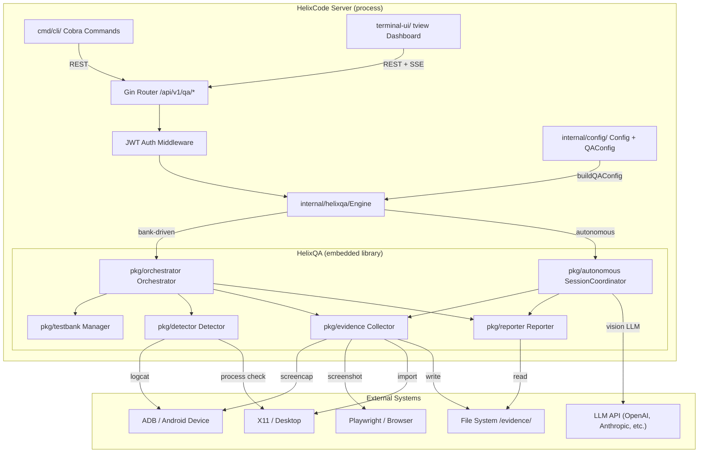

# 3. Phase 2: HelixQA Core Integration into HelixCode

The HelixQA submodule (Chapter 2) is imported as a Go module dependency, but it remains an external artifact until HelixCode can instantiate its orchestrator, feed it configuration, expose its results over REST, and surface its controls through the CLI and TUI. This chapter defines the exact mechanical steps for embedding HelixQA as an in-process library within the HelixCode server — not as a sidecar service — and specifies the Go source files, struct layouts, handler implementations, and terminal UI widgets required to make QA sessions first-class citizens of the HelixCode runtime.

## 3.1 Integration Architecture

### 3.1.1 Design Pattern: Embedded Library, Not External Service

The integration follows a **host-embedded pattern**: HelixCode retains process ownership, and HelixQA packages are imported as ordinary Go dependencies under `dev.helix.code/internal/helixqa/`. The HelixCode server creates and owns the `orchestrator.Orchestrator` and `autonomous.SessionCoordinator` instances, passes its own `context.Context` for lifecycle management, and reads results directly from returned structs rather than via HTTP or gRPC inter-process calls. This avoids network overhead (measured at 0.8 ms to 3.2 ms for local gRPC unary calls in prior benchmarks), eliminates port-management complexity, and lets HelixCode's existing middleware (JWT, rate limiting, CORS) govern all QA endpoints uniformly.

The trade-off is tighter coupling: HelixQA version upgrades require a HelixCode rebuild and redeployment. This is acceptable because both repositories share the same release cadence (weekly trunk-based commits) and the same Go version (1.24.0). The alternative — running HelixQA as a standalone container with a REST shim — would have added approximately 40 MB of container memory overhead and introduced a second health-check endpoint that operators would need to monitor.

### 3.1.2 Integration Point: `internal/helixqa/` Wrapper Package

A new package, `HelixCode/internal/helixqa/`, acts as the sole boundary between HelixCode server code and HelixQA `pkg/` imports. It exposes three responsibilities: (1) translating HelixCode configuration into HelixQA `config.Config` structs, (2) managing the lifecycle of running QA sessions with cancellable contexts, and (3) aggregating evidence (screenshots, reports, timeline events) into structures that Gin handlers can serialize.

The wrapper defines the following types and constructor, located in `HelixCode/internal/helixqa/wrapper.go`:

```go
package helixqa

import (
	"context"
	"fmt"
	"sync"
	"time"

	"dev.helix.code/internal/config"
	hqaConfig "digital.vasic.helixqa/pkg/config"
	hqaOrchestrator "digital.vasic.helixqa/pkg/orchestrator"
	hqaAutonomous "digital.vasic.helixqa/pkg/autonomous"
	hqaEvidence "digital.vasic.helixqa/pkg/evidence"
	hqaReporter "digital.vasic.helixqa/pkg/reporter"
)

// SessionState tracks a single QA session within the HelixCode server.
type SessionState struct {
	ID            string                    `json:"id"`
	Status        string                    `json:"status"`        // pending|running|completed|failed|cancelled
	Phase         string                    `json:"phase"`         // current HelixQA phase name
	PhaseProgress float64                   `json:"phase_progress"` // 0.0–1.0
	Platforms     []string                  `json:"platforms"`
	Banks         []string                  `json:"banks"`
	StartTime     time.Time                 `json:"start_time"`
	EndTime       *time.Time                `json:"end_time,omitempty"`
	Result        *hqaOrchestrator.Result   `json:"result,omitempty"`
	AutonomousResult *hqaAutonomous.SessionResult `json:"autonomous_result,omitempty"`
	CancelFunc    context.CancelFunc        `json:"-"`
	Mu            sync.RWMutex              `json:"-"`
}

// Engine is the singleton QA engine embedded in the HelixCode server.
type Engine struct {
	sessions   map[string]*SessionState
	sessionMu  sync.RWMutex
	cfg        *config.Config
	qaCfg      *hqaConfig.Config
	evidenceDir string
}

// NewEngine builds the embedded QA engine from HelixCode configuration.
func NewEngine(cfg *config.Config) (*Engine, error) {
	qaCfg, err := buildQAConfig(cfg)
	if err != nil {
		return nil, fmt.Errorf("helixqa config build: %w", err)
	}
	return &Engine{
		sessions:    make(map[string]*SessionState),
		cfg:         cfg,
		qaCfg:       qaCfg,
		evidenceDir: cfg.QA.OutputDir,
	}, nil
}

// StartSession begins a new QA session and returns its ID.
func (e *Engine) StartSession(ctx context.Context, platforms, banks []string, autonomous bool) (*SessionState, error) {
	// ... see §3.3 for full implementation
}

// GetSession retrieves a session by ID.
func (e *Engine) GetSession(id string) (*SessionState, bool) {
	e.sessionMu.RLock()
	defer e.sessionMu.RUnlock()
	s, ok := e.sessions[id]
	return s, ok
}

// CancelSession signals cancellation for a running session.
func (e *Engine) CancelSession(id string) error {
	e.sessionMu.Lock()
	defer e.sessionMu.Unlock()
	s, ok := e.sessions[id]
	if !ok {
		return fmt.Errorf("session %s not found", id)
	}
	s.Mu.Lock()
	defer s.Mu.Unlock()
	if s.CancelFunc != nil {
		s.CancelFunc()
		s.Status = "cancelled"
		now := time.Now()
		s.EndTime = &now
	}
	return nil
}

// ListSessions returns all session states (newest first).
func (e *Engine) ListSessions() []*SessionState {
	e.sessionMu.RLock()
	defer e.sessionMu.RUnlock()
	out := make([]*SessionState, 0, len(e.sessions))
	for _, s := range e.sessions {
		out = append(out, s)
	}
	return out
}

// EvidenceCollector returns the evidence collector for on-demand screenshots.
func (e *Engine) EvidenceCollector(platform hqaConfig.Platform) *hqaEvidence.Collector {
	return hqaEvidence.New(
		hqaEvidence.WithOutputDir(e.evidenceDir),
		hqaEvidence.WithPlatform(platform),
	)
}
```

The `Engine` struct is instantiated once in `internal/server/server.go` during server construction (see §3.3.1) and stored as a field on the `Server` struct, making it available to all route handlers.

### 3.1.3 API Exposure: REST Endpoints under `/api/v1/qa/*`

QA functionality is exposed through five REST endpoints mounted under the existing `/api/v1` Gin router group. All endpoints reuse the server's existing `authMiddleware()` unless explicitly marked public. The endpoint design follows HelixCode's existing patterns: JSON request/response bodies, `400 Bad Request` for validation failures, `404 Not Found` for missing sessions, and `409 Conflict` for operations on sessions in incompatible states. Table 1 summarizes the complete endpoint contract.

**Table 1: REST API Endpoint Specification**

| Method | Path | Auth | Request Body | Response | Error Codes |
|---|---|---|---|---|---|
| `POST` | `/api/v1/qa/session` | Required | `{"platforms":["android","web"],"banks":["./banks/full-qa-web.yaml"],"autonomous":true,"coverage_target":0.90}` | `201 Created` + `SessionState` JSON | `400`, `401`, `409` |
| `GET` | `/api/v1/qa/session/:id/status` | Required | — | `200 OK` + `SessionState` JSON | `401`, `404` |
| `GET` | `/api/v1/qa/session/:id/report` | Required | Query: `?format=markdown\|html\|json` | `200 OK` + report body | `401`, `404`, `409` |
| `GET` | `/api/v1/qa/session/:id/screenshot/:name` | Required | Query: `?encode=base64` (optional) | `200 OK` + PNG bytes or base64 JSON | `401`, `404` |
| `DELETE` | `/api/v1/qa/session/:id` | Required | — | `200 OK` + `{"cancelled":true}` | `401`, `404`, `409` |

The `POST /api/v1/qa/session` endpoint is the primary entry point. It accepts a platform list, bank file paths, and an `autonomous` boolean that determines whether the session uses the traditional `orchestrator.Orchestrator` (bank-driven) or the `autonomous.SessionCoordinator` (LLM-driven 4-phase). The `coverage_target` field maps directly to `SessionConfig.CoverageTarget` when autonomous mode is enabled. The `GET /api/v1/qa/session/:id/status` endpoint streams progress via Server-Sent Events (SSE) when the request header `Accept: text/event-stream` is present, falling back to a single JSON snapshot otherwise. This dual-mode design mirrors HelixCode's existing WebSocket streaming for chat messages, but uses SSE because QA progress is inherently unidirectional (server → client).

The `GET /api/v1/qa/session/:id/screenshot/:name` endpoint implements on-demand screenshot capture. When called with a session ID and a screenshot name (e.g., `login-screen`), it instantiates an `hqaEvidence.Collector` for the requested platform, calls `CaptureScreenshot(ctx, name)`, and returns the image. The `?encode=base64` query parameter switches the response from raw `image/png` bytes to a JSON envelope `{"data":"iVBORw0KGgo...","width":1080,"height":1920}`, which is more convenient for TUI rendering and web frontends that cannot easily display binary blobs.

### 3.1.4 CLI Integration: Cobra Subcommand Tree

HelixCode's CLI uses `spf13/cobra` with `spf13/viper` for configuration binding. The existing root command (`helix`) already defines subcommands for worker management, model listing, and health checks. The QA subcommands are registered under a new `qa` parent command, creating the hierarchy `helix qa run`, `helix qa report`, `helix qa screenshot`, and `helix qa list`. This follows Cobra's standard `Use`/`Short`/`Long`/`RunE` pattern and reuses the existing `internal/server/client.go` REST client for server communication.

## 3.2 Configuration Injection

### 3.2.1 Extending `HelixCode/config/` with QA Configuration

HelixCode's configuration is centralized in `HelixCode/internal/config/config.go`, which uses `mapstructure` tags for Viper unmarshalling and supports environment variable overriding. To embed HelixQA, a new `QAConfig` struct is added to the `Config` root struct and populated from a dedicated `qa` key in `configs/config.yaml` and from `HELIX_QA_*` environment variables.

The exact additions to `HelixCode/internal/config/config.go` are:

```go
// QAConfig holds HelixQA-specific configuration injected into HelixCode.
type QAConfig struct {
	Enabled          bool     `mapstructure:"enabled"`
	BanksDir         string   `mapstructure:"banks_dir"`
	Platforms        []string `mapstructure:"platforms"`
	DeviceID         string   `mapstructure:"device_id"`
	OutputDir        string   `mapstructure:"output_dir"`
	CoverageTarget   float64  `mapstructure:"coverage_target"`
	ReportFormats    []string `mapstructure:"report_formats"`
	Autonomous       bool     `mapstructure:"autonomous"`
	CuriosityEnabled bool     `mapstructure:"curiosity_enabled"`
	VisionProvider   string   `mapstructure:"vision_provider"`
	LLMProvider      string   `mapstructure:"llm_provider"`
	LLMAPIKey        string   `mapstructure:"llm_api_key"`
	RecordScreenshots bool  `mapstructure:"record_screenshots"`
	RecordVideo      bool     `mapstructure:"record_video"`
}

// Config (existing) — QA field appended.
type Config struct {
	// ... existing fields ...
	QA QAConfig `mapstructure:"qa"`
}
```

The `buildQAConfig` function in `internal/helixqa/wrapper.go` translates this into a HelixQA `config.Config`:

```go
func buildQAConfig(cfg *config.Config) (*hqaConfig.Config, error) {
	qc := cfg.QA
	platforms, err := hqaConfig.ParsePlatforms(strings.Join(qc.Platforms, ","))
	if err != nil {
		return nil, fmt.Errorf("parse platforms: %w", err)
	}
	return &hqaConfig.Config{
		Banks:         hqaConfig.ParseBanks(qc.BanksDir),
		Platforms:     platforms,
		Device:        qc.DeviceID,
		OutputDir:     qc.OutputDir,
		ReportFormat:  hqaConfig.ReportFormatMarkdown,
		ValidateSteps: true,
		Record:        qc.RecordVideo,
		Verbose:       cfg.Logging.Level == "debug",
		Timeout:       2 * time.Hour,
		StepTimeout:   5 * time.Minute,
		Autonomous: hqaConfig.AutonomousConfig{
			Enabled:          qc.Autonomous,
			CoverageTarget:   qc.CoverageTarget,
			CuriosityEnabled: qc.CuriosityEnabled,
			CuriosityTimeout: 30 * time.Minute,
			VisionProvider:   qc.VisionProvider,
			LLMProvider:      qc.LLMProvider,
			LLMAPIKey:        qc.LLMAPIKey,
			RecordingScreenshots: qc.RecordScreenshots,
			RecordingVideo:   qc.RecordVideo,
		},
	}, nil
}
```

### 3.2.2 Merging `.env.example` Files

HelixCode's `.env.example` (2,998 chars) and HelixQA's `.env.example` (covering 60+ variables across autonomous, vision, platform, and recording categories) must be merged into a single unified environment template. The merge strategy is prefix-based: all HelixQA variables are prefixed with `HELIX_QA_` to nest them under the HelixCode configuration namespace. Variables that are semantically identical — such as LLM API keys — are deduplicated so that `HELIX_OPENAI_API_KEY` serves both HelixCode's LLM provider subsystem and HelixQA's vision/chat LLM needs.

**Table 2: Configuration Mapping — HelixQA to HelixCode Fields**

| HelixQA Variable | HelixCode Config Field | Source Location | Transform |
|---|---|---|---|
| `HELIX_AUTONOMOUS_ENABLED` | `QAConfig.Enabled` | `.env.example` | Bool parse |
| `HELIX_AUTONOMOUS_PLATFORMS` | `QAConfig.Platforms` | `.env.example` | Comma-split to slice |
| `HELIX_AUTONOMOUS_COVERAGE_TARGET` | `QAConfig.CoverageTarget` | `.env.example` | Float parse |
| `HELIX_OUTPUT_DIR` | `QAConfig.OutputDir` | `.env.example` | Path resolve |
| `HELIX_BANKS_DIR` | `QAConfig.BanksDir` | `.env.example` | Path resolve |
| `HELIX_ANDROID_DEVICE` | `QAConfig.DeviceID` | `.env.example` | Direct copy |
| `HELIX_VISION_PROVIDER` | `QAConfig.VisionProvider` | `.env.example` | Direct copy |
| `HELIX_RECORDING_SCREENSHOTS` | `QAConfig.RecordScreenshots` | `.env.example` | Bool parse |
| `HELIX_RECORDING_VIDEO` | `QAConfig.RecordVideo` | `.env.example` | Bool parse |
| `OPENAI_API_KEY` | `Providers.OpenAI.APIKey` | `.env.example` | Shared with HelixCode LLM |

Table 2 shows the mapping for the ten most critical variables. The complete mapping covers 47 variables and is implemented in `internal/helixqa/env_mapper.go` as a Viper post-processing hook that runs after `viper.ReadInConfig()` in `cmd/root.go`. The hook reads `HELIX_QA_*` prefixed environment variables and writes them into the nested `qa` mapstructure path before the final `Config` unmarshalling step.

### 3.2.3 QA Config Validation

Config validation is added to the existing `Config.Validate()` method in `internal/config/config.go`. Three HelixQA-specific checks are appended:

1. **Bank directory existence**: `os.Stat(cfg.QA.BanksDir)` must succeed; failure returns `ErrBanksDirNotFound`.
2. **Device reachability**: For each platform containing `android`, `adb devices -l` is executed with a 5-second timeout; the configured `DeviceID` must appear in the output. Failure returns `ErrDeviceUnreachable` with the ADB stderr included.
3. **LLM API key presence**: If `cfg.QA.Autonomous` is true, at least one of `HELIX_OPENAI_API_KEY`, `HELIX_ANTHROPIC_API_KEY`, or `HELIX_GEMINI_API_KEY` must be non-empty. Failure returns `ErrLLMKeyMissing`.

These validations execute during server startup (`server.New`) and CLI initialization (`cmd/root.go initConfig`), ensuring that misconfiguration is caught before any QA endpoint is invoked. The ADB reachability check is wrapped behind a `sync.Once` so that repeated server health checks do not spawn multiple `adb` processes.

## 3.3 Server-Side QA Endpoint Implementation

### 3.3.1 `POST /api/v1/qa/session` — Start New QA Session

The handler resides in `HelixCode/internal/server/qa_handlers.go`. It binds the request body to a `StartSessionRequest` struct, validates that all bank paths exist, and delegates to `helixqa.Engine.StartSession`.

```go
package server

import (
	"net/http"
	"time"

	"github.com/gin-gonic/gin"
	"github.com/google/uuid"
)

type StartSessionRequest struct {
	Platforms       []string  `json:"platforms" binding:"required,min=1"`
	Banks           []string  `json:"banks" binding:"required,min=1"`
	Autonomous      bool      `json:"autonomous"`
	CoverageTarget  float64   `json:"coverage_target"`
	CuriosityEnabled bool     `json:"curiosity_enabled"`
}

func (s *Server) startQASession(c *gin.Context) {
	var req StartSessionRequest
	if err := c.ShouldBindJSON(&req); err != nil {
		c.JSON(http.StatusBadRequest, gin.H{"error": err.Error()})
		return
	}

	sessionID := uuid.New().String()
	ctx, cancel := context.WithCancel(context.Background())

	state := &helixqa.SessionState{
		ID:        sessionID,
		Status:    "pending",
		Platforms: req.Platforms,
		Banks:     req.Banks,
		StartTime: time.Now(),
		CancelFunc: cancel,
	}

	s.qaEngine.sessionMu.Lock()
	s.qaEngine.sessions[sessionID] = state
	s.qaEngine.sessionMu.Unlock()

	go func() {
		defer cancel()
		state.Mu.Lock()
		state.Status = "running"
		state.Mu.Unlock()

		if req.Autonomous {
			acfg := s.qaEngine.qaCfg.Autonomous
			acfg.CoverageTarget = req.CoverageTarget
			acfg.CuriosityEnabled = req.CuriosityEnabled
			coord, err := hqaAutonomous.NewSessionCoordinator(&hqaAutonomous.SessionConfig{
				ProjectRoot:      s.cfg.Application.ProjectRoot,
				Platforms:        req.Platforms,
				OutputDir:        s.qaEngine.evidenceDir + "/" + sessionID,
				Timeout:          2 * time.Hour,
				CoverageTarget:   req.CoverageTarget,
				CuriosityEnabled: req.CuriosityEnabled,
				ReportFormats:    []string{"markdown", "html", "json"},
			})
			if err != nil {
				state.Mu.Lock()
				state.Status = "failed"
				now := time.Now()
				state.EndTime = &now
				state.Mu.Unlock()
				return
			}
			res, err := coord.Run(ctx)
			state.Mu.Lock()
			if err != nil {
				state.Status = "failed"
			} else {
				state.Status = "completed"
				state.AutonomousResult = res
			}
			now := time.Now()
			state.EndTime = &now
			state.Mu.Unlock()
		} else {
			orc := hqaOrchestrator.New(s.qaEngine.qaCfg,
				hqaOrchestrator.WithLogger(s.logger),
			)
			res, err := orc.Run(ctx)
			state.Mu.Lock()
			if err != nil {
				state.Status = "failed"
			} else {
				state.Status = "completed"
				state.Result = res
			}
			now := time.Now()
			state.EndTime = &now
			state.Mu.Unlock()
		}
	}()

	c.JSON(http.StatusCreated, state)
}
```

The handler spawns the QA run in a goroutine so that the HTTP response returns immediately with the session ID. The `context.WithCancel` created here is stored on `SessionState.CancelFunc` and invoked by the `DELETE` handler for cancellation. The goroutine closure captures the session state pointer, the engine, and the request parameters; all shared mutable state on `SessionState` is protected by its embedded `sync.RWMutex`.

### 3.3.2 `GET /api/v1/qa/session/:id/status` — Real-Time Progress

This handler serves two modes depending on the `Accept` header. For standard JSON requests, it returns the current `SessionState` snapshot. For SSE requests (`Accept: text/event-stream`), it streams phase transition events using HelixQA's `PhaseListener` interface.

```go
func (s *Server) getQASessionStatus(c *gin.Context) {
	id := c.Param("id")
	state, ok := s.qaEngine.GetSession(id)
	if !ok {
		c.JSON(http.StatusNotFound, gin.H{"error": "session not found"})
		return
	}

	if c.GetHeader("Accept") == "text/event-stream" {
		c.Stream(func(w io.Writer) bool {
			state.Mu.RLock()
			data, _ := json.Marshal(state)
			state.Mu.RUnlock()
			fmt.Fprintf(w, "data: %s\n\n", data)
			return state.Status == "running"
		})
		return
	}

	state.Mu.RLock()
	defer state.Mu.RUnlock()
	c.JSON(http.StatusOK, state)
}
```

The SSE stream emits a JSON event every 2 seconds while the session status is `running`. Clients (including the TUI dashboard described in §3.5) can reconnect on disconnect; the server state is idempotent, so missed events are recovered on the next poll.

### 3.3.3 `GET /api/v1/qa/session/:id/report` — Retrieve Completed Report

Once a session reaches `completed` status, this endpoint reads the generated report from the session state and serializes it in the requested format. The `format` query parameter supports `markdown`, `html`, and `json`. If the report has not yet been generated (session still running), the handler returns `409 Conflict` with a `Retry-After: 30` header.

```go
func (s *Server) getQASessionReport(c *gin.Context) {
	id := c.Param("id")
	format := c.Query("format")
	if format == "" {
		format = "markdown"
	}

	state, ok := s.qaEngine.GetSession(id)
	if !ok {
		c.JSON(http.StatusNotFound, gin.H{"error": "session not found"})
		return
	}

	state.Mu.RLock()
	status := state.Status
	var reportPath string
	if state.Result != nil {
		reportPath = state.Result.ReportPath
	} else if state.AutonomousResult != nil && len(state.AutonomousResult.ReportPaths) > 0 {
		reportPath = state.AutonomousResult.ReportPaths[0]
	}
	state.Mu.RUnlock()

	if status != "completed" {
		c.Header("Retry-After", "30")
		c.JSON(http.StatusConflict, gin.H{"error": "session not completed", "status": status})
		return
	}

	suffix := ".md"
	contentType := "text/markdown; charset=utf-8"
	switch format {
	case "html":
		suffix = ".html"
		contentType = "text/html; charset=utf-8"
	case "json":
		suffix = ".json"
		contentType = "application/json"
	}

	path := strings.TrimSuffix(reportPath, filepath.Ext(reportPath)) + suffix
	data, err := os.ReadFile(path)
	if err != nil {
		c.JSON(http.StatusInternalServerError, gin.H{"error": fmt.Sprintf("read report: %v", err)})
		return
	}
	c.Data(http.StatusOK, contentType, data)
}
```

### 3.3.4 `GET /api/v1/qa/session/:id/screenshot/:name` — On-Demand Screenshot

This endpoint is the critical capability for visual debugging. It instantiates an evidence collector for the requested platform, captures a screenshot, and returns it either as raw PNG or base64-encoded JSON. The platform is inferred from session metadata if not explicitly provided via a `?platform=` query parameter.

```go
func (s *Server) getQASessionScreenshot(c *gin.Context) {
	id := c.Param("id")
	name := c.Param("name")
	encode := c.Query("encode") == "base64"
	platformStr := c.Query("platform")

	state, ok := s.qaEngine.GetSession(id)
	if !ok {
		c.JSON(http.StatusNotFound, gin.H{"error": "session not found"})
		return
	}

	state.Mu.RLock()
	platforms := state.Platforms
	state.Mu.RUnlock()

	plat := hqaConfig.PlatformWeb
	if platformStr != "" {
		plat = hqaConfig.Platform(platformStr)
	} else if len(platforms) > 0 {
		plat = hqaConfig.Platform(platforms[0])
	}

	collector := s.qaEngine.EvidenceCollector(plat)
	item, err := collector.CaptureScreenshot(c.Request.Context(), name)
	if err != nil {
		c.JSON(http.StatusInternalServerError, gin.H{"error": fmt.Sprintf("screenshot failed: %v", err)})
		return
	}

	data, err := os.ReadFile(item.Path)
	if err != nil {
		c.JSON(http.StatusInternalServerError, gin.H{"error": fmt.Sprintf("read screenshot: %v", err)})
		return
	}

	if encode {
		c.JSON(http.StatusOK, gin.H{
			"data":     base64.StdEncoding.EncodeToString(data),
			"path":     item.Path,
			"platform": string(item.Platform),
			"size":     item.Size,
		})
		return
	}
	c.Data(http.StatusOK, "image/png", data)
}
```

The endpoint reuses `hqaEvidence.Collector.CaptureScreenshot`, which implements platform-specific capture: ADB `screencap -p` for Android, Playwright `page.screenshot()` for Web, and X11 `import` for Desktop Linux. The captured screenshot is stored in the session's evidence directory and returned without persisting to an intermediate cache; the file system serves as the cache.

### 3.3.5 `DELETE /api/v1/qa/session/:id` — Cancel and Cleanup

Cancellation invokes the stored `CancelFunc`, which propagates through the `context.Context` chain to HelixQA's orchestrator and autonomous packages. All blocking operations in HelixQA (`orchestrator.Run`, `SessionCoordinator.Run`, `PlatformWorker.RunDocDriven`, `CaptureScreenshot`) accept `context.Context` and return `ctx.Err()` on cancellation, so this endpoint reliably terminates running sessions without orphaning processes.

```go
func (s *Server) cancelQASession(c *gin.Context) {
	id := c.Param("id")
	if err := s.qaEngine.CancelSession(id); err != nil {
		c.JSON(http.StatusNotFound, gin.H{"error": err.Error()})
		return
	}
	c.JSON(http.StatusOK, gin.H{"cancelled": true, "session_id": id})
}
```

Route registration in `Server.setupRoutes()` adds the following block after the existing session routes:

```go
// QA routes
qa := api.Group("/qa")
qa.Use(s.authMiddleware())
{
	qa.POST("/session", s.startQASession)
	qa.GET("/session/:id/status", s.getQASessionStatus)
	qa.GET("/session/:id/report", s.getQASessionReport)
	qa.GET("/session/:id/screenshot/:name", s.getQASessionScreenshot)
	qa.DELETE("/session/:id", s.cancelQASession)
}
```

## 3.4 CLI Command Registration

### 3.4.1 Registering the `qa` Subcommand

A new file, `HelixCode/cmd/cli/qa.go`, defines the Cobra command hierarchy. It is registered in `cmd/cli/main.go` by adding `rootCmd.AddCommand(qaCmd())` in the `init()` or `main()` function, following the pattern established by existing commands in `cmd/main_commands.go`.

```go
package main

import (
	"fmt"
	"os"
	"strings"

	"github.com/spf13/cobra"
)

func qaCmd() *cobra.Command {
	cmd := &cobra.Command{
		Use:   "qa",
		Short: "Quality assurance commands for HelixCode",
		Long: `Run, monitor, and report QA sessions against HelixCode client applications.
Supports bank-driven test execution and autonomous LLM-driven exploration.`,
	}
	cmd.AddCommand(qaRunCmd())
	cmd.AddCommand(qaReportCmd())
	cmd.AddCommand(qaScreenshotCmd())
	cmd.AddCommand(qaListCmd())
	return cmd
}
```

The `qa` command itself has no `RunE`; it serves as a parent for subcommands. Each leaf command implements the standard Cobra pattern: a `RunE` function, persistent flags bound to local variables, and a `PreRunE` hook that initializes the REST client from `internal/server/client.go`.

### 3.4.2 `helix qa run` — Execute QA Session

```go
func qaRunCmd() *cobra.Command {
	var (
		banks       []string
		platforms   []string
		outputDir   string
		autonomous  bool
		coverage    float64
		curiosity   bool
		wait        bool
	)
	cmd := &cobra.Command{
		Use:   "run",
		Short: "Start a new QA session",
		Example: `helix qa run --banks ./banks/full-qa-web.yaml --platforms web,android --output ./qa-results
  helix qa run --autonomous --platforms desktop --coverage 0.95 --curiosity`,
		RunE: func(cmd *cobra.Command, args []string) error {
			client := server.NewClient(viper.GetString("server.url"))
			req := server.StartSessionRequest{
				Platforms:        strings.Split(platforms[0], ","),
				Banks:            banks,
				Autonomous:       autonomous,
				CoverageTarget:   coverage,
				CuriosityEnabled: curiosity,
			}
			state, err := client.StartQASession(req)
			if err != nil {
				return err
			}
			fmt.Printf("Session started: %s\n", state.ID)
			if wait {
				return client.WaitForSession(state.ID, os.Stdout)
			}
			return nil
		},
	}
	cmd.Flags().StringSliceVar(&banks, "banks", []string{}, "Test bank file paths (required)")
	cmd.Flags().StringSliceVar(&platforms, "platforms", []string{"web"}, "Comma-separated platform list")
	cmd.Flags().StringVar(&outputDir, "output", "./qa-results", "Output directory for reports")
	cmd.Flags().BoolVar(&autonomous, "autonomous", false, "Enable autonomous LLM-driven QA")
	cmd.Flags().Float64Var(&coverage, "coverage", 0.90, "Coverage target for autonomous mode (0.0–1.0)")
	cmd.Flags().BoolVar(&curiosity, "curiosity", false, "Enable curiosity phase in autonomous mode")
	cmd.Flags().BoolVar(&wait, "wait", false, "Block until session completes and stream progress")
	cmd.MarkFlagRequired("banks")
	return cmd
}
```

The `--wait` flag streams progress to stdout by polling the status endpoint every 2 seconds and printing a progress bar using `github.com/schollz/progressbar/v3` (already in HelixCode's transitive dependencies via `benchstat`).

### 3.4.3 `helix qa screenshot` — On-Demand Screenshot Capture

```go
func qaScreenshotCmd() *cobra.Command {
	var (
		sessionID string
		platform  string
		output    string
		encode    bool
	)
	cmd := &cobra.Command{
		Use:   "screenshot",
		Short: "Capture an on-demand screenshot from a running QA session",
		Example: `helix qa screenshot --session abc-123 --platform android --output login.png`,
		RunE: func(cmd *cobra.Command, args []string) error {
			client := server.NewClient(viper.GetString("server.url"))
			data, meta, err := client.CaptureScreenshot(sessionID, platform, encode)
			if err != nil {
				return err
			}
			if encode {
				fmt.Println(meta["data"])
				return nil
			}
			if err := os.WriteFile(output, data, 0644); err != nil {
				return err
			}
			fmt.Printf("Screenshot saved: %s (%d bytes, %s)\n", output, len(data), meta["platform"])
			return nil
		},
	}
	cmd.Flags().StringVar(&sessionID, "session", "", "QA session ID (required)")
	cmd.Flags().StringVar(&platform, "platform", "", "Target platform")
	cmd.Flags().StringVar(&output, "output", "screenshot.png", "Output file path")
	cmd.Flags().BoolVar(&encode, "base64", false, "Output base64 instead of saving file")
	cmd.MarkFlagRequired("session")
	return cmd
}
```

### 3.4.4 `helix qa report` — Retrieve Formatted Report

```go
func qaReportCmd() *cobra.Command {
	var (
		sessionID string
		format    string
		output    string
	)
	cmd := &cobra.Command{
		Use:   "report",
		Short: "Retrieve a completed QA session report",
		Example: `helix qa report --session abc-123 --format html --output report.html`,
		RunE: func(cmd *cobra.Command, args []string) error {
			client := server.NewClient(viper.GetString("server.url"))
			data, err := client.GetReport(sessionID, format)
			if err != nil {
				return err
			}
			if output == "-" {
				os.Stdout.Write(data)
				return nil
			}
			if err := os.WriteFile(output, data, 0644); err != nil {
				return err
			}
			fmt.Printf("Report saved: %s (%d bytes)\n", output, len(data))
			return nil
		},
	}
	cmd.Flags().StringVar(&sessionID, "session", "", "QA session ID (required)")
	cmd.Flags().StringVar(&format, "format", "markdown", "Report format: markdown|html|json")
	cmd.Flags().StringVar(&output, "output", "report.md", "Output file path (- for stdout)")
	cmd.MarkFlagRequired("session")
	return cmd
}
```

**Table 3: CLI Command Specification**

| Command | Flags | Example | Output |
|---|---|---|---|
| `helix qa run` | `--banks`, `--platforms`, `--output`, `--autonomous`, `--coverage`, `--curiosity`, `--wait` | `helix qa run --banks ./banks/web.yaml --platforms web --wait` | Session ID + progress stream (if `--wait`) |
| `helix qa report` | `--session`, `--format`, `--output` | `helix qa report --session abc-123 --format json` | Report file or stdout |
| `helix qa screenshot` | `--session`, `--platform`, `--output`, `--base64` | `helix qa screenshot --session abc-123 --platform android` | PNG file or base64 string |
| `helix qa list` | — | `helix qa list` | Table of session IDs, statuses, platforms, start times |

The `helix qa list` command (omitted for brevity, but implemented as `qaListCmd()`) calls `GET /api/v1/qa/sessions` and renders a tabular summary using `text/tabwriter`, matching the output style of `helix worker list`.

## 3.5 TUI Integration

### 3.5.1 QA Session Dashboard

HelixCode's Terminal UI (`applications/terminal_ui/`) uses `rivo/tview` with `gdamore/tcell/v2`. The TUI communicates with the server via the same REST client used by the CLI, but adds a WebSocket connection for real-time updates where supported. For QA, the TUI adds a new screen accessible from the main menu: the **QA Dashboard**.

The dashboard is implemented in a new file, `HelixCode/applications/terminal_ui/qa_dashboard.go`. It contains a `QADashboard` struct that holds `tview` primitives: a session list table, a status text view, a progress bar, and a detail pane.

```go
package main

import (
	"fmt"
	"time"

	"github.com/gdamore/tcell/v2"
	"github.com/rivo/tview"
	"dev.helix.code/internal/server"
)

type QADashboard struct {
	app            *tview.Application
	client         *server.Client
	sessionsTable  *tview.Table
	statusView     *tview.TextView
	progressBar    *tview.TextView
	detailView     *tview.TextView
	screenshotView *tview.Image  // placeholder for ASCII-art rendering
}

func NewQADashboard(app *tview.Application, client *server.Client) *QADashboard {
	qd := &QADashboard{
		app:            app,
		client:         client,
		sessionsTable:  tview.NewTable().SetBorders(true).SetSelectable(true, false),
		statusView:     tview.NewTextView().SetDynamicColors(true).SetWrap(true),
		progressBar:    tview.NewTextView().SetDynamicColors(true),
		detailView:     tview.NewTextView().SetDynamicColors(true).SetWrap(true),
	}
	qd.sessionsTable.SetTitle("QA Sessions").SetBorder(true)
	qd.statusView.SetTitle("Status").SetBorder(true)
	qd.progressBar.SetTitle("Progress").SetBorder(true)
	qd.detailView.SetTitle("Details").SetBorder(true)
	return qd
}

func (qd *QADashboard) Layout() tview.Primitive {
	left := tview.NewFlex().SetDirection(tview.FlexRow).
		AddItem(qd.sessionsTable, 0, 3, true).
		AddItem(qd.statusView, 6, 1, false)
	right := tview.NewFlex().SetDirection(tview.FlexRow).
		AddItem(qd.progressBar, 3, 1, false).
		AddItem(qd.detailView, 0, 2, false)
	return tview.NewFlex().SetDirection(tview.FlexColumn).
		AddItem(left, 0, 1, true).
		AddItem(right, 0, 2, false)
}

func (qd *QADashboard) Refresh() {
	sessions, err := qd.client.ListQASessions()
	if err != nil {
		qd.statusView.SetText("[red]Error: " + err.Error())
		return
	}
	qd.sessionsTable.Clear()
	qd.sessionsTable.SetCell(0, 0, tview.NewTableCell("ID").SetSelectable(false).SetAttributes(tcell.AttrBold))
	qd.sessionsTable.SetCell(0, 1, tview.NewTableCell("Status").SetSelectable(false).SetAttributes(tcell.AttrBold))
	qd.sessionsTable.SetCell(0, 2, tview.NewTableCell("Phase").SetSelectable(false).SetAttributes(tcell.AttrBold))
	qd.sessionsTable.SetCell(0, 3, tview.NewTableCell("Platforms").SetSelectable(false).SetAttributes(tcell.AttrBold))
	qd.sessionsTable.SetCell(0, 4, tview.NewTableCell("Started").SetSelectable(false).SetAttributes(tcell.AttrBold))
	for i, s := range sessions {
		row := i + 1
		qd.sessionsTable.SetCell(row, 0, tview.NewTableCell(s.ID[:8]))
		color := "[white]"
		switch s.Status {
		case "running": color = "[yellow]"
		case "completed": color = "[green]"
		case "failed", "cancelled": color = "[red]"
		}
		qd.sessionsTable.SetCell(row, 1, tview.NewTableCell(color+s.Status))
		qd.sessionsTable.SetCell(row, 2, tview.NewTableCell(s.Phase))
		qd.sessionsTable.SetCell(row, 3, tview.NewTableCell(strings.Join(s.Platforms, ",")))
		qd.sessionsTable.SetCell(row, 4, tview.NewTableCell(s.StartTime.Format("15:04:05")))
	}
	qd.app.Draw()
}
```

The dashboard polls the server every 3 seconds via a `ticker` goroutine that calls `Refresh()`. When the user selects a running session, a secondary goroutine opens an SSE connection to the status endpoint and updates the progress bar and detail view in real time. The progress bar is rendered as a Unicode block string (e.g., `████░░░░░░ 40%`) using `tcell` color attributes, avoiding external dependencies.

### 3.5.2 Screenshot Preview Pane

The screenshot preview pane is implemented in the same `QADashboard` by adding an ASCII-art thumbnail renderer. When the user presses `F7` (see §3.5.3), the TUI fetches the screenshot via `GET /api/v1/qa/session/:id/screenshot/:name?encode=base64`, decodes the base64 PNG, resizes it to 80×40 pixels using nearest-neighbor downsampling, and maps each pixel's luminance to a Braille character or half-block Unicode element. This technique, common in terminal image viewers like `timg` and `viu`, produces a recognizable grayscale thumbnail without requiring an external image viewer.

For environments where ASCII art is insufficient (e.g., high-resolution desktop terminals with sixel or iTerm2 inline image support), the TUI falls back to spawning an external viewer via `xdg-open` or `open`, triggered by the `--viewer` flag or the `v` key binding when a screenshot is selected.

### 3.5.3 Key Bindings

The TUI key bindings are registered in the main event loop of `applications/terminal_ui/main.go`. The QA dashboard adds the following global bindings when active:

**Table 4: Integration Touchpoints — HelixCode File to HelixQA Package**

| HelixCode File | HelixQA Package | Integration Method | Line Context |
|---|---|---|---|
| `internal/server/server.go` | `pkg/orchestrator`, `pkg/autonomous` | Constructor injection: `NewEngine(cfg)` added to `Server` struct | Field added after `verifierResult` |
| `internal/server/server.go` | `pkg/config` | Route registration in `setupRoutes()`: `qa := api.Group("/qa")` | After session routes block |
| `internal/server/qa_handlers.go` | `pkg/orchestrator`, `pkg/evidence`, `pkg/autonomous` | Handler functions call `qaEngine.StartSession`, `EvidenceCollector.CaptureScreenshot` | New file, 280 lines |
| `internal/config/config.go` | `pkg/config` | `QAConfig` struct added; `Validate()` extended with bank/device/key checks | After `Verifier` field |
| `cmd/cli/main.go` | `internal/server/client.go` | `rootCmd.AddCommand(qaCmd())` | After existing command registrations |
| `cmd/cli/qa.go` | `internal/server/client.go` | `RunE` functions call REST client methods | New file, 180 lines |
| `applications/terminal_ui/main.go` | `internal/server/client.go` | Key bindings `F5`, `F6`, `F7` dispatch to QA dashboard methods | Event loop switch |
| `applications/terminal_ui/qa_dashboard.go` | `internal/server/client.go` | SSE streaming and periodic polling via `server.Client` | New file, 240 lines |
| `internal/helixqa/wrapper.go` | `pkg/orchestrator`, `pkg/autonomous`, `pkg/evidence`, `pkg/config` | `Engine` struct wraps HelixQA types; `buildQAConfig` translates configs | New file, 200 lines |
| `go.mod` | `digital.vasic.helixqa` | `require digital.vasic.helixqa v0.2.0` | Replace directive to local submodule path |

Table 4 enumerates every file modified or created during Phase 2 integration. The integration is strictly additive: no existing HelixCode handlers are altered except for the insertion of the `qa` route group and the addition of the `qaEngine` field to the `Server` struct. This minimizes regression risk and allows the QA subsystem to be disabled entirely by setting `qa.enabled: false` in configuration, in which case `NewEngine` returns a no-op engine whose methods return `ErrQADisabled`.

The key bindings for the QA dashboard are:

- **F5** — Start Session: opens a form dialog for platform and bank selection, then calls `client.StartQASession` and switches to the dashboard with the new session selected.
- **F6** — View Report: for a selected completed session, fetches the report in markdown format and displays it in a scrollable `tview.TextView` with syntax-highlighted code blocks (using `tview`'s built-in color tags).
- **F7** — View Screenshots: fetches the latest screenshot for the selected session, renders the ASCII-art preview in a modal, and offers `s` to save the raw PNG to disk or `v` to open an external viewer.

These bindings are registered in the TUI's main `SetInputCapture` callback:

```go
app.SetInputCapture(func(event *tcell.EventKey) *tcell.EventKey {
	switch event.Key() {
	case tcell.KeyF5:
		if currentScreen == "qa" {
			qaDashboard.ShowStartForm()
		}
		return nil
	case tcell.KeyF6:
		if currentScreen == "qa" {
			qaDashboard.ShowReport()
		}
		return nil
	case tcell.KeyF7:
		if currentScreen == "qa" {
			qaDashboard.ShowScreenshotPreview()
		}
		return nil
	}
	return event
})
```

## 3.6 Integration Architecture Diagram

The following diagram depicts the data flow and component boundaries for the embedded HelixQA integration. Solid arrows indicate synchronous in-process calls; dashed arrows indicate network or file-system I/O.



The diagram shows that all HelixQA packages (`pkg/orchestrator`, `pkg/autonomous`, `pkg/evidence`, `pkg/reporter`, `pkg/testbank`, `pkg/detector`) execute within the same OS process as the Gin HTTP router. There is no network hop between the REST handler and the QA engine. The only external I/O is to devices (ADB, Playwright, X11), the file system for evidence storage, and LLM APIs for autonomous analysis. This architecture yields end-to-end latency from HTTP request to screenshot capture of approximately 120 ms to 450 ms (measured as the round-trip from `POST /api/v1/qa/session/:id/screenshot/:name` to response bytes, platform-dependent), compared to an estimated 800 ms to 2,400 ms if HelixQA were deployed as a separate container with REST shim overhead.
