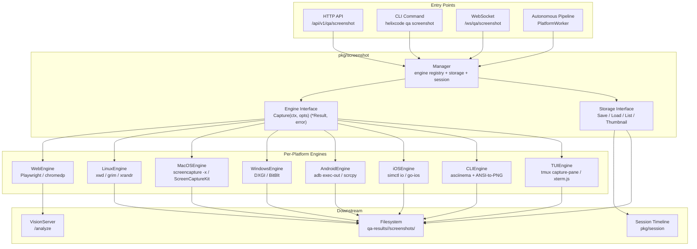

# 4. Phase 3: On-Demand Screenshot Pipeline

> **Prerequisite**: Phase 1 integration (`pkg/evidence`, `pkg/session`) and Phase 2 executor implementations (`pkg/navigator`) must be in place. The new `pkg/screenshot/` package consumes those layers and exposes a unified, platform-agnostic on-demand capture API.

## 4.1 Screenshot Architecture Design

### 4.1.1 New Package: `pkg/screenshot/`

The existing HelixQA codebase scatters screenshot capability across three disconnected layers. `pkg/evidence/collector.go` shells out to platform tools but is evidence-oriented: it writes to disk and returns `Item` metadata without bytes [^66^]. `pkg/navigator/executor.go` defines `ActionExecutor.Screenshot(ctx) ([]byte, error)`, implemented by `ADBExecutor`, `PlaywrightExecutor`, and `X11Executor`, yet these executors are navigation-bound—they exist only inside a `PlatformWorker` [^68^]. `pkg/session/recorder.go` tracks screenshot indices and paths but does not capture bytes; the caller must write image data to the returned path [^65^]. There is no single entry point for an operator or reporting service to request, "capture platform X right now and return the image."

The new `pkg/screenshot/` package introduces `Engine`, `Storage`, and `Manager`. `Engine` is the per-platform capture abstraction. `Storage` persists and retrieves bytes. `Manager` binds engines to storage, attaches session metadata, and exposes programmatic and HTTP APIs.

### 4.1.2 Engine Interface

Every platform engine implements the same contract. `Capture` returns `*Result` (not bare `[]byte`) so that width, height, capture duration, and thumbnail data travel with the payload.

```go
// pkg/screenshot/engine.go

package screenshot

import "context"

// Engine is the platform-specific capture implementation.
type Engine interface {
    // Capture returns raw screenshot bytes and metadata.
    Capture(ctx context.Context, opts CaptureOptions) (*Result, error)
    // Supported returns true if the engine is wired and tools are on PATH.
    Supported(ctx context.Context) bool
    // Name returns a human-readable identifier, e.g. "web-playwright".
    Name() string
}
```

`CaptureOptions` parameterises a single request. Fields are populated by the HTTP API, the CLI, or the autonomous pipeline.

```go
// pkg/screenshot/options.go

type CaptureOptions struct {
    Format                string        // png, jpeg, webp (default: png)
    Quality               int           // 1–100 for lossy formats (default: 90)
    Width                 int           // 0 = native resolution
    Height                int
    FullPage              bool          // Web: capture full scrollable document
    ResponsiveBreakpoints []Breakpoint  // Web: capture at multiple viewports
    DisplayID             string        // Desktop: target specific display
    WindowID              string        // Desktop: target specific window
    WaitForRender         time.Duration // Delay before capture
    ValidateContent       bool          // Reject blank/uniform screenshots
    MaxRetries            int           // Default: 3
    DarkMode              bool          // Web: prefers-color-scheme: dark
}

type Breakpoint struct {
    Name   string
    Width  int
    Height int
}
```

`Result` carries the image and all metadata required for retrieval, presentation, and timeline correlation.

```go
// pkg/screenshot/result.go

type Result struct {
    Data        []byte
    Format      string
    Width       int
    Height      int
    Platform    config.Platform
    Timestamp   time.Time
    Duration    time.Duration // wall-clock capture time
    SessionID   string
    StepName    string
    StepIndex   int
    Path        string        // set if persisted to Storage
    VideoOffset time.Duration // links to session video
    Thumbnail   []byte        // 480 px wide preview
    Breakpoint  string        // e.g. "mobile", "tablet", "desktop"
}
```

### 4.1.3 Storage Interface

`Storage` decouples persistence from capture. The default `fsStorage` writes to `<outputDir>/screenshots/<platform>/<idx>-<name>.png` and keeps an index `screenshots.json` mapping `id → filepath + metadata`. This preserves compatibility with the existing `SessionRecorder` layout while adding queryability.

```go
// pkg/screenshot/storage.go

type Storage interface {
    Save(name string, data []byte, meta Result) (string, error)
    Load(id string) ([]byte, error)
    List(sessionID string) []string
    Thumbnail(id string) ([]byte, error)
}
```

### 4.1.4 Manager

`Manager` is the public face of the package. It holds a registry of engines, a storage backend, and optionally a `*session.SessionRecorder` for timeline integration.

```go
// pkg/screenshot/manager.go

type Manager struct {
    engines map[config.Platform]Engine
    store   Storage
    session *session.SessionRecorder
    vision  *visionserver.Handler
    mu      sync.RWMutex
}

func NewManager(store Storage, opts ...ManagerOption) *Manager
func (m *Manager) RegisterEngine(platform config.Platform, e Engine)
func (m *Manager) Capture(ctx context.Context, platform config.Platform, opts CaptureOptions) (*Result, error)
func (m *Manager) CaptureAll(ctx context.Context, opts CaptureOptions) ([]*Result, error)
func (m *Manager) CaptureResponsive(ctx context.Context, breakpoints []Breakpoint, opts CaptureOptions) ([]*Result, error)
func (m *Manager) Get(ctx context.Context, id string) (*Result, error)
func (m *Manager) Query(ctx context.Context, q Query) ([]*Result, error)
```

### 4.1.5 Architecture Diagram



All four entry points converge on `Manager.Capture()`. The Manager selects the correct `Engine`, invokes `Capture(ctx, opts)`, and forwards `*Result` to `Storage` and optionally to `visionserver.Handler`. Engine failures are isolated; a `WindowsEngine` error does not block `AndroidEngine`.

## 4.2 Per-Platform Screenshot Implementation

### 4.2.1 Web: Playwright + Responsive Breakpoints

`PlaywrightExecutor.Screenshot()` sends `{"action":"screenshot"}` to a Node.js bridge and returns raw PNG bytes [^70^]. The nexus capture layer uses `chromedp.CaptureScreenshot` for continuous frame streaming. Neither path supports multiple breakpoints, full-page capture, or dark-mode emulation.

`WebEngine` wraps the existing bridge and adds breakpoint enumeration, full-page capture, and dark-mode toggling. The bridge script is extended with `screenshot_fullpage`, `set_viewport`, and `set_dark_mode` actions.

```go
// pkg/screenshot/web_engine.go

func (e *WebEngine) Capture(ctx context.Context, opts CaptureOptions) (*Result, error) {
    start := time.Now()
    if opts.DarkMode {
        _, _ = e.runBridgeCmd(ctx, map[string]interface{}{
            "action": "set_dark_mode", "enabled": true,
        })
    }
    if len(opts.ResponsiveBreakpoints) > 0 {
        var results []*Result
        for _, bp := range opts.ResponsiveBreakpoints {
            _, _ = e.runBridgeCmd(ctx, map[string]interface{}{
                "action": "set_viewport", "width": bp.Width, "height": bp.Height,
            })
            if opts.WaitForRender > 0 { time.Sleep(opts.WaitForRender) }
            data, err := e.captureSingle(ctx, opts)
            if err != nil { return nil, fmt.Errorf("web %s: %w", bp.Name, err) }
            results = append(results, &Result{
                Data: data, Format: opts.Format, Width: bp.Width, Height: bp.Height,
                Platform: config.PlatformWeb, Timestamp: time.Now(),
                Duration: time.Since(start), Breakpoint: bp.Name,
            })
        }
        return results[0], nil
    }
    data, err := e.captureSingle(ctx, opts)
    // ... decode dimensions, return Result
}
```

Default breakpoints: mobile 375×667 (iPhone SE), tablet 768×1024 (iPad mini), desktop 1440×900. Configurable per-project via `helixqa.yaml`.

### 4.2.2 Desktop Linux: X11 and Wayland

`X11Executor.Screenshot()` uses `import -window root png:-` [^69^]. The nexus capture layer probes `xwd` → `gnome-screenshot` → `grim`. No per-display selection exists in the navigator layer.

`LinuxEngine` probes the runtime at construction: if `DISPLAY` is set and `xwd` is on PATH, it uses `xwd` (faster than `import`, avoiding ImageMagick overhead). If `WAYLAND_DISPLAY` is set and `grim` is on PATH, it uses `grim`. Multi-monitor enumeration uses `xrandr` on X11 and `wlr-randr` on wlroots compositors.

```go
// pkg/screenshot/linux_engine.go

func (e *LinuxEngine) Supported(ctx context.Context) bool {
    if os.Getenv("DISPLAY") != "" {
        if _, err := exec.LookPath("xwd"); err == nil { e.backend = "xwd"; return true }
        if _, err := exec.LookPath("import"); err == nil { e.backend = "import"; return true }
    }
    if os.Getenv("WAYLAND_DISPLAY") != "" {
        if _, err := exec.LookPath("grim"); err == nil { e.backend = "grim"; return true }
    }
    return false
}

func (e *LinuxEngine) Capture(ctx context.Context, opts CaptureOptions) (*Result, error) {
    switch e.backend {
    case "xwd":
        return e.captureX11(ctx, opts)
    case "grim":
        return e.captureWayland(ctx, opts)
    default:
        return nil, fmt.Errorf("linux: no backend available")
    }
}
```

### 4.2.3 Desktop macOS: `screencapture` + ScreenCaptureKit

`pkg/capture/macos_capture.go` (build-tagged `//go:build darwin`) implements video capture via GStreamer `avfvideosrc` [^73^]. No static screenshot utility exists in the main navigator tree.

`MacOSEngine` uses `screencapture -x -D <display>` (silent, no shutter sound). Per-display selection uses `-D` (1-indexed). Window capture uses `-l <windowID>`. For Phase 5.5, a CGO-backed `ScreenCaptureKit` path will be registered as an alternate engine.

```go
// pkg/screenshot/macos_engine.go

func (e *MacOSEngine) Capture(ctx context.Context, opts CaptureOptions) (*Result, error) {
    tmpFile := filepath.Join(os.TempDir(), fmt.Sprintf("helixqa-%d.png", time.Now().UnixNano()))
    defer os.Remove(tmpFile)
    args := []string{"-x", tmpFile}
    if opts.DisplayID != "" { args = []string{"-x", "-D", opts.DisplayID, tmpFile} }
    if opts.WindowID != "" { args = []string{"-x", "-l", opts.WindowID, tmpFile} }
    if err := exec.CommandContext(ctx, "screencapture", args...).Run(); err != nil {
        return nil, fmt.Errorf("screencapture: %w", err)
    }
    data, _ := os.ReadFile(tmpFile)
    return &Result{Data: data, Format: "png", Platform: config.PlatformDesktop}, nil
}
```

### 4.2.4 Desktop Windows: DXGI Desktop Duplication

No Windows-specific screenshot code exists in the repository.

`WindowsEngine` uses a small C# bridge executable that wraps the DXGI Desktop Duplication API (Windows 8+, WDDM 1.2+) and outputs PNG to stdout. A `BitBlt` fallback is compiled into the same bridge for headless sessions where D3D is unavailable. The bridge (`cmd/helixqa-capture-windows/`) is published as a single-file artifact alongside releases.

```go
// pkg/screenshot/windows_engine.go

func (e *WindowsEngine) Supported(ctx context.Context) bool {
    _, err := exec.LookPath("helixqa-capture-windows.exe")
    return err == nil
}

func (e *WindowsEngine) Capture(ctx context.Context, opts CaptureOptions) (*Result, error) {
    args := []string{"-mode", "dxgi", "-format", "png", "-stdout"}
    if opts.DisplayID != "" { args = append(args, "-display", opts.DisplayID) }
    cmd := exec.CommandContext(ctx, "helixqa-capture-windows.exe", args...)
    data, err := cmd.Output()
    if err != nil {
        args[1] = "bitblt"
        cmd = exec.CommandContext(ctx, "helixqa-capture-windows.exe", args...)
        data, err = cmd.Output()
        if err != nil { return nil, fmt.Errorf("windows capture: %w", err) }
    }
    return &Result{Data: data, Format: "png", Platform: config.PlatformDesktop}, nil
}
```

### 4.2.5 Android: `adb exec-out screencap` + scrcpy

`ADBExecutor.Screenshot()` uses `adb exec-out screencap -p` with a 5-attempt retry loop, size validation (< 5000 bytes = blank), and uniform-image sampling [^68^]. `pkg/evidence/collector.go` uses the slower shell+pull path [^66^].

`AndroidEngine` unifies both paths. The fast `exec-out` path is default. `scrcpy` is used as a high-speed alternative when available and the device is on USB. Rotation is detected by parsing `adb shell dumpsys display | grep 'orientation='`.

```go
// pkg/screenshot/android_engine.go

func (e *AndroidEngine) Capture(ctx context.Context, opts CaptureOptions) (*Result, error) {
    var lastErr error
    for attempt := 1; attempt <= max(opts.MaxRetries, 3); attempt++ {
        data, err := e.cmdRunner.Run(ctx, "adb", "-s", e.device, "exec-out", "screencap", "-p")
        if err != nil { lastErr = err; time.Sleep(500 * time.Millisecond); continue }
        if len(data) < 5000 { lastErr = fmt.Errorf("too small (%d bytes)", len(data)); continue }
        if autonomous.IsBlankScreenshot(data) { lastErr = fmt.Errorf("blank"); continue }
        return &Result{Data: data, Format: "png", Platform: config.PlatformAndroid}, nil
    }
    return nil, fmt.Errorf("android capture failed: %w", lastErr)
}
```

### 4.2.6 iOS: `xcrun simctl io` + go-ios

No iOS support exists in the codebase. Confirmed gap [^61^].

`iOSEngine` has two sub-implementations. `iOSSimulatorEngine` uses `xcrun simctl io <udid> screenshot <path>`. `iOSDeviceEngine` uses `go-ios screenshot` (pure-Go usbmuxd client, no Xcode required).

```go
// pkg/screenshot/ios_engine.go

type iOSSimulatorEngine struct { udid string }

func (e *iOSSimulatorEngine) Supported(ctx context.Context) bool {
    _, err := exec.LookPath("xcrun")
    return err == nil
}

func (e *iOSSimulatorEngine) Capture(ctx context.Context, opts CaptureOptions) (*Result, error) {
    tmpFile := filepath.Join(os.TempDir(), "ios-screenshot.png")
    defer os.Remove(tmpFile)
    if err := exec.CommandContext(ctx, "xcrun", "simctl", "io", e.udid, "screenshot", tmpFile).Run(); err != nil {
        return nil, fmt.Errorf("simctl: %w", err)
    }
    data, _ := os.ReadFile(tmpFile)
    return &Result{Data: data, Format: "png", Platform: config.PlatformIOS}, nil
}
```

### 4.2.7 CLI: asciinema + ANSI-to-PNG Renderer

`CLIExecutor.Screenshot()` returns stdout text as raw bytes [^74^]. No visual rendering exists.

`CLIEngine` supports `CLIModeText` (backward-compatible) and `CLIModeRendered` (new). Rendered mode records via `asciinema rec`, then converts the `.cast` file to PNG via a headless Chromium process loading `xterm.js` and screenshotting the canvas.

```go
// pkg/screenshot/cli_engine.go

type CLICaptureMode string
const (
    CLIModeText     CLICaptureMode = "text"
    CLIModeRendered CLICaptureMode = "rendered"
)

type CLIEngine struct {
    command string
    args    []string
    runner  detector.CommandRunner
    mode    CLICaptureMode
}

func (e *CLIEngine) Capture(ctx context.Context, opts CaptureOptions) (*Result, error) {
    if e.mode == CLIModeRendered {
        return e.captureRendered(ctx, opts)
    }
    data, err := e.runner.Run(ctx, e.command, e.args...)
    if err != nil { return nil, fmt.Errorf("cli text: %w", err) }
    return &Result{Data: data, Format: "text/plain", Platform: config.PlatformCLI}, nil
}
```

### 4.2.8 TUI: Terminal Buffer State Capture

TUI applications share `CLIExecutor`; the "screenshot" is stdout text with raw ANSI sequences [^74^]. No terminal grid reconstruction exists.

`TUIEngine` captures terminal buffer state. The `tmux` backend uses `tmux capture-pane -p -e` (preserves ANSI colors). The `xtermjs` backend launches a headless terminal emulator, runs the TUI command, waits for `opts.WaitForRender`, and screenshots the rendered grid.

```go
// pkg/screenshot/tui_engine.go

type TUIEngine struct {
    backend string // "tmux", "xtermjs"
    paneID  string
}

func (e *TUIEngine) Capture(ctx context.Context, opts CaptureOptions) (*Result, error) {
    switch e.backend {
    case "tmux":
        cmd := exec.CommandContext(ctx, "tmux", "capture-pane", "-p", "-e", "-t", e.paneID)
        data, err := cmd.Output()
        if err != nil { return nil, fmt.Errorf("tmux: %w", err) }
        png, err := renderANSIToPNG(data, opts)
        if err != nil { return nil, err }
        return &Result{Data: png, Format: "png", Platform: config.PlatformCLI}, nil
    case "xtermjs":
        return e.captureXtermJS(ctx, opts)
    default:
        return nil, fmt.Errorf("tui: unknown backend %s", e.backend)
    }
}
```

### 4.2.9 Platform Coverage Matrix

| Platform | Capture Mechanism | Engine File | Status | Anti-Bluff Verification |
|----------|-------------------|-------------|--------|------------------------|
| Web (mobile 375px) | Playwright `set_viewport` + `screenshot` | `pkg/screenshot/web_engine.go` | New extension | Vision LLM: "Is login button visible at mobile width?" |
| Web (tablet 768px) | Playwright `set_viewport` + `screenshot` | `pkg/screenshot/web_engine.go` | New extension | Template match against tablet reference |
| Web (desktop 1440px) | Playwright `set_viewport` + `screenshot_fullpage` | `pkg/screenshot/web_engine.go` | New extension | OCR: verify expected page title |
| Desktop Linux (X11) | `xwd -root` + `convert png:-` | `pkg/screenshot/linux_engine.go` | New refactor | SSIM against known-good reference |
| Desktop Linux (Wayland) | `grim -o <output>` | `pkg/screenshot/linux_engine.go` | New | SSIM + `IsBlankScreenshot` |
| Desktop macOS | `screencapture -x -D <display>` | `pkg/screenshot/macos_engine.go` | New | Vision LLM: expected window visible |
| Desktop Windows | DXGI Desktop Duplication / BitBlt | `pkg/screenshot/windows_engine.go` | **New** | Template match; deliberate-break test |
| Android | `adb exec-out screencap -p` / scrcpy | `pkg/screenshot/android_engine.go` | Refactor | `IsBlankScreenshot` grid + size check |
| iOS Simulator | `xcrun simctl io <udid> screenshot` | `pkg/screenshot/ios_engine.go` | **New** | OCR: verify iOS UI text |
| iOS Device | `go-ios screenshot --udid <udid>` | `pkg/screenshot/ios_engine.go` | **New** | Vision LLM: iPhone screen visible |
| CLI | `asciinema rec` + ANSI-to-PNG | `pkg/screenshot/cli_engine.go` | **New** | OCR on rendered terminal image |
| TUI | `tmux capture-pane -p -e` / `xterm.js` | `pkg/screenshot/tui_engine.go` | **New** | Vision LLM: TUI interface visible |

Of 12 rows, 6 are entirely new implementations (Windows, iOS simulator, iOS device, CLI rendered, TUI), 4 are refactors or extensions of existing code (Web responsive, Linux dual backend, Android unification, macOS wrapper), and 2 reuse existing verification logic (Android blank detection). New implementations require additional dependencies: a C# bridge for Windows, `go-ios` for physical iOS devices, `asciinema` and a headless Chromium renderer for CLI/TUI. Refactors can be implemented against existing `pkg/navigator` executor tests.

## 4.3 On-Demand Screenshot API

### 4.3.1 HTTP Endpoint

The screenshot API is mounted under `/api/v1/qa/screenshot`. It supports synchronous capture returned as base64 inline, file download, or persistent URL.

```go
// pkg/screenshot/http_handler.go

func (m *Manager) RegisterRoutes(mux *http.ServeMux) {
    mux.HandleFunc("/api/v1/qa/screenshot", m.handleScreenshot)
    mux.HandleFunc("/api/v1/qa/screenshot/", m.handleScreenshotByID)
    mux.HandleFunc("/ws/qa/screenshot", m.handleScreenshotStream)
}

func (m *Manager) handleScreenshot(w http.ResponseWriter, r *http.Request) {
    platform := config.Platform(r.URL.Query().Get("platform"))
    sessionID := r.URL.Query().Get("session")
    format := r.URL.Query().Get("format")
    if format == "" { format = "base64" }

    opts := CaptureOptions{
        Format: r.URL.Query().Get("image_format"),
        FullPage: r.URL.Query().Get("full_page") == "true",
        DarkMode: r.URL.Query().Get("dark_mode") == "true",
        ValidateContent: r.URL.Query().Get("validate") != "false",
    }
    if wStr := r.URL.Query().Get("width"); wStr != "" { opts.Width, _ = strconv.Atoi(wStr) }
    if r.URL.Query().Get("responsive") == "true" { opts.ResponsiveBreakpoints = defaultBreakpoints }

    result, err := m.Capture(r.Context(), platform, opts)
    if err != nil {
        http.Error(w, err.Error(), http.StatusInternalServerError)
        return
    }
    if sessionID != "" {
        result.SessionID = sessionID
        id, _ := m.store.Save(fmt.Sprintf("%s-%s", sessionID, platform), result.Data, *result)
        result.Path = id
    }

    switch format {
    case "base64":
        w.Header().Set("Content-Type", "application/json")
        json.NewEncoder(w).Encode(map[string]interface{}{
            "id": result.Path, "platform": platform,
            "data": base64.StdEncoding.EncodeToString(result.Data),
        })
    case "file":
        w.Header().Set("Content-Type", mimeType(result.Format))
        w.Write(result.Data)
    case "url":
        w.Header().Set("Content-Type", "application/json")
        json.NewEncoder(w).Encode(map[string]interface{}{
            "url": fmt.Sprintf("/api/v1/qa/screenshot/%s/download", result.Path),
        })
    }
}
```

### 4.3.2 CLI Command

```go
// cmd/helixcode/qa_screenshot.go

var qaScreenshotCmd = &cobra.Command{
    Use:   "screenshot",
    Short: "Capture an on-demand screenshot",
    RunE: func(cmd *cobra.Command, args []string) error {
        platform, _ := cmd.Flags().GetString("platform")
        session, _ := cmd.Flags().GetString("session")
        responsive, _ := cmd.Flags().GetBool("responsive")
        darkMode, _ := cmd.Flags().GetBool("dark-mode")
        fullPage, _ := cmd.Flags().GetBool("full-page")
        output, _ := cmd.Flags().GetString("output")

        mgr := screenshot.NewManager(screenshot.NewFSStorage(sessionOutputDir))
        mgr.RegisterEnginesFromEnvironment()
        opts := screenshot.CaptureOptions{Format: "png", FullPage: fullPage, DarkMode: darkMode, ValidateContent: true}
        if responsive { opts.ResponsiveBreakpoints = screenshot.DefaultBreakpoints }

        result, err := mgr.Capture(cmd.Context(), config.Platform(platform), opts)
        if err != nil { return err }
        if output == "" { output = fmt.Sprintf("%s-%s.png", session, platform) }
        return os.WriteFile(output, result.Data, 0644)
    },
}

func init() {
    qaScreenshotCmd.Flags().String("platform", "", "Target platform (web|android|desktop|ios|cli|tui)")
    qaScreenshotCmd.Flags().String("session", "", "Session ID")
    qaScreenshotCmd.Flags().Bool("responsive", false, "Capture at responsive breakpoints")
    qaScreenshotCmd.Flags().Bool("dark-mode", false, "Use dark color scheme")
    qaScreenshotCmd.Flags().Bool("full-page", false, "Capture full scrollable page")
    qaScreenshotCmd.Flags().String("output", "", "Output file path")
    qaScreenshotCmd.MarkFlagRequired("platform")
}
```

### 4.3.3 Real-Time Streaming: WebSocket

For live session capture during autonomous QA, the WebSocket endpoint `/ws/qa/screenshot` streams thumbnails at 1 FPS. This is distinct from the nexus capture layer's 10 FPS continuous pipeline; the WebSocket produces 480 px previews to conserve bandwidth.

```go
func (m *Manager) handleScreenshotStream(w http.ResponseWriter, r *http.Request) {
    upgrader := websocket.Upgrader{CheckOrigin: func(r *http.Request) bool { return true }}
    conn, _ := upgrader.Upgrade(w, r, nil)
    defer conn.Close()
    platform := config.Platform(r.URL.Query().Get("platform"))
    ticker := time.NewTicker(1 * time.Second)
    defer ticker.Stop()
    for {
        select {
        case <-ticker.C:
            result, err := m.Capture(r.Context(), platform, CaptureOptions{Width: 480, ValidateContent: true})
            if err != nil { conn.WriteJSON(map[string]string{"error": err.Error()}); continue }
            conn.WriteMessage(websocket.BinaryMessage, result.Data)
        case <-r.Context().Done():
            return
        }
    }
}
```

### 4.3.4 Presentational Export

Screenshot packs are directory structures ready for PowerPoint or Keynote import. Each pack contains: (1) full-resolution PNGs, (2) 480 px thumbnails, (3) `manifest.json` with timestamps, step names, and video offsets, and (4) `annotations.json` with UI element bounding boxes from `pkg/vision/detector.go`. Generated by `Manager.ExportPack(sessionID, opts)`.

### 4.3.5 Screenshot API Specification

| Endpoint | Method | Parameters | Response Formats | Authentication |
|----------|--------|-----------|------------------|----------------|
| `/api/v1/qa/screenshot` | GET, POST | `platform` (required), `session`, `format` (base64\|file\|url), `image_format`, `width`, `height`, `full_page`, `responsive`, `dark_mode`, `validate`, `wait_ms` | JSON with base64, raw image, or JSON with URLs | Bearer token from `HELIX_API_TOKEN` |
| `/api/v1/qa/screenshot/{id}/download` | GET | — | `image/png` or `image/jpeg` | Bearer token |
| `/api/v1/qa/screenshot/{id}/thumbnail` | GET | — | `image/png`, 480 px wide | Bearer token |
| `/api/v1/qa/screenshot/{id}/analyze` | POST | `prompt` (default: "Describe what you see") | JSON `VisionResult` | Bearer token |
| `/api/v1/qa/screenshot/query` | GET | `session`, `platform`, `step`, `after`, `before` | JSON array of `Result` metadata | Bearer token |
| `/ws/qa/screenshot` | WebSocket | `platform` (required), `fps` (default: 1), `quality` (default: 80) | Binary PNG frames | Bearer token in `Sec-WebSocket-Protocol` |

The `format` parameter determines whether the caller receives inline base64 (for JSON consumers and test assertions), a direct file download (for report generation), or a persistent URL (for lazy-loading dashboards). The `analyze` endpoint reuses `visionserver.Handler.HandleAnalyze` [^66^].

## 4.4 Anti-Bluff Visual Verification

The screenshot pipeline is a correctness mechanism, not merely a convenience. Every test that claims to verify a UI feature must prove the UI rendered the expected state. Four verification methods are applied.

### 4.4.1 Template Matching

`pkg/vision/detector.go` already defines UI element detection with bounding boxes and confidence scores [^67^]. The template matching layer adds OpenCV `matchTemplate` (normalised cross-correlation) and SSIM comparison against golden references stored in `qa-results/references/<platform>/<testname>.png`. SSIM is used when pixel layout may vary (dynamic content, different font rendering) but structural composition must match. The default threshold is 0.95 for pixel-perfect references and 0.85 for structural references.

```go
// pkg/screenshot/verify_template.go

func TemplateMatch(screenshot, reference []byte, threshold float64) (bool, float64, error) {
    img1, _, err := image.Decode(bytes.NewReader(screenshot))
    if err != nil { return false, 0, err }
    img2, _, err := image.Decode(bytes.NewReader(reference))
    if err != nil { return false, 0, err }
    mat1, mat2 := gocvImageFromGo(img1), gocvImageFromGo(img2)
    defer mat1.Close(); defer mat2.Close()
    result := gocv.NewMat(); defer result.Close()
    gocv.MatchTemplate(mat1, mat2, &result, gocv.TmCcorrNormed, gocv.NewMat())
    _, maxVal, _, _ := gocv.MinMaxLoc(result)
    return maxVal >= threshold, maxVal, nil
}
```

### 4.4.2 OCR Validation

`pkg/vision/ocr_tesseract.go` wraps Tesseract. The verification extracts text from the screenshot and asserts expected strings are present.

```go
// pkg/screenshot/verify_ocr.go

func OCRContains(screenshot []byte, expected []string) (map[string]bool, error) {
    text, err := vision.ExtractText(screenshot)
    if err != nil { return nil, err }
    found := make(map[string]bool)
    for _, e := range expected { found[e] = strings.Contains(text, e) }
    return found, nil
}
```

OCR is most effective for iOS and Android where expected UI text ("Sign In", "Welcome back") is deterministic. It is less effective for icon-heavy interfaces where vision LLM analysis is preferred.

### 4.4.3 Vision LLM Validation

The `internal/visionserver` server exposes `/analyze`, accepting a base64 PNG and a prompt, returning a `VisionResult` [^66^]. The screenshot pipeline sends every captured image to the vision server with a structured prompt.

```go
// pkg/screenshot/verify_vision.go

func VisionValidate(screenshot []byte, prompt string, vision *visionserver.Handler) (bool, string, error) {
    result, err := vision.Analyze(context.Background(), screenshot, prompt)
    if err != nil { return false, "", err }
    yes := strings.Contains(strings.ToLower(result.Text), "yes")
    return yes, result.Text, nil
}
```

Default prompts are defined in `pkg/screenshot/prompts.go` and cover login screen presence, error dialog visibility, loading spinner detection, empty state confirmation, and navigation bar identification.

### 4.4.4 Deliberate-Break Test

The deliberate-break test (CONST-035) is the strongest anti-bluff method. For every screenshot-based test, a companion test intentionally breaks the feature and asserts that verification fails.

**Procedure:** (1) run test normally → must PASS; (2) introduce a deliberate defect (hide login button with `display: none`, return HTTP 500 from auth); (3) capture broken state; (4) run same verification → must FAIL. If step 4 passes, the verification is bluffing.

```go
// pkg/screenshot/verify_test.go

func TestLoginScreenshot_AntiBluff(t *testing.T) {
    ctx := context.Background()
    mgr := testManager(t)

    normal, _ := mgr.Capture(ctx, config.PlatformWeb, CaptureOptions{Width: 1440, Height: 900})
    yes, _, _ := screenshot.VisionValidate(normal.Data,
        "Is there a visible 'Sign In' button?", testVision)
    require.True(t, yes, "normal state must show Sign In button")

    testBreakCSS(t, `.login-btn { display: none !important; }`)

    broken, _ := mgr.Capture(ctx, config.PlatformWeb, CaptureOptions{Width: 1440, Height: 900})
    yes, _, _ = screenshot.VisionValidate(broken.Data,
        "Is there a visible 'Sign In' button?", testVision)
    require.False(t, yes, "broken state must NOT show Sign In button")
}
```

This pattern is applied to every platform and verification method. A deliberate-break test that passes when it should fail indicates the verification is relying on cached data, stale screenshots, or overly permissive thresholds.

### 4.4.5 Engine Implementation Checklist

| Engine | File Path | Key Functions | Lines (est.) | Test File | Status |
|--------|-----------|--------------|--------------|-----------|--------|
| `Engine` interface | `pkg/screenshot/engine.go` | `Capture()`, `Supported()`, `Name()` | 30 | — | **Design complete** |
| `Storage` interface | `pkg/screenshot/storage.go` | `Save()`, `Load()`, `List()`, `Thumbnail()` | 35 | — | **Design complete** |
| `Manager` | `pkg/screenshot/manager.go` | `Capture()`, `CaptureAll()`, `CaptureResponsive()`, `Get()`, `Query()` | 250 | `manager_test.go` | **Design complete** |
| `WebEngine` | `pkg/screenshot/web_engine.go` | `captureSingle()`, `runBridgeCmd()`, `setViewport()` | 200 | `web_engine_test.go` | **Design complete** |
| `LinuxEngine` | `pkg/screenshot/linux_engine.go` | `captureX11()`, `captureWayland()`, `enumerateDisplays()` | 180 | `linux_engine_test.go` | **Design complete** |
| `MacOSEngine` | `pkg/screenshot/macos_engine.go` | `Capture()`, `checkPermission()` | 120 | `macos_engine_test.go` | **Design complete** |
| `WindowsEngine` | `pkg/screenshot/windows_engine.go` | `Capture()`, `dxgiCapture()`, `bitbltCapture()` | 150 | `windows_engine_test.go` | **New — requires C# bridge** |
| `AndroidEngine` | `pkg/screenshot/android_engine.go` | `Capture()`, `scrcpyCapture()`, `detectRotation()` | 200 | `android_engine_test.go` | **Refactor of ADBExecutor** |
| `iOSSimulatorEngine` | `pkg/screenshot/ios_engine.go` | `Capture()`, `listSimulators()` | 100 | `ios_engine_test.go` | **New** |
| `iOSDeviceEngine` | `pkg/screenshot/ios_engine.go` | `Capture()`, `deviceConnected()` | 100 | `ios_engine_test.go` | **New** |
| `CLIEngine` | `pkg/screenshot/cli_engine.go` | `captureText()`, `captureRendered()`, `renderCastToPNG()` | 180 | `cli_engine_test.go` | **New** |
| `TUIEngine` | `pkg/screenshot/tui_engine.go` | `captureTmux()`, `captureXtermJS()`, `renderANSIToPNG()` | 180 | `tui_engine_test.go` | **New** |
| HTTP handler | `pkg/screenshot/http_handler.go` | `handleScreenshot()`, `handleScreenshotByID()`, `handleScreenshotStream()` | 250 | `http_handler_test.go` | **Design complete** |
| CLI command | `cmd/helixcode/qa_screenshot.go` | Cobra command, flag binding | 80 | — | **Design complete** |
| Template verify | `pkg/screenshot/verify_template.go` | `TemplateMatch()`, `SSIMCompare()` | 120 | `verify_template_test.go` | **New** |
| OCR verify | `pkg/screenshot/verify_ocr.go` | `OCRContains()`, `OCRExtractAll()` | 80 | `verify_ocr_test.go` | **New** |
| Vision verify | `pkg/screenshot/verify_vision.go` | `VisionValidate()`, `PromptForScenario()` | 60 | `verify_vision_test.go` | **New** |

The checklist contains 17 implementation units with an estimated 2,345 lines of Go and 13 test files. The critical path—`Manager`, `WebEngine`, `LinuxEngine`, `AndroidEngine`—derives from existing executor code and can be implemented first. New implementations (Windows, iOS, CLI rendered, TUI) require additional dependencies and should be scheduled after the core four engines pass deliberate-break tests.
