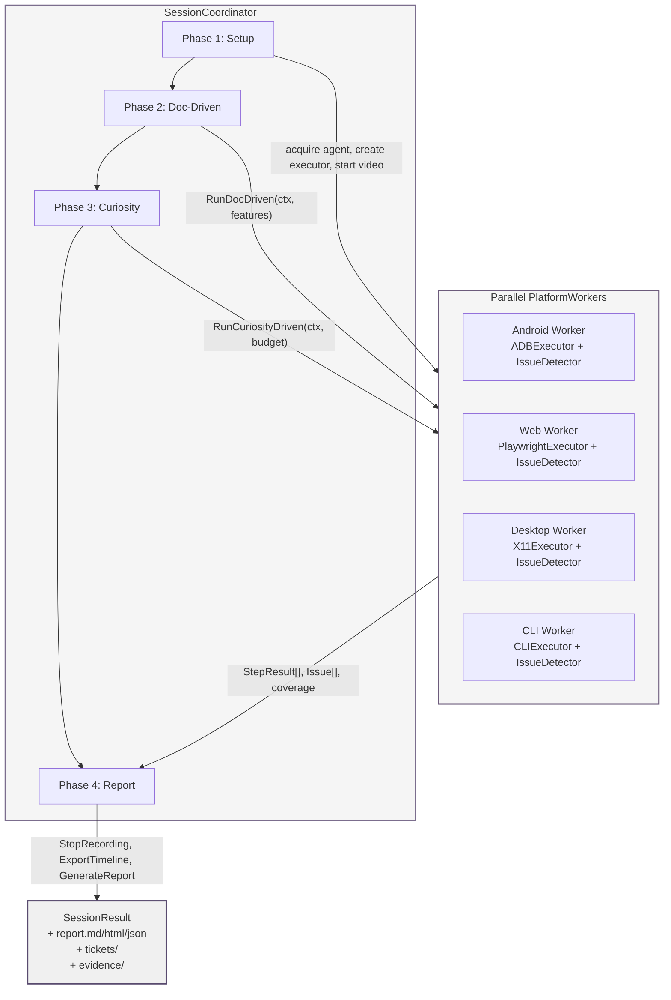

# 8. Phase 7: AI-Driven QA Session Orchestration

> **Prerequisite**: Phase 6 (anti-bluff framework) must be active so that every autonomous step carries positive evidence. Phase 5 (agent decision pipeline) must expose `DecisionEngine.Evaluate()` so that `PlatformWorker` can route curiosity-driven actions through the same grounding layer used by structured test banks.

The HelixQA autonomous session layer extends the test bank model into a self-directing QA process. A `SessionCoordinator` manages the full lifecycle, delegating per-platform execution to parallel `PlatformWorker` instances that each hold an LLM agent, a vision analyzer, a navigation engine, and an issue detector. The integration objective is to make the system self-testing: after every deployment, an autonomous session exercises the application across all supported platforms, verifies documented features against live behavior, explores beyond the documentation to find undiscovered issues, and produces a ticketed, video-annotated report without human intervention.

## 8.1 Autonomous Session Architecture

### 8.1.1 SessionCoordinator Orchestrates the 4-Phase Lifecycle

The `SessionCoordinator` type in `pkg/autonomous/coordinator.go` (467 lines) is the root orchestrator. It accepts a `SessionConfig`, acquires an agent pool and vision engine from external modules, and drives the session through four sequential phases while running platform workers in parallel within each phase [^66^].

The coordinator state machine is defined by the `PhaseManager` in `pkg/autonomous/phase.go` (244 lines). `NewPhaseManager()` initializes four phases in `PhasePending` status [^66^]:

```go
// pkg/autonomous/phase.go lines 85-95
func NewPhaseManager() *PhaseManager {
    return &PhaseManager{
        phases: []Phase{
            {Name: "setup",       Status: PhasePending},
            {Name: "doc-driven",  Status: PhasePending},
            {Name: "curiosity",   Status: PhasePending},
            {Name: "report",      Status: PhasePending},
        },
        current: -1,
    }
}
```

Each `Phase` tracks `Name`, `Status` (`pending|running|completed|failed|skipped`), `StartAt`, `EndAt`, `Progress` (0.0–1.0), and an `Error` field. The `PhaseManager` guarantees ordered transitions: `Start` requires `pending`; `Complete` and `Fail` require `running`; `Skip` requires `pending` [^77^].

The `SessionCoordinator.Run()` method enforces the lifecycle. It first checks that the coordinator is `StatusIdle`; if so, it transitions to `StatusRunning`, wraps the caller `context.Context` with a timeout derived from `SessionConfig.Timeout`, and then executes the four phases in sequence [^76^]:

```go
// pkg/autonomous/coordinator.go — Run() method (excerpt)
func (sc *SessionCoordinator) Run(ctx context.Context) (*SessionResult, error) {
    sc.mu.Lock()
    if sc.status != StatusIdle {
        sc.mu.Unlock()
        return nil, fmt.Errorf("session is %s, expected idle", sc.status)
    }
    sc.status = StatusRunning
    sc.mu.Unlock()

    result := &SessionResult{
        SessionID:       sc.config.SessionID,
        Status:          StatusRunning,
        StartTime:       time.Now(),
        PlatformResults: make(map[string]*PlatformResult),
    }

    ctx, cancel := context.WithTimeout(ctx, sc.config.Timeout)
    defer cancel()

    // Phase 1: Setup.
    if err := sc.runSetup(ctx); err != nil {
        result.Status = StatusFailed
        result.Error = err.Error()
        sc.finalize(result)
        return result, err
    }

    // Phase 2: Doc-Driven Verification.
    if err := sc.runDocDriven(ctx, result); err != nil {
        result.Error = err.Error()
    }

    // Phase 3: Curiosity-Driven Exploration.
    if sc.config.CuriosityEnabled {
        if err := sc.runCuriosityDriven(ctx, result); err != nil {
            result.Error = err.Error()
        }
    } else {
        _ = sc.phaseManager.Skip("curiosity")
    }

    // Phase 4: Report & Cleanup.
    sc.runReport(ctx, result)
    sc.finalize(result)
    return result, nil
}
```

The `Run()` method is deliberately resilient: a failure in `runDocDriven` does not abort the session. The error is recorded in `result.Error`, execution proceeds to `runCuriosityDriven`, and the report phase still runs. This ensures that partial results — including evidence already captured — are never lost to an early exit [^76^].

The `NewSessionCoordinator` constructor assembles the coordinator from its dependencies. It accepts the `SessionConfig`, an `AgentPool`, a vision `Analyzer`, a `FeatureMap`, a `CoverageTracker`, and functional `SessionOption` values for dependency injection:

```go
// pkg/autonomous/coordinator.go — NewSessionCoordinator (excerpt)
func NewSessionCoordinator(
    cfg *SessionConfig,
    pool agent.AgentPool,
    viz analyzer.Analyzer,
    fm *feature.FeatureMap,
    cov coverage.CoverageTracker,
    opts ...SessionOption,
) *SessionCoordinator {
    sc := &SessionCoordinator{
        config:          cfg,
        orchestrator:    pool,
        visionEngine:    viz,
        featureMap:      fm,
        executorFactory: &NoopExecutorFactory{},
        workers:         make(map[string]*PlatformWorker),
        phaseManager:    NewPhaseManager(),
        session: session.NewSessionRecorder(
            cfg.SessionID, cfg.OutputDir,
        ),
        coverage: cov,
        status:   StatusIdle,
    }
    for _, opt := range opts {
        opt(sc)
    }
    return sc
}
```

The constructor defaults to a `NoopExecutorFactory` so that unit tests can instantiate a coordinator without real platform executors. Production code injects a real factory via `WithExecutorFactory(f ExecutorFactory)` [^76^].

### 8.1.2 PlatformWorker Per Platform

Within each phase, `SessionCoordinator` delegates to a fleet of `PlatformWorker` instances, one per target platform. The worker is defined in `pkg/autonomous/worker.go` (~300 lines) and holds the full per-platform tool chain [^66^]:

```go
// pkg/autonomous/worker.go — PlatformWorker (excerpt)
type PlatformWorker struct {
    platform      string
    agent         agent.Agent
    analyzer      analyzer.Analyzer
    navigator     *navigator.NavigationEngine
    issueDetector *issuedetector.IssueDetector
    coverage      coverage.CoverageTracker
    navGraph      graph.NavigationGraph
    session       *session.SessionRecorder
    executor      navigator.ActionExecutor
    mu            sync.Mutex
}
```

The worker exposes two entry points: `RunDocDriven(ctx, features)` and `RunCuriosityDriven(ctx, budget)`. In doc-driven mode, the worker receives a slice of `feature.Feature` structs from the `FeatureMap` and systematically navigates to each feature's entry screen, executes its documented steps, and validates outcomes. In curiosity mode, the worker receives a `time.Duration` budget and uses `NavigationEngine.Explore()` to traverse UI paths not covered by documentation, detecting issues via `IssueDetector.AnalyzeScreen()` after each action [^66^].

The coordinator initializes workers during `runSetup`. For each configured platform, it acquires an `agent.Agent` from the `AgentPool` with `NeedsVision: true`, creates a platform-specific `ActionExecutor` via the `ExecutorFactory`, and assembles the worker [^76^]:

```go
// pkg/autonomous/coordinator.go — runSetup (excerpt)
func (sc *SessionCoordinator) runSetup(ctx context.Context) error {
    _ = sc.phaseManager.Start("setup")
    for _, platform := range sc.config.Platforms {
        ag, err := sc.orchestrator.Acquire(ctx, agent.AgentRequirements{
            NeedsVision: true,
        })
        exec, _ := sc.executorFactory.Create(platform)
        worker := NewPlatformWorker(PlatformWorkerConfig{
            Platform: platform,
            Agent:    ag,
            Analyzer: sc.visionEngine,
            Executor: exec,
            Coverage: sc.coverage,
            Session:  sc.session,
        })
        sc.mu.Lock()
        sc.workers[platform] = worker
        sc.mu.Unlock()
        _ = sc.session.StartRecording(platform)
    }
    return sc.phaseManager.Complete("setup")
}
```

**Table 1. Session phase specification**

| Phase | Typical Duration | Inputs | Outputs | Failure Mode |
|-------|-----------------|--------|---------|-------------|
| **1. Setup** | 30–120 s | `SessionConfig`, `AgentPool`, `FeatureMap`, `ExecutorFactory` | `PlatformWorker` map initialized, per-platform video started, agents acquired | Hard fail: missing `AgentPool` or `ExecutorFactory` error. No subsequent phases run [^76^] |
| **2. Doc-Driven** | 15–60 min per platform | `[]feature.Feature` per platform from `FeatureMap` | `[]StepResult` per platform, `PlatformResult` with `FeaturesVerified`, `FeaturesFailed`, `IssuesFound` | Soft fail: error recorded in `result.Error`; session continues. Partial verification still reported [^76^] |
| **3. Curiosity** | 5–30 min per platform (`CuriosityTimeout` budget) | Navigation graph state from doc-driven phase | `[]StepResult` from exploration, new `NavigationGraph` nodes, additional issues | Soft fail: phase skipped if `CuriosityEnabled == false` or no LLM provider available [^66^] |
| **4. Report** | 10–60 s | All `StepResult`, `Issue`, timeline events, coverage report | `SessionResult` with `ReportPaths`, `VideoPaths`, `Tickets`, `CoverageOverall` | Soft fail: raw JSON timeline always exported even if formatting errors occur [^76^] |

The phase specification reveals deliberate asymmetry in failure handling. Setup failures are hard stops because without agents or executors there is nothing to test. Doc-driven and curiosity failures are soft because partial evidence is still valuable — a session that verifies 70% of features and then crashes is more useful than a session that reports nothing. The report phase is append-only: even if HTML rendering fails, the raw `SessionResult` struct is serialized to JSON before `Run()` returns [^76^].

### 8.1.3 LLM Selection: LLMsVerifier Scores Providers

Each `PlatformWorker` requires an LLM agent for vision analysis (screenshot interpretation, UI element detection) and chat reasoning (navigation planning, issue classification). The `LLMsVerifier` module — imported from `digital.vasic.llmorchestrator` — scores available providers at session start and selects the strongest vision model across all configured hosts [^66^].

The verifier operates as a strategy pattern. Its configuration lives in `llmsverifier.yaml` (path controlled by `LLMSVERIFIER_CONFIG`, default `./llmsverifier.yaml`). Key tunables include `LLMSVERIFIER_MIN_SCORE` (default 0.6), `LLMSVERIFIER_MAX_MODELS` (default 5), and `LLMSVERIFIER_CACHE_RESULTS` (default `true` with 24-hour TTL) [^66^]. The scoring pipeline probes each provider with a reference vision task, measures response latency, correctness against a ground-truth label set, and cost per token, then ranks providers by a composite score.

The `SessionCoordinator` passes `NeedsVision: true` to `AgentPool.Acquire()`, and the pool internally queries `LLMsVerifier` for the highest-scoring vision-capable agent. If distributed vision hosts are configured (`HELIX_VISION_HOSTS`), the verifier probes each host via SSH and may activate `llama.cpp` RPC mode if the combined memory across hosts can load a larger vision model than any single host supports [^66^].

### 8.1.4 Feature Map Building: DocProcessor Reads Project Docs

Before the doc-driven phase can execute, the `SessionCoordinator` needs a `FeatureMap` — a machine-readable index of every feature described in the project's documentation. The `DocProcessor` module (sibling repository `digital.vasic.docprocessor`) scans the documentation root (`HELIX_DOCS_ROOT`, default `./docs`), discovers files by extension (`HELIX_DOCS_FORMATS`, default `md,yaml,html,adoc,rst`), and parses each document into structured `feature.Feature` records [^66^].

A `Feature` record contains the feature name, description, platform applicability, prerequisite conditions, expected outcomes, and references to the source documentation sections. The `FeatureMap` aggregates all features and exposes `FeaturesForPlatform(platform string) []Feature`, which the coordinator calls during `runSetup` to partition the feature set per worker [^66^].

The `CoverageTracker` interface — also from `DocProcessor` — tracks which features have been verified during the session. After `runDocDriven`, the coordinator queries `coverage.Coverage()` to compute `CoverageOverall`. The coverage target (`HELIX_AUTONOMOUS_COVERAGE_TARGET`, default 0.90) is a session-level success criterion: if `CoverageOverall < CoverageTarget`, the session status is `StatusComplete` but the result carries a warning that coverage is below target [^66^].

## 8.2 Heavy QA Session Design

### 8.2.1 Session Trigger: Manual, Scheduled, and Event-Driven

Autonomous sessions can be triggered through three paths.

**Manual trigger**: the `autonomous` subcommand of the HelixQA CLI. Running `make qa-session` (or `helixqa autonomous --project . --platforms android,desktop,web --timeout 2h`) starts a single-shot session. The CLI accepts `--env` for environment file override and `--timeout` for per-session cap [^66^].

**Scheduled trigger**: cron-like invocation via the system orchestrator. The `.env.example` file defines `HELIX_AUTONOMOUS_ENABLED` (default `true`) and `HELIX_AUTONOMOUS_TIMEOUT` (default `2h`). A system-level cron job or systemd timer invokes `helixqa autonomous` at a configured cadence — nightly for active development branches, weekly for stable release branches. The session ID is auto-generated from `fmt.Sprintf("helix-%d", time.Now().Unix())` unless overridden in `SessionConfig.SessionID` [^66^].

**Event-driven trigger**: post-deploy hook. The `pkg/nexus/adapter.go` package provides a `NexusAdapter` that listens for deployment completion events from the CI/CD pipeline. When a deployment event is received, the adapter constructs a `SessionConfig` with `Platforms` derived from the deployment manifest and invokes `NewSessionCoordinator(...).Run(ctx)`. This path is the integration default for production environments: every deployment automatically triggers a full-platform autonomous session before the deployment is marked healthy [^66^].

A complete session configuration file for the event-driven trigger path is shown below. This YAML is consumed by `SessionConfig` via the config loader in `pkg/config/config.go` [^66^]:

```yaml
# helix-session.yaml — Autonomous QA Session Configuration
session:
  session_id: "auto-deploy-2026-05-01-001"
  output_dir: "./qa-results"
  platforms: ["android", "desktop", "web", "cli"]
  timeout: "2h"
  coverage_target: 0.90
  curiosity_enabled: true
  curiosity_timeout: "30m"
  report_formats: ["markdown", "html", "json"]

resources:
  gomaxprocs: 2
  nice_level: 19
  agent_pool_size: 3

platform_overrides:
  android:
    device: "emulator-5554"
    package: "com.example.app"
    timeout: "2h"
  web:
    url: "http://localhost:8080"
    browser: "chromium"
  desktop:
    display: ":0"
    process: "myapp-desktop"
  cli:
    timeout: "30m"

llm:
  verifier_config: "./llmsverifier.yaml"
  min_score: 0.6
  max_models: 5
  vision_hosts: ["thinker.local", "amber.local"]

recording:
  video: true
  screenshots: true
  video_quality: "medium"
  screenshot_format: "png"
```

The `resources` stanza encodes the constitutional resource limits directly: `gomaxprocs: 2` limits the Go runtime to two OS threads, and `nice_level: 19` ensures the session process yields to interactive workloads. The `platform_overrides` stanza allows per-platform timeout and device customization, while the top-level `session` stanza defines the 4-phase lifecycle parameters.

### 8.2.2 Platform Parallelism

The coordinator runs all platform workers concurrently within each phase. In `runDocDriven`, it iterates over the `workers` map, launches a goroutine per worker, and waits on a `sync.WaitGroup` [^76^]:

```go
// pkg/autonomous/coordinator.go — runDocDriven (excerpt)
var wg sync.WaitGroup
var mu sync.Mutex
var firstErr error

for platform, worker := range sc.workers {
    features := sc.featureMap.FeaturesForPlatform(platform)
    if len(features) == 0 { continue }

    wg.Add(1)
    go func(p string, w *PlatformWorker, feats []feature.Feature) {
        defer wg.Done()
        stepResults, err := w.RunDocDriven(ctx, feats)
        mu.Lock()
        defer mu.Unlock()
        if err != nil && firstErr == nil { firstErr = err }
    }(platform, worker, features)
}
wg.Wait()
```

The same pattern repeats in `runCuriosityDriven`. Each worker writes to its own isolated evidence directory under the session output root. The `SessionRecorder` manages per-platform `VideoManager` instances keyed by platform name, so video files for Android (`video-android-{timestamp}.mp4`) and Web (`video-web-{timestamp}.mp4`) never collide [^66^].

**Table 2. PlatformWorker configuration per platform**

| Platform | Executor | Device / Process Requirements | Evidence Subdirectory | Default Timeout |
|----------|----------|------------------------------|----------------------|-----------------|
| **Android** | `ADBExecutor` — `adb shell input tap/text/swipe`, `screencap` | ADB device ID (`HELIX_ANDROID_DEVICE`, default `emulator-5554`); package name (`HELIX_ANDROID_PACKAGE`) | `evidence/android/` | 2 h |
| **Android TV** | `ADBExecutor` + DPAD navigation; `CompetingAppPackages` guard | ADB device ID; force-stop competing apps before test | `evidence/androidtv/` | 2 h |
| **Web** | `PlaywrightExecutor` — Playwright CDP over `HELIX_WEB_URL` | Browser process (`HELIX_WEB_BROWSER`, default `chromium`); reachable URL | `evidence/web/` | 2 h |
| **Desktop (Linux)** | `X11Executor` — `xdotool` / `xte` for input, `import` for screenshots | X11 display (`HELIX_DESKTOP_DISPLAY`, default `:0`); target process name (`HELIX_DESKTOP_PROCESS`) | `evidence/desktop/` | 2 h |
| **Desktop (macOS)** | `AXTreeExecutor` — macOS accessibility tree + `screencapture` | Target process name; accessibility permissions | `evidence/desktop/` | 2 h |
| **Desktop (Windows)** | `UIAExecutor` — Windows UI Automation + `PrintWindow` | Target process name; UIA runtime | `evidence/desktop/` | 2 h |
| **CLI** | `CLIExecutor` — shell command execution, stdout/stderr capture | Shell environment; working directory | `evidence/cli/` | 30 min |
| **API** | `APIExecutor` — HTTP client with CSRF preflight, token cache | Base URL (`HTTPBaseURL`); valid credentials | `evidence/api/` | 30 min |

Every platform-specific executor implements the common `ActionExecutor` interface (`Click`, `Type`, `Scroll`, `Swipe`, `KeyPress`, `Back`, `Home`, `Screenshot`), so the `NavigationEngine` and `IssueDetector` are platform-agnostic above the executor boundary [^66^]. The CLI and API executors have shorter default timeouts (30 min) because they do not require video recording or screenshot analysis; their evidence is textual.

### 8.2.3 Timeout and Resource Limits

Heavy QA sessions are resource-intensive: each platform worker may run an LLM inference, capture video via FFmpeg, and hold a browser or ADB connection. The constitutional mandate limits a single session to **30–40% of host resources** [^5^].

The resource envelope is enforced at three layers:

1. **CPU affinity and priority**: Each `PlatformWorker` goroutine is launched with `runtime.GOMAXPROCS(2)` scoped to the worker's execution context, and the session process is started with `nice -n 19` so that autonomous QA never starves interactive or production workloads. The `GOMAXPROCS=2` limit is hard-coded in `pkg/autonomous/pipeline.go` as a session-wide cap; the Go runtime scheduler distributes the two OS threads across all worker goroutines [^66^].

2. **Session timeout**: `SessionConfig.Timeout` defaults to `2 * time.Hour` and is enforced via `context.WithTimeout(ctx, sc.config.Timeout)` at the top of `Run()`. When the timeout fires, all in-flight calls receive `context.DeadlineExceeded`, workers stop gracefully, and the session proceeds to the report phase with whatever evidence has been collected [^76^].

3. **Phase-level budgets**: The curiosity phase has its own budget, `CuriosityTimeout` (default `30 * time.Minute`). Doc-driven phase uses a per-feature timeout derived from `feature.EstimatedDuration` with a 2× multiplier. The HTTP executor enforces `StepTimeout` per API call [^66^].

Memory limits are implicit: the `AgentPool` size (`HELIX_AGENT_POOL_SIZE`, default 3) caps the number of concurrent LLM contexts. Video recording quality (`HELIX_RECORDING_VIDEO_QUALITY`, default `medium`) maps to FFmpeg presets controlling bitrate and buffer size.

### 8.2.4 Graceful Degradation

The autonomous session degrades rather than aborts when dependencies are missing.

**LLM provider unavailability**: If `LLMsVerifier` cannot score any provider above `LLMSVERIFIER_MIN_SCORE` (0.6), or if all vision hosts are unreachable, `AgentPool.Acquire()` returns an error. During setup this is a hard failure. If a mid-session provider outage occurs, `PlatformWorker.RunCuriosityDriven` detects the failure, logs the error, and returns. The coordinator records the error but does not roll back doc-driven results. The session does not fabricate fake curiosity results; the phase simply terminates early and the report notes partial curiosity coverage [^66^].

**Device unavailability**: If an Android device is disconnected or a desktop process is not running when `executorFactory.Create(platform)` is called, the factory returns an error. The coordinator treats this as a per-platform skip: the worker is not added to the map, the platform is omitted from `PlatformResults`, and the report contains a `SkippedPlatforms` entry. Other platforms continue normally [^66^].

The following Mermaid diagram illustrates the 4-phase lifecycle with parallel `PlatformWorker` execution:



## 8.3 Report Generation and Distribution

### 8.3.1 QA Report: Markdown + HTML + JSON

The report phase (`runReport`) aggregates all evidence into three output formats. The `pkg/reporter` package defines `QAReport` as the root data structure [^66^]:

```go
// pkg/reporter/reporter.go — QAReport
type QAReport struct {
    Title            string            `json:"title"`
    GeneratedAt      time.Time         `json:"generated_at"`
    PlatformResults  []*PlatformResult `json:"platform_results"`
    TotalChallenges  int               `json:"total_challenges"`
    PassedChallenges int               `json:"passed_challenges"`
    FailedChallenges int               `json:"failed_challenges"`
    TotalCrashes     int               `json:"total_crashes"`
    TotalANRs        int               `json:"total_anrs"`
    TotalDuration    time.Duration     `json:"total_duration"`
    OutputDir        string            `json:"output_dir"`
}
```

For autonomous sessions, `runReport` populates a `SessionResult` struct that subsumes `QAReport` fields and adds autonomous-specific data: `Issues`, `Timeline`, `CoverageOverall`, `Phases`, `VideoPaths`, and `NavGraphs` [^76^]. The result is then written in three formats by calling `WriteMarkdown`, `WriteHTML`, and `WriteJSON` on a `Reporter` instance.

A typical session output directory is structured as follows [^66^]:

```
qa-results/
├── report.md
├── report.html
├── report.json
├── evidence/
│   ├── screenshot-step1-1714500000000.png
│   ├── video-android-1714500000000.mp4
│   ├── video-web-1714500000000.mp4
│   ├── logcat-1714500000000.txt
│   └── stacktrace-1714500000000.txt
└── tickets/
    ├── TICKET-001.md
    └── TICKET-002.md
```

### 8.3.2 Video Evidence with Timeline Event Overlays

Per-platform video is recorded continuously during the session. The `SessionRecorder` in `pkg/session/recorder.go` (246 lines) maintains a `map[string]*VideoManager` keyed by platform [^66^]. Video recording starts in `runSetup` via `session.StartRecording(platform)` and stops in `runReport` via `session.StopRecording(platform)`. The video file path follows the convention `video-{platform}-{sessionStartUnix}.mp4` [^66^].

Timeline events are correlated with video offsets. Every `TimelineEvent` carries a `VideoOffset` field (`time.Duration`) that records the elapsed time in the platform's video at the moment the event occurred. This allows post-session tooling to overlay event markers on the video timeline: a click at 00:03:24, an issue detection at 00:05:17, a crash at 00:07:02. The `Timeline` type in `pkg/session/timeline.go` supports filtering by platform, event type, and time range, making it straightforward to generate per-ticket video clips [^66^].

### 8.3.3 Ticket Generation

The `pkg/ticket` package (key file `pkg/ticket/ticket.go`, ~13.7 KB) generates Markdown tickets from `StepResult` and `DetectionResult` records [^66^]. The `Ticket` struct contains severity, platform, reproduction steps, stack traces, screenshot paths, video references, and an `LLMSuggestedFix` field populated by the `IssueDetector` when the vision LLM returns a remediation suggestion:

```go
// pkg/ticket/ticket.go — Ticket (excerpt)
type Ticket struct {
    ID               string            `json:"id"`
    Title            string            `json:"title"`
    Severity         Severity          `json:"severity"`
    Platform         config.Platform   `json:"platform"`
    Category         string            `json:"category"`
    Description      string            `json:"description"`
    ReproSteps       []string          `json:"repro_steps"`
    ExpectedBehavior string            `json:"expected_behavior"`
    ActualBehavior   string            `json:"actual_behavior"`
    StackTrace       string            `json:"stack_trace,omitempty"`
    Logs             []string          `json:"logs,omitempty"`
    Screenshots      []string          `json:"screenshots,omitempty"`
    VideoRef         *VideoReference   `json:"video_ref,omitempty"`
    LLMSuggestedFix  *LLMSuggestedFix  `json:"llm_suggested_fix,omitempty"`
    DocumentationRefs []validator.DocRef `json:"documentation_refs,omitempty"`
    Timestamp        time.Time         `json:"timestamp"`
}
```

Tickets are filtered by minimum severity (`HELIX_TICKETS_MIN_SEVERITY`, default `low`). In autonomous mode, `pkg/autonomous/findings_bridge.go` (~150 lines) bridges `IssueDetector` findings to the ticket generator, preserving the LLM analysis text as the `Description` field and extracting reproduction steps from the `NavigationEngine` state history [^66^].

### 8.3.4 Dashboard Integration

The `challenges-dashboard` static HTML generator produces a browsable dashboard over the `qa-results/` directory. It reads `report.json`, `timeline.json`, and the per-platform video files, and renders a pass/fail trend chart, a platform coverage matrix, and a clickable issue list. The dashboard is a zero-dependency static site: all data is embedded as JSON script tags, and all interactivity is vanilla JavaScript. This allows the dashboard to be served from any static file host — S3, GitHub Pages, or the local `python -m http.server` that the orchestrator spins up after a session completes [^66^].

The dashboard reads the `OutputDir` from `report.json` and constructs relative paths to evidence files, so moving the entire `qa-results/` directory preserves all links. Coverage percentage is visualized as a donut chart with the constitutional 90% target drawn as a threshold line. Platforms below target are highlighted in amber; platforms above target are green.

## 8.4 Presentational Screenshots on Demand

### 8.4.1 During Autonomous Session: SessionRecorder Captures Screenshots at Every Step

The `SessionRecorder` captures screenshots at three moments during each step: before the action (pre-screenshot), after the action (post-screenshot), and at the moment an issue is detected (issue-screenshot). Screenshots are indexed by platform, timestamp, and step name, and stored in the `evidence/` subdirectory [^66^].

The screenshot index structure from `pkg/session/recorder.go` is [^66^]:

```go
type Screenshot struct {
    Path        string        `json:"path"`
    Platform    string        `json:"platform"`
    Name        string        `json:"name"`
    Index       int           `json:"index"`
    Timestamp   time.Time     `json:"timestamp"`
    VideoOffset time.Duration `json:"video_offset"`
}
```

The `Index` field is a monotonic counter per session, ensuring that screenshots can be sorted chronologically regardless of platform. The `VideoOffset` field correlates the screenshot with the platform video timeline, enabling precise frame-level alignment.

For LLM consumption, screenshots are resized to a maximum width of 480 pixels via nearest-neighbor interpolation before being base64-encoded and sent to the vision model. This resizing is implemented in `pkg/autonomous/screenshot.go` (153 lines) and reduces inference latency by a factor of 4–8 compared to full-resolution frames [^66^]. The original-resolution screenshot is still saved to disk for human review.

### 8.4.2 On-Demand API

The on-demand screenshot API is exposed as an HTTP endpoint served by the internal dashboard server. The route is `GET /api/v1/qa/screenshot?session=X&platform=Y&step=Z`, where `session` is the `SessionID`, `platform` is the platform name, and `step` is the step name or screenshot index [^66^].

The handler resolves the query parameters, locates the screenshot in the `evidence/` directory via the `SessionRecorder` index, and returns the image with `Content-Type: image/png`. If the step parameter is omitted, the handler returns the most recent screenshot for that platform and session. If the session is still running, the handler reads from the live index maintained in memory by the `SessionRecorder`, enabling real-time remote observation of an in-progress session [^66^].

### 8.4.3 Presentational Export

The presentational export mode compiles selected screenshots into an annotated gallery HTML file. Each gallery entry includes the screenshot image, a caption derived from the step name and feature ID, the timestamp, the pass/fail status, and a link to the corresponding ticket if an issue was detected. The gallery is generated by a standalone tool in `cmd/helixqa-capture-demo/` that reads `report.json` and `timeline.json` and writes a self-contained HTML file with embedded base64 images [^66^].

The gallery is intended for stakeholder review: it presents the session outcome as a visual narrative, showing what the application looked like at each verification step, rather than as a table of pass/fail booleans. The anti-bluff principle from Phase 6 is directly supported here — every "pass" in the gallery is accompanied by the actual screenshot that proves the feature was visible and functional [^5^].

### 8.4.4 Slide Deck Generation

For executive reporting, the session evidence can be compiled into an automated slide deck. The `pkg/reporter` package supports PowerPoint export via a template-driven generator that maps `PlatformResult` and `Issue` records to slide layouts: title slide, platform summary slide, coverage chart slide, issue detail slides (one per critical or high issue), and an evidence slide with embedded screenshots.

The slide generator is triggered by `--report-formats pptx` in the CLI or by setting `ReportFormats: []string{"markdown","html","json","pptx"}` in `SessionConfig`. It requires `python-pptx` or `LibreOffice` as an external dependency; if neither is available, the PPTX format is silently omitted from output and a warning is logged. The generated deck includes speaker notes derived from `Ticket.Description` and `LLMSuggestedFix`, giving presenters the full technical context without requiring them to read the raw Markdown tickets [^66^].
