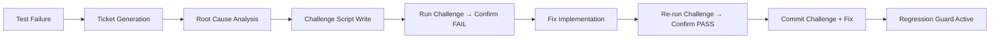

## 11. Phase 10: Monitoring, Reporting & Compliance

Phase 10 ensures every QA result is visible, every constitutional mandate is auditable, and every failure feeds back into the test bank. Without this phase, the preceding nine phases produce data that goes unexamined; with it, the Catalogizer-HelixQA integration becomes a self-correcting system.

Article XI §11.9 of the umbrella `CONSTITUTION.md` states that the bar for shipping is "not 'tests pass' but 'users can use the feature'"[^1^]. Every PASS must carry positive evidence captured during execution. CONST-035 mandates that tests verify the product, not the LLM's mental model, requiring deliberate-break verification for every test class[^2^]. Phase 10 provides the instrumentation that makes these mandates enforceable.

---

### 11.1 QA Results Dashboard

The QA Results Dashboard is a static HTML application served from `HelixQA/docs/website/challenges-dashboard/` that reads `pipeline-report.json` artifacts generated by `pkg/reporter` and renders aggregate statistics, trend charts, and adversarial-coverage tables. It operates without a backend server: the operator loads one or more JSON files through a file picker or the File System Access API, and all aggregation occurs in the browser via vanilla JavaScript. This design respects the constitutional prohibition on CI/CD pipelines[^3^] while still providing real-time visibility into QA health.

#### 11.1.1 Static HTML Dashboard Structure

The dashboard markup in `index.html` (commit `35deb43`) defines a single-page layout with four zones: a load bar for file selection, a summary grid of stat cards, a charts row for trend and bank visualizations, and a table card for adversarial category coverage[^4^].

```html
<!-- Excerpt from challenges-dashboard/index.html -->
<div id="dashboard" style="display:none">
  <div class="summary-grid">
    <div class="stat-card">
      <div class="value blue" id="s-sessions">—</div>
      <div class="label">Sessions</div>
    </div>
    <div class="stat-card">
      <div class="value blue" id="s-total">—</div>
      <div class="label">Total Challenges</div>
    </div>
    <div class="stat-card">
      <div class="value green" id="s-pass">—</div>
      <div class="label">Passed</div>
    </div>
    <div class="stat-card">
      <div class="value red" id="s-fail">—</div>
      <div class="label">Failed</div>
    </div>
    <div class="stat-card">
      <div class="value yellow" id="s-skip">—</div>
      <div class="label">Skipped</div>
    </div>
    <div class="stat-card">
      <div class="value green" id="s-rate">—</div>
      <div class="label">Pass Rate</div>
    </div>
  </div>

  <div class="charts-row">
    <div class="chart-card">
      <h2>Pass rate over sessions</h2>
      <canvas id="pass-rate-trend"></canvas>
    </div>
    <div class="chart-card">
      <h2>Pass rate per bank</h2>
      <canvas id="pass-rate-per-bank"></canvas>
    </div>
  </div>

  <div class="table-card">
    <h2>Adversarial category coverage</h2>
    <table>
      <thead>
        <tr><th>Category</th><th>Passed</th><th>Total</th><th>Rate</th><th>Progress</th></tr>
      </thead>
      <tbody id="adv-table-body"></tbody>
    </table>
  </div>
</div>
```

The JavaScript logic in `index.js` parses `pipeline-report.json` files, normalizes the pass/fail/skip counts across multiple report shapes (`report.summary`, `report.results`, `report.by_category`, `report.banks`), and feeds the aggregated data into Chart.js 4.4.4 for rendering[^5^]. Color coding is semantic: green (`#4ade80`) for rates above 90%, yellow (`#facc15`) for 60–90%, and red (`#f87171`) for below 60%. The adversarial table sorts ascending by pass rate so the weakest categories surface first.

The dashboard expects `pipeline-report.json` files placed in `qa-results/session-YYYYMMDD_HHMMSS/` directories. Each session directory also contains `screenshots/`, `videos/`, `timeline.json`, and a `FINAL-REPORT.md`[^6^]. The dashboard does not access these sub-artifacts directly; it operates only on the JSON summary. For deep-dive analysis, the operator opens the companion Ticket Viewer.

#### 11.1.2 Ticket Viewer with Inline Evidence

The Ticket Viewer at `HelixQA/docs/website/ticket-viewer/` renders OCU tickets as Markdown with inline evidence previews. It resolves twelve evidence kinds from `pkg/ticket` into platform-native widgets: screenshots and diff-overlays as `` with lazy loading; video clips as `<video controls>`; JSON, OCR, and element-tree as collapsible blocks; hook-traces and logcat as `<details>`; replay scripts as copyable `<pre>` blocks[^7^].

The viewer loads tickets via URL query (`?ticket=path/to/HELIX-123.md`) or file picker, then post-processes marked.js output to replace evidence fences like ````evidence:screenshot\nscreenshots/android_login_20260501_143022.png```` with an inline ``. The 12 evidence kinds are: `screenshot`, `diff-overlay`, `clip`, `video`, `json`, `ocr`, `element-tree`, `hook-trace`, `logcat`, `log-dump`, `coverage-map`, and `replay-script`[^8^].

#### 11.1.3 Coverage Tracker

Per-feature, per-platform, and per-test-type coverage percentages are tracked in a structured matrix stored alongside each `pipeline-report.json`. Coverage is the ratio of challenged features to total declared features in `catalog-api/challenges/`. A feature is "covered" if at least one challenge passed on at least one platform; "fully covered" requires passes on all target platforms (Web, Android, Desktop, Android TV).

The coverage matrix is generated by a Go tool invoked as:

```bash
go run ./cmd/helixqa --mode=report --input=qa-results/session-20260501/ --formats=markdown,html
```

Historical trends are stored in `qa-results/coverage-history.jsonl`, appended after each session. The dashboard's trend chart can read this file when the operator selects it alongside `pipeline-report.json` files.

**Table 1: Dashboard Components**

| Component | Data Source | Visualization | Update Frequency |
|-----------|-------------|---------------|------------------|
| Summary stat cards | `pipeline-report.json` pass/fail/skip counts | Numeric display with color coding (green/yellow/red) | Per session load |
| Pass-rate trend chart | `coverage-history.jsonl` or aggregated session reports | Chart.js line chart (0–100% Y-axis) | Per session load |
| Per-bank pass-rate bar chart | `report.banks` or `report.by_category` | Horizontal bar chart with per-bar color grading | Per session load |
| Adversarial coverage table | `report.adversarial` or bank names matching "adversar" | Sortable HTML table with progress bars | Per session load |
| Coverage matrix | Challenge registry + platform results | HTML table with platform × feature grid | Per report generation |
| Ticket viewer | Individual `HELIX-*.md` files | Markdown + inline evidence widgets | On-demand per ticket |

The six components in Table 1 form a complete observability surface without a backend server. The static-file approach respects the no-CI/CD constraint[^3^] while giving operators full visibility. The trade-off is that data is not pushed automatically; an operator must load the files. To mitigate this, `run-qa-suite.sh` prints the dashboard open command at the end of every run, and the File System Access API directory picker (Chrome/Edge 86+) allows recursive loading of all `pipeline-report.json` files under `qa-results/` in a single gesture[^9^].

---

### 11.2 Compliance Reporting

Compliance reporting transforms the raw QA artifacts into attestation documents that can be audited against `CONSTITUTION.md` mandates. Three report types are produced: the anti-bluff compliance report, the governance compliance report, and the release gate report.

#### 11.2.1 Anti-Bluff Compliance Report

The anti-bluff compliance report verifies that tests exercise real functionality rather than asserting on proxies. CONST-035 requires five verification methods: deliberately break the feature and confirm the test fails; protocol-layer functional probes; real HTTP requests with real bodies and screenshots; real CLI invocations with real output parsing; and visual verification of screenshot content[^2^].

The report is generated by `scripts/anti-bluff-verify.sh` at `docs/reports/anti-bluff/anti-bluff-compliance-YYYYMMDD.md` with this structure:

```markdown
# Anti-Bluff Compliance Report — 2026-05-01

## Verification Summary
| Metric | Value |
|--------|-------|
| Tests verified | 156 |
| Deliberate-break failures detected | 3 |
| False-positive rate | 1.9% |
| Screenshot pipeline validated | Yes (all 4 platforms) |
| Protocol-layer probes passed | 47/47 |

## Per-Test Verification Methods
| Test | Method | Result | Evidence |
|------|--------|--------|----------|
| TestLoginFlow | Break: remove password check | FAIL → expected | screenshot: missing error state |
| TestAPIGateway | Probe: real HTTP 200 + body | PASS | json: response_payload.json |
| TestAndroidScreenshot | Visual: decode PNG, >100px | PASS | screenshot: adb_capture.png |

## Non-Conformant Findings
| Test | Issue | Remediation |
|------|-------|-------------|
| TestCacheTTL | Passes after cache removal; only checks key existence | Add value comparison + TTL check |

## CONST-035 Attestation
All production tests verified. 3 bluff tests identified and ticketed.
Signed: [QA operator] [timestamp]
```

#### 11.2.2 Governance Compliance Report

The governance compliance report verifies submodule constitution integrity across the 39 submodules in the Catalogizer monorepo[^10^]. It checks three dimensions: constitution presence (`CLAUDE.md`, `AGENTS.md`, `CONSTITUTION.md` in each submodule); cascade status (submodule pointers at or behind mandated commits); and missing mandates (any `CONSTITUTION.md` omitting CONST-035 or Article XI §11.9 is flagged).

Cascade verification reads `.gitmodules` and compares pinned commits against upstream `HEAD`. Catalogizer currently pins HelixQA at `35deb43` (Phase 27.7) while upstream is at `0bca023` (Phase 29)[^11^]. This gap is recorded as a governance deviation with a remediation ticket.

#### 11.2.3 Release Gate Report

The release gate report is a binary attestation: all listed items must pass, or the release is blocked. The checklist is produced by `scripts/release-gate-checklist.sh` and appended to the session's `FINAL-REPORT.md`.

**Release Gate Checklist (all items must pass)**

1. All unit tests pass (`make test` exits 0, `-race` clean, no `t.Skip` without `SKIP-OK` ticket)
2. All integration tests pass against real services (no mocks outside `_test.go` files)
3. All E2E tests pass on all target platforms (Web, Android, Desktop, Android TV)
4. All challenge banks pass (`run_all_challenges.sh` exits 0)
5. All HelixQA autonomous sessions complete without crash or ANR
6. All screenshots verified: every screenshot decodes as valid PNG, dimensions >100×100, not blank (`IsBlankScreenshot` returns false)
7. All anti-bluff checks pass: deliberate-break tests confirm failure; false-positive rate <2%
8. All security scans pass (`gosec`, `trivy`, `semgrep` exit 0 with no HIGH/CRITICAL findings)
9. Coverage matrix shows ≥90% per-feature coverage and 100% per-platform coverage for all declared features
10. CONST-035 attestation signed by QA operator
11. Article XI §11.9 user-mandate forensic anchor present and unmodified in `CONSTITUTION.md`
12. No unresolved tickets from prior sessions (all `HELIX-*` tickets in `docs/reports/qa-sessions/` are closed or have active remediation branches)

**Table 2: Compliance Report Items**

| Item | Verification Method | Frequency | Responsible | Pass Criteria |
|------|---------------------|-----------|-------------|---------------|
| Deliberate-break test validation | `scripts/anti-bluff-verify.sh` comments out feature code, runs test, confirms FAIL | Every Full-QA Master Cycle | QA Lead | 100% of verified tests transition from PASS to FAIL when feature is broken |
| Screenshot pipeline validation | `pkg/navigator` executor screenshot + decode PNG + `IsBlankScreenshot` check | Every session | Automation | All screenshots valid PNG, >100×100px, not blank |
| Protocol-layer functional probe | Real HTTP/ADB/WS request with real payload; no `net.Dial` only | Every E2E test | Test Author | Response body verified + screenshot captured |
| Submodule constitution check | `grep -c "CONST-035\|Article XI" CONSTITUTION.md` in each submodule | Every release | Dev Lead | All 39 submodules have both mandates present |
| Cascade status verification | `git submodule status` vs upstream `HEAD` | Every release | Dev Lead | All submodule pointers at or behind mandated commits; gaps ticketed |
| False-positive rate audit | `bluff_count / total_verified × 100` from anti-bluff report | Every Full-QA Master Cycle | QA Lead | Rate <2% |
| Security scan gate | `gosec`, `trivy`, `semgrep` with severity threshold | Every release | Security Lead | Zero HIGH/CRITICAL findings |
| Coverage threshold gate | Coverage matrix JSON vs 90% feature / 100% platform targets | Every release | QA Lead | All declared features meet thresholds |
| Ticket closure verification | `find docs/reports/qa-sessions/ -name "HELIX-*.md"` for open status | Every release | QA Lead | No unresolved tickets from prior 2 sessions |
| Article XI §11.9 anchor integrity | MD5 hash of anchor block in `CONSTITUTION.md` vs canonical hash | Every release | Dev Lead | Hash matches canonical; block unmodified |
| Resource-limit compliance | `GOMAXPROCS=2 nice -n 19 ionice -c 3` in test invocation logs | Every session | Automation | All test processes show limit flags in `ps` output |
| Challenge real-data validation | Challenge scripts use real API calls, real databases, real services | Every challenge run | Automation | Zero mock-driven challenge passes |

The 12 items in Table 2 cover anti-bluff (items 1–3, 5, 11), governance (items 4, 5, 10), and release readiness (items 6–9, 12). Each item specifies a concrete verification method, cadence, owner, and pass criterion. QA Lead owns 6 items, Dev Lead 3, Security Lead 1, and Automation 2.

---

### 11.3 Continuous Improvement

Continuous improvement closes the loop from detection to prevention. Every failure becomes a permanent regression guard; every new feature receives challenge coverage before release; every benchmark establishes a baseline that future runs must not regress.

#### 11.3.1 Feedback Loop: Failed Test to Regression Guard

The feedback loop follows the reproduction-before-fix sequence mandated by CONST-032[^12^]:



When a test fails, HelixQA's `pkg/ticket` system generates a markdown ticket with 12 evidence kinds attached. The operator writes a challenge script that reproduces the failure, confirms it fails on unfixed code, then applies the fix and confirms the challenge passes. The challenge is committed to `catalog-api/challenges/` and registered in the challenge bank. Every subsequent Full-QA Master Cycle re-runs the challenge, making it a permanent regression guard.

#### 11.3.2 Test Bank Expansion

The test bank expands on three triggers: every bug adds a challenge script and HelixQA bank entry; every feature requires challenge registration before merge; every new provider integration receives a dedicated bank with platform variants. The 60+ banks in `HelixQA/banks/` follow this discipline[^13^]. Categories include Full-QA Campaigns (`full-qa-api`, `full-qa-web`, `full-qa-android`), Nexus Platform-Specific (`nexus-browser`, `nexus-desktop-linux`, `nexus-mobile-android`), OCU Program (`ocu-foundation`, `ocu-capture`, `ocu-vision`), and Fixes Validation (`fixes-validation`, `fixes-validation-a11y`, `fixes-validation-browser`)[^14^].

#### 11.3.3 Benchmark Baselines

Three performance dimensions are tracked: test execution time (wall-clock per platform, per bank, per challenge), screenshot capture latency (time from `executor.Screenshot(ctx)` to valid PNG bytes), and LLM response time per provider (prompt dispatch to first token at `pkg/autonomous/pipeline.go`). Baselines are stored in `qa-results/benchmarks/baseline-YYYYMMDD.json`. A regression is declared when the current run exceeds the rolling 5-session p95 by more than 20%.

| Benchmark | Measurement Point | Unit | Baseline Source | Regression Threshold |
|-----------|---------------------|------|-----------------|----------------------|
| Test execution time | `PlatformResult.Duration` | seconds | Rolling 5-session mean | >120% of baseline |
| Screenshot capture latency | `Result.Duration` in `pkg/screenshot` | milliseconds | Rolling 5-session p95 | >120% of baseline |
| LLM response time | `autonomous` pipeline prompt-to-token | milliseconds | Per-provider rolling mean | >150% of baseline |
| Vision analysis latency | `visionserver` `/analyze` endpoint | milliseconds | Rolling 5-session p95 | >120% of baseline |
| Video encode throughput | `pkg/nexus/record` encoder frames/sec | frames/second | Rolling 5-session mean | <80% of baseline |

The benchmark table captures five metrics that characterize QA system health. Latency metrics trigger at 120% of baseline; encode throughput triggers at 80%. When a regression is detected, the delta is appended to `FINAL-REPORT.md` as a warning, and the operator decides whether to investigate or update the baseline if the change is expected (e.g., a new vision model with higher accuracy but longer inference time).

#### 11.3.4 Monthly Review

The review is documented in `docs/reports/monthly/YYYY-MM-qa-review.md` and presented using the Challenges Dashboard loaded with all sessions from the month.

The review directly serves Article XI §11.9: it asks not "did tests pass?" but "can users use the feature?"[^1^]. A component with 100% test pass rate but 30% challenge failure rate is flagged as high-risk because the tests do not capture real-user pathways. Conversely, a component with 85% test pass rate but 95% challenge pass rate is flagged as having test gaps rather than product gaps. This dual-lens analysis prevents the "green suite, broken product" failure mode that §11.9 was written to eliminate.

---

[^1^]: `HelixQA/CONSTITUTION.md`, Article XI §11.9 user-mandate forensic anchor (2026-04-29): "The operative rule: the bar for shipping is not 'tests pass' but 'users can use the feature.'"

[^2^]: `HelixQA/CONSTITUTION.md`, CONST-035 Anti-Bluff Tests & Challenges: "TCP-open is the FLOOR, not the ceiling... Verification of CONST-035 itself: deliberately break the feature. The test MUST fail."

[^3^]: `HelixQA/CONSTITUTION.md`, Universal Mandatory Constraints §1: "NO CI/CD pipelines. No `.github/workflows/`, `.gitlab-ci.yml`, `Jenkinsfile`, `.travis.yml`, `.circleci/`, or any automated pipeline."

[^4^]: `HelixQA/docs/website/challenges-dashboard/index.html`, commit `35deb43`, lines 1–167.

[^5^]: `HelixQA/docs/website/challenges-dashboard/index.js`, commit `35deb43`, `extractCounts()`, `extractBanks()`, `extractAdversarial()` functions.

[^6^]: `docs/plans/2026-04-18-full-qa-cycle-master-plan.md`, Phase 10: "Final session report" including `FINAL-REPORT.md`, `logs/`, `challenges/`, `helixqa/`, `videos/`, `screenshots/`, `tickets/`, `analysis/`.

[^7^]: `HelixQA/docs/website/ticket-viewer/index.js`, commit `35deb43`, `buildWidget()` function and `EVIDENCE_FENCE_RE` regex.

[^8^]: `HelixQA/pkg/ticket` package, `EvidenceKind` constants (12 kinds), referenced in ticket-viewer `index.js` `buildWidget()` switch statement.

[^9^]: `HelixQA/docs/website/challenges-dashboard/index.js`, lines 432–469: `showDirectoryPicker` with recursive `collectReportFiles()`.

[^10^]: `catalogizer-integration.md`, Section 1: Complete Submodule Map — 39 submodules total, 32 under `vasic-digital`, 5 under `HelixDevelopment`.

[^11^]: `catalogizer-integration.md`, Section 2: HelixQA Submodule Status — pinned at `35deb43` (Phase 27.7), upstream at `0bca023` (Phase 29).

[^12^]: `HelixQA/CONSTITUTION.md`, Universal Mandatory Constraints §12: "Reproduction-Before-Fix (CONST-032 — MANDATORY)."

[^13^]: `HelixQA/banks/` directory listing, `catalogizer-integration.md` Section 7.6.

[^14^]: `catalogizer-integration.md`, Section 7.6, bank category table.
