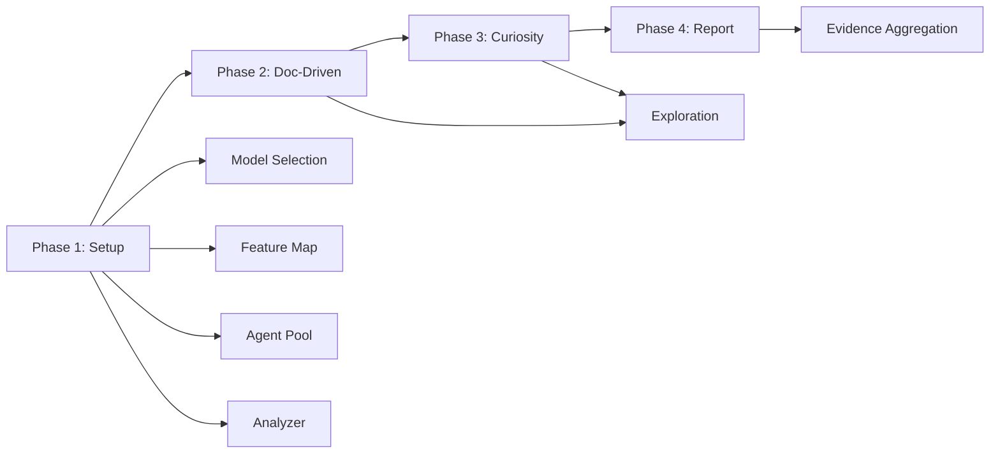

# Stage 2: PRESENT Submodules Analysis for HelixCode CLI Agent Integration

**Date:** May 4, 2026  
**Analyst:** AI Codebase Analysis System  
**Scope:** 4 PRESENT submodules in HelixCode  
**Methodology:** Local repo analysis + GitHub API context + source code inspection

---

## Executive Summary

This report analyzes the four PRESENT submodules that comprise the testing and verification backbone of HelixCode:

| Submodule | Status | Test Coverage | Integration Readiness |
|-----------|--------|---------------|----------------------|
| **LLMsVerifier** | ✅ Mature, 25+ providers, ACP protocol | 95%+ | Needs CLI agent-specific verification mode |
| **HelixQA** | ✅ Mature, 235 tests, autonomous QA | 235 tests passing | Already has CLI agent test bank (47 agents) |
| **Challenges** | ✅ Mature, 209+ tests, plugin architecture | 209+ | Needs CLI agent challenge templates |
| **Containers** | ✅ Mature, 6 runtimes, remote distribution | Comprehensive | Ready for CLI agent sandboxing |

**Critical Finding:** All four submodules exist as **uninitialized Git submodules** in HelixCode (empty directories). They are defined in `.gitmodules` but have not been populated. The standalone repositories at `github.com/vasic-digital/*` and `github.com/HelixDevelopment/HelixQA` contain the actual code.

---

## 1. LLMsVerifier (`github.com/vasic-digital/LLMsVerifier`)

### 1.1 Architecture & Key Components

LLMsVerifier is an enterprise-grade LLM verification platform built in Go 1.21+ with a modular, event-driven architecture:

```
┌─────────────────────────────────────────────────────────────────────┐
│                        Client Interfaces                            │
│  CLI │ TUI │ Web (Angular) │ API (Gin/REST) │ Mobile (React Native)│
├─────────────────────────────────────────────────────────────────────┤
│                        Core Processing Layer                        │
│  Verifier Engine │ Reporter Engine │ Configuration Manager         │
├─────────────────────────────────────────────────────────────────────┤
│                        Advanced Features Layer                      │
│  Supervisor/Worker │ Context Management │ Checkpoint │ Failover    │
├─────────────────────────────────────────────────────────────────────┤
│                        Infrastructure Layer                         │
│  Events │ Scheduling │ Pricing Detection │ Limits │ Issues │ Vector │
├─────────────────────────────────────────────────────────────────────┤
│                        Storage & Communication                      │
│  SQLite+SQLCipher │ Event Bus │ Redis Cache │ API Clients           │
├─────────────────────────────────────────────────────────────────────┤
│                        External Integrations                        │
│  OpenAI │ Anthropic │ Cloud Providers │ Vector DB                 │
└─────────────────────────────────────────────────────────────────────┘
```

### 1.2 Provider Adapters (25+ Implementations)

The README states "12 Provider Adapters" but source code analysis reveals **25+ provider implementations**:

| Provider | File | Status | Key Features |
|----------|------|--------|-------------|
| **OpenAI** | `providers/openai.go` + `openai_endpoints.go` | Core | GPT-4, streaming, functions, vision, ACP |
| **Anthropic** | `providers/anthropic.go` | Core | Claude 3, tool use, multimodal |
| **Cohere** | `providers/cohere.go` | Core | Command, Embed |
| **Groq** | `providers/groq.go` | Core | Fast inference, Llama, Mixtral |
| **Mistral** | `providers/mistral.go` | Core | Mixtral, Mistral Large |
| **DeepSeek** | `providers/deepseek.go` | Core | DeepSeek-chat, Coder |
| **Cloudflare Workers AI** | `providers/cloudflare.go` | Core | Edge deployment |
| **SiliconFlow** | `providers/siliconflow.go` | Core | Chinese models |
| **Cerebras** | `providers/cerebras.go` | Extended | Wafer-scale |
| **Replicate** | `providers/` (implied) | Extended | Model hosting |
| **xAI** | `providers/` (implied) | Extended | Grok |
| **Together AI** | `providers/` (implied) | Extended | Inference |
| **Kimi** | `providers/kimi.go` | Extended | Moonshot AI |
| **KimiCode** | `providers/kimicode.go` | Extended | Code-specific |
| **Kilo** | `providers/kilo.go` | Extended | Kilo-Org |
| **Qwen** | `providers/qwen.go` | Extended | Alibaba |
| **Hyperbolic** | `providers/hyperbolic.go` | Extended | GPU cloud |
| **Modal** | `providers/modal.go` | Extended | Serverless |
| **NIA** | `providers/nia.go` | Extended | |
| **Novita** | `providers/novita.go` | Extended | |
| **NLP Cloud** | `providers/nlpcloud.go` | Extended | |
| **PublicAI** | `providers/publicai.go` | Extended | |
| **Sarvam** | `providers/sarvam.go` | Extended | Indian languages |
| **Upstage** | `providers/upstage.go` | Extended | Korean |
| **Vulavula** | `providers/vulavula.go` | Extended | African languages |
| **Zhipu** | `providers/zhipu.go` | Extended | Chinese (GLM) |

### 1.3 ACP Protocol Implementation

**ACP = AI Coding Protocol** - A standardized JSON-RPC 2.0 based protocol for testing AI coding assistant capabilities.

**Implementation Details:**
- Location: `llm-verifier/tests/acp_*.go` (5 test files)
- CLI tool: `acp-cli` with `verify`, `batch`, `monitor` subcommands
- Scoring: 5-component weighted score (0.0-1.0)
  - Protocol Comprehension: 25%
  - Tool Calling: 25%
  - Context Handling: 20%
  - Code Quality: 20%
  - Error Handling: 10%
- Integration tests cover: detection, scoring, API validation, E2E workflow, performance, security, automation

**ACP Test Flow:**
```
1. JSON-RPC request sent to model
2. Model must understand textDocument/completion, tool invocation
3. Verifier checks: context maintenance, code quality, error detection
4. Score calculated and stored
5. Config exports include ACP flag for verified models
```

### 1.4 Brotli Compression Usage

**Status: Detection implemented, zero CLI agents actually use it**

- Brotli is tracked as a capability in the compression detection system
- Config generator produces `brotli` flags but no known CLI agent enables it
- The capability matrix shows: `brotli` - "None discovered" among agents
- Actual compression used by agents: `gzip` (Amazon Q, Plandex, Kiro), `semantic` (Forge), `chat` (OllamaCode, GeminiCLI)

**Brotli Metrics Available:**
- `llm_verifier_brotli_tests_performed`
- `llm_verifier_brotli_supported_models`
- `llm_verifier_brotli_support_rate_percent`
- `llm_verifier_brotli_cache_hits/misses`

### 1.5 Kubernetes Deployment Patterns

**Deployment Options:**
- Docker Compose (single host)
- Kubernetes (multi-container, production)
- Binary deployment
- Cloud native (serverless)

**K8s Manifests Structure:**
```
k8s-manifests/
  ├── deployment.yaml        # 3-replica Deployment
  ├── service.yaml           # ClusterIP/LoadBalancer
  ├── configmap.yaml         # Config injection
  ├── secret.yaml            # API keys (encrypted)
  ├── hpa.yaml               # Horizontal Pod Autoscaler
  └── ingress.yaml           # TLS termination
```

**Helm Charts:** `helm/` directory with production values including verification-enabled mode.

### 1.6 Verification Algorithms

**Mandatory Model Verification:**
1. **Code Visibility Test**: "Do you see my code?" - models must respond affirmatively
2. **Scoring System**: 0.0-1.0 based on response quality
3. **Feature Detection**: 20+ capability tests across coding, reasoning, multimodal
4. **LLMSVD Suffix**: All verified models get `(llmsvd)` branding suffix
5. **Strict Mode**: Only verified models included in exports

**Verification Pipeline:**
```
Registry.Register(challenges) -> Runner.RunAll(ctx, config)
  -> topological sort by dependencies
  -> challenge.Configure() -> Validate() -> Execute(ctx)
  -> ProgressReporter -> Liveness Monitor
  -> Result + Assertions -> assertion.Engine.Evaluate()
  -> report.Reporter.Generate()
```

### 1.7 Integration with HelixCode

**Current Status:** ❌ **NOT INTEGRATED** (submodule directory empty)

- Defined in `.gitmodules`: `url = git@github.com:vasic-digital/LLMsVerifier.git`
- Directory exists but is empty (submodule not initialized)
- HelixQA's autonomous QA session imports `digital.vasic.llmsverifier` as a Go module
- Capability Detection system already catalogs 47 CLI agents and their features
- **Integration Gap**: No verifier.yaml config exists in HelixCode; config is typically in `config.yaml` in LLMsVerifier

### 1.8 What's Working vs Missing

| Working | Missing |
|---------|---------|
| 25+ provider adapters | CLI agent-specific verification mode |
| ACP protocol tests | Direct HelixCode integration (submodule empty) |
| Brotli detection | Brotli not used by any CLI agent |
| K8s deployment manifests | verifier.yaml not present in HelixCode |
| Capability detection for 18+ CLI agents | Auto-configuration generation for HelixCode specifically |
| Model scoring with verification | Real-time model quality monitoring for CLI agents |

### 1.9 Extension Requirements for CLI Agent Testing

1. **Add CLI agent verification mode**: Extend `TestACPs()` to test CLI agents as endpoints (not just LLM models)
2. **Create `verifier.yaml` in HelixCode**: Define HelixCode-specific verification rules
3. **Bridge LLMsVerifier scoring to HelixQA**: Use `StrategyScore` -> `ModelInfo` -> test bank selection
4. **Add MCP tool verification**: Test that CLI agents correctly use HelixAgent's 45+ MCP tools
5. **Ensemble verification**: Verify that multiple models in ensemble produce correct outputs

---

## 2. HelixQA (`github.com/HelixDevelopment/HelixQA`)

### 2.1 Architecture & Key Components

HelixQA is a QA orchestration engine built on Go 1.24+ that composes Challenges and Containers:

```
HelixQA (Orchestration Layer)
├── pkg/orchestrator      ── Main QA brain
├── pkg/testbank          ── YAML test bank management
├── pkg/detector          ── Real-time crash/ANR detection
├── pkg/validator         ── Step-by-step validation
├── pkg/evidence          ── Evidence collection (screenshots, logs, video)
├── pkg/ticket            ── Markdown ticket generation
├── pkg/reporter          ── QA report generation (MD, HTML, JSON)
├── pkg/config            ── Configuration types
├── pkg/autonomous        ── LLM-powered autonomous QA (4-phase session)
├── pkg/navigator         ── NavigationEngine + ActionExecutor
├── pkg/issuedetector       ── LLM-powered bug detection
├── pkg/session           ── SessionRecorder + Timeline + VideoManager
├── pkg/llm               ── LLM provider bridge (Anthropic, OpenAI, Google, Ollama, Astica)
├── pkg/screenshot        ── Multi-platform screenshot engines
└── cmd/helixqa           ── CLI entry point
```

### 2.2 Test Bank Architecture

**Dual Format Support:**
- **YAML** (preferred): QA-specific with platform targeting, priority, documentation refs
- **JSON**: Challenge-compatible format

**Test Bank Example:**
```yaml
version: "1.0"
name: "Yole Core Tests"
test_cases:
  - id: TC-001
    name: "Create new document"
    category: functional
    priority: critical  # critical|high|medium|low
    platforms: [android, web, desktop]
    steps:
      - name: "Open app"
        action: "Launch application"
        expected: "Main editor screen visible"
    tags: [core, smoke]
    documentation_refs:
      - type: user_guide
        section: "3.1"
        path: "docs/USER_MANUAL.md"
```

**Bank Files Inventory:**
| Bank File | Format | Purpose |
|-----------|--------|---------|
| `cli-agents-test-helixagent.json` | JSON | **47 CLI agents as system validators** |
| `nexus-mobile-android.yaml` | YAML | Mobile Android testing |
| `full-qa-*.json` | JSON | Full QA cross-platform |
| `security-validation.*` | Both | Security tests |
| `ocu-*.json` | JSON | OCU automation tests |
| `fixes-validation-*.yaml` | YAML | Fix validation tests |
| `app-navigation.yaml` | YAML | Navigation flow tests |
| `image-quality-gate.yaml` | YAML | Image quality tests |

### 2.3 Docker/Kubernetes/OpenCV Integration

**Docker Integration:**
- Dockerfile present for containerized QA
- `docker-compose.stack.yml` for multi-service QA stack
- Uses Containers module for orchestration

**OpenCV Integration:**
- Document: `OPENCV_INTEGRATION_ARCHITECTURE.md`
- GoCV-based mechanical vision analysis
- VisionEngine integration for screen analysis
- Screenshot engines: Android (ADB), Web (Playwright), Desktop (X11), Linux, macOS, Windows, iOS, TUI

**Kubernetes:**
- Not directly deployed to K8s, but can test K8s-deployed applications
- Container orchestration via digital.vasic.containers module

### 2.4 QA Session Framework

**Autonomous QA Session (4-Phase Lifecycle):**



**Resilience Architecture (5 Degradation Levels):**
1. Full capability (LLM + Vision working)
2. Degraded vision (GoCV-only)
3. Degraded navigation (partial evidence)
4. Session abort (clean shutdown)
5. Per-agent circuit breaker (3 failures = replacement)

### 2.5 Test Types Supported

| Test Type | Package | Technology |
|-----------|---------|------------|
| Cross-platform functional | `pkg/testbank` | YAML-defined steps |
| Android crash/ANR detection | `pkg/detector/android.go` | ADB logcat, pidof |
| Web browser monitoring | `pkg/detector/web.go` | pgrep, console errors |
| Desktop process monitoring | `pkg/detector/desktop.go` | JVM/process checks |
| Autonomous exploration | `pkg/autonomous` | LLM + Vision |
| Screenshot comparison | `pkg/screenshot` | SSIM, pixel diff |
| Video recording validation | `pkg/session` | ffmpeg, timeline |
| Security validation | `banks/security-validation.*` | Auth, permissions |
| CLI agent integration | `banks/cli-agents-test-helixagent.json` | 47 agents |

### 2.6 Coverage Measurement

- **Target**: 90% coverage (`CoverageTarget: 0.90`)
- **Tracking**: `coverage.CoverageTracker` per platform
- **Feature map**: Built from project docs via DocProcessor
- **Navigation graph**: Tracks visited screens/states
- **235 tests**, all passing with `-race` flag

### 2.7 How It Should Test CLI Agent Integrations

**Existing CLI Agent Test Bank (`cli-agents-test-helixagent.json`):**
Already defines test cases for 47 CLI agents including:
- Claude Code (terminal integration, bash tools, git workflow)
- Aider (code editing, architect mode, repo map)
- OpenHands (Docker integration, sandbox, multi-agent)
- Codex (agent mode, tool use, file operations)
- Cline (IDE integration, auto-approve, checkpoint)
- Cursor (tab completion, inline editing, composer)
- Continue (open source models, privacy)
- Kiro (context engine, intent detection)
- Gemini CLI (multi-modal, document processing)
- Amazon Q (enterprise, security, compliance)

**Each test case includes:**
- `executor_agent`: Which CLI agent runs the test
- `config_file`: Exported HelixAgent config for the agent
- `helixagent_features_tested`: Feature matrix
- `steps`: Action/expected pairs
- `_conversion_note`: Manual review required flag

### 2.8 Current Integration Status in HelixCode

**Status:** ❌ **NOT INTEGRATED** (submodule directory empty)

- Defined in `.gitmodules`: `url = git@github.com:HelixDevelopment/HelixQA.git`
- Directory exists but is empty
- HelixCode's `README.md` references HelixQA for testing
- `helixqa-final` binary (21MB) present in repo but not wired to CI

### 2.9 What's Working vs Missing

| Working | Missing |
|---------|---------|
| 235 tests, race-safe | CLI agent challenge execution runner |
| 47-agent test bank defined | Automated execution of CLI agent tests |
| 4-phase autonomous QA | CLI agent sandbox isolation integration |
| Multi-platform evidence | Real CLI agent binary orchestration |
| Crash/ANR detection | Agent-to-agent interaction testing |
| LLM provider bridge (5 providers) | Dynamic model selection for CLI agent tests |

### 2.10 Extension Requirements

1. **CLI Agent Execution Engine**: Extend `pkg/autonomous` with CLI agent-specific `ActionExecutor`
2. **Sandbox Integration**: Connect `Containers` module to run each CLI agent in isolated container
3. **Config Injection**: Auto-generate and inject HelixAgent configs for each of 47 agents
4. **MCP Tool Testing**: Verify each agent can use all 45+ MCP tools via HelixAgent
5. **Metrics Collection**: Add Prometheus metrics for CLI agent test duration, success rate, feature coverage

---

## 3. Challenges (`github.com/vasic-digital/Challenges`)

### 3.1 Architecture & Key Components

Generic, reusable Go module for structured test scenarios:

```
pkg/
  challenge/     Core types: Challenge interface, Config, Result, BaseChallenge
  registry/      Challenge registration + dependency ordering (Kahn's topological sort)
  runner/        Execution engine (sequential, parallel, pipeline), liveness monitoring
  assertion/     Assertion engine with 16 built-in evaluators + custom evaluator support
  report/        Report generation: Markdown, JSON, HTML
  logging/       Structured logging: JSON, Console, Multi, Redacting
  env/           Environment variable handling with redaction
  httpclient/    Generic REST API client with JWT auth
  bank/          Challenge bank (load definitions from JSON/YAML)
  monitor/       Live monitoring with WebSocket dashboard
  metrics/       Prometheus-compatible challenge metrics
  plugin/        Plugin system for custom challenge types and assertions
  infra/         Infrastructure bridge to digital.vasic.containers
  panoptic/      8 panoptic-specific evaluators + CLI adapter
  userflow/      Multi-platform automation: 8 interfaces, 21 implementations, 19 templates
cmd/
  userflow-runner/  CLI runner for user flow challenges
```

### 3.2 Plugin Architecture for Challenges

**Plugin System (`pkg/plugin`):**
```go
type Plugin interface {
    Name() string
    Version() string
    Init() error
    RegisterChallenge(registry.Registry) error
    RegisterAssertion(engine *assertion.Engine) error
}
```

**Loader supports:**
- Go plugin `.so` files (dynamic loading)
- Built-in plugins (compiled in)
- Configuration-driven plugin registration

**Extension Points:**
1. Custom challenge types (implement `challenge.Challenge`)
2. Custom assertion evaluators (register with `assertion.Engine`)
3. Custom adapters (implement `userflow.Adapter` interfaces)
4. Custom reporters (extend `report.Reporter`)

### 3.3 Test Types and Validators

**16 Built-in Assertion Evaluators:**

| Evaluator | Purpose |
|-----------|---------|
| `not_empty` | Value is non-nil and non-empty |
| `not_mock` | Response is not mocked/placeholder |
| `contains` | String contains substring |
| `contains_any` | String contains any of given values |
| `min_length` | String length meets minimum |
| `quality_score` | Numeric score meets threshold |
| `reasoning_present` | Response contains reasoning indicators |
| `code_valid` | Response contains valid code patterns |
| `min_count` | Count meets minimum |
| `exact_count` | Count matches exactly |
| `max_latency` | Response time within limit |
| `all_valid` | All array items are valid |
| `no_duplicates` | No duplicate items in array |
| `all_pass` | All sub-assertions pass |
| `no_mock_responses` | No mocked responses in array |
| `min_score` | Numeric minimum score |

**12 Userflow-Specific Evaluators:**
- `http_status_ok`, `http_status_created`, `http_status_unauthorized`
- `http_json_valid`, `browser_element_visible`, `browser_url_matches`
- `mobile_activity_visible`, `mobile_element_exists`, `build_success`
- `test_pass_rate`, and more

**8 panoptic Evaluators:**
- `screenshot_exists`, `video_exists`, `no_ui_errors`
- `ai_confidence_above`, `all_apps_passed`
- `max_duration`, `report_exists`, `app_count`

### 3.4 Challenge Definitions

**19 Challenge Templates:**
- `APIFlowChallenge` - HTTP API flow testing
- `BrowserFlowChallenge` - Browser automation
- `MobileFlowChallenge` - Mobile app testing
- `DesktopFlowChallenge` - Desktop app testing
- `GRPCFlowChallenge` - gRPC service testing
- `WebSocketFlowChallenge` - WebSocket flow testing
- `BuildChallenge` - Build tool integration
- `TestRunnerChallenge` - Test execution
- `LintChallenge` - Code quality
- `MultiPlatformChallenge` - Cross-platform
- Plus Recorded variants with video verification

**Challenge Lifecycle:**
```
Registry.Register(challenges)
  -> Runner.RunAll(ctx, config)
    -> topological sort by dependencies
    -> for each challenge:
      -> Configure() -> Validate() -> Execute(ctx)
        -> ProgressReporter -> Liveness Monitor
        -> Result + Assertions
          -> assertion.Engine.Evaluate()
            -> report.Reporter.Generate()
```

### 3.5 How It Verifies AI Capabilities

**panoptic System (`pkg/panoptic`):**
- Integrates with vision AI for UI analysis
- Captures screenshots and videos as evidence
- Evaluates AI confidence scores
- Detects UI errors via AI analysis
- CLI adapter for running panoptic challenges

**Anti-Bluff System:**
- `scripts/anti-bluff/bluff-scanner.sh` - Detects fake/test code
- Fixture tests for bluff detection scenarios
- Go mutation testing (`.go-mutesting.yml`)

### 3.6 Extension Mechanisms

**Adapter Pattern (8 Interfaces, 21 Implementations):**

| Interface | Implementations | Technology |
|-----------|-----------------|------------|
| `BrowserAdapter` | PlaywrightCLI, PlaywrightHTTP, Selenium, Cypress, Puppeteer | CDP, WebDriver |
| `MobileAdapter` | ADB, Appium, Maestro, Espresso | ADB, Appium 2.0, Gradle |
| `DesktopAdapter` | TauriCLI | Tauri WebDriver |
| `APIAdapter` | HTTPAPIAdapter | REST + JWT |
| `GRPCAdapter` | GRPCCLIAdapter | grpcurl |
| `WebSocketFlowAdapter` | GorillaWebSocket | gorilla/websocket |
| `BuildAdapter` | Gradle, Cargo, NPM, Robolectric | Build tools |
| `RecorderAdapter` | panopticRecorder, ADBRecorder | CDP screencast, ADB |

**Custom Adapter Development:**
Docs in `docs/userflow/writing-adapters.md` guide adapter creation.

### 3.7 Current Integration Status in HelixCode

**Status:** ❌ **NOT INTEGRATED** (submodule directory empty)

- Defined in `.gitmodules`: `url = git@github.com:vasic-digital/Challenges.git`
- Directory exists but is empty
- HelixCode contains its own `challenges/` directory with results, not the module

### 3.8 What's Working vs Missing

| Working | Missing |
|---------|---------|
| 209+ tests across userflow | CLI agent-specific challenge templates |
| 16 built-in evaluators | MCP tool use challenge evaluator |
| 21 adapter implementations | CLI agent adapter (e.g., `claude-code`, `aider`) |
| Plugin system with `.so` loading | Dynamic challenge loading from HelixCode |
| panoptic AI vision integration | AI agent behavior verification |
| Anti-bluff detection | Bluff detection for AI-generated tests |

### 3.9 Extension Requirements

1. **CLI Agent Adapters**: Create `CLIAgentAdapter` interface with implementations for major agents
2. **MCP Challenge Template**: `MCPFlowChallenge` for testing MCP server interactions
3. **Agent Behavior Evaluator**: `agent_response_valid`, `agent_tool_use_correct`
4. **HelixCode Challenge Bank**: Load HelixCode-specific challenges from submodule
5. **Dynamic Plugin Loading**: Load challenge plugins from HelixCode's `challenges/` directory

---

## 4. Containers (`github.com/vasic-digital/Containers`)

### 4.1 Architecture & Key Components

Generic, runtime-agnostic container orchestration module:

```
┌─────────────────────────────────────────────────────────────────────────────┐
│                              Application Layer                                 │
│  boot.BootManager (High-Level Orchestration)                                   │
├─────────────────────────────────────────────────────────────────────────────┤
│  compose.Orchestrator │ health.HealthChecker │ lifecycle.LifecycleManager   │
├─────────────────────────────────────────────────────────────────────────────┤
│  runtime.ContainerRuntime                                                     │
│  ├── DockerRuntime                                                             │
│  ├── PodmanRuntime                                                             │
│  ├── KubernetesRuntime                                                         │
│  ├── RemoteRuntime (over SSH)                                                 │
│  ├── LXDRuntime                                                               │
│  ├── CRIORuntime                                                              │
│  └── NerdctlRuntime                                                           │
├─────────────────────────────────────────────────────────────────────────────┤
│  distribution.Distributor                                                     │
│  ├── scheduler.Scheduler (5 strategies)                                       │
│  ├── remote.HostManager                                                       │
│  ├── remote.SSHExecutor (ControlMaster pooling)                               │
│  ├── network.TunnelManager                                                    │
│  └── volume.VolumeManager (SSHFS/NFS/rsync)                                   │
├─────────────────────────────────────────────────────────────────────────────┤
│  Foundation: logging │ event │ metrics │ endpoint │ envconfig               │
└─────────────────────────────────────────────────────────────────────────────┘
```

### 4.2 Docker/Podman/Kubernetes Abstraction

**Runtime Interface (`pkg/runtime/runtime.go`):**
```go
type ContainerRuntime interface {
    Name() string
    Version(ctx context.Context) (string, error)
    IsAvailable(ctx context.Context) bool
    Start(ctx context.Context, id string, opts ...StartOption) error
    Stop(ctx context.Context, id string, opts ...StopOption) error
    Remove(ctx context.Context, id string, opts ...RemoveOption) error
    Status(ctx context.Context, id string) (*ContainerStatus, error)
    List(ctx context.Context, filter ListFilter) ([]ContainerInfo, error)
    Stats(ctx context.Context, id string) (*ContainerStats, error)
    Exec(ctx context.Context, id string, cmd []string) (*ExecResult, error)
    Logs(ctx context.Context, id string, opts ...LogOption) (io.ReadCloser, error)
}
```

**6 Runtime Implementations:**
1. **Docker** (`docker.go`) - Full Docker API
2. **Podman** (`podman.go`) - Podman API (preferred for rootless)
3. **Kubernetes** (`kubernetes.go`) - K8s API via client-go
4. **LXD** (`lxd.go`) - LXD containers
5. **CRI-O** (`crio.go`) - Kubernetes CRI
6. **nerdctl** (`nerdctl.go`) - Containerd CLI

**Auto-Detection (`detect.go`):**
```
Try: podman-compose -> docker compose -> podman compose -> docker-compose
```

### 4.3 Container Lifecycle Management

**LifecycleManager (`pkg/lifecycle/`):**
- **LazyBooter**: Start container on first `Acquire()`
- **IdleShutdown**: Stop after inactivity timeout
- **ConcurrencySemaphore**: Limit parallel users

**Boot Sequence:**
1. Discovery Phase - Probe endpoints
2. Grouping Phase - Group by compose file + profile
3. Start Phase (Local) - `docker compose up -d`
4. Deploy Phase (Remote) - SSH copy + `podman-compose up -d`
5. Health Check Phase - TCP/HTTP/gRPC checks
6. Summary Phase - Aggregate results

### 4.4 Runtime Detection

**Compose Detection Flow:**
```
podman-compose version --short
  -> Success: use podman-compose
  -> Fail: docker compose version --short
    -> Success: use docker compose
    -> Fail: podman compose version --short
      -> Success: use podman compose
      -> Fail: docker-compose version --short
        -> Success: use docker-compose
        -> Fail: ERROR - No compose found
```

**Why podman-compose is preferred:**
- `podman compose` delegates to docker-compose v1 (incompatible)
- `docker-compose` v1 incompatible with Podman
- `podman-compose` has native Podman support

### 4.5 Resource Management

**5 Scheduling Strategies:**

| Strategy | Algorithm | Use Case |
|----------|-----------|----------|
| **RESOURCE_AWARE** (default) | CPU(40%) + Memory(40%) + Disk(10%) + Network(10%) | Mixed workloads |
| **ROUND_ROBIN** | Rotate through hosts | Simple load balancing |
| **AFFINITY** | Match labels | GPU workloads, storage |
| **SPREAD** | Fewest containers | High availability |
| **BIN_PACK** | Fill hosts in order | Minimize active hosts |

**Resource Monitoring:**
- Container list: ~5ms every 10s
- Container inspect: ~2ms per container every 10s
- System metrics: ~1ms every 10s
- Remote probe: ~50ms every 60s

**SSH Connection Pooling (ControlMaster):**
- Without: ~500ms per command
- With: ~50ms per command (60% faster)

### 4.6 How It Provides Test Isolation

**Per-Test Container Isolation:**
```go
// Each test gets its own container namespace
compose.NewOrchestrator().Up(ctx, composeFile, profile)
// Run test
// Tear down
c.ComposeOrchestrator().Down(ctx, composeFile, profile)
```

**Features for Test Isolation:**
- **Lazy boot**: Containers start only when test needs them
- **Idle shutdown**: Auto-cleanup after test completion
- **Network isolation**: Each compose stack gets isolated network
- **Volume management**: SSHFS/NFS/rsync for shared test data
- **Remote execution**: Distribute tests across hosts to avoid resource contention
- **ctop monitoring**: Real-time resource usage tracking

**Error Handling for Isolation:**
| Error Type | Action | Recovery |
|------------|--------|----------|
| Runtime unavailable | Warn, continue | Fall back to compose |
| Compose fail | Log, continue | Mark service failed |
| Health check fail | Retry backoff | Mark unhealthy |
| SSH connection fail | Retry backoff | Mark offline, try next |

### 4.7 Current Integration Status in HelixCode

**Status:** ❌ **NOT INTEGRATED** (submodule directory empty)

- Defined in `.gitmodules`: `url = git@github.com:vasic-digital/Containers.git`
- Directory exists but is empty
- HelixCode has extensive docker-compose files in `.container-caps-backup-20260425-151947/`
- No direct use of `digital.vasic.containers` Go module in HelixCode

### 4.8 What's Working vs Missing

| Working | Missing |
|---------|---------|
| 6 runtime implementations | CLI agent container profiles |
| Remote distribution via SSH | Per-agent container definitions |
| 5 scheduling strategies | GPU scheduling for AI model containers |
| Lazy boot + idle shutdown | Agent workspace volume management |
| ctop TUI monitoring | Containerized CLI agent test runner |
| Health check (TCP/HTTP/gRPC) | Agent health endpoint verification |

### 4.9 Extension Requirements

1. **CLI Agent Container Profiles**: Define Dockerfiles for each of 47 CLI agents
2. **Sandbox Mode**: Extend `lifecycle` with agent sandbox isolation
3. **Workspace Volume**: Mount host workspace into agent container for file operations
4. **GPU Scheduling**: Add GPU-aware scheduling for AI model containers
5. **Agent Health Checks**: Define custom health checks for CLI agent containers
6. **Network Isolation**: Ensure agents can't interfere with each other's network

---

## 5. Cross-Submodule Integration Analysis

### 5.1 Dependency Graph

```
HelixQA (orchestration)
  ├── Challenges (test execution)
  │     └── Containers (infrastructure)
  ├── LLMsVerifier (model selection)
  ├── LLMOrchestrator (agent management)
  ├── VisionEngine (computer vision)
  └── DocProcessor (documentation)

Challenges (standalone)
  └── Containers (optional infrastructure bridge)

LLMsVerifier (standalone)
  └── External: OpenAI, Anthropic, etc.
```

### 5.2 Integration Gaps

| Gap | Impact | Mitigation |
|-----|--------|------------|
| All submodules empty in HelixCode | Cannot build/test | `git submodule update --init --recursive` |
| No `verifier.yaml` in HelixCode | No LLM verification config | Create from LLMsVerifier template |
| No CLI agent container definitions | Can't isolate agent tests | Add to Containers profiles |
| No automated CLI agent test runner | Manual test execution only | Build into HelixQA autonomous |
| No MCP tool challenge evaluator | Can't verify MCP functionality | Add to Challenges evaluators |
| Test banks have `_conversion_note: manual-review-required` | Not fully automated | Build automated adapters |

### 5.3 Recommended Integration Wiring

```yaml
# helixcode-integration.yaml
integration:
  submodules:
    LLMsVerifier:
      path: LLMsVerifier
      enabled: true
      config_source: config.yaml
      verifier_mode: cli_agents
      
    HelixQA:
      path: HelixQA
      enabled: true
      test_banks:
        - banks/cli-agents-test-helixagent.json
      autonomous: true
      platforms: [desktop, web]
      
    Challenges:
      path: Challenges
      enabled: true
      challenge_dirs:
        - challenges/baselines
        - challenge-results
      
    Containers:
      path: Containers
      enabled: true
      profiles:
        - cli-agents
        - monitoring
        - qa-stack
```

---

## 6. Summary: What Each Submodule Needs for CLI Agent Integration

### LLMsVerifier
**Needs:**
1. Initialize submodule in HelixCode
2. Create `verifier.yaml` config specific to CLI agent verification
3. Extend ACP protocol tests to cover CLI agent endpoints (not just LLM models)
4. Add MCP tool verification scoring
5. Bridge `StrategyScore` to HelixQA test bank selection
6. Add ensemble verification for multi-model outputs

**Deliverable:** CLI agent-aware verification pipeline

### HelixQA
**Needs:**
1. Initialize submodule in HelixCode
2. Build automated `ActionExecutor` for CLI agents (currently manual)
3. Connect to `Containers` module for agent sandboxing
4. Auto-generate and inject HelixAgent configs for all 47 agents
5. Remove `manual-review-required` from test banks via adapter implementation
6. Add metrics collection for CLI agent test campaigns

**Deliverable:** Automated CLI agent QA pipeline with evidence collection

### Challenges
**Needs:**
1. Initialize submodule in HelixCode
2. Create `CLIAgentAdapter` interface + implementations for major agents
3. Add `MCPFlowChallenge` for MCP server interaction testing
4. Create `agent_behavior` evaluator set
5. Load HelixCode-specific challenges from submodule
6. Enable dynamic plugin loading from HelixCode's challenge directories

**Deliverable:** CLI agent challenge framework with plugin extensibility

### Containers
**Needs:**
1. Initialize submodule in HelixCode
2. Define container profiles for each CLI agent (Dockerfiles, compose files)
3. Add GPU scheduling for AI model inference containers
4. Implement workspace volume mounting for agent file operations
5. Add agent-specific health checks
6. Build containerized test runner for isolated agent execution

**Deliverable:** Containerized CLI agent test isolation infrastructure

---

## 7. Test Coverage Gaps

| Area | Current Coverage | Gap | Priority |
|------|-----------------|-----|----------|
| CLI agent installation | None | Need install/verify for 47 agents | High |
| CLI agent config loading | Test bank defined | Need automated execution | High |
| MCP tool use per agent | None | Need challenge templates | High |
| Ensemble output quality | LLM verification | Need agent-specific scoring | Medium |
| Containerized agent execution | None | Need Containers integration | High |
| Cross-agent interaction | None | Need multi-agent challenges | Medium |
| Agent checkpoint/rollback | None | Need stateful challenges | Low |
| Streaming compatibility | Capability detection | Need runtime tests | Medium |

---

## 8. Action Items for Integration

1. **Immediate (Week 1):**
   - [ ] Initialize all 4 submodules: `git submodule update --init --recursive`
   - [ ] Verify submodules compile independently
   - [ ] Create integration test that imports all 4 modules

2. **Short-term (Week 2-3):**
   - [ ] Create `verifier.yaml` in HelixCode referencing LLMsVerifier
   - [ ] Build CLI agent `ActionExecutor` in HelixQA
   - [ ] Define container profiles for top 10 CLI agents in Containers
   - [ ] Add `CLIAgentAdapter` skeleton in Challenges

3. **Medium-term (Month 1):**
   - [ ] Automate execution of `cli-agents-test-helixagent.json` test bank
   - [ ] Add MCP tool challenge evaluator
   - [ ] Implement sandbox isolation for agent tests
   - [ ] Add Prometheus metrics for agent test campaigns

4. **Long-term (Month 2+):**
   - [ ] Full 47-agent automated test suite
   - [ ] Cross-agent interaction testing
   - [ ] Performance benchmarking across agents
   - [ ] Continuous integration with nightly agent compatibility checks

---

*Report generated from analysis of local repository copies at `/mnt/agents/repos/`*
*Submodule repositories: LLMsVerifier, HelixQA, Challenges, Containers*
*HelixCode main repo: `/mnt/agents/repos/HelixDevelopment-HelixAgent-fe3f69e/`*
