<!--
Document-Metadata (constitution §11.4.44)
Revision: 1
Last modified: 2026-05-20T00:00:00Z
Authority: HelixCode programme — research deliverable R4 (Speed-programme synthesis & index).
           Cascaded from CONSTITUTION.md / constitution submodule. Synthesises R1
           (01-current-state-bottleneck-audit.md), R2 (02-competitive-analysis.md) and
           R3 (03-optimization-techniques.md) into one actionable programme. Operator
           speed mandate 2026-05-20: HelixCode + owned submodules 3–5× faster than
           competitor AI CLI agents without regressing any working feature.
Scope:     Index + executive synthesis. NO production code changed by this file —
           implementation follows as phased, subagent-driven rounds (see 04-…).
-->

# R4 — HelixCode Speed Programme: Overview & Executive Synthesis

| | |
|---|---|
| **Revision** | 1 |
| **Created** | 2026-05-20 |
| **Last modified** | 2026-05-20T00:00:00Z |
| **Status** | active |
| **Authority** | docs/research/speed/ — operator speed mandate 2026-05-20 |

## Table of contents

- [1. The mandate & this document](#1-the-mandate--this-document)
- [2. Document set — speed programme index](#2-document-set--speed-programme-index)
- [3. The 3–5× goal decomposition](#3-the-35-goal-decomposition)
- [4. Latency-budget breakdown — current vs target](#4-latency-budget-breakdown--current-vs-target)
- [5. Unified ranked opportunity list (R1 ↔ R2 ↔ R3)](#5-unified-ranked-opportunity-list-r1--r2--r3)
- [6. Risk posture — no working feature may regress](#6-risk-posture--no-working-feature-may-regress)
- [7. Measurement strategy — the baseline is mandatory](#7-measurement-strategy--the-baseline-is-mandatory)
- [8. How the phased plan follows from this synthesis](#8-how-the-phased-plan-follows-from-this-synthesis)

## 1. The mandate & this document

Operator mandate (2026-05-20): make the entire HelixCode codebase **and every owned
submodule** 3–5× faster than competitor AI CLI coding agents — Claude Code, Gemini
CLI, Aider, Cline/Roo Code, OpenHands, Cursor, Continue, Plandex, Crush — **without
breaking any working feature**, with every change covered by all supported test
types and real anti-bluff proofs, executed in phases via subagent-driven rounds.

This document (R4) is the **synthesis layer**. R1–R3 each answered one question:
*where are we slow* (R1), *how do competitors win* (R2), *what techniques exist*
(R3). R4 reconciles all three into a single ranked opportunity list and points to
the phased implementation plan (`04-phased-implementation-plan.md`). No production
code is changed by R1–R4; they are research + planning. Execution begins at Phase 0
of the plan.

## 2. Document set — speed programme index

The `docs/research/speed/` directory holds five documents. Each `.md` has an
HTML + PDF sibling regenerated per constitution §11.4.65.

| Doc | File | Role |
|-----|------|------|
| R4 | [`00-speed-programme-overview.md`](./00-speed-programme-overview.md) | **This file** — index + executive synthesis, goal decomposition, unified opportunity list, risk posture, measurement strategy. |
| R1 | [`01-current-state-bottleneck-audit.md`](./01-current-state-bottleneck-audit.md) | 23 ranked real-codebase bottlenecks (B01–B23), each with `file:line` evidence. |
| R2 | [`02-competitive-analysis.md`](./02-competitive-analysis.md) | How 9 competitor agents achieve speed; 12-technique adoption table. |
| R3 | [`03-optimization-techniques.md`](./03-optimization-techniques.md) | ~70 optimization techniques across 8 areas, impact-to-effort ranked, 3-wave sequencing. |
| Plan | [`04-phased-implementation-plan.md`](./04-phased-implementation-plan.md) | Phased, subagent-sized task plan — Phase 0 baseline through Phase 5; per-task test floor + anti-bluff proofs. |

**Reading order:** new readers — R4 (this) → R1 → R2 → R3 → Plan. Implementers —
R4 §5 (opportunity list) then jump straight to the Plan.

## 3. The 3–5× goal decomposition

Per R3's central finding, "agent speed" is **not one number** — it is four largely
independent latency budgets, and the 3–5× multiplier is a *product* of per-budget
wins, not a single lever. R3's decomposition table:

| Lever group | Contribution to end-to-end speedup | Source |
|---|---|---|
| Prompt caching + streaming-first + connection pooling | **~2–3×** on perceived latency (time-to-first-token) | R3 §4, R2 technique #1/#8/#9 |
| Incremental indexing + content-addressed context caches | **~1.5–2×** on context-build phases | R3 §5, R2 technique #2 |
| Go PGO + allocation/GC/concurrency tuning | **~1.05–1.3×** on the CPU-bound slices that remain | R3 §1–§2 |
| Startup-time + build/test speed | developer-experience multiplier (not user-facing runtime) | R3 §3/§8, R1 B01/B02 |

**Why this reaches 3–5×.** The first two budgets are multiplicative on different
phases of a turn: a turn spends time *building context* then *waiting on the LLM*.
Cutting context-build ~1.75× and LLM-wait ~2.5× compounds. Worked example —
`2.5 × 1.75 ≈ 4.4×` on a context-heavy turn; a pure chat turn with a warm cache is
nearer the 2–3× LLM-only figure; a cold cold-start command (e.g. `--list-models`)
is dominated by R1 B01/B02 startup work and gets its largest win there. **The 3–5×
band is therefore situation-dependent** — the programme must deliver across all
situations, which is exactly why Phase 0 captures *per-scenario* baselines.

**Goal restatement, measurable:** for each of the four canonical scenarios in §7,
post-programme wall-clock must be **≤ 1/3 to ≤ 1/5** of the Phase-0 HelixCode
baseline, and ≤ the fastest competitor's measured wall-clock on identical hardware.

## 4. Latency-budget breakdown — current vs target

The diagram below shows where wall-clock goes on a representative *context-heavy
agent turn* today (R1 evidence) versus the programme target. Numbers are
illustrative proportions pending Phase-0 measurement — Phase 0 replaces them with
captured pprof + wall-clock data.

```mermaid
gantt
    title Context-heavy agent turn — latency budget (illustrative, Phase 0 confirms)
    dateFormat X
    axisFormat %s
    section CURRENT (~100 units)
    Eager serial startup B01/B02      :c1, 0, 18
    Repo-map build B04-B07 (serial)   :c2, 18, 30
    Content search B08 (serial grep)  :c3, 48, 10
    HTTP connect churn B03            :c4, 58, 7
    LLM wait — no/partial cache       :crit, c5, 65, 35
    section TARGET (~25-33 units)
    Lazy startup (deferred)           :t1, 0, 3
    Repo-map warm cache + parallel    :t2, 3, 6
    Content search parallel pool      :t3, 9, 3
    Pooled HTTP/2 keepalive           :t4, 12, 2
    LLM wait — warm prompt cache      :active, t5, 14, 14
```

Reading: the LLM-wait slice (R3 §4) is the largest single budget and the largest
absolute win (prompt caching, §4.1/§4.2). Startup (R1 B01/B02) is the largest
*perceived* win on short commands. Repo-map + search (B04–B08) compound on every
context-heavy turn. Tuning (HTTP, alloc, GC) trims the residue.

## 5. Unified ranked opportunity list (R1 ↔ R2 ↔ R3)

This is the programme's master list. Each opportunity reconciles a **real
HelixCode bottleneck (R1)**, the **competitor technique that proves it pays
(R2)**, and the **technique catalogue entry (R3)**. Ordered by impact-to-effort —
the order the phased plan executes them.

| # | Opportunity | R1 bottleneck | R2 technique | R3 technique | Est. speedup | Effort | Risk |
|---|-------------|---------------|--------------|--------------|--------------|--------|------|
| O1 | **Prompt-cache-stable prefix + `cache_control` for all providers + pre-warm** | — (greenfield discipline) | #1 (Claude Code `promptCacheBreakDetection`), #8 (Plandex all-provider) | 4.1, 4.2 | ~2–3× TTFT | Low-Med | Low |
| O2 | **Shared tuned HTTP/2 transport across all 9 providers** | B03 | #6 (lesson), #9 | 4.7 | High per-call | Low | Low |
| O3 | **Streaming-first verification on every surface (CLI/TUI/desktop)** | — | #9 | 4.3 | High perceived | Low | Low |
| O4 | **Lazy/deferred CLI startup — sync.Once getters on `*CLI`** | B01, B13, B14, B18 | #6 (Gemini Go-rewrite 68×, MCP stdio fix) | 3.1, 3.2 | High cold-start | Low-Med | Med |
| O5 | **Lazy/async Ollama discovery (out of constructor)** | B02 | #6 | 3.1 | High cold-start | Low | Low |
| O6 | **Persistent content-addressed repo-map cache (path+mtime/hash)** | B07, B15, B19 | #2 (Aider diskcache + getmtime) | 5.2, 5.4, 6.1 | ~1.5–2× warm context | Med | Low |
| O7 | **Parallelise repo-map: worker pool + parser pool + single-pass stats** | B04, B05, B06, B16 | #2 (Plandex tree-sitter maps) | 2.1, 2.2, 1.4 | High cold index | Med | Med |
| O8 | **Parallelise `SearchContent` grep tool (bounded worker pool)** | B08 | #2 (Continue ripgrep), #5 | 2.1, 7.2 | High on large trees | Low-Med | Low |
| O9 | **Incremental tree-sitter parsing (edit API, not full re-parse)** | B06 (extends) | #2 | 5.1, 5.3 | High per-edit | Med | Med |
| O10 | **Small-model routing for cheap subtasks (cascade)** | — | #7 (Aider architect/editor, Cursor) | 4.4 | High on agent loops | Med | Med |
| O11 | **Diff-style edits + dedicated fast-apply path** | — | #3 (Cursor 9–13×, Morph), #4 (Roo `apply_diff`) | 4.5 | High interactive | Med-High | Med |
| O12 | **Aggressive tool-call parallelism + parallel sub-agents** | — | #5 (Claude Code `/batch` up to 10×) | 2.1 | High multi-file | Med | Med |
| O13 | **`filepath.WalkDir` migration + buffered I/O** | B09 | — | 7.1, 7.2 | Medium | Low | Low |
| O14 | **Hoist per-call `regexp.MustCompile`; remove redundant body copies** | B11, B12 | — | 1.5 | Medium | Low | Low |
| O15 | **PGO with a real production `default.pgo`** | — | — | 1.1 | 2–14% CPU | Low | Low |
| O16 | **Config loaded once, threaded down (drop Viper global on hot path)** | B10 | — | 3.4 | Low-Med | Low-Med | Low |
| O17 | **Multi-tier cache (memory→disk→Redis) for context/embeddings** | — | #2 | 6.1, 5.6 | High | Med | Med |
| O18 | **History condenser/compaction to keep cache prefix small** | — | #10 (OpenHands, `/compact`) | (R3 §5 context) | Med (long runs) | Med | Med |
| O19 | **Config-driven DB pool sizing; smaller CLI default** | B17 | — | — | Low | Low | Low |
| O20 | **Profile-gated alloc/GC/contention tuning (`sync.Pool`, sharded locks)** | B22, B23 | — | 1.3, 1.4, 1.7, 2.3 | 1.05–1.3× | Med-High | Med |
| O21 | **Sub-package `internal/llm`; build-cache + `-p` test tuning** | B20, B21 | #6 (lesson) | 8.1, 8.2, 8.3 | Dev-experience | Low-Med | Low |

The phased plan (`04-…`) groups O1–O21 into phases by the impact-to-effort and
risk ordering above: low-risk/high-impact first (O1–O8), then medium-effort
context wins (O9, O17, O10), then interactive levers (O11, O12), then
profile-gated tuning (O20) and developer-experience (O21).

## 6. Risk posture — no working feature may regress

The mandate's hard constraint: **no working feature may regress.** This is a
CONST-035 / Article XI §11.9 anti-bluff invariant — a speedup that breaks a
feature is a false-success. Therefore every task in the plan is gated by the
**CONST-048 six-invariant test floor** *per change*:

1. anti-bluff posture with captured runtime evidence;
2. proof of working capability end-to-end on the target topology;
3. implementation matching the documented promise;
4. no open issues/bugs surfaced;
5. documentation in sync;
6. four-layer test floor (pre-build + post-build + runtime + paired mutation).

Concretely, every task must show: (a) the **same** functional tests that passed
before the change still pass after it (no-regression proof); (b) a **benchmark**
with captured before/after numbers proving the claimed speedup (anti-bluff —
"faster" without numbers is a bluff under CONST-035 Rule 9); (c) a **Challenge**
exercising the real end-to-end user workflow; (d) **HelixQA** bank coverage per
CONST-050. Tasks are sequenced low-risk-first specifically so the riskiest
changes (O7 repo-map parallelism, O11 fast-apply, O20 contention tuning) land
only after the measurement harness (Phase 0) and the safe wins (Phase 1) have
proven the test floor is reliable.

Per CONST-047/CONST-051, owned submodules are equal-codebase: the same speed
posture, test floor and anti-bluff proofs apply recursively to every owned
submodule that contributes to a measured scenario.

## 7. Measurement strategy — the baseline is mandatory

The "3–5×" claim is **unfalsifiable without a baseline**. R1 §6 lists seven
measurement gaps; the programme cannot validate anything until they are closed.
This is why **Phase 0 of the plan is "establish the measurement baseline" and
nothing else can be validated before it completes.**

**Canonical scenarios** (each measured before and after every relevant phase):

| S | Scenario | Primary metric | Bottlenecks exercised |
|---|----------|----------------|-----------------------|
| S1 | `cli --help` / `--list-models` cold start | wall-clock to exit | B01, B02, B10, B13, B14 |
| S2 | Cold repo-map index of a large repo (~5k files) | wall-clock + alloc | B04–B07, B09, B15, B19 |
| S3 | Content search (`Grep`) over a large tree | wall-clock | B08, B09 |
| S4 | Single LLM round-trip (cold cache vs warm cache) | time-to-first-token | B02, B03; O1 |

**Instruments** (R3 §1.2, R1 §6):

- **pprof** — CPU + heap + mutex + block profiles for S2/S3/S4; `net/http/pprof`
  for the server path. Profiles are committed as evidence and as the input to PGO
  (O15 / R3 §1.1).
- **`go test -bench -benchmem`** — the 113 existing benchmarks plus new ones for
  the four hot paths (startup, llm dispatch, repomap, search) which currently
  lack dedicated coverage (R1 §6).
- **Competitor wall-clock benchmarks** — Claude Code, Gemini CLI, Aider, Cline,
  Crush measured on *identical hardware* for S1–S4, so 3–5× has a concrete number
  to beat (R1 §6 item 6, R2 §2 Go-rewrite data point).
- **`GODEBUG=inittrace=1`** — to size slow `init()` chains for O4 (R3 §3.2).

**Anti-bluff rule for the whole programme:** no phase may claim a speedup without
pasted before/after numbers from that session (CONST-035 Rule 9). A green
benchmark with no captured delta is a bluff.

## 8. How the phased plan follows from this synthesis

`04-phased-implementation-plan.md` turns §5's opportunity list into ~5 phases of
subagent-sized tasks:

- **Phase 0 — Measurement baseline** (must run first; §7).
- **Phase 1 — Low-risk high-impact LLM & startup wins** (O1–O5: prompt cache,
  HTTP tuning, streaming, lazy startup, lazy Ollama).
- **Phase 2 — Context-build speed** (O6–O9, O13, O14: repo-map cache + parallelism,
  parallel search, incremental parsing, walk/regex hygiene).
- **Phase 3 — Interactive & agent-loop levers** (O10–O12, O18: model routing,
  fast-apply, tool parallelism, compaction).
- **Phase 4 — Profile-gated tuning & caching architecture** (O15, O17, O19, O20:
  PGO, multi-tier cache, DB pool, alloc/GC/contention).
- **Phase 5 — Developer-experience & submodule cascade** (O16, O21 + recursive
  application to owned submodules per CONST-047/051).

See the plan for per-task IDs, target files, test floors and anti-bluff proofs.
