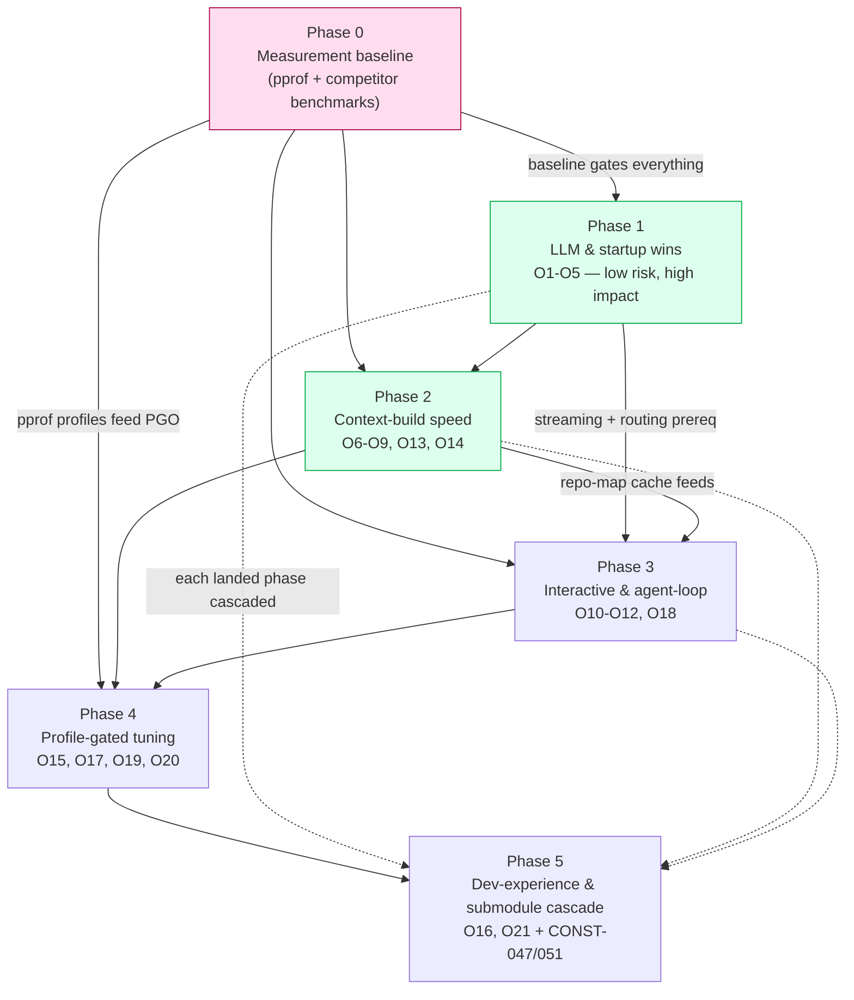

<!--
Document-Metadata (constitution §11.4.44)
Revision: 1
Last modified: 2026-05-20T00:00:00Z
Authority: HelixCode programme — research deliverable R4 (Phased implementation plan).
           Cascaded from CONSTITUTION.md / constitution submodule. Turns the unified
           opportunity list in 00-speed-programme-overview.md §5 into phased,
           subagent-sized tasks. Operator speed mandate 2026-05-20.
Scope:     Planning only. NO production code changed by this file — each task below
           is executed as its own subagent-driven round with the test floor + anti-
           bluff proofs specified per task. Implementation is NOT done here.
-->

# R4 — HelixCode Speed Programme: Phased Implementation Plan

| | |
|---|---|
| **Revision** | 1 |
| **Created** | 2026-05-20 |
| **Last modified** | 2026-05-20T00:00:00Z |
| **Status** | active |
| **Authority** | docs/research/speed/ — operator speed mandate 2026-05-20 |

## Table of contents

- [1. Scope, conventions & how to read a task](#1-scope-conventions--how-to-read-a-task)
- [2. Phase-dependency graph](#2-phase-dependency-graph)
- [3. Phase 0 — Measurement baseline](#3-phase-0--measurement-baseline)
- [4. Phase 1 — Low-risk high-impact LLM & startup wins](#4-phase-1--low-risk-high-impact-llm--startup-wins)
- [5. Phase 2 — Context-build speed](#5-phase-2--context-build-speed)
- [6. Phase 3 — Interactive & agent-loop levers](#6-phase-3--interactive--agent-loop-levers)
- [7. Phase 4 — Profile-gated tuning & caching architecture](#7-phase-4--profile-gated-tuning--caching-architecture)
- [8. Phase 5 — Developer-experience & submodule cascade](#8-phase-5--developer-experience--submodule-cascade)
- [9. §11.4.74 submodule-catalogue check (mandatory before any new component)](#9-1474-submodule-catalogue-check-mandatory-before-any-new-component)
- [10. Per-task test-floor & anti-bluff template](#10-per-task-test-floor--anti-bluff-template)
- [11. Task summary table](#11-task-summary-table)

## 1. Scope, conventions & how to read a task

This plan executes the unified opportunity list O1–O21 from
[`00-speed-programme-overview.md`](./00-speed-programme-overview.md) §5. It divides
the work into **6 phases (Phase 0 through Phase 5)** containing **31 tasks total**.

**One task ≈ one subagent-sized work unit (≈1 PWU per constitution §11.4.58)** —
small enough that a single subagent-driven round can implement, test, prove and
commit it. Tasks are ordered within a phase by dependency then impact-to-effort.

Each task is specified as:

- **ID** — `Pn-Tnn` (phase, task).
- **Title**.
- **Target files** — the real `helix_code/...` paths to change (from R1 evidence).
- **Implements** — cross-reference to R1 bottleneck / R2 technique / R3 technique /
  R4 opportunity (O-number).
- **Expected speedup** — the claim the benchmark must prove.
- **Risk** — Low / Med / High (regression risk to working features).
- **Test types** — per CONST-050: unit + integration + benchmark + Challenge +
  HelixQA. (Mocks permitted ONLY in unit tests — CONST-050(A).)
- **Anti-bluff proof** — the captured runtime evidence each test must produce
  (CONST-035 / Article XI §11.9). "Faster" without pasted before/after numbers is
  a bluff (Rule 9).

**Path note (R1 §2):** `helix_code/` IS the inner Go module (`module
dev.helix.code`, `go 1.26`). The CLAUDE.md text describing a deeper
`helix_code/helix_code/` path is stale — paths below use the confirmed layout.

**Hard constraint:** no working feature may regress (R4 §6). Every task carries
the no-regression proof — the functional tests that passed before still pass after.

## 2. Phase-dependency graph

**Critical path:** Phase 0 → Phase 1 → Phase 2 → Phase 4 → Phase 5. Phase 0 is a
hard gate — no speedup claim is falsifiable before the baseline exists (R4 §7).
Phase 3 depends on Phase 1 (streaming + provider plumbing) and Phase 2 (warm
repo-map cache feeds context for the agent loop). Phase 5 cascades each landed
phase's work into owned submodules and may begin its per-submodule cascade as
soon as the corresponding meta-repo phase is green (dotted edges).

## 3. Phase 0 — Measurement baseline

**Goal:** capture the before-state. Nothing else in the programme can be validated
until this phase produces committed baseline artefacts. No production code changes
in this phase — it builds the measurement harness and captures numbers.

### P0-T01 — pprof harness for the four hot paths
- **Target files:** `helix_code/cmd/cli/main.go` (add opt-in `--pprof` flag wiring),
  `helix_code/internal/server/` (verify `net/http/pprof` mount), new
  `helix_code/tests/performance/pprof_harness_test.go`.
- **Implements:** R3 §1.2; R1 §6 items 1–4; R4 §7.
- **Expected speedup:** none (enabling task).
- **Risk:** Low.
- **Test types:** unit (harness wiring); integration (pprof endpoint serves a
  profile); benchmark (the harness runs the 4 scenarios); Challenge (capture-a-
  profile workflow); HelixQA (perf bank registers the harness).
- **Anti-bluff proof:** committed `.pprof` files for S1–S4 under
  `docs/research/speed/baseline/`; pasted `go tool pprof -top` output.

### P0-T02 — Benchmark suite for startup / llm-dispatch / repomap / search
- **Target files:** new `*_test.go` benchmarks in `helix_code/cmd/cli/`,
  `helix_code/internal/llm/`, `helix_code/internal/repomap/`,
  `helix_code/internal/tools/filesystem/`.
- **Implements:** R1 §6 item 3 (these hot paths currently lack benchmarks); R3 §8.3.
- **Expected speedup:** none (enabling).
- **Risk:** Low.
- **Test types:** benchmark (the suite itself); unit (benchmark helpers); HelixQA
  (benchmark bank registration).
- **Anti-bluff proof:** pasted `go test -bench -benchmem` output for each new
  benchmark, committed as `baseline/benchmarks-2026-05-20.txt`.

### P0-T03 — Competitor wall-clock baseline on identical hardware
- **Target files:** new `scripts/testing/competitor_speed_baseline.sh`;
  results under `docs/research/speed/baseline/`.
- **Implements:** R1 §6 item 6; R2 §2 (Go-rewrite 68× data point).
- **Expected speedup:** none (enabling — sets the number to beat).
- **Risk:** Low.
- **Test types:** integration (script runs each agent for S1–S4); Challenge
  (reproducible competitor-benchmark run); HelixQA (bank).
- **Anti-bluff proof:** committed table of measured wall-clock for Claude Code /
  Gemini CLI / Aider / Cline / Crush across S1–S4; raw `/usr/bin/time` output.

### P0-T04 — Scenario fixtures + the canonical-scenario runner
- **Target files:** new `helix_code/tests/performance/scenarios/` (large-repo
  fixture generator), `scripts/testing/run_speed_scenarios.sh`.
- **Implements:** R4 §7 (S1–S4 canonical scenarios).
- **Expected speedup:** none (enabling).
- **Risk:** Low.
- **Test types:** integration (runner produces stable numbers across 3 runs);
  Challenge (end-to-end scenario run); HelixQA (bank).
- **Anti-bluff proof:** pasted 3-run variance for each scenario proving the
  harness is stable enough to detect a 1.3×+ change.

## 4. Phase 1 — Low-risk high-impact LLM & startup wins

**Goal:** the S-tier wins (R3 sequencing Wave 1) — ~2–3× perceived-latency from
prompt caching + HTTP tuning + streaming + lazy startup. Low regression risk.

### P1-T01 — Shared tuned HTTP/2 transport across all providers
- **Target files:** new `helix_code/internal/providers/httpclient.go` (shared
  factory); edit `helix_code/internal/llm/{openai,deepseek,gemini,azure,copilot,cerebras,koboldai,local}_provider.go` + `local_llm_manager.go`.
- **Implements:** R1 B03; R2 #9; R3 §4.7; O2.
- **Expected speedup:** removes per-call TLS handshake on bursts; high on
  concurrent/rapid-fire requests.
- **Risk:** Low.
- **Test types:** unit (factory returns tuned transport — `MaxIdleConnsPerHost≥32`,
  `ForceAttemptHTTP2`); integration (real provider call reuses a connection);
  benchmark (burst of N calls, connection-reuse count); Challenge (real LLM
  generate over a warm pool); HelixQA (provider bank).
- **Anti-bluff proof:** captured `netstat`/transport idle-conn count before/after
  proving reuse; pasted benchmark delta.

### P1-T02 — Lazy/async Ollama discovery out of the constructor
- **Target files:** `helix_code/internal/llm/ollama_provider.go` (remove
  `discoverModels()` from `NewOllamaProvider`, line ~109), `helix_code/cmd/cli/main.go` (~234).
- **Implements:** R1 B02; R2 #6; R3 §3.1; O5.
- **Expected speedup:** removes one synchronous HTTP round-trip from every CLI
  start.
- **Risk:** Low.
- **Test types:** unit (constructor does no network I/O — mock asserts zero
  calls); integration (discovery still works on first `GetModels`); benchmark
  (`NewCLI()` wall-clock before/after); Challenge (`--list-models` still returns
  real models); HelixQA (bank).
- **Anti-bluff proof:** pasted `NewCLI()` benchmark delta; Challenge output showing
  real Ollama models still listed (no regression).

### P1-T03 — Lazy CLI startup: sync.Once getters on `*CLI`
- **Target files:** `helix_code/cmd/cli/main.go` `Run()` (lines ~459–680) —
  convert ~20 eager subsystems to `sync.Once`-guarded lazy getters.
- **Implements:** R1 B01, B13, B14, B18; R2 #6; R3 §3.1, §3.2; O4.
- **Expected speedup:** high cold-start — short commands skip worktree git
  shell-out, hooks YAML, LSP `LookPath` sweep, MCP spawn.
- **Risk:** Med (touches the bootstrap of every command — needs the full
  no-regression suite).
- **Test types:** unit (each getter constructs once, lazily); integration (every
  command path still wires its subsystems on demand); benchmark (S1 cold start);
  Challenge (each top-level command still works end-to-end); HelixQA (CLI bank,
  full command matrix).
- **Anti-bluff proof:** pasted S1 wall-clock before/after; the full pre-change
  CLI command test matrix passing post-change (no-regression proof).

### P1-T04 — Prompt-cache-stable prefix + deterministic JSON serialization
- **Target files:** `helix_code/internal/llm/` request-builders (system prompt +
  tool-definition assembly), new `helix_code/internal/llm/promptcache/` (cache-break
  detection + deterministic key ordering).
- **Implements:** R2 #1, #8; R3 §4.1; O1. Go pitfall — map-key order randomization
  must be eliminated.
- **Expected speedup:** up to ~85% TTFT on long prompts (cache hit).
- **Risk:** Low-Med (prefix changes must be invisible to feature behaviour).
- **Test types:** unit (serialization is byte-deterministic across 1000 runs;
  cache-break detector flags a mutated prefix); integration (real Anthropic call
  reports `cache_read_input_tokens > 0` on the 2nd request); benchmark (TTFT cold
  vs warm); Challenge (multi-turn session, 2nd turn hits cache); HelixQA (bank).
- **Anti-bluff proof:** pasted API response showing `cache_creation_input_tokens`
  then `cache_read_input_tokens` on turn 2; TTFT delta.

### P1-T05 — `cache_control` opt-in for every supported provider
- **Target files:** `helix_code/internal/llm/{anthropic,openai,gemini,...}_provider.go`
  request paths.
- **Implements:** R2 #8 (Plandex all-provider); R3 §4.1; O1.
- **Expected speedup:** extends T04's win to OpenAI/Gemini (implicit + explicit
  caching).
- **Risk:** Low-Med.
- **Test types:** unit (each provider emits provider-correct cache directives);
  integration (real call per provider reports cache hit); benchmark (per-provider
  TTFT cold/warm); Challenge; HelixQA (multi-provider bank).
- **Anti-bluff proof:** per-provider pasted cache-hit metric from the real API.

### P1-T06 — Cache pre-warming at session start
- **Target files:** `helix_code/internal/session/` (session-open hook),
  `helix_code/internal/llm/promptcache/`.
- **Implements:** R3 §4.2; O1.
- **Expected speedup:** removes the first-request cold-cache penalty.
- **Risk:** Low.
- **Test types:** unit (warm request is `max_tokens`-minimal); integration (first
  real user request after warm-up is a cache hit); benchmark (first-turn TTFT with
  vs without pre-warm); Challenge; HelixQA (bank).
- **Anti-bluff proof:** pasted first-turn `cache_read_input_tokens > 0`.

### P1-T07 — Streaming-first verification on every surface
- **Target files:** `helix_code/cmd/cli/main.go`, `helix_code/applications/terminal-ui/`,
  `helix_code/applications/desktop/` — verify all consume `GenerateStream`.
- **Implements:** R2 #9; R3 §4.3; O3. (Verify, do not regress — mostly present.)
- **Expected speedup:** high perceived (time-to-first-visible-token).
- **Risk:** Low.
- **Test types:** unit (each surface renders incrementally); integration (real
  streamed response renders token-by-token); benchmark (time-to-first-token);
  Challenge (CLI + TUI + desktop each show streaming); HelixQA (UI bank).
- **Anti-bluff proof:** captured timestamped render log proving first token shown
  before completion arrives.

## 5. Phase 2 — Context-build speed

**Goal:** R3 Wave 2 context wins — ~1.5–2× on context-build phases via repo-map
cache + parallelism + incremental parsing.

### P2-T01 — `filepath.WalkDir` migration + buffered I/O
- **Target files:** the 19 `filepath.Walk` sites (R1 B09) — `internal/repomap/repomap.go:248`, `internal/context`, `internal/fix`, `internal/rules`, `internal/tools/{mapping,web,filesystem}`, `internal/workflow`, etc.
- **Implements:** R1 B09; R3 §7.1, §7.2; O13.
- **Expected speedup:** medium on large trees (cheaper `fs.DirEntry`).
- **Risk:** Low (mechanical).
- **Test types:** unit (walk yields identical file set); integration (repo-map +
  search still cover the same files); benchmark (cold walk of S2 fixture);
  Challenge; HelixQA (bank).
- **Anti-bluff proof:** pasted before/after walk benchmark; file-set equality test.

### P2-T02 — Hoist per-call regexp; remove redundant body copies
- **Target files:** `internal/editor/formats/{editor,diff,architect,whole}_format.go`
  (≥17 `MustCompile` sites — R1 B12); `internal/llm/ollama_provider.go:359,398`
  (`bytes.NewReader` not `strings.NewReader(string(...))` — R1 B11).
- **Implements:** R1 B11, B12; R3 §1.5; O14.
- **Expected speedup:** medium on edit-format parse hot path.
- **Risk:** Low.
- **Test types:** unit (package-level regexes compile once; parse output
  unchanged); integration (real LLM-edit-format parse); benchmark (parse loop
  alloc/op); Challenge; HelixQA (bank).
- **Anti-bluff proof:** pasted `-benchmem` allocs/op before/after.

### P2-T03 — Persistent content-addressed repo-map cache
- **Target files:** `helix_code/internal/repomap/cache.go` (key by path+mtime/
  content-hash; one background writer replacing per-`Set` goroutine — R1 B07),
  `repomap.go:148` (stat-based token estimate — R1 B19).
- **Implements:** R1 B07, B15, B19; R2 #2 (Aider diskcache + getmtime); R3 §5.2,
  §5.4, §6.1; O6.
- **Expected speedup:** ~1.5–2× on warm context (unchanged files never re-parsed).
- **Risk:** Med (cache correctness — stale entry must miss).
- **Test types:** unit (changed file → cache miss; unchanged → hit); integration
  (warm second index reuses cache); benchmark (cold vs warm S2 index); Challenge
  (edit one file, re-index, only that file re-parsed); HelixQA (bank).
- **Anti-bluff proof:** pasted cold-vs-warm index wall-clock; instrumentation log
  showing N−1 cache hits after a 1-file edit.

### P2-T04 — Parallelise repo-map: worker pool + parser pool + single-pass stats
- **Target files:** `helix_code/internal/repomap/repomap.go` (consume the unused
  `MaxConcurrency`, line 29 — R1 B04; single-pass `GetStatistics` — R1 B05;
  narrow lock — R1 B16), `tree_sitter.go:56` (`sync.Pool` of parsers — R1 B06).
- **Implements:** R1 B04, B05, B06, B16; R2 #2; R3 §2.1, §2.2, §1.4; O7.
- **Expected speedup:** high on cold index (tree-sitter is the CPU bottleneck).
- **Risk:** Med (concurrency correctness — race-tested).
- **Test types:** unit (`-race`; worker pool bounded by `MaxConcurrency`; parser
  pool resets between files); integration (parallel index = serial index output);
  benchmark (cold S2 index, varying concurrency); Challenge; HelixQA (bank).
- **Anti-bluff proof:** pasted `-race` clean run; output-equality test (parallel
  vs serial); benchmark delta vs P0 baseline.

### P2-T05 — Parallelise the `SearchContent` grep tool
- **Target files:** `helix_code/internal/tools/filesystem/searcher.go:243` —
  bounded worker pool (`errgroup.SetLimit`) over candidate paths.
- **Implements:** R1 B08; R2 #2 (Continue ripgrep); R3 §2.1, §7.2; O8.
- **Expected speedup:** high on large trees (the agent `Grep` hot path).
- **Risk:** Low-Med (result ordering — must remain deterministic).
- **Test types:** unit (parallel search = serial search result set, sorted);
  integration (real grep over S3 fixture); benchmark (S3 wall-clock); Challenge
  (agent `Grep` tool call end-to-end); HelixQA (tools bank).
- **Anti-bluff proof:** result-set equality test; pasted S3 benchmark delta.

### P2-T06 — Incremental tree-sitter parsing (edit API)
- **Target files:** `helix_code/internal/repomap/tree_sitter.go` — use the
  `smacker/go-tree-sitter` incremental edit API instead of full re-parse.
- **Implements:** R1 B06 (extends); R2 #2; R3 §5.1, §5.3; O9.
- **Expected speedup:** high on per-edit context refresh (re-parse only edited
  regions).
- **Risk:** Med (incremental-parse correctness vs full re-parse).
- **Test types:** unit (incremental re-parse == full re-parse AST for an edited
  file); integration (edit→re-index produces correct symbols); benchmark
  (per-edit re-parse vs full); Challenge; HelixQA (bank).
- **Anti-bluff proof:** AST-equality test (incremental vs full); pasted per-edit
  benchmark delta.

### P2-T07 — Config loaded once, threaded down
- **Target files:** `helix_code/internal/config/config.go:215` (`Load()`),
  `helix_code/cmd/cli/main.go:241`, server + subagent config paths.
- **Implements:** R1 B10; R3 §3.4; O16.
- **Expected speedup:** low-medium (drops repeat YAML reads / Viper global churn).
- **Risk:** Low-Med (config plumbing — every consumer must get the same struct).
- **Test types:** unit (`Load()` called once; struct threaded); integration (CLI +
  server + subagent see consistent config); benchmark (startup config-load count);
  Challenge; HelixQA (bank).
- **Anti-bluff proof:** instrumentation log proving a single `ReadInConfig` per
  process; no-regression config tests.

## 6. Phase 3 — Interactive & agent-loop levers

**Goal:** the interactive multipliers — model routing, fast-apply, tool
parallelism, compaction. Depends on Phase 1 (provider plumbing) + Phase 2
(repo-map context).

### P3-T01 — Small-model routing for cheap subtasks (cascade)
- **Target files:** new `helix_code/internal/llm/routing/`; callers in
  `internal/agent/`, `internal/commands/` (classification, ranking, commit-msg,
  ambiguity detection).
- **Implements:** R2 #7; R3 §4.4; O10. Model metadata MUST come from LLMsVerifier
  (CONST-036/037) — no hardcoded model lists.
- **Expected speedup:** high on multi-step agent loops (cheap tasks on fast
  models).
- **Risk:** Med (routing must not degrade output quality — escalate on low
  confidence).
- **Test types:** unit (routing policy picks small model for trivial tasks; mock
  verifier); integration (real cascade — small model first, escalate); benchmark
  (agent-loop wall-clock with vs without routing); Challenge (real multi-step
  task); HelixQA (bank).
- **Anti-bluff proof:** captured per-subtask model-used log; loop wall-clock delta;
  quality-parity assertion vs frontier-only.

### P3-T02 — Diff-style edits (SEARCH/REPLACE only changed lines)
- **Target files:** `helix_code/internal/editor/formats/` — emit only changed
  lines; `internal/tools/` apply path with fuzzy match.
- **Implements:** R2 #3, #4 (Roo `apply_diff`, Aider `diff`/`udiff`); R3 (edit
  format); O11.
- **Expected speedup:** ~30% fewer output tokens → proportional latency cut.
- **Risk:** Med (malformed diff = correctness + speed loss — benchmark edit-format
  compliance).
- **Test types:** unit (diff round-trips; malformed diff rejected); integration
  (real LLM emits a valid diff that applies); benchmark (output-token count
  full-rewrite vs diff); Challenge (real multi-edit); HelixQA (edit bank).
- **Anti-bluff proof:** pasted output-token delta; edit-format compliance rate.

### P3-T03 — Dedicated fast-apply path
- **Target files:** new `helix_code/internal/editor/fastapply/`; integrates with
  P3-T01 routing.
- **Implements:** R2 #3 (Cursor speculative edits 9–13×, Morph 4500–10,500 tok/s);
  R3 §4.5; O11.
- **Expected speedup:** high interactive — file apply ~10× faster.
- **Risk:** Med-High (apply correctness is non-negotiable — full no-regression
  edit suite).
- **Test types:** unit (fast-apply output == reference apply); integration (real
  apply-model / speculative path produces a correct file); benchmark (apply
  tok/s); Challenge (real file-edit workflow); HelixQA (edit bank).
- **Anti-bluff proof:** byte-equality of fast-apply vs reference apply on a corpus;
  pasted apply tok/s before/after.

### P3-T04 — Aggressive tool-call parallelism
- **Target files:** `helix_code/internal/agent/` tool-dispatch loop; `internal/tools/registry.go`.
- **Implements:** R2 #5 (Claude Code `/batch` up to 10×); R3 §2.1; O12.
- **Expected speedup:** high on multi-file / multi-tool turns.
- **Risk:** Med (independent-tool detection — only parallelise side-effect-free or
  non-conflicting calls).
- **Test types:** unit (independent calls run concurrently, dependent serialised);
  integration (real multi-tool turn); benchmark (multi-tool turn wall-clock);
  Challenge (real multi-file task); HelixQA (agent bank).
- **Anti-bluff proof:** captured concurrency trace; turn wall-clock delta;
  output-equality vs serial.

### P3-T05 — History condenser / compaction
- **Target files:** `helix_code/internal/context/`, `internal/session/` —
  summarise history to keep the cached prefix small.
- **Implements:** R2 #10 (OpenHands condenser, `/compact`); R4 O18.
- **Expected speedup:** medium on long autonomous runs (prevents context bloat).
- **Risk:** Med (compaction must not drop task-critical context).
- **Test types:** unit (condenser preserves key facts); integration (long session
  stays under the window); benchmark (long-run turn latency with vs without);
  Challenge (real long autonomous run); HelixQA (bank).
- **Anti-bluff proof:** captured token-count trajectory; task-success parity
  long-run with vs without compaction.

## 7. Phase 4 — Profile-gated tuning & caching architecture

**Goal:** R3 Wave 3 — only where Phase 0 pprof evidence proves the bottleneck
(§11.4.6 no-guessing).

### P4-T01 — PGO with a real production `default.pgo`
- **Target files:** `helix_code/cmd/cli/default.pgo` (committed),
  `helix_code/cmd/server/default.pgo`, `helix_code/Makefile` (PGO build note).
- **Implements:** R3 §1.1; O15. Profile sourced from Phase 0 P0-T01.
- **Expected speedup:** 2–14% CPU-bound.
- **Risk:** Low.
- **Test types:** unit (build picks up `.pgo`); benchmark (S2/S3 with vs without
  PGO); integration (PGO binary passes the full suite); Challenge; HelixQA (bank).
- **Anti-bluff proof:** pasted benchmark delta PGO vs non-PGO; committed profile.

### P4-T02 — Multi-tier cache (memory→disk→Redis) for context/embeddings
- **Target files:** new `helix_code/internal/cache/` (L1/L2/L3); integrate with
  `internal/repomap/cache.go`, `internal/redis/`, embedding paths.
- **Implements:** R2 #2; R3 §6.1, §5.6; O17. §11.4.74 check — see §9.
- **Expected speedup:** high (warm reads ~0.1 ms L1).
- **Risk:** Med (cache coherence across tiers).
- **Test types:** unit (L1→L2→L3 read-through; populate-upward); integration (real
  Redis L3); benchmark (read latency per tier); Challenge (warm-cache workflow);
  HelixQA (bank).
- **Anti-bluff proof:** per-tier latency measurement; coherence test (write
  invalidates all tiers).

### P4-T03 — Config-driven DB pool sizing
- **Target files:** `helix_code/internal/database/database.go:45-48` (pool
  `MaxConns`/`MinConns` from config; smaller CLI default).
- **Implements:** R1 B17; O19.
- **Expected speedup:** low (fewer idle conns for CLI).
- **Risk:** Low.
- **Test types:** unit (pool sizing reads config); integration (real PostgreSQL,
  pool honours config); benchmark (CLI startup conn count); Challenge; HelixQA.
- **Anti-bluff proof:** pasted pool-stat output proving config-driven sizing.

### P4-T04 — Profile-gated alloc / GC / contention tuning
- **Target files:** profile-confirmed hot paths only — candidates
  `internal/memory/memory_manager.go` (32 locks — R1 B22), `internal/cognee/service.go`
  (R1 B23); `sync.Pool` / sharded locks / `RWMutex` per pprof.
- **Implements:** R1 B22, B23; R3 §1.3, §1.4, §1.7, §2.3; O20.
- **Expected speedup:** 1.05–1.3× on CPU/lock-bound slices.
- **Risk:** Med (concurrency correctness — `-race` mandatory).
- **Test types:** unit (`-race`; pool/lock correctness); integration (concurrent
  agent turns); benchmark (mutex-profile contention before/after); Challenge;
  HelixQA (bank).
- **Anti-bluff proof:** pasted mutex/block profile before/after proving the
  bottleneck was real and reduced; `-race` clean.

## 8. Phase 5 — Developer-experience & submodule cascade

**Goal:** developer-experience speed + recursive application of every landed
speedup to owned submodules (CONST-047, CONST-051 — submodules are equal-codebase).

### P5-T01 — Build cache, `-p`/`GOMAXPROCS`, test parallelism tuning
- **Target files:** `helix_code/Makefile` (test targets — R1 B20), `Makefile`.
- **Implements:** R1 B20; R3 §8.1, §8.2, §8.3; O21.
- **Expected speedup:** developer-experience (suite wall-time).
- **Risk:** Low.
- **Test types:** integration (suite still passes with tuned `-p`/`-parallel`);
  benchmark (suite wall-time before/after); Challenge; HelixQA.
- **Anti-bluff proof:** pasted suite wall-time delta; full suite still green.

### P5-T02 — Sub-package `internal/llm` for incremental-compile speed
- **Target files:** `helix_code/internal/llm/` → `internal/llm/providers/...`
  (30k LOC / 75 files — R1 B21).
- **Implements:** R1 B21; R3 §8.4; O21.
- **Expected speedup:** developer-experience (smaller recompile unit).
- **Risk:** Med (import-path churn — every importer updated atomically).
- **Test types:** unit (all packages compile + pass); integration (no behaviour
  change); benchmark (incremental compile after a 1-line edit); Challenge; HelixQA.
- **Anti-bluff proof:** pasted incremental-compile time before/after; full suite
  green; no import-path drift.

### P5-T03 — Cascade Phase 1–4 speedups into owned submodules
- **Target files:** every owned submodule under `vasic-digital` / `HelixDevelopment`
  (and the other authorised orgs per CONST-051) that contributes to a measured
  scenario — `helix_qa/`, `challenges/`, `security/`, etc.
- **Implements:** CONST-047, CONST-051(A) (equal-codebase); R4 §6.
- **Expected speedup:** programme-wide — each submodule gets the same posture.
- **Risk:** Med (per-submodule regression surface).
- **Test types:** per submodule — unit + integration + benchmark + Challenge +
  HelixQA; recursive per CONST-047.
- **Anti-bluff proof:** per-submodule before/after benchmark; per-submodule
  no-regression suite; coverage-ledger entry per CONST-048.

### P5-T04 — Speed-programme coverage ledger & release-gate sweep
- **Target files:** `docs/research/speed/` ledger; `scripts/generate-coverage-ledger.sh`
  extended for speed metrics.
- **Implements:** CONST-048 (coverage ledger — feature × platform × invariant).
- **Expected speedup:** none (governance close-out).
- **Risk:** Low.
- **Test types:** integration (ledger regenerates); Challenge (ledger sweep);
  HelixQA.
- **Anti-bluff proof:** committed ledger showing every O1–O21 task with captured
  before/after evidence and a green test floor.

## 9. §11.4.74 submodule-catalogue check (mandatory before any new component)

Per constitution §11.4.74, **before any task introduces a new reusable component,
the vasic-digital / HelixDevelopment owned-submodule catalogue MUST be checked** —
discover dynamically via `gh repo list vasic-digital`, `gh repo list HelixDevelopment`
and `glab` for the GitLab mirrors. Incorporate an existing owned component rather
than rebuilding it (CONST-051(C) — flat layout, no nested own-org chains;
CONST-054 — record in `helix-deps.yaml`).

Tasks that introduce a candidate-reusable component and therefore REQUIRE the
catalogue check before implementation:

| Task | New component | Check before building |
|------|---------------|------------------------|
| P0-T01 | pprof profiling harness | `helix_qa/` perf tooling; R3 §1.1 note. |
| P1-T01 | shared HTTP-client factory | `helix_code/internal/providers`; R3 §4.7 note. |
| P2-T04 | bounded worker-pool / scheduler | `helix_code/internal/worker`; owned-submodule catalogue; R3 §2.2 note. |
| P2-T03 / P4-T02 | content-addressed / multi-tier cache | `helix_code/internal/redis`; owned-submodule catalogue; R3 §6.1 note. |
| P3-T01 | model-routing component | LLMsVerifier (CONST-036) is the model-metadata source — do not duplicate. |
| P3-T03 | fast-apply component | owned-submodule catalogue; R2 #3. |

If the catalogue has no suitable component, the new component is built **decoupled
and project-not-aware** (CONST-051(B)) so it can itself become a catalogue entry.

## 10. Per-task test-floor & anti-bluff template

Every task above is closed only when ALL of the following are captured in the
task's commit/PR (CONST-035, CONST-048, CONST-050):

1. **Unit tests** — mocks permitted *only here* (CONST-050(A)). Prove the changed
   unit behaves; for concurrency tasks, `-race` clean.
2. **Integration tests** — real infrastructure (real PostgreSQL/Redis/Ollama/LLM
   provider), no mocks. Prove the change works in the real system.
3. **Benchmark** — `go test -bench -benchmem`, **before AND after**, pasted. The
   delta IS the speedup claim. No delta = bluff (CONST-035 Rule 9).
4. **Challenge** — a `challenges/` script exercising the real end-to-end user
   workflow the task touches (CONST-006/050).
5. **HelixQA** — the change registered in the relevant `helix_qa/` test bank;
   autonomous QA session run with captured wire evidence (CONST-050).
6. **No-regression proof** — the functional tests that passed before the change
   still pass after it (R4 §6 — no working feature regresses).

**Anti-bluff statement each task's evidence must satisfy:** pasted terminal output
from *that session* showing (a) the before number, (b) the after number, (c) the
ratio meeting the task's "Expected speedup", (d) the full functional suite green.
Words like *verified / tested / faster / complete* without this output are
forbidden (CLAUDE.md Rule 9).

## 11. Task summary table

| Phase | Tasks | Theme | Risk band |
|-------|-------|-------|-----------|
| Phase 0 | P0-T01 … P0-T04 (4) | Measurement baseline — pprof + benchmarks + competitor wall-clock + scenario harness | Low |
| Phase 1 | P1-T01 … P1-T07 (7) | LLM & startup wins — HTTP tuning, lazy startup/Ollama, prompt cache, streaming | Low–Med |
| Phase 2 | P2-T01 … P2-T07 (7) | Context-build speed — WalkDir, regex hoist, repo-map cache + parallelism, incremental parse, config-once | Low–Med |
| Phase 3 | P3-T01 … P3-T05 (5) | Interactive & agent-loop — model routing, diff edits, fast-apply, tool parallelism, compaction | Med–High |
| Phase 4 | P4-T01 … P4-T04 (4) | Profile-gated tuning — PGO, multi-tier cache, DB pool, alloc/GC/contention | Low–Med |
| Phase 5 | P5-T01 … P5-T04 (4) | Dev-experience & submodule cascade — build/test tuning, sub-packaging, CONST-047/051 cascade, coverage ledger | Low–Med |
| **Total** | **31 tasks** | **6 phases** | Phase 0 gates all; low-risk-first ordering |

Execution: each task is one subagent-driven round per the operator's standing
preference. Phases run in the dependency order of §2; within a phase, tasks run in
listed order (dependency then impact-to-effort). Phase 0 must complete and commit
its baseline artefacts before any Phase 1+ speedup claim is admissible.
